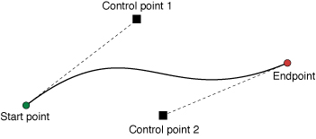

> Navigation: [Technologies](../../technologies.md) · [UIKit](../../uikit.md) · [UIBezierPath](../uibezierpath.md)

# addCurve(to:controlPoint1:controlPoint2:)

<sub>Instance Method</sub>

Appends a cubic Bézier curve to the path.

<sub>iOS, iPadOS, Mac Catalyst, tvOS, visionOS, watchOS</sub>

```swift
func addCurve(to endPoint: CGPoint, controlPoint1: CGPoint, controlPoint2: CGPoint)
```

## Parameters

- `endPoint` — The end point of the curve.

- `controlPoint1` — The first control point to use when computing the curve.

- `controlPoint2` — The second control point to use when computing the curve.

## Discussion

This method appends a cubic Bézier curve from the current point to the end point specified by the `endPoint` parameter. The two control points define the curvature of the segment. The following image shows an approximation of a cubic Bézier curve given a set of initial points. The exact curvature of the segment involves a complex mathematical relationship between all of the points and is well documented online.



You must set the path’s current point (using the [- moveToPoint:](<move(to_).md>) method or through the previous creation of a line or curve segment) before you call this method. If the path is empty, this method does nothing. After adding the curve segment, this method updates the current point to the value in `point`.

## See Also

### Constructing a path

- [- moveToPoint:](<move(to_).md>) — Moves the path’s current point to the specified location.
- [- addLineToPoint:](<addline(to_).md>) — Appends a straight line to the path.
- [- addArcWithCenter:radius:startAngle:endAngle:clockwise:](<addarc(withcenter_radius_startangle_endangle_clockwise_).md>) — Appends an arc to the path.
- [- addQuadCurveToPoint:controlPoint:](<addquadcurve(to_controlpoint_).md>) — Appends a quadratic Bézier curve to the path.
- [- closePath](<close().md>) — Closes the most recent subpath.
- [- removeAllPoints](<removeallpoints().md>) — Removes all points from the path, effectively deleting all subpaths.
- [- appendPath:](<append(__).md>) — Appends the contents of the specified path object to the path.
- [CGPath](cgpath.md) — The Core Graphics representation of the path.
- [currentPoint](currentpoint.md) — The current point in the graphics path.
