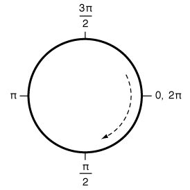

> Navigation: [Technologies](../../technologies.md) · [UIKit](../../uikit.md) · [UIBezierPath](../uibezierpath.md)

# init(arcCenter:radius:startAngle:endAngle:clockwise:)

<sub>Initializer</sub>

Creates and returns a new Bézier path object with an arc of a circle.

<sub>iOS, iPadOS, Mac Catalyst, tvOS, visionOS, watchOS</sub>

```swift
convenience init(arcCenter center: CGPoint, radius: CGFloat, startAngle: CGFloat, endAngle: CGFloat, clockwise: Bool)
```

## Parameters

- `center` — Specifies the center point of the circle (in the current coordinate system) used to define the arc.

- `radius` — Specifies the radius of the circle used to define the arc.

- `startAngle` — Specifies the starting angle of the arc (measured in radians).

- `endAngle` — Specifies the end angle of the arc (measured in radians).

- `clockwise` — The direction in which to draw the arc.

## Return Value

A new path object with the specified arc.

## Discussion

This method creates an open subpath. The created arc lies on the perimeter of the specified circle. When drawn in the default coordinate system, the start and end angles are based on the unit circle shown in the following image. For example, specifying a start angle of `0` radians, an end angle of `π` radians, and setting the `clockwise` parameter to [true](../../swift/true.md) draws the bottom half of the circle. However, specifying the same start and end angles but setting the `clockwise` parameter to [false](../../swift/false.md) draws the top half of the circle.



After calling this method, the current point is set to the point on the arc at the end angle of the circle.

## See Also

### Creating a Bézier path

- [+ bezierPathWithRect:](<init(rect_).md>) — Creates and returns a new Bézier path object with a rectangular path.
- [+ bezierPathWithOvalInRect:](<init(ovalin_).md>) — Creates and returns a new Bézier path object with an inscribed oval path in the specified rectangle.
- [+ bezierPathWithRoundedRect:cornerRadius:](<init(roundedrect_cornerradius_).md>) — Creates and returns a new Bézier path object with a rounded rectangular path.
- [+ bezierPathWithRoundedRect:byRoundingCorners:cornerRadii:](<init(roundedrect_byroundingcorners_cornerradii_).md>) — Creates and returns a new Bézier path object with a rectangular path rounded at the specified corners.
- [+ bezierPathWithCGPath:](<init(cgpath_)-833n8.md>) — Creates and returns a new Bézier path object with the contents of a Core Graphics path.
- [- bezierPathByReversingPath](<reversing().md>) — Creates and returns a new Bézier path object with the reversed contents of the current path.
- [- init](<init().md>) — Creates and returns an empty path object.
- [- initWithCoder:](<init(coder_).md>) — Creates a Bézier path object from data in an unarchiver.
