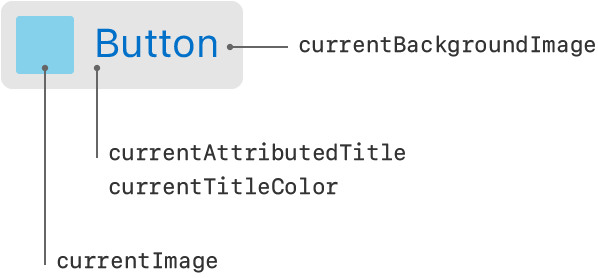

> Navigation: [Technologies](../technologies.md) · [UIKit](../uikit.md)

# UIButton

<sub>Class</sub>

A control that executes your custom code in response to user interactions.

<sub>iOS, iPadOS, Mac Catalyst, tvOS, visionOS</sub>

```swift
@MainActor class UIButton
```

## Overview

When you tap a button, or select a button that has focus, the button performs any actions attached to it. You communicate the purpose of a button using a text label, an image, or both. The appearance of buttons is configurable, so you can tint buttons or format titles to match the design of your app. You can add buttons to your interface programmatically or using Interface Builder.


<sub>A screenshot showing three buttons. The first button shows the label “Button”. The second button shows an image of a plus sign in a circle. The third button shows an image of a lowercase “i” in a circle.</sub>

When adding a button to your interface, perform the following steps:

- Set the type of the button at creation time.
- Supply a title string or image; size the button appropriately for your content.
- Connect one or more action methods to the button.
- Set up Auto Layout rules to govern the size and position of the button in your interface.
- Provide accessibility information and localized strings.

> [!important] Important
> An app built with Mac Catalyst running in macOS 11 throws an exception when calling a button’s [- addGestureRecognizer:](<uiview/addgesturerecognizer(__).md>) method when [buttonType](uibutton/buttontype-swift.property.md) is [UIButtonTypeSystem](uibutton/buttontype-swift.enum/system.md) and the user interface idiom is [UIUserInterfaceIdiomMac](uiuserinterfaceidiom/mac.md).

### Respond to button taps

Buttons use the target-action design pattern to notify your app when the user taps the button. Rather than handle touch events directly, you assign action methods to the button and designate which events trigger calls to your methods. At runtime, the button handles all incoming touch events and calls your methods in response.

You connect a button to your action method using the [- addTarget:action:forControlEvents:](<uicontrol/addtarget(__action_for_).md>) method or by creating a connection in Interface Builder. The signature of an action method takes one of three forms, as shown in the following code. Choose the form that provides the information that you need to respond to the button tap.

**Swift**

```swift
@IBAction func doSomething()
@IBAction func doSomething(sender: UIButton)
@IBAction func doSomething(sender: UIButton, forEvent event: UIEvent)
```

**Objective-C**

```objc
- (IBAction)doSomething;
- (IBAction)doSomething:(id)sender;
- (IBAction)doSomething:(id)sender forEvent:(UIEvent*)event;
```

### Configure a button’s appearance

A button’s type defines its basic appearance and behavior. You specify the type of a button at creation time using the [+ buttonWithType:](<uibutton/init(type_).md>) method or in your storyboard file. After creating a button, you can’t change its type. The most commonly used button types are the Custom and System types, but use the other types when appropriate.

> [!note] Note
> To configure the appearance of all buttons in your app, use the appearance proxy object. The [UIButton](uibutton.md) class implements the [+ appearance](<uiappearance/appearance().md>) class method, which you can use to fetch the appearance proxy for all buttons in your app.

#### Configure button states

Buttons have five states that define their appearance: default, highlighted, focused, selected, and disabled. When you add a button to your interface, it’s in the default state initially, which means the button is enabled and the user isn’t interacting with it. As the user interacts with the button, its state changes to the other values. For example, when the user taps a button with a title, the button moves to the highlighted state.

When configuring a button either programmatically or in Interface Builder, you specify attributes for each state separately. In Interface Builder, use the State Config control in the Attributes inspector to choose the appropriate state and then configure the other attributes. If you don’t specify attributes for a particular state, the [UIButton](uibutton.md) class provides a reasonable default behavior. For example, a disabled button is normally dimmed and doesn’t display a highlight when tapped. Other properties of this class, such as the [adjustsImageWhenHighlighted](uibutton/adjustsimagewhenhighlighted.md) and [adjustsImageWhenDisabled](uibutton/adjustsimagewhendisabled.md) properties, let you alter the default behavior in specific cases.

#### Provide content

The content of a button consists of a title string or image that you specify. The content you specify is used to configure the [UILabel](uilabel.md) and [UIImageView](uiimageview.md) object managed by the button itself. You can access these objects using the [titleLabel](uibutton/titlelabel.md) or [imageView](uibutton/imageview.md) properties and modify their values directly. The methods of this class also provide a convenient shortcut for configuring the appearance of your string or image.

Normally, you configure a button using either a title or an image and size the button accordingly. Buttons can also have a background image, which is positioned behind the content you specify. It’s possible to specify both an image and a title for buttons, which results in the appearance shown in the following image. You can access the current content of a button using the indicated properties.



When setting the content of a button, you must specify the title, image, and appearance attributes for each state separately. If you don’t customize the content for a particular state, the button uses the values associated with the Default state and adds any appropriate customizations. For example, in the highlighted state, an image-based button draws a highlight on top of the default image if no custom image is provided.

#### Customize tint color

You can specify a custom button tint using the [tintColor](uibutton/tintcolor.md) property. This property sets the color of the button image and text. If you don’t explicitly set a tint color, the button uses its superview’s tint color.

#### Specify edge insets

Use insets to add or remove space around the content in your custom or system buttons. You can specify separate insets for your button’s title ([titleEdgeInsets](uibutton/titleedgeinsets.md)), image ([imageEdgeInsets](uibutton/imageedgeinsets.md)), and both the title and image together ([contentEdgeInsets](uibutton/contentedgeinsets.md)). When applied, insets affect the corresponding content rectangle of the button, which the Auto Layout engine uses to determine the button’s position.

There should be no reason for you to adjust the edge insets for info, contact, or disclosure buttons.

### Configure button attributes in Interface Builder

The following table lists the core attributes that you configure for buttons in Interface Builder.

| Attribute | Description |
|---|---|
| Type | The button type. This attribute determines the default settings for many other button attributes. The value of this attribute can’t be changed at runtime, but you can access it using the [buttonType](uibutton/buttontype-swift.property.md) property. |
| State Config | The state selector. After selecting a value in this control, changes to the button’s attributes apply to the specified state. |
| Title | The button’s title. You can specify a button’s title as a plain string or attributed string. |
| (Title Font and Attributes) | The font and other attributes to apply to the button’s title string. The specific configuration options depends on whether you specified a plain string or attributed string for the button’s title. For a plain string, you can customize the font, text color, and shadow color. For an attributed string, you can specify alignment, text direction, indentation, hyphenation, and many other options. |
| Image | The button’s foreground image. Typically, you use template images for a button’s foreground, but you may specify any image in your Xcode project. |
| Background | The button’s background image. The background image is displayed behind its title and foreground image. |

The following table lists attributes that affect the button’s appearance.

| Attribute | Description |
|---|---|
| Shadow Offset | The offsets and behavior of the button’s shadow. Shadows affect title strings only. Enable the Reverses on Highlight option to change the highlighting of the shadow when the button state changes to or from the highlighted state.  Configure the offsets programmatically using the [shadowOffset](uilabel/shadowoffset.md) property of the button’s [titleLabel](uibutton/titlelabel.md) object. Configure the highlighting behavior using the [reversesTitleShadowWhenHighlighted](uibutton/reversestitleshadowwhenhighlighted.md) property. |
| Drawing | The drawing behavior of the button.  When the Shows Touch On Highlight ([showsTouchWhenHighlighted](uibutton/showstouchwhenhighlighted.md)) option is enabled, the button adds a white glow to the part of a button that the user touches.  When the Highlighted Adjusts Image ([adjustsImageWhenHighlighted](uibutton/adjustsimagewhenhighlighted.md)) option is enabled, button images get darker when it’s in the highlighted state.  When the Disabled Adjusts Image ([adjustsImageWhenDisabled](uibutton/adjustsimagewhendisabled.md)) option is enabled, the image is dimmed when the button is disabled. |
| Line Break | The line breaking options for the button’s text. Use this attribute to define how the button’s title is modified to fit the available space. |

The following table lists the edge inset attributes for buttons. Use edge inset buttons to alter the rectangle for the button’s content.

| Attribute | Description |
|---|---|
| Edge | The edge insets to configure. You can specify separate edge insets for the button’s overall content, its title, and its image. |
| Inset | The inset values. Positive values shrink the corresponding edge, moving it closer to the center of the button. Negative values expand the edge, moving it away from the center of the button. Access these values at runtime using the [contentEdgeInsets](uibutton/contentedgeinsets.md), [titleEdgeInsets](uibutton/titleedgeinsets.md), and [imageEdgeInsets](uibutton/imageedgeinsets.md) properties. |

For information about the button’s inherited Interface Builder attributes, see [UIControl](uicontrol.md) and [UIView](uiview.md).

### Support localization

To internationalize a button, specify a localized string for the button’s title text. (You may also localize a button’s image as appropriate.)

When using storyboards to build your interface, use Xcode’s base internationalization feature to configure the localizations your project supports. When you add a localization, Xcode creates a strings file for that localization. When configuring your interface programmatically, use the system’s built-in support for loading localized strings and resources. For more information about internationalizing your interface, see [Internationalization and Localization Guide](https://developer.apple.com/library/archive/documentation/MacOSX/Conceptual/BPInternational/Introduction/Introduction.html#//apple_ref/doc/uid/10000171i).

### Make buttons accessible

Buttons are accessible by default. The default accessibility traits for a button are Button and User Interaction Enabled.

The accessibility label, traits, and hint are spoken back to the user when VoiceOver is enabled on a device. The button’s title overwrites its accessibility label; even if you set a custom value for the label, VoiceOver speaks the value of the title. VoiceOver speaks this information when a user taps the button once. For example, when a user taps the Options button in Camera, VoiceOver speaks the following:

- `"Options. Button. Shows additional camera options."`

For more information about making iOS controls accessible, see the accessibility information in [UIControl](uicontrol.md). For general information about making your interface accessible, see [Accessibility Programming Guide for iOS](https://developer.apple.com/library/archive/documentation/UserExperience/Conceptual/iPhoneAccessibility/Introduction/Introduction.html#//apple_ref/doc/uid/TP40008785).

## Relationships

- **Inherits From**: [UIControl](uicontrol.md)

- **Conforms To**: [CALayerDelegate](../quartzcore/calayerdelegate.md), [CLBodyIdentifiable](../corelocation/clbodyidentifiable.md), [CMBodyIdentifiable](../coremotion/cmbodyidentifiable.md), [CVarArg](../swift/cvararg.md), [Copyable](../swift/copyable.md), [CustomDebugStringConvertible](../swift/customdebugstringconvertible.md), [CustomStringConvertible](../swift/customstringconvertible.md), [Equatable](../swift/equatable.md), [Escapable](../swift/escapable.md), [Hashable](../swift/hashable.md), [NSCoding](../foundation/nscoding.md), [NSObjectProtocol](../objectivec/nsobjectprotocol.md), [NSTouchBarProvider](../appkit/nstouchbarprovider.md), [Sendable](../swift/sendable.md), [SendableMetatype](../swift/sendablemetatype.md), [UIAccessibilityContentSizeCategoryImageAdjusting](uiaccessibilitycontentsizecategoryimageadjusting.md), [UIAccessibilityIdentification](uiaccessibilityidentification.md), [UIActivityItemsConfigurationProviding](uiactivityitemsconfigurationproviding.md), [UIAppearance](uiappearance.md), [UIAppearanceContainer](uiappearancecontainer.md), [UIContextMenuInteractionDelegate](uicontextmenuinteractiondelegate.md), [UICoordinateSpace](uicoordinatespace.md), [UIDynamicItem](uidynamicitem.md), [UIFocusEnvironment](uifocusenvironment.md), [UIFocusItem](uifocusitem.md), [UIFocusItemContainer](uifocusitemcontainer.md), [UILargeContentViewerItem](uilargecontentvieweritem.md), [UIPasteConfigurationSupporting](uipasteconfigurationsupporting.md), [UIPopoverPresentationControllerSourceItem](uipopoverpresentationcontrollersourceitem.md), [UIResponderStandardEditActions](uiresponderstandardeditactions.md), [UISpringLoadedInteractionSupporting](uispringloadedinteractionsupporting.md), [UITraitChangeObservable](uitraitchangeobservable-67e94.md), [UITraitEnvironment](uitraitenvironment.md), [UIUserActivityRestoring](uiuseractivityrestoring.md)

## Topics

### Creating buttons

- [- initWithFrame:](<uibutton/init(frame_).md>) — Creates a new button with the specified frame.
- [- initWithFrame:primaryAction:](<uibutton/init(frame_primaryaction_).md>) — Creates a new button with the specified frame, registers the primary action event, and sets the title and image to the action’s title and image.
- [- initWithCoder:](<uibutton/init(coder_).md>) — Creates a new button with data in an unarchiver.

### Creating buttons of a specific type

- [+ buttonWithType:](<uibutton/init(type_).md>) — Creates and returns a new button of the specified type.
- [init(type:primaryAction:)](<uibutton/init(type_primaryaction_).md>) — Creates a new button with the specified type, registers the primary action event, and sets the title and image to the action’s title and image.
- [ButtonType](uibutton/buttontype-swift.enum.md) — Specifies the style of a button.

### Creating system buttons

- [+ systemButtonWithImage:target:action:](<uibutton/systembutton(with_target_action_).md>) — Creates and returns a system type button with specified image, target, and action.

### Creating buttons from a configuration object

- [init(configuration:primaryAction:)](<uibutton/init(configuration_primaryaction_).md>) — Creates a new button with the specified configuration and registers the primary action event.
- [Configuration](uibutton/configuration-swift.struct.md) — A configuration that specifies the appearance and behavior of a button and its contents.

### Managing the appearance with a configuration object

- [configuration](uibutton/configuration-5rlyb.md) — The configuration for the button’s appearance.
- [automaticallyUpdatesConfiguration](uibutton/automaticallyupdatesconfiguration.md) — A Boolean value that determines whether the button configuration changes when button’s state changes.
- [- setNeedsUpdateConfiguration](<uibutton/setneedsupdateconfiguration().md>) — Requests the system update the button configuration.
- [- updateConfiguration](<uibutton/updateconfiguration().md>) — Updates the button configuration in response to a button state change.
- [configurationUpdateHandler](uibutton/configurationupdatehandler-swift.property.md) — A closure that executes when the button state changes.
- [ConfigurationUpdateHandler](uibutton/configurationupdatehandler-swift.typealias.md) — A closure to update the configuration of a button.

### Managing the title

- [titleLabel](uibutton/titlelabel.md) — A view that displays the value of the `currentTitle` property for a button.
- [- titleForState:](<uibutton/title(for_).md>) — Returns the title associated with the specified state.
- [- setTitle:forState:](<uibutton/settitle(__for_).md>) — Sets the title to use for the specified state.
- [- attributedTitleForState:](<uibutton/attributedtitle(for_).md>) — Returns the styled title associated with the specified state.
- [- setAttributedTitle:forState:](<uibutton/setattributedtitle(__for_).md>) — Sets the styled title to use for the specified state.
- [- titleColorForState:](<uibutton/titlecolor(for_).md>) — Returns the title color used for a state.
- [- setTitleColor:forState:](<uibutton/settitlecolor(__for_).md>) — Sets the color of the title to use for the specified state.
- [- titleShadowColorForState:](<uibutton/titleshadowcolor(for_).md>) — Returns the shadow color of the title used for a state.
- [- setTitleShadowColor:forState:](<uibutton/settitleshadowcolor(__for_).md>) — Sets the color of the title shadow to use for the specified state.

### Managing images and tint color

- [- backgroundImageForState:](<uibutton/backgroundimage(for_).md>) — Returns the background image used for a button state.
- [- imageForState:](<uibutton/image(for_).md>) — Returns the image used for a button state.
- [- setBackgroundImage:forState:](<uibutton/setbackgroundimage(__for_).md>) — Sets the background image to use for the specified button state.
- [- setImage:forState:](<uibutton/setimage(__for_).md>) — Sets the image to use for the specified state.
- [- preferredSymbolConfigurationForImageInState:](<uibutton/preferredsymbolconfigurationforimage(in_).md>) — Returns the preferred symbol configuration for a button state.
- [- setPreferredSymbolConfiguration:forImageInState:](<uibutton/setpreferredsymbolconfiguration(__forimagein_).md>) — Sets the preferred symbol configuration for a button state.
- [tintColor](uibutton/tintcolor.md) — The tint color to apply to the button title and image.

### Specifying the role

- [role](uibutton/role-swift.property.md) — The role of the button.
- [Role](uibutton/role-swift.enum.md) — Constants that describe the role of the button.

### Specifying the behavioral style

- [behavioralStyle](uibutton/behavioralstyle.md) — The style that determines how the button behaves.
- [preferredBehavioralStyle](uibutton/preferredbehavioralstyle.md) — The preferred behavioral style.
- [UIBehavioralStyle](uibehavioralstyle.md) — Constants that indicate how a control behaves in apps built with Mac Catalyst.

### Getting the current state

- [buttonType](uibutton/buttontype-swift.property.md) — The button type.
- [currentTitle](uibutton/currenttitle.md) — The current title that is displayed on the button.
- [currentAttributedTitle](uibutton/currentattributedtitle.md) — The current styled title that is displayed on the button.
- [currentTitleColor](uibutton/currenttitlecolor.md) — The color used to display the title.
- [currentTitleShadowColor](uibutton/currenttitleshadowcolor.md) — The color of the title’s shadow.
- [currentImage](uibutton/currentimage.md) — The current image displayed on the button.
- [currentBackgroundImage](uibutton/currentbackgroundimage.md) — The current background image displayed on the button.
- [currentPreferredSymbolConfiguration](uibutton/currentpreferredsymbolconfiguration.md) — The current symbol size, style, and weight.
- [imageView](uibutton/imageview.md) — The button’s image view.
- [subtitleLabel](uibutton/subtitlelabel.md) — The label that displays the text of the subtitle.

### Supporting pointer interactions

- [pointerInteractionEnabled](uibutton/ispointerinteractionenabled.md) — A Boolean that enables pointer interaction.
- [hovered](uibutton/ishovered.md) — A Boolean value that indicates whether a pointer effect is active.
- [pointerStyleProvider](uibutton/pointerstyleprovider-y4eb.md) — A closure that returns the pointer style to use when the pointer hovers over the button.
- [PointerStyleProvider](uibutton/pointerstyleprovider-swift.typealias.md) — A type alias defining a closure that returns a pointer style to apply to a button.
- [UIButtonPointerStyleProvider](uibuttonpointerstyleprovider.md) — A type alias defining a block that returns a pointer style to apply to a button.

### Supporting menu and toggle buttons

- [menu](uibutton/menu.md) — A menu that the button displays.
- [held](uibutton/isheld.md) — A Boolean value that indicates whether the button menu is visible.
- [changesSelectionAsPrimaryAction](uibutton/changesselectionasprimaryaction.md) — A Boolean value that indicates whether the button tracks a selection, either through a menu or a toggle.
- [preferredMenuElementOrder](uibutton/preferredmenuelementorder.md) — The preferred menu-element ordering strategy for the menu.

### Deprecated

- [Deprecated symbols](uibutton-deprecated-symbols.md) — Symbols that buttons no longer support.

## See Also

### Controls

- [Responding to control-based events using target-action](responding-to-control-based-events-using-target-action.md) — Handle user input by connecting buttons, sliders, and other controls to your app’s code using the target-action design pattern.
- [UIControl](uicontrol.md) — The base class for controls, which are visual elements that convey a specific action or intention in response to user interactions.
- [UIColorWell](uicolorwell.md) — A control that displays a color picker.
- [UIDatePicker](uidatepicker.md) — A control for inputting date and time values.
- [UIPageControl](uipagecontrol.md) — A control that displays a horizontal series of dots, each of which corresponds to a page in the app’s document or other data-model entity.
- [UISegmentedControl](uisegmentedcontrol.md) — A horizontal control that consists of multiple segments, each segment functioning as a discrete button.
- [UISlider](uislider.md) — A control for selecting a single value from a continuous range of values.
- [UIStepper](uistepper.md) — A control for incrementing or decrementing a value.
- [UISwitch](uiswitch.md) — A control that offers a binary choice, such as on/off.
