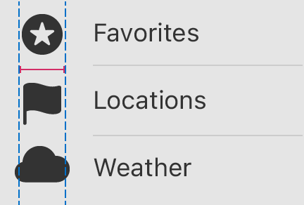

> Navigation: [Technologies](../../../technologies.md) · [UIKit](../../../uikit.md) · [UICellAccessory](../../uicellaccessory-swift.struct.md) · [MultiselectOptions](../multiselectoptions.md)

# reservedLayoutWidth

<sub>Instance Property</sub>

The layout width that the system reserves for the accessory, and then centers the accessory within.

<sub>iOS, iPadOS, Mac Catalyst, tvOS, visionOS</sub>

```swift
var reservedLayoutWidth: UICellAccessory.LayoutDimension
```

## Discussion

Use this property to ensure consistent horizontal alignment from both system and custom accessories to your content, even when the accessories vary in size.

The reserved layout width only affects the amount of space for the accessory, and its positioning within that space. It doesn’t affect the size of the accessory.



<sub>Diagram of three cells, each of which contains one accessory on the leading side. The accessories vary in width, but use the same reserved layout width to achieve consistent alignment. Annotations running the height of the diagram illustrate the static width.</sub>

## See Also

### Accessing configuration options

- [isHidden](ishidden.md) — A Boolean value that determines whether the cell hides the accessory.
- [tintColor](tintcolor.md) — The tint color to apply to the accessory.
- [backgroundColor](backgroundcolor.md) — The background color to apply to the accessory.
