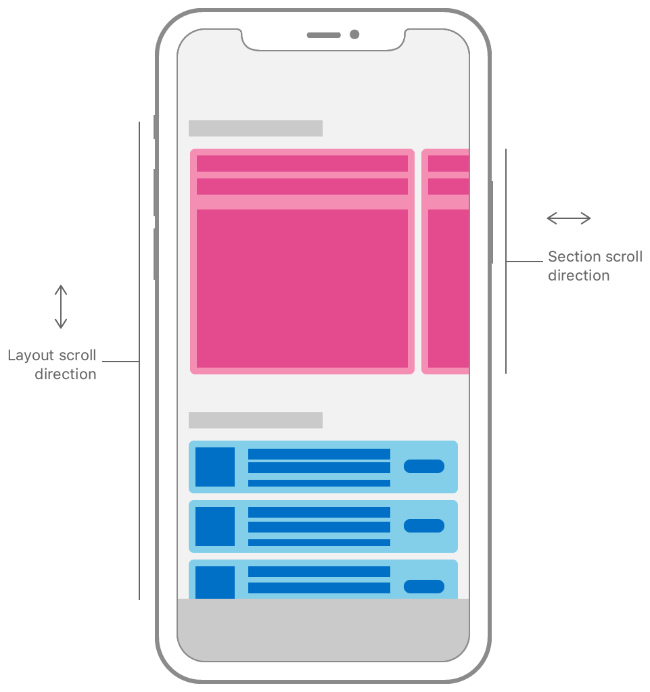

> Navigation: [Technologies](../technologies.md) · [UIKit](../uikit.md)

# UICollectionLayoutSectionOrthogonalScrollingBehavior

<sub>Enumeration</sub>

The scrolling behavior of the layout’s sections in relation to the main layout axis.

<sub>iOS, iPadOS, Mac Catalyst, tvOS, visionOS</sub>

```swift
enum UICollectionLayoutSectionOrthogonalScrollingBehavior
```

## Overview

By default, each section lays out its content along the main axis of its layout, defined by the layout configuration’s [scrollDirection](uicollectionviewcompositionallayoutconfiguration/scrolldirection.md) property. You can change this behavior for a particular section by setting its [orthogonalScrollingBehavior](nscollectionlayoutsection/orthogonalscrollingbehavior.md) property to a different value than its default [UICollectionLayoutSectionOrthogonalScrollingBehaviorNone](uicollectionlayoutsectionorthogonalscrollingbehavior/none.md). Setting any other value for this property makes the section lay out its content orthogonally to the main layout axis.



<sub>Diagram of a collection view layout with multiple sections. The collection view sections are laid out vertically, so the collection view scrolls on the vertical axis to reveal more content. The content in the top section of the collection view scrolls on the horizontal axis, orthogonally to the main layout axis of the collection view’s layout.</sub>

## Relationships

- **Conforms To**: [BitwiseCopyable](../swift/bitwisecopyable.md), [Equatable](../swift/equatable.md), [Hashable](../swift/hashable.md), [RawRepresentable](../swift/rawrepresentable.md), [Sendable](../swift/sendable.md), [SendableMetatype](../swift/sendablemetatype.md)

## Topics

### Constants

- [UICollectionLayoutSectionOrthogonalScrollingBehaviorNone](uicollectionlayoutsectionorthogonalscrollingbehavior/none.md) — The section does not allow users to scroll its content orthogonally.
- [UICollectionLayoutSectionOrthogonalScrollingBehaviorContinuous](uicollectionlayoutsectionorthogonalscrollingbehavior/continuous.md) — The section allows users to scroll its content orthogonally with continuous scrolling.
- [UICollectionLayoutSectionOrthogonalScrollingBehaviorContinuousGroupLeadingBoundary](uicollectionlayoutsectionorthogonalscrollingbehavior/continuousgroupleadingboundary.md) — The section allows users to scroll its content orthogonally, coming to a natural stop at the leading boundary of the visible group.
- [UICollectionLayoutSectionOrthogonalScrollingBehaviorPaging](uicollectionlayoutsectionorthogonalscrollingbehavior/paging.md) — The section allows users to page its content orthogonally.
- [UICollectionLayoutSectionOrthogonalScrollingBehaviorGroupPaging](uicollectionlayoutsectionorthogonalscrollingbehavior/grouppaging.md) — The section allows users to page its content orthogonally one group at a time.
- [UICollectionLayoutSectionOrthogonalScrollingBehaviorGroupPagingCentered](uicollectionlayoutsectionorthogonalscrollingbehavior/grouppagingcentered.md) — The section allows users to page its content orthogonally one group at a time, centering each group.

### Initializers

- [init(rawValue:)](<uicollectionlayoutsectionorthogonalscrollingbehavior/init(rawvalue_).md>)
