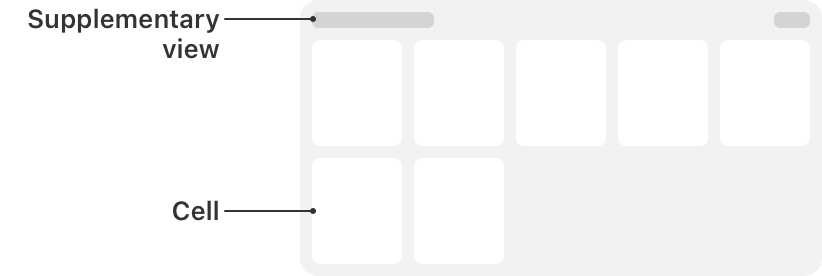

> Navigation: [Technologies](../technologies.md) · [UIKit](../uikit.md)

# UICollectionView

<sub>Class</sub>

An object that manages an ordered collection of data items and presents them using customizable layouts.

<sub>iOS, iPadOS, Mac Catalyst, tvOS, visionOS</sub>

```swift
@MainActor class UICollectionView
```

## Overview

When you add a collection view to your user interface, your app’s main job is to manage the data associated with that collection view. The collection view gets its data from the data source object, stored in the collection view’s [dataSource](uicollectionview/datasource.md) property. For your data source, you can use a [UICollectionViewDiffableDataSource](uicollectionviewdiffabledatasource-9tqpa.md) object, which provides the behavior you need to simply and efficiently manage updates to your collection view’s data and user interface. Alternatively, you can create a custom data source object by adopting the [UICollectionViewDataSource](uicollectionviewdatasource.md) protocol.

Data in the collection view is organized into individual items, which you can group into sections for presentation. An item is the smallest unit of data you want to present. For example, in a photos app, an item might be a single image. The collection view presents items onscreen using a cell, which is an instance of the [UICollectionViewCell](uicollectionviewcell.md) class that your data source configures and provides.



In addition to its cells, a collection view can present data using other types of views. These supplementary views can be, for example, section headers and footers that are separate from the individual cells but still convey information. Support for supplementary views is optional and defined by the collection view’s layout object, which is also responsible for defining the placement of those views.

Besides embedding a [UICollectionView](uicollectionview.md) in your user interface, you use the methods of the collection view to ensure that the visual presentation of items matches the order in your data source object. A [UICollectionViewDiffableDataSource](uicollectionviewdiffabledatasource-9tqpa.md) object manages this process automatically. If you’re using a custom data source, then whenever you add, delete, or rearrange data in your collection, you use the methods of [UICollectionView](uicollectionview.md) to insert, delete, and rearrange the corresponding cells.

You also use the collection view object to manage the selected items, although for this behavior the collection view works with its associated [delegate](uicollectionview/delegate.md) object.

### Layouts

A layout object defines the visual arrangement of the content in the collection view. A subclass of the [UICollectionViewLayout](uicollectionviewlayout.md) class, the layout object defines the organization and location of all cells and supplementary views inside the collection view. Although it defines their locations, the layout object doesn’t actually apply that information to the corresponding views. The collection view applies layout information to the corresponding views because the creation of cells and supplementary views involves coordination between the collection view and your data source object. The layout object is like another data source, except it provides visual information instead of item data.

You typically specify a layout object when you create a collection view, but you can also change the layout of a collection view dynamically. The layout object is stored in the [collectionViewLayout](uicollectionview/collectionviewlayout.md) property. Setting this property directly updates the layout immediately, without animating the changes. If you want to animate the changes, call the [- setCollectionViewLayout:animated:completion:](<uicollectionview/setcollectionviewlayout(__animated_completion_).md>) method instead.

To create an interactive transition — one that is driven by a gesture recognizer or touch events — use the [- startInteractiveTransitionToCollectionViewLayout:completion:](<uicollectionview/startinteractivetransition(to_completion_).md>) method to change the layout object. That method installs an intermediate layout object, which works with your gesture recognizer or event-handling code to track the transition progress. When your event-handling code determines that the transition is finished, it calls the [- finishInteractiveTransition](<uicollectionview/finishinteractivetransition().md>) or [- cancelInteractiveTransition](<uicollectionview/cancelinteractivetransition().md>) method to remove the intermediate layout object and install the intended target layout object.

For more information, see [Layouts](layouts.md).

### Cells and supplementary views

The collection view’s data source object provides both the content for items and the views used to present that content. When the collection view first loads its content, it asks its data source to provide a view for each visible item. The collection view maintains a queue or list of view objects that the data source has marked for reuse. Instead of creating new views explicitly in your code, you always dequeue views.

There are two methods for dequeueing views. The one you use depends on which type of view has been requested:

- Use the [- dequeueReusableCellWithReuseIdentifier:forIndexPath:](<uicollectionview/dequeuereusablecell(withreuseidentifier_for_).md>) to get a cell for an item in the collection view.
- Use the [- dequeueReusableSupplementaryViewOfKind:withReuseIdentifier:forIndexPath:](<uicollectionview/dequeuereusablesupplementaryview(ofkind_withreuseidentifier_for_).md>) method to get a supplementary view requested by the layout object.

Before you call either of these methods, you must tell the collection view how to create the corresponding view if one doesn’t already exist. For this, you must register either a class or a nib file with the collection view. For example, when registering cells, you use the [- registerClass:forCellWithReuseIdentifier:](<uicollectionview/register(__forcellwithreuseidentifier_)-3vaho.md>) method to register a class or the [- registerNib:forCellWithReuseIdentifier:](<uicollectionview/register(__forcellwithreuseidentifier_)-6z6t4.md>) method to register a nib file. As part of the registration process, you specify the reuse identifier that identifies the purpose of the view. This is the same string you use when dequeueing the view later.

After dequeueing the appropriate view in your data source method, configure its content and return it to the collection view for use. After getting the layout information from the layout object, the collection view applies it to the view and displays it.

### Data prefetching

Collection views provide two prefetching techniques you can use to improve responsiveness:

- _Cell prefetching_ prepares cells in advance of the time they’re required. When a collection view requires a large number of cells simultaneously — for example, a new row of cells in grid layout — the cells are requested earlier than the time required for display. Cell rendering is therefore spread across multiple layout passes, resulting in a smoother scrolling experience. Cell prefetching is enabled by default.
- _Data prefetching_ provides a mechanism whereby you’re notified of the data requirements of a collection view in advance of the requests for cells. This is useful if the content of your cells relies on an expensive data loading process, such as a network request. Assign an object that conforms to the [UICollectionViewDataSourcePrefetching](uicollectionviewdatasourceprefetching.md) protocol to the [prefetchDataSource](uicollectionview/prefetchdatasource.md) property to receive notifications of when to prefetch data for cells.

### Reorder items interactively

Collection views allow you to move items around based on user interactions. Typically, the order of items in a collection view is defined by your data source. If you allow users to reorder items, you can configure a gesture recognizer to track the user’s interactions with a collection view item and update that item’s position.

To begin the interactive repositioning of an item, call the [- beginInteractiveMovementForItemAtIndexPath:](<uicollectionview/begininteractivemovementforitem(at_).md>) method of the collection view. While your gesture recognizer is tracking touch events, call the [- updateInteractiveMovementTargetPosition:](<uicollectionview/updateinteractivemovementtargetposition(__).md>) method to report changes in the touch location. When you’re done tracking the gesture, call the [- endInteractiveMovement](<uicollectionview/endinteractivemovement().md>) or [- cancelInteractiveMovement](<uicollectionview/cancelinteractivemovement().md>) method to conclude the interactions and update the collection view.

During user interactions, the collection view invalidates its layout dynamically to reflect the current position of the item. If you do nothing, the default layout behavior repositions the items for you, but you can customize the layout animations if you want. When interactions finish, the collection view updates its data source object with the new location of the item.

The [UICollectionViewController](uicollectionviewcontroller.md) class provides a default gesture recognizer that you can use to rearrange items in its managed collection view. To install this gesture recognizer, set the [installsStandardGestureForInteractiveMovement](uicollectionviewcontroller/installsstandardgestureforinteractivemovement.md) property of the collection view controller to [true](../swift/true.md).

### Interface Builder attributes

The following table lists the attributes that you configure for collection views in Interface Builder.

| Attribute | Description |
|---|---|
| Items | The number of prototype cells. This property controls the specified number of prototype cells for you to configure in your storyboard. Collection views must always have at least one cell and may have multiple cells for displaying different types of content or for displaying the same content in different ways. |
| Layout | The layout object to use. Use this control to select between the [UICollectionViewFlowLayout](uicollectionviewflowlayout.md) object and a custom layout object that you define.  When the flow layout is selected, you can also configure the scrolling direction for the collection view’s content and whether the flow layout has header and footer views. Enabling header and footer views adds reusable views to your storyboard that you can configure with your header and footer content. You can also create those views programmatically.  When a custom layout is selected, you must specify the [UICollectionViewLayout](uicollectionviewlayout.md) subclass to use. |

When the Flow layout is selected, the Size inspector for the collection view contains additional attributes for configuring flow layout metrics. Use those attributes to configure the size of your cells, the size of headers and footers, the minimum spacing between cells, and any margins around each section of cells. For more information about the meaning of the flow layout metrics, see [UICollectionViewFlowLayout](uicollectionviewflowlayout.md).

### Internationalization

A collection view has no direct content of its own to internationalize. Instead, you internationalize the cells and reusable views of the collection view. For more information about internationalization, see [Localization](https://developer.apple.com/localization/).

### Accessibility

A collection view has no content of its own to make accessible. If your cells and reusable views contain standard UIKit controls such as [UILabel](uilabel.md) and [UITextField](uitextfield.md), you can make those controls accessible. When a collection view changes its onscreen layout, it posts the [UIAccessibilityLayoutChangedNotification](uiaccessibility/notification/layoutchanged.md) notification.

For general information about making your interface accessible, see [Accessibility for UIKit](accessibility-for-uikit.md).

## Relationships

- **Inherits From**: [UIScrollView](uiscrollview.md)

- **Conforms To**: [CALayerDelegate](../quartzcore/calayerdelegate.md), [CLBodyIdentifiable](../corelocation/clbodyidentifiable.md), [CMBodyIdentifiable](../coremotion/cmbodyidentifiable.md), [CVarArg](../swift/cvararg.md), [Copyable](../swift/copyable.md), [CustomDebugStringConvertible](../swift/customdebugstringconvertible.md), [CustomStringConvertible](../swift/customstringconvertible.md), [Equatable](../swift/equatable.md), [Escapable](../swift/escapable.md), [Hashable](../swift/hashable.md), [NSCoding](../foundation/nscoding.md), [NSObjectProtocol](../objectivec/nsobjectprotocol.md), [NSTouchBarProvider](../appkit/nstouchbarprovider.md), [Sendable](../swift/sendable.md), [SendableMetatype](../swift/sendablemetatype.md), [UIAccessibilityIdentification](uiaccessibilityidentification.md), [UIActivityItemsConfigurationProviding](uiactivityitemsconfigurationproviding.md), [UIAppearance](uiappearance.md), [UIAppearanceContainer](uiappearancecontainer.md), [UICoordinateSpace](uicoordinatespace.md), [UIDataSourceTranslating](uidatasourcetranslating.md), [UIDynamicItem](uidynamicitem.md), [UIFocusEnvironment](uifocusenvironment.md), [UIFocusItem](uifocusitem.md), [UIFocusItemContainer](uifocusitemcontainer.md), [UIFocusItemScrollableContainer](uifocusitemscrollablecontainer.md), [UILargeContentViewerItem](uilargecontentvieweritem.md), [UIPasteConfigurationSupporting](uipasteconfigurationsupporting.md), [UIPopoverPresentationControllerSourceItem](uipopoverpresentationcontrollersourceitem.md), [UIResponderStandardEditActions](uiresponderstandardeditactions.md), [UISpringLoadedInteractionSupporting](uispringloadedinteractionsupporting.md), [UITraitChangeObservable](uitraitchangeobservable-67e94.md), [UITraitEnvironment](uitraitenvironment.md), [UIUserActivityRestoring](uiuseractivityrestoring.md)

## Topics

### Creating a collection view

- [- initWithFrame:collectionViewLayout:](<uicollectionview/init(frame_collectionviewlayout_).md>) — Creates a collection view object with the specified frame and layout.
- [- initWithCoder:](<uicollectionview/init(coder_).md>) — Creates a collection view object from data in a given unarchiver.

### Providing the collection view data

- [dataSource](uicollectionview/datasource.md) — The object that provides the data for the collection view.
- [UICollectionViewDiffableDataSource](uicollectionviewdiffabledatasource-9tqpa.md) — The object you use to manage data and provide cells for a collection view.
- [UICollectionViewDataSource](uicollectionviewdatasource.md) — The methods adopted by the object you use to manage data and provide cells for a collection view.
- [Building high-performance lists and collection views](building-high-performance-lists-and-collection-views.md) — Improve the performance of lists and collections in your app with prefetching and image preparation.

### Prefetching collection view cells and data

- [prefetchingEnabled](uicollectionview/isprefetchingenabled.md) — A Boolean value that indicates whether cell and data prefetching are enabled.
- [prefetchDataSource](uicollectionview/prefetchdatasource.md) — The object that acts as the prefetching data source for the collection view, receiving notifications of upcoming cell data requirements.
- [UICollectionViewDataSourcePrefetching](uicollectionviewdatasourceprefetching.md) — A protocol that provides advance warning of the data requirements for a collection view, allowing the triggering of asynchronous data load operations.

### Managing collection view interactions

- [delegate](uicollectionview/delegate.md) — The object that acts as the delegate of the collection view.
- [UICollectionViewDelegate](uicollectionviewdelegate.md) — The methods adopted by the object you use to manage user interactions with items in a collection view.

### Creating cells

- [CellRegistration](uicollectionview/cellregistration.md) — A registration for the collection view’s cells.
- [dequeueConfiguredReusableCell(using:for:item:)](<uicollectionview/dequeueconfiguredreusablecell(using_for_item_).md>) — Dequeues a configured reusable cell object.
- [- registerClass:forCellWithReuseIdentifier:](<uicollectionview/register(__forcellwithreuseidentifier_)-3vaho.md>) — Registers a class for use in creating new collection view cells.
- [- registerNib:forCellWithReuseIdentifier:](<uicollectionview/register(__forcellwithreuseidentifier_)-6z6t4.md>) — Registers a nib file for use in creating new collection view cells.
- [- dequeueReusableCellWithReuseIdentifier:forIndexPath:](<uicollectionview/dequeuereusablecell(withreuseidentifier_for_).md>) — Dequeues a reusable cell object located by its identifier.

### Creating headers and footers

- [SupplementaryRegistration](uicollectionview/supplementaryregistration.md) — A registration for the collection view’s supplementary views.
- [dequeueConfiguredReusableSupplementary(using:for:)](<uicollectionview/dequeueconfiguredreusablesupplementary(using_for_).md>) — Dequeues a configured reusable supplementary view object.
- [- registerClass:forSupplementaryViewOfKind:withReuseIdentifier:](<uicollectionview/register(__forsupplementaryviewofkind_withreuseidentifier_)-661io.md>) — Registers a class for use in creating supplementary views for the collection view.
- [- registerNib:forSupplementaryViewOfKind:withReuseIdentifier:](<uicollectionview/register(__forsupplementaryviewofkind_withreuseidentifier_)-9hn73.md>) — Registers a nib file for use in creating supplementary views for the collection view.
- [- dequeueReusableSupplementaryViewOfKind:withReuseIdentifier:forIndexPath:](<uicollectionview/dequeuereusablesupplementaryview(ofkind_withreuseidentifier_for_).md>) — Dequeues a reusable supplementary view located by its identifier and kind.

### Configuring the background view

- [backgroundView](uicollectionview/backgroundview.md) — The view that provides the background appearance.

### Changing the layout

- [collectionViewLayout](uicollectionview/collectionviewlayout.md) — The layout used to organize the collected view’s items.
- [- setCollectionViewLayout:animated:](<uicollectionview/setcollectionviewlayout(__animated_).md>) — Changes the collection view’s layout and optionally animates the change.
- [- setCollectionViewLayout:animated:completion:](<uicollectionview/setcollectionviewlayout(__animated_completion_).md>) — Changes the collection view’s layout and notifies you when the animations complete.
- [- startInteractiveTransitionToCollectionViewLayout:completion:](<uicollectionview/startinteractivetransition(to_completion_).md>) — Changes the collection view’s current layout using an interactive transition effect.
- [- finishInteractiveTransition](<uicollectionview/finishinteractivetransition().md>) — Tells the collection view to finish an interactive transition by installing the intended target layout.
- [- cancelInteractiveTransition](<uicollectionview/cancelinteractivetransition().md>) — Tells the collection view to cancel an interactive transition and return to its original layout object.
- [LayoutInteractiveTransitionCompletion](uicollectionview/layoutinteractivetransitioncompletion.md) — The completion block called at the end of an interactive transition for a collection view.

### Getting the state of the collection view

- [numberOfSections](uicollectionview/numberofsections.md) — The number of sections displayed by the collection view.
- [- numberOfItemsInSection:](<uicollectionview/numberofitems(insection_).md>) — Fetches the count of items in the specified section.
- [visibleCells](uicollectionview/visiblecells.md) — An array of visible cells currently displayed by the collection view.

### Inserting, moving, and deleting Items

- [- insertItemsAtIndexPaths:](<uicollectionview/insertitems(at_).md>) — Inserts new items at the specified index paths.
- [- moveItemAtIndexPath:toIndexPath:](<uicollectionview/moveitem(at_to_).md>) — Moves an item from one location to another in the collection view.
- [- deleteItemsAtIndexPaths:](<uicollectionview/deleteitems(at_).md>) — Deletes the items at the specified index paths.

### Inserting, moving, and deleting sections

- [- insertSections:](<uicollectionview/insertsections(__).md>) — Inserts new sections at the specified indexes.
- [- moveSection:toSection:](<uicollectionview/movesection(__tosection_).md>) — Moves a section from one location to another in the collection view.
- [- deleteSections:](<uicollectionview/deletesections(__).md>) — Deletes the sections at the specified indexes.

### Reordering items interactively

- [- beginInteractiveMovementForItemAtIndexPath:](<uicollectionview/begininteractivemovementforitem(at_).md>) — Initiates the interactive movement of the item at the specified index path.
- [- updateInteractiveMovementTargetPosition:](<uicollectionview/updateinteractivemovementtargetposition(__).md>) — Updates the position of the item within the collection view’s bounds.
- [- endInteractiveMovement](<uicollectionview/endinteractivemovement().md>) — Ends interactive movement tracking and moves the target item to its new location.
- [- cancelInteractiveMovement](<uicollectionview/cancelinteractivemovement().md>) — Ends interactive movement tracking and returns the target item to its original location.

### Managing drag interactions

- [dragDelegate](uicollectionview/dragdelegate.md) — The delegate object that manages the dragging of items from the collection view.
- [UICollectionViewDragDelegate](uicollectionviewdragdelegate.md) — The interface for initiating drags from a collection view.
- [hasActiveDrag](uicollectionview/hasactivedrag.md) — A Boolean value that indicates whether items were lifted from the collection view and have not yet been dropped.
- [dragInteractionEnabled](uicollectionview/draginteractionenabled.md) — A Boolean value that indicates whether the collection view supports dragging content.

### Managing drop interactions

- [dropDelegate](uicollectionview/dropdelegate.md) — The delegate object that manages the dropping of items into the collection view.
- [UICollectionViewDropDelegate](uicollectionviewdropdelegate.md) — The interface for handling drops in a collection view.
- [hasActiveDrop](uicollectionview/hasactivedrop.md) — A Boolean value that indicates whether the collection view is currently tracking a drop session.
- [reorderingCadence](uicollectionview/reorderingcadence-swift.property.md) — The speed at which items in the collection view are reordered to show potential drop locations.
- [ReorderingCadence](uicollectionview/reorderingcadence-swift.enum.md) — Constants indicating the speed at which collection view items are reorganized during a drop.

### Selecting cells

- [indexPathsForSelectedItems](uicollectionview/indexpathsforselecteditems.md) — The index paths for the selected items.
- [- selectItemAtIndexPath:animated:scrollPosition:](<uicollectionview/selectitem(at_animated_scrollposition_).md>) — Selects the item at the specified index path and optionally scrolls it into view.
- [- deselectItemAtIndexPath:animated:](<uicollectionview/deselectitem(at_animated_).md>) — Deselects the item at the specified index.
- [allowsSelection](uicollectionview/allowsselection.md) — A Boolean value that indicates whether users can select items in the collection view.
- [allowsMultipleSelection](uicollectionview/allowsmultipleselection.md) — A Boolean value that determines whether users can select more than one item in the collection view.
- [allowsSelectionDuringEditing](uicollectionview/allowsselectionduringediting.md) — A Boolean value that determines whether users can select cells while the collection view is in editing mode.
- [allowsMultipleSelectionDuringEditing](uicollectionview/allowsmultipleselectionduringediting.md) — A Boolean value that controls whether users can select more than one cell simultaneously in editing mode.
- [selectionFollowsFocus](uicollectionview/selectionfollowsfocus.md) — A Boolean value that triggers an automatic selection when focus moves to a cell.

### Putting the collection view into edit mode

- [editing](uicollectionview/isediting.md) — A Boolean value that determines whether the collection view is in editing mode.

### Locating items and views in the collection view

- [- indexPathForItemAtPoint:](<uicollectionview/indexpathforitem(at_).md>) — Gets the index path of the item at the specified point in the collection view.
- [indexPathsForVisibleItems](uicollectionview/indexpathsforvisibleitems.md) — An array of the visible items in the collection view.
- [- indexPathForCell:](<uicollectionview/indexpath(for_).md>) — Gets the index path of the specified cell.
- [- cellForItemAtIndexPath:](<uicollectionview/cellforitem(at_).md>) — Gets the cell object at the index path you specify.
- [- indexPathsForVisibleSupplementaryElementsOfKind:](<uicollectionview/indexpathsforvisiblesupplementaryelements(ofkind_).md>) — Gets the index paths of all visible supplementary views of the specified type.
- [- supplementaryViewForElementKind:atIndexPath:](<uicollectionview/supplementaryview(forelementkind_at_).md>) — Gets the supplementary view at the specified index path.
- [- visibleSupplementaryViewsOfKind:](<uicollectionview/visiblesupplementaryviews(ofkind_).md>) — Gets an array of the visible supplementary views of the specified kind.

### Getting layout information

- [- layoutAttributesForItemAtIndexPath:](<uicollectionview/layoutattributesforitem(at_).md>) — Gets the layout information for the item at the specified index path.
- [- layoutAttributesForSupplementaryElementOfKind:atIndexPath:](<uicollectionview/layoutattributesforsupplementaryelement(ofkind_at_).md>) — Gets the layout information for the specified supplementary view.

### Scrolling an item into view

- [- scrollToItemAtIndexPath:atScrollPosition:animated:](<uicollectionview/scrolltoitem(at_at_animated_).md>) — Scrolls the collection view contents until the specified item is visible.
- [ScrollPosition](uicollectionview/scrollposition.md) — Constants that indicate how to scroll an item into the visible portion of the collection view.
- [ScrollDirection](uicollectionview/scrolldirection.md) — Constants that indicate the direction of scrolling for the layout.

### Animating multiple changes to the collection view

- [- performBatchUpdates:completion:](<uicollectionview/performbatchupdates(__completion_).md>) — Animates multiple insert, delete, reload, and move operations as a group.

### Reloading content

- [hasUncommittedUpdates](uicollectionview/hasuncommittedupdates.md) — A Boolean value that indicates whether the collection view contains drop placeholders or is reordering its items as part of handling a drop.
- [- reconfigureItemsAtIndexPaths:](<uicollectionview/reconfigureitems(at_).md>) — Updates the data for the items at the index paths you specify, preserving the existing cells for the items.
- [- reloadData](<uicollectionview/reloaddata().md>) — Reloads all of the data for the collection view.
- [- reloadSections:](<uicollectionview/reloadsections(__).md>) — Reloads the data in the specified sections of the collection view.
- [- reloadItemsAtIndexPaths:](<uicollectionview/reloaditems(at_).md>) — Reloads just the items at the specified index paths.

### Identifying collection view elements

- [ElementCategory](uicollectionview/elementcategory.md) — Constants specifying the type of view.
- [UICollectionElementKindSectionFooter](uicollectionview/elementkindsectionfooter.md) — A supplementary view that identifies the footer for a given section.
- [UICollectionElementKindSectionHeader](uicollectionview/elementkindsectionheader.md) — A supplementary view that identifies the header for a given section.

### Working with focus

- [allowsFocus](uicollectionview/allowsfocus.md) — A Boolean value that determines whether the collection view allows its cells to become focused.
- [allowsFocusDuringEditing](uicollectionview/allowsfocusduringediting.md) — A Boolean value that determines whether the collection view allows its cells to become focused in edit mode.
- [selectionFollowsFocus](uicollectionview/selectionfollowsfocus.md) — A Boolean value that triggers an automatic selection when focus moves to a cell.
- [remembersLastFocusedIndexPath](uicollectionview/rememberslastfocusedindexpath.md) — A Boolean value that indicates whether the collection view automatically assigns the focus to the item at the last focused index path.

### Managing context menus

- [contextMenuInteraction](uicollectionview/contextmenuinteraction.md) — The collection view’s context menu interaction.

### Resizing self-sizing cells

- [selfSizingInvalidation](uicollectionview/selfsizinginvalidation-swift.property.md) — The mode that the collection view uses for invalidating the size of self-sizing cells.
- [SelfSizingInvalidation](uicollectionview/selfsizinginvalidation-swift.enum.md) — Constants that describe modes for invalidating the size of self-sizing collection view cells.

### Instance Properties

- [appIntentsDataSource](uicollectionview/appintentsdatasource.md) — The object acting as the collection view’s data source for app entity identifiers that make a cell’s content avdiscoverable by Apple Intelligence and Siri.

### Instance Methods

- [- indexPathForSupplementaryView:](<uicollectionview/indexpath(forsupplementaryview_).md>) — Gets the index path of the specified supplementary view.

## See Also

### View

- [UICollectionViewController](uicollectionviewcontroller.md) — A view controller that specializes in managing a collection view.
