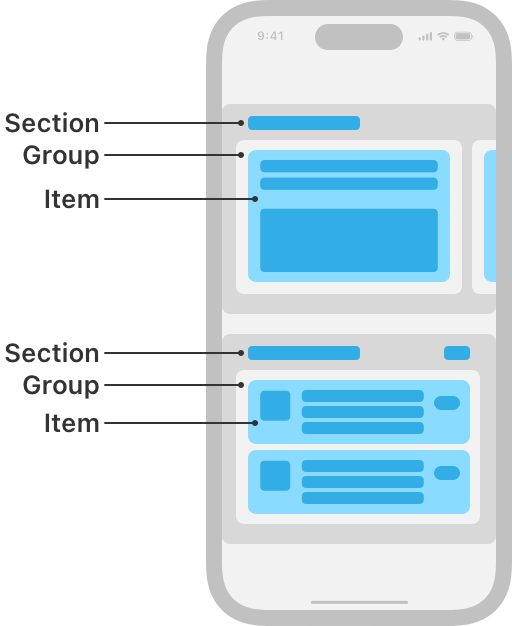

> Navigation: [Technologies](../technologies.md) · [UIKit](../uikit.md)

# UICollectionViewCompositionalLayout

<sub>Class</sub>

A layout object that lets you combine items in highly adaptive and flexible visual arrangements.

<sub>iOS, iPadOS, Mac Catalyst, tvOS, visionOS</sub>

```swift
@MainActor class UICollectionViewCompositionalLayout
```

## Overview

A compositional layout is a type of collection view layout. It’s designed to be composable, flexible, and fast, letting you build any kind of visual arrangement for your content by combining — or compositing — each smaller component into a full layout.

A compositional layout is composed of one or more sections that break up the layout into distinct visual groupings. Each section is composed of groups of individual items, the smallest unit of data you want to present. A group might lay out its items in a horizontal row, a vertical column, or a custom arrangement.



<sub>Schematic representation of the App Store app on iOS, showing a collection view with a compositional layout. The layout is composed of two horizontally-scrolling sections that have different layouts. The top section shows one group with one item visible onscreen, with other groups peeking in from the side of the screen. The bottom section shows one group that’s a column of three cells, each of those cells being an item. Each of the items, groups, and sections are outlined and labeled to show how the pieces fit together.</sub>

You combine the components by building up from items into a group, from groups into a section, and finally into a full layout, like in this example of a basic list layout:

**Swift**

```swift
func createBasicListLayout() -> UICollectionViewLayout { 
    let itemSize = NSCollectionLayoutSize(widthDimension: .fractionalWidth(1.0),                                  
                                         heightDimension: .fractionalHeight(1.0))    
    let item = NSCollectionLayoutItem(layoutSize: itemSize)  
  
    let groupSize = NSCollectionLayoutSize(widthDimension: .fractionalWidth(1.0),                                          
                                          heightDimension: .absolute(44))    
    let group = NSCollectionLayoutGroup.horizontal(layoutSize: groupSize,                                                   
                                                     subitems: [item])  
  
    let section = NSCollectionLayoutSection(group: group)    

    let layout = UICollectionViewCompositionalLayout(section: section)    
    return layout
}
```

**Objective-C**

```objc
- (UICollectionViewLayout *)createBasicListLayout {
    NSCollectionLayoutSize *itemSize = [NSCollectionLayoutSize sizeWithWidthDimension:[NSCollectionLayoutDimension fractionalWidthDimension:1.0] heightDimension:[NSCollectionLayoutDimension fractionalHeightDimension:1.0]];
    
    NSCollectionLayoutItem *item = [NSCollectionLayoutItem itemWithLayoutSize:itemSize];

    NSCollectionLayoutSize *groupSize = [NSCollectionLayoutSize sizeWithWidthDimension:[NSCollectionLayoutDimension fractionalWidthDimension:1.0] heightDimension:[NSCollectionLayoutDimension absoluteDimension:44.0]];

    NSCollectionLayoutGroup *group = [NSCollectionLayoutGroup horizontalGroupWithLayoutSize:groupSize subitems:@[item]];
    
    NSCollectionLayoutSection *section = [NSCollectionLayoutSection sectionWithGroup:group];

    UICollectionViewCompositionalLayout *layout = [[UICollectionViewCompositionalLayout alloc] initWithSection:section];
    
    return layout;
}
```

## Relationships

- **Inherits From**: [UICollectionViewLayout](uicollectionviewlayout.md)

- **Conforms To**: [CVarArg](../swift/cvararg.md), [CustomDebugStringConvertible](../swift/customdebugstringconvertible.md), [CustomStringConvertible](../swift/customstringconvertible.md), [Equatable](../swift/equatable.md), [Hashable](../swift/hashable.md), [NSCoding](../foundation/nscoding.md), [NSObjectProtocol](../objectivec/nsobjectprotocol.md), [Sendable](../swift/sendable.md), [SendableMetatype](../swift/sendablemetatype.md)

## Topics

### Creating a layout

- [- initWithSection:](<uicollectionviewcompositionallayout/init(section_).md>) — Creates a compositional layout object with a single section.
- [- initWithSection:configuration:](<uicollectionviewcompositionallayout/init(section_configuration_).md>) — Creates a compositional layout object with a single section and an additional configuration.
- [- initWithSectionProvider:](<uicollectionviewcompositionallayout/init(sectionprovider_).md>) — Creates a compositional layout object with a section provider to supply the layout’s sections.
- [- initWithSectionProvider:configuration:](<uicollectionviewcompositionallayout/init(sectionprovider_configuration_).md>) — Creates a compositional layout object with a section provider and an additional configuration.

### Creating a list layout

- [list(using:)](<uicollectionviewcompositionallayout/list(using_).md>) — Creates a compositional layout that contains only list sections of the specified configuration.
- [UICollectionLayoutListConfiguration](uicollectionlayoutlistconfiguration-swift.struct.md) — A configuration for creating a list layout.

### Configuring the layout

- [configuration](uicollectionviewcompositionallayout/configuration.md) — The layout’s configuration, such as its scroll direction and section spacing.

## See Also

### Essentials

- [Implementing modern collection views](implementing-modern-collection-views.md) — Bring compositional layouts to your app and simplify updating your user interface with diffable data sources.
