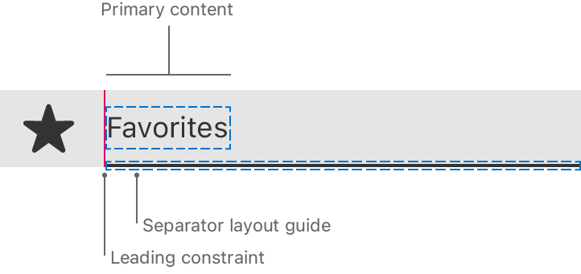

> Navigation: [Technologies](../../technologies.md) · [UIKit](../../uikit.md) · [UICollectionViewListCell](../uicollectionviewlistcell.md)

# separatorLayoutGuide

<sub>Instance Property</sub>

A guide for laying out separators in relation to the primary content in the cell.

<sub>iOS, iPadOS, Mac Catalyst, visionOS</sub>

```swift
var separatorLayoutGuide: UILayoutGuide { get }
```

## Discussion

This property only takes effect in a layout section that supports separators, like a section that you create using [list(using:layoutEnvironment:)](<../nscollectionlayoutsection/list(using_layoutenvironment_).md>).

The separator layout guide represents the frame of the separator, which the system uses to determine where to draw the separator at the bottom of the cell.

By default, when you apply a system-provided content configuration to a list cell, the separator automatically aligns to the primary text in the content view. For custom subviews in the cell, you need to add a constraint to this layout guide that connects it to the leading edge of the cell’s primary content.



<sub>Diagram of a Favorites menu item with a separator below the cell, indicating another cell below. The separator layout guide appears around the frame of the separator. The leading edge of the separator layout guide is constrained to the leading edge of the primary content, the beginning of the word “Favorites.”</sub>

To align the separators to your content, add constraints to the leading or trailing anchors of this layout guide.

## See Also

### Customizing layout

- [indentationLevel](indentationlevel.md) — The level of indentation for the cell.
- [indentationWidth](indentationwidth.md) — The width of an indentation level.
- [indentsAccessories](indentsaccessories.md) — A Boolean value that detemines whether the cell indents accessories on the leading side.
