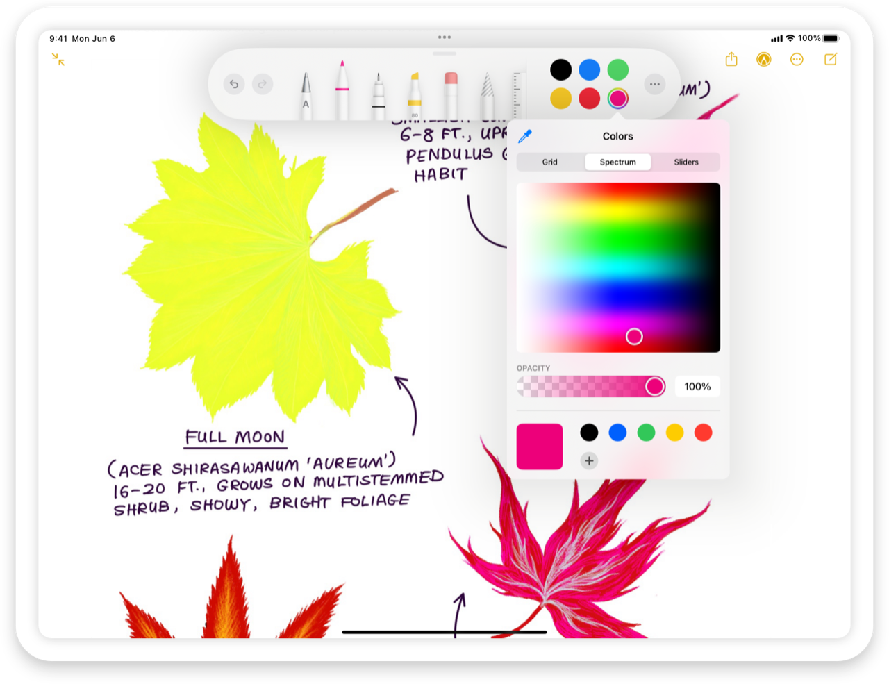

> Navigation: [Technologies](../technologies.md) · [UIKit](../uikit.md)

# UIColorPickerViewController

<sub>Class</sub>

A view controller that manages the interface for selecting a color.

<sub>iOS, iPadOS, Mac Catalyst, visionOS</sub>

```swift
@MainActor class UIColorPickerViewController
```

## Overview

[UIColorPickerViewController](uicolorpickerviewcontroller.md) provides a standard interface to select colors. Use this class instead of [UIColorWell](uicolorwell.md) if you need more fine-grained control over the presentation.



<sub>Screenshot of a color picker in a popover presentation style, showing a spectrum of color options. The title of the color picker is Colors.</sub>

You typically present a [UIColorPickerViewController](uicolorpickerviewcontroller.md) as a popover:

```swift
// This example code appears in a subclass of UIViewController that conforms to
// UIColorPickerViewControllerDelegate.
func presentColorPicker() {
    let colorPicker = UIColorPickerViewController()
    colorPicker.title = "Background Color"
    colorPicker.supportsAlpha = false
    colorPicker.delegate = self
    colorPicker.modalPresentationStyle = .popover
    colorPicker.popoverPresentationController?.sourceItem = self.navigationItem.rightBarButtonItem
    self.present(colorPicker, animated: true)
}
```

You can also react to the color-selection change or the dismissal of the color picker by implementing the [UIColorPickerViewControllerDelegate](uicolorpickerviewcontrollerdelegate.md) functions.

## Relationships

- **Inherits From**: [UIViewController](uiviewcontroller.md)

- **Conforms To**: [CVarArg](../swift/cvararg.md), [CustomDebugStringConvertible](../swift/customdebugstringconvertible.md), [CustomStringConvertible](../swift/customstringconvertible.md), [Equatable](../swift/equatable.md), [Hashable](../swift/hashable.md), [NSCoding](../foundation/nscoding.md), [NSExtensionRequestHandling](../foundation/nsextensionrequesthandling.md), [NSObjectProtocol](../objectivec/nsobjectprotocol.md), [NSTouchBarProvider](../appkit/nstouchbarprovider.md), [Sendable](../swift/sendable.md), [SendableMetatype](../swift/sendablemetatype.md), [UIActivityItemsConfigurationProviding](uiactivityitemsconfigurationproviding.md), [UIAppearanceContainer](uiappearancecontainer.md), [UIContentContainer](uicontentcontainer.md), [UIFocusEnvironment](uifocusenvironment.md), [UIPasteConfigurationSupporting](uipasteconfigurationsupporting.md), [UIResponderStandardEditActions](uiresponderstandardeditactions.md), [UIStateRestoring](uistaterestoring.md), [UITraitChangeObservable](uitraitchangeobservable-67e94.md), [UITraitEnvironment](uitraitenvironment.md), [UIUserActivityRestoring](uiuseractivityrestoring.md)

## Topics

### Creating a color picker view controller

- [- init](<uicolorpickerviewcontroller/init().md>) — Creates a color picker view controller.

### Configuring the color picker view controller

- [delegate](uicolorpickerviewcontroller/delegate.md) — The delegate that receives updates about the color selection.
- [UIColorPickerViewControllerDelegate](uicolorpickerviewcontrollerdelegate.md) — The delegate protocol to inform about changes in color selection.
- [maximumLinearExposure](uicolorpickerviewcontroller/maximumlinearexposure.md) — The maximum exposure to apply to a color when returned by the color picker.
- [selectedColor](uicolorpickerviewcontroller/selectedcolor.md) — The color selected by the user.
- [supportsAlpha](uicolorpickerviewcontroller/supportsalpha.md) — A Boolean value that enables alpha value control.
- [supportsEyedropper](uicolorpickerviewcontroller/supportseyedropper.md) — If set to `NO` the eyedropper functionality is not supported for this color picker.

## See Also

### Color picker

- [UIColorPickerViewControllerDelegate](uicolorpickerviewcontrollerdelegate.md) — The delegate protocol to inform about changes in color selection.
