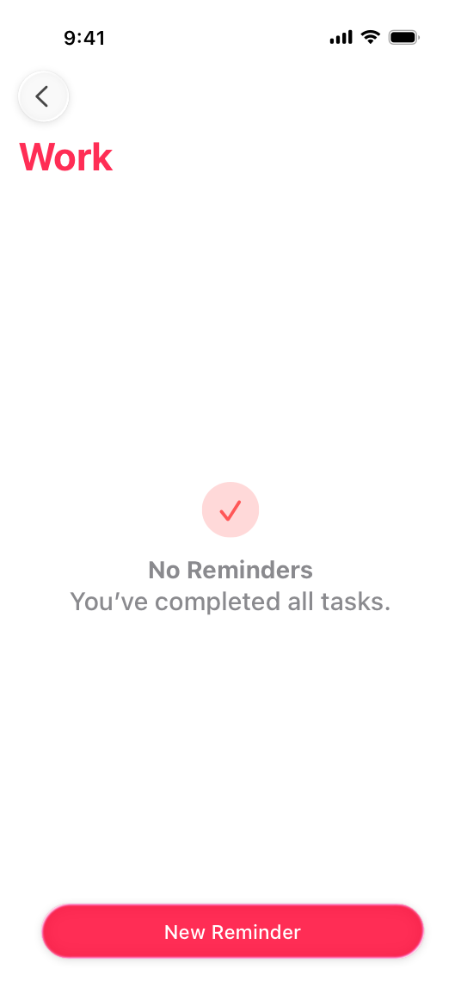

> Navigation: [Technologies](../technologies.md) · [UIKit](../uikit.md)

# UIContentUnavailableConfiguration

<sub>Structure</sub>

A content configuration for a content-unavailable view.

<sub>iOS, iPadOS, Mac Catalyst, tvOS, visionOS</sub>

```swift
struct UIContentUnavailableConfiguration
```

## Overview

A content-unavailable configuration is a composable description of a view that indicates your app can’t display content. Using a content-unavailable configuration, you can obtain system default styling for a variety of different empty states. Fill the configuration with placeholder content, and then assign it to a view controller’s [contentUnavailableConfiguration](uiviewcontroller/contentunavailableconfiguration-4b95e.md), or to a [UIContentUnavailableView](uicontentunavailableview.md).

The following screenshot shows an example of a content-unavailable view configured by setting the [image](uicontentunavailableconfiguration-swift.struct/image.md), [text](uicontentunavailableconfiguration-swift.struct/text.md), and [secondaryText](uicontentunavailableconfiguration-swift.struct/secondarytext.md) properties.



## Relationships

- **Conforms To**: [Copyable](../swift/copyable.md), [CustomDebugStringConvertible](../swift/customdebugstringconvertible.md), [CustomReflectable](../swift/customreflectable.md), [CustomStringConvertible](../swift/customstringconvertible.md), [Equatable](../swift/equatable.md), [Escapable](../swift/escapable.md), [Hashable](../swift/hashable.md), [UIContentConfiguration](uicontentconfiguration-9eib5.md)

## Topics

### Structures

- [ButtonProperties](uicontentunavailableconfiguration-swift.struct/buttonproperties-swift.struct.md) — Properties to configure buttons for a content-unavailable view.
- [ImageProperties](uicontentunavailableconfiguration-swift.struct/imageproperties-swift.struct.md) — Properties to configure the image for a content-unavailable view.
- [TextProperties](uicontentunavailableconfiguration-swift.struct/textproperties-swift.struct.md) — Properties to configure text for a content-unavailable view.

### Instance Properties

- [alignment](uicontentunavailableconfiguration-swift.struct/alignment-swift.property.md) — The alignment of the image, text, and buttons.
- [attributedText](uicontentunavailableconfiguration-swift.struct/attributedtext.md) — An attributed variant of the primary text.
- [axesPreservingSuperviewLayoutMargins](uicontentunavailableconfiguration-swift.struct/axespreservingsuperviewlayoutmargins.md) — Configures which margins use the layout margins inherited from the superview.
- [background](uicontentunavailableconfiguration-swift.struct/background.md) — The configuration for the background.
- [button](uicontentunavailableconfiguration-swift.struct/button.md) — The configuration for the primary button.
- [buttonProperties](uicontentunavailableconfiguration-swift.struct/buttonproperties-swift.property.md) — Additional configuration for the primary button.
- [buttonToSecondaryButtonPadding](uicontentunavailableconfiguration-swift.struct/buttontosecondarybuttonpadding.md) — The padding between the primary button and secondary button.
- [directionalLayoutMargins](uicontentunavailableconfiguration-swift.struct/directionallayoutmargins.md) — The margins between the content and the edges of the content view.
- [image](uicontentunavailableconfiguration-swift.struct/image.md) — The image to display.
- [imageProperties](uicontentunavailableconfiguration-swift.struct/imageproperties-swift.property.md) — The configuration for the image.
- [imageToTextPadding](uicontentunavailableconfiguration-swift.struct/imagetotextpadding.md) — The padding between the image and the primary text.
- [secondaryAttributedText](uicontentunavailableconfiguration-swift.struct/secondaryattributedtext.md) — An attributed variant of the secondary text.
- [secondaryButton](uicontentunavailableconfiguration-swift.struct/secondarybutton.md) — The configuration for the secondary button.
- [secondaryButtonProperties](uicontentunavailableconfiguration-swift.struct/secondarybuttonproperties.md) — Additional configuration for the secondary button.
- [secondaryText](uicontentunavailableconfiguration-swift.struct/secondarytext.md) — The secondary text to display.
- [secondaryTextProperties](uicontentunavailableconfiguration-swift.struct/secondarytextproperties.md) — Properties for configuring the secondary text.
- [text](uicontentunavailableconfiguration-swift.struct/text.md) — The primary text to display.
- [textProperties](uicontentunavailableconfiguration-swift.struct/textproperties-swift.property.md) — Properties for configuring the primary text.
- [textToButtonPadding](uicontentunavailableconfiguration-swift.struct/texttobuttonpadding.md) — The padding between the text and buttons.
- [textToSecondaryTextPadding](uicontentunavailableconfiguration-swift.struct/texttosecondarytextpadding.md) — The padding between the primary and secondary text.

### Type Methods

- [empty()](<uicontentunavailableconfiguration-swift.struct/empty().md>) — Creates the default configuration for unavailable content.
- [loading()](<uicontentunavailableconfiguration-swift.struct/loading().md>) — Creates the default configuration for content that’s loading.
- [search()](<uicontentunavailableconfiguration-swift.struct/search().md>) — Creates the default configuration for searches that return no results.

### Enumerations

- [Alignment](uicontentunavailableconfiguration-swift.struct/alignment-swift.enum.md) — Constants to define the alignment of views in a content-unavailable view.

## See Also

### Unavailable content configurations

- [UIContentUnavailableConfigurationState](uicontentunavailableconfigurationstate-swift.struct.md) — A structure that encapsulates state for a content-unavailable view.
