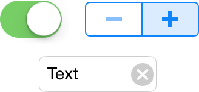

> Navigation: [Technologies](../technologies.md) · [UIKit](../uikit.md)

# UIControl

<sub>Class</sub>

The base class for controls, which are visual elements that convey a specific action or intention in response to user interactions.

<sub>iOS, iPadOS, Mac Catalyst, tvOS, visionOS</sub>

```swift
@MainActor class UIControl
```

## Overview

Controls implement elements such as buttons and sliders, which your app can use to facilitate navigation, gather user input, or manipulate content. Controls use the target-action mechanism to report user interactions to your app.



You don’t create instances of this class directly. The [UIControl](uicontrol.md) class is a subclassing point that you extend to implement custom controls. You can also subclass existing control classes to extend or modify their behaviors. For example, you might override the methods of this class to track touch events yourself or to determine when the state of the control changes.

A control’s state determines its appearance and its ability to support user interactions. Controls can be in one of several states, which the [State](uicontrol/state-swift.struct.md) type defines. You can change the state of a control programmatically according to your app’s needs. For example, you might disable a control to prevent the user from interacting with it. User interactions can also change the state of a control.

### Respond to user interaction

The target-action mechanism simplifies the code that you write to use controls in your app. Instead of writing code to track touch events, you write action methods to respond to control-specific events. For example, you might write an action method that responds to changes in the value of a slider. The control handles all the work of tracking incoming touch events and determining when to call your methods.

When adding an action method to a control, you specify both the action method and an object that defines that method to the [- addTarget:action:forControlEvents:](<uicontrol/addtarget(__action_for_).md>) method. (You can also configure the target and action of a control in Interface Builder.) The target object can be any object, but it’s typically the view controller’s root view that contains the control. If you specify `nil` for the target object, the control searches the responder chain for an object that defines the specified action method.

The signature of an action method takes one of three forms. The `sender` parameter corresponds to the control that calls the action method, and the `event` parameter corresponds to the [UIEvent](uievent.md) object that triggered the control-related event.

**Swift**

```swift
@IBAction func doSomething()
@IBAction func doSomething(sender: UIButton)
@IBAction func doSomething(sender: UIButton, forEvent event: UIEvent)
```

**Objective-C**

```objc
- (IBAction)doSomething;
- (IBAction)doSomething:(id)sender;
- (IBAction)doSomething:(id)sender forEvent:(UIEvent*)event;
```

The system calls action methods when the user interacts with the control in specific ways. The [Event](uicontrol/event.md) type defines the types of user interactions that a control can report and those interactions mostly correlate to specific touch events within the control. When configuring a control, you must specify which events trigger the calling of your method. For a button control, you might use the [UIControlEventTouchDown](uicontrol/event/touchdown.md) or [UIControlEventTouchUpInside](uicontrol/event/touchupinside.md) event to trigger calls to your action method. For a slider, you might care only about changes to the slider’s value, so you might choose to attach your action method to [UIControlEventValueChanged](uicontrol/event/valuechanged.md) events.

When a control-specific event occurs, the control calls any associated action methods immediately. The current [UIApplication](uiapplication.md) object dispatches action methods and finds an appropriate object to handle the message, following the responder chain, if necessary. For more information about responders and the responder chain, see [Event Handling Guide for UIKit Apps](https://developer.apple.com/library/archive/documentation/EventHandling/Conceptual/EventHandlingiPhoneOS/index.html#//apple_ref/doc/uid/TP40009541).

### Configure control attributes in Interface Builder

The following table lists the attributes for instances of the [UIControl](uicontrol.md) class.

| Attribute | Description |
|---|---|
| Alignment | The horizontal and vertical alignment of a control’s content. For controls that contain text or images, such as buttons and text fields, use these attributes to configure the position of that content within the control’s bounds.  These alignment options apply to the content of a control and not to the control itself. For information about how to align controls with respect to other controls and views, see [Auto Layout Guide](https://developer.apple.com/library/archive/documentation/UserExperience/Conceptual/AutolayoutPG/index.html#//apple_ref/doc/uid/TP40010853). |
| Content | The initial state of the control. Use the checkboxes to configure whether the control is in an enabled, selected, or highlighted state initially. |

### Support localization

Because [UIControl](uicontrol.md) is an abstract class, you don’t internationalize it specifically. However, you do internationalize the content of subclasses like [UIButton](uibutton.md). For information about internationalizing a specific control, see the reference for that control.

### Make controls accessible

Controls are accessible by default. To be useful, an accessible user interface element must provide accurate and helpful information about its screen position, name, behavior, value, and type. This is the information VoiceOver speaks to users. Users who are blind or have low vision can rely on VoiceOver to help them use their devices.

Controls support the following accessibility attributes:

- **Label.** A short, localized word or phrase that succinctly describes the control or view, but doesn’t identify the element’s type. Examples are _Add_ and _Play_.
- **Traits.** A combination of one or more individual traits, each of which describes a single aspect of an element’s state, behavior, or usage. For example, you might use a combination of the Keyboard Key and the Selected traits to describe an element that behaves like a keyboard key and that’s in a selected state.
- **Hint.** A brief, localized phrase that describes the results of an action on an element. Examples are _Adds a title_ and _Opens the shopping list_.
- **Frame.** The frame of the element in screen coordinates, which the `CGRect` structure specifies for an element’s screen location and size.
- **Value.** The current value of an element when the label doesn’t represent the value. For example, the label for a slider might be _Speed_, but its current value might be _50%_.

The `UIControl` class provides default content for the value and frame attributes. Many controls automatically enable additional specific traits as well. You can configure other accessibility attributes programmatically or with the Identity inspector in Interface Builder.

For more information about accessibility attributes, see [Accessibility Programming Guide for iOS](https://developer.apple.com/library/archive/documentation/UserExperience/Conceptual/iPhoneAccessibility/Introduction/Introduction.html#//apple_ref/doc/uid/TP40008785).

### Subclassing notes

Subclassing [UIControl](uicontrol.md) gives you access to the built-in target-action mechanism and simplified event-handling support. You can subclass existing controls and modify their behavior in one of two ways:

- Override the [- sendAction:to:forEvent:](<uicontrol/sendaction(__to_for_).md>) method of an existing subclass to observe or modify the dispatching of action methods to the control’s associated targets. You might use this method to modify the dispatch behavior for the specified object, selector, or event.
- Override the [- beginTrackingWithTouch:withEvent:](<uicontrol/begintracking(__with_).md>), [- continueTrackingWithTouch:withEvent:](<uicontrol/continuetracking(__with_).md>), [- endTrackingWithTouch:withEvent:](<uicontrol/endtracking(__with_).md>), and [- cancelTrackingWithEvent:](<uicontrol/canceltracking(with_).md>) methods to track touch events occurring in the control. You can use the tracking information to perform additional actions. Always use these methods to track touch events instead of the methods that the [UIResponder](uiresponder.md) class defines.

If you subclass [UIControl](uicontrol.md) directly, your subclass is responsible for setting up and managing your control’s visual appearance. Use the methods for tracking events to update your control’s state and to send an action when the control’s value changes.

## Relationships

- **Inherits From**: [UIView](uiview.md)

- **Inherited By**: [UIButton](uibutton.md), [UIColorWell](uicolorwell.md), [UIDatePicker](uidatepicker.md), [UIPageControl](uipagecontrol.md), [UIPasteControl](uipastecontrol.md), [UIRefreshControl](uirefreshcontrol.md), [UISegmentedControl](uisegmentedcontrol.md), [UISlider](uislider.md), [UIStepper](uistepper.md), [UISwitch](uiswitch.md), [UITextField](uitextfield.md)

- **Conforms To**: [CALayerDelegate](../quartzcore/calayerdelegate.md), [CLBodyIdentifiable](../corelocation/clbodyidentifiable.md), [CMBodyIdentifiable](../coremotion/cmbodyidentifiable.md), [CVarArg](../swift/cvararg.md), [Copyable](../swift/copyable.md), [CustomDebugStringConvertible](../swift/customdebugstringconvertible.md), [CustomStringConvertible](../swift/customstringconvertible.md), [Equatable](../swift/equatable.md), [Escapable](../swift/escapable.md), [Hashable](../swift/hashable.md), [NSCoding](../foundation/nscoding.md), [NSObjectProtocol](../objectivec/nsobjectprotocol.md), [NSTouchBarProvider](../appkit/nstouchbarprovider.md), [Sendable](../swift/sendable.md), [SendableMetatype](../swift/sendablemetatype.md), [UIAccessibilityIdentification](uiaccessibilityidentification.md), [UIActivityItemsConfigurationProviding](uiactivityitemsconfigurationproviding.md), [UIAppearance](uiappearance.md), [UIAppearanceContainer](uiappearancecontainer.md), [UIContextMenuInteractionDelegate](uicontextmenuinteractiondelegate.md), [UICoordinateSpace](uicoordinatespace.md), [UIDynamicItem](uidynamicitem.md), [UIFocusEnvironment](uifocusenvironment.md), [UIFocusItem](uifocusitem.md), [UIFocusItemContainer](uifocusitemcontainer.md), [UILargeContentViewerItem](uilargecontentvieweritem.md), [UIPasteConfigurationSupporting](uipasteconfigurationsupporting.md), [UIPopoverPresentationControllerSourceItem](uipopoverpresentationcontrollersourceitem.md), [UIResponderStandardEditActions](uiresponderstandardeditactions.md), [UITraitChangeObservable](uitraitchangeobservable-67e94.md), [UITraitEnvironment](uitraitenvironment.md), [UIUserActivityRestoring](uiuseractivityrestoring.md)

## Topics

### Creating a control

- [- initWithFrame:primaryAction:](<uicontrol/init(frame_primaryaction_).md>) — Creates a control with the specified frame and primary action.
- [- initWithFrame:](<uicontrol/init(frame_).md>) — Creates a control with the specified frame.
- [- initWithCoder:](<uicontrol/init(coder_).md>) — Creates a control from data in an unarchiver.

### Managing state

- [state](uicontrol/state-swift.property.md) — The state of the control, specified as a bit mask value.
- [State](uicontrol/state-swift.struct.md) — Constants describing the state of a control.
- [enabled](uicontrol/isenabled.md) — A Boolean value indicating whether the control is in the enabled state.
- [selected](uicontrol/isselected.md) — A Boolean value indicating whether the control is in the selected state.
- [highlighted](uicontrol/ishighlighted.md) — A Boolean value indicating whether the control draws a highlight.

### Specifying content alignment

- [contentVerticalAlignment](uicontrol/contentverticalalignment-swift.property.md) — The vertical alignment of content within the control’s bounds.
- [ContentVerticalAlignment](uicontrol/contentverticalalignment-swift.enum.md) — Constants for specifying the vertical alignment of content (text and images) in a control.
- [contentHorizontalAlignment](uicontrol/contenthorizontalalignment-swift.property.md) — The horizontal alignment of content within the control’s bounds.
- [effectiveContentHorizontalAlignment](uicontrol/effectivecontenthorizontalalignment.md) — The horizontal alignment currently in effect for the control.
- [ContentHorizontalAlignment](uicontrol/contenthorizontalalignment-swift.enum.md) — The horizontal alignment of content (text and images) within a control.

### Managing the control’s targets and actions

- [- addTarget:action:forControlEvents:](<uicontrol/addtarget(__action_for_).md>) — Associates a target object and action method with the control.
- [- removeTarget:action:forControlEvents:](<uicontrol/removetarget(__action_for_).md>) — Stops the delivery of events to the specified target object.
- [allTargets](uicontrol/alltargets.md) — Returns all target objects associated with the control.
- [- addAction:forControlEvents:](<uicontrol/addaction(__for_).md>) — Adds the UIAction to a given event. UIActions are uniqued based on their identifier, and subsequent actions with the same identifier replace previously added actions. You may add multiple UIActions for corresponding controlEvents, and you may add the same action to multiple controlEvents.
- [- removeAction:forControlEvents:](<uicontrol/removeaction(__for_).md>) — Removes the action from the set of passed control events.
- [- removeActionForIdentifier:forControlEvents:](<uicontrol/removeaction(identifiedby_for_).md>) — Removes the action with the provided identifier from the set of passed control events.
- [- actionsForTarget:forControlEvent:](<uicontrol/actions(fortarget_forcontrolevent_).md>) — Returns the actions performed on a target object when the specified event occurs.
- [allControlEvents](uicontrol/allcontrolevents.md) — Returns the events for which the control has associated actions.
- [enumerateEventHandlers(_:)](<uicontrol/enumerateeventhandlers(__).md>)
- [Event](uicontrol/event.md) — Constants describing the types of events possible for controls.

### Triggering actions

- [- performPrimaryAction](<uicontrol/performprimaryaction().md>) — Calls the method associated with the control’s primary action.
- [- sendAction:](<uicontrol/sendaction(__).md>) — Like -sendAction:to:forEvent:, this method is called by -sendActionsForControlEvents:. You may override this method to observe or modify behavior. If you override this method, you should call super precisely once to dispatch the action, or not call super to suppress sending that action.
- [- sendAction:to:forEvent:](<uicontrol/sendaction(__to_for_).md>) — Calls the specified action method.
- [- sendActionsForControlEvents:](<uicontrol/sendactions(for_).md>) — Calls the action methods associated with the specified events.

### Tracking touches and redrawing controls

- [- beginTrackingWithTouch:withEvent:](<uicontrol/begintracking(__with_).md>) — Notifies the control when a touch event enters the control’s bounds.
- [- continueTrackingWithTouch:withEvent:](<uicontrol/continuetracking(__with_).md>) — Notifies the control when a touch event for the control updates.
- [- endTrackingWithTouch:withEvent:](<uicontrol/endtracking(__with_).md>) — Notifies the control when a touch event associated with the control ends.
- [- cancelTrackingWithEvent:](<uicontrol/canceltracking(with_).md>) — Notifies the control to cancel tracking related to the specified event.
- [tracking](uicontrol/istracking.md) — A Boolean value that indicates whether the control is currently tracking touch events.
- [touchInside](uicontrol/istouchinside.md) — A Boolean value that indicates whether a tracked touch event is currently inside the control’s bounds.

### Managing context menus

- [Adding context menus in your app](adding-context-menus-in-your-app.md) — Provide quick access to useful actions by adding context menus to your iOS app.
- [contextMenuInteraction](uicontrol/contextmenuinteraction.md) — A context menu interaction for the control.
- [contextMenuInteractionEnabled](uicontrol/iscontextmenuinteractionenabled.md) — A Boolean value that determines whether the control enables its context menu interaction.
- [showsMenuAsPrimaryAction](uicontrol/showsmenuasprimaryaction.md) — A Boolean value that determines whether the context menu interaction is the control’s primary action.
- [- contextMenuInteraction:configurationForMenuAtLocation:](<uicontrol/contextmenuinteraction(__configurationformenuatlocation_).md>)
- [- contextMenuInteraction:previewForDismissingMenuWithConfiguration:](<uicontrol/contextmenuinteraction(__previewfordismissingmenuwithconfiguration_).md>)
- [- contextMenuInteraction:previewForHighlightingMenuWithConfiguration:](<uicontrol/contextmenuinteraction(__previewforhighlightingmenuwithconfiguration_).md>)
- [- contextMenuInteraction:willDisplayMenuForConfiguration:animator:](<uicontrol/contextmenuinteraction(__willdisplaymenufor_animator_).md>)
- [- contextMenuInteraction:willEndForConfiguration:animator:](<uicontrol/contextmenuinteraction(__willendfor_animator_).md>)
- [- menuAttachmentPointForConfiguration:](<uicontrol/menuattachmentpoint(for_).md>) — Return a point in this control’s coordinate space to which to attach the given configuration’s menu.

### Showing tooltips

- [toolTip](uicontrol/tooltip.md) — The default text to display in the control’s tooltip.
- [toolTipInteraction](uicontrol/tooltipinteraction.md) — The tooltip interaction associated with the control.

### Inspecting animation status

- [symbolAnimationEnabled](uicontrol/issymbolanimationenabled.md) — A Boolean value that indicates whether symbol effects animate.

## See Also

### Controls

- [Responding to control-based events using target-action](responding-to-control-based-events-using-target-action.md) — Handle user input by connecting buttons, sliders, and other controls to your app’s code using the target-action design pattern.
- [UIButton](uibutton.md) — A control that executes your custom code in response to user interactions.
- [UIColorWell](uicolorwell.md) — A control that displays a color picker.
- [UIDatePicker](uidatepicker.md) — A control for inputting date and time values.
- [UIPageControl](uipagecontrol.md) — A control that displays a horizontal series of dots, each of which corresponds to a page in the app’s document or other data-model entity.
- [UISegmentedControl](uisegmentedcontrol.md) — A horizontal control that consists of multiple segments, each segment functioning as a discrete button.
- [UISlider](uislider.md) — A control for selecting a single value from a continuous range of values.
- [UIStepper](uistepper.md) — A control for incrementing or decrementing a value.
- [UISwitch](uiswitch.md) — A control that offers a binary choice, such as on/off.
