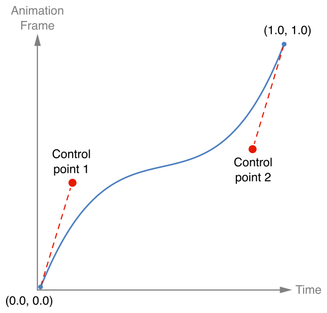

> Navigation: [Technologies](../technologies.md) · [UIKit](../uikit.md)

# UICubicTimingParameters

<sub>Class</sub>

The timing information for animations in the form of a cubic Bézier curve.

<sub>iOS, iPadOS, Mac Catalyst, tvOS, visionOS</sub>

```swift
@MainActor class UICubicTimingParameters
```

## Overview

Use a [UICubicTimingParameters](uicubictimingparameters.md) object to specify custom timing curves when creating animations with objects that adopt the [UIViewAnimating](uiviewanimating.md) protocol, such as [UIViewPropertyAnimator](uiviewpropertyanimator.md).

A cubic Bézier timing curve consists of a line whose starting point is (`0`, `0`), whose end point is (`1`, `1`), and whose shape is defined by two control points. The slope of the line at each point in time defines the speed of the animation at that time. Steep slopes cause animations to appear to run faster and shallower slopes cause them to appear to run slower. The following graph shows a timing curve where the animations start fast and finish fast but run more slowly through the middle section.



## Relationships

- **Inherits From**: [NSObject](../objectivec/nsobject-swift.class.md)

- **Conforms To**: [CVarArg](../swift/cvararg.md), [CustomDebugStringConvertible](../swift/customdebugstringconvertible.md), [CustomStringConvertible](../swift/customstringconvertible.md), [Equatable](../swift/equatable.md), [Hashable](../swift/hashable.md), [NSCoding](../foundation/nscoding.md), [NSCopying](../foundation/nscopying.md), [NSObjectProtocol](../objectivec/nsobjectprotocol.md), [Sendable](../swift/sendable.md), [UITimingCurveProvider](uitimingcurveprovider.md)

## Topics

### Initializing a cubic timing parameters object

- [- init](<uicubictimingparameters/init().md>) — Initializes the object with the system’s default timing curve.
- [- initWithAnimationCurve:](<uicubictimingparameters/init(animationcurve_).md>) — Initializes the object with the specified UIKit timing curve.
- [- initWithControlPoint1:controlPoint2:](<uicubictimingparameters/init(controlpoint1_controlpoint2_).md>) — Initializes the object with the specified control points for a cubic Bézier curve.
- [- initWithCoder:](<uicubictimingparameters/init(coder_).md>) — Creates a timing parameters object from data in an unarchiver.

### Getting the timing parameters

- [animationCurve](uicubictimingparameters/animationcurve.md) — The standard UIKit animation curve to use for timing.
- [controlPoint1](uicubictimingparameters/controlpoint1.md) — The first control point for the cubic Bézier curve.
- [controlPoint2](uicubictimingparameters/controlpoint2.md) — The second control point of the cubic Bézier curve.

## See Also

### Timing curves

- [UITimingCurveProvider](uitimingcurveprovider.md) — An interface for providing the timing information needed to perform animations.
- [UISpringTimingParameters](uispringtimingparameters.md) — The timing information for animations that mimics the behavior of a spring.
