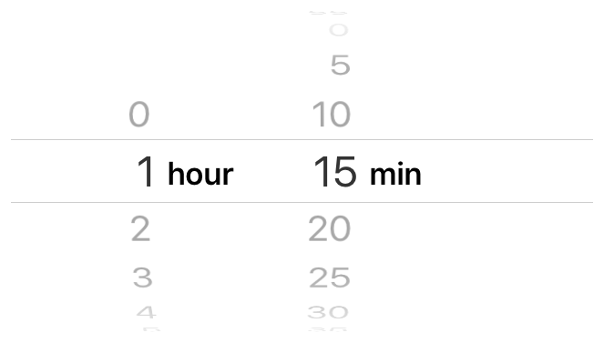

> Navigation: [Technologies](../technologies.md) · [UIKit](../uikit.md)

# UIDatePicker

<sub>Class</sub>

A control for inputting date and time values.

<sub>iOS, iPadOS, Mac Catalyst, visionOS</sub>

```swift
@MainActor class UIDatePicker
```

## Overview

You can use a date picker to allow a user to enter either a point in time (calendar date, time value, or both) or a time interval (for example, for a timer). The date picker reports interactions to its associated target object.

To add a date picker to your interface:

- Set the date picker mode at creation time.
- Supply additional configuration options such as minimum and maximum dates if required.
- Connect an action method to the date picker.
- Set up Auto Layout rules to govern the position of the date picker in your interface.

You use a date picker only for handling the selection of times and dates. If you want to handle the selection of arbitrary items from a list, use a [UIPickerView](uipickerview.md) object.

### Configure a date picker

The [datePickerMode](uidatepicker/datepickermode.md) property determines the configuration of a date picker. You can set the [datePickerMode](uidatepicker/datepickermode.md) value programmatically or in Interface Builder. For modes that include date or time values, you can also configure the locale, calendar, and time zone information. The date picker uses that information when formatting date and time values for the current user, and defaults to the device’s locale, calendar, and time zone. The [date](uidatepicker/date.md) property represents the currently selected date in the form of an [NSDate](../foundation/nsdate.md) object, which is calendar and time zone agnostic.

To limit the range of dates that the user can select, assign values to the [minimumDate](uidatepicker/minimumdate.md) and [maximumDate](uidatepicker/maximumdate.md) properties. You can also use the [minuteInterval](uidatepicker/minuteinterval.md) property to allow only specific time increments.

Setting the [datePickerMode](uidatepicker/datepickermode.md) property to [UIDatePickerModeCountDownTimer](uidatepicker/mode/countdowntimer.md) allows the user to choose a duration in hours and minutes. When in this mode, the [countDownDuration](uidatepicker/countdownduration.md) property represents the displayed duration, measured in seconds as an [TimeInterval](../foundation/timeinterval.md). Note that even though you set this property in seconds, the date picker can only show values in minutes.

The figure below shows a date picker configured with the [datePickerMode](uidatepicker/datepickermode.md) property set to [UIDatePickerModeCountDownTimer](uidatepicker/mode/countdowntimer.md) and the [minuteInterval](uidatepicker/minuteinterval.md) property set to `5`. The value of [countDownDuration](uidatepicker/countdownduration.md) is currently `4500`.



> [!note] Note
> You can use a [UIDatePicker](uidatepicker.md) object for the selection of a time interval, but you must use an [Timer](../foundation/timer.md) object to implement the actual timer behavior. For more information, see [Timer](../foundation/timer.md).

### Respond to user interaction

Date pickers use the target-action design pattern to notify your app when the user changes the selected date. To be notified when the date picker’s value changes, register your action method with the [UIControlEventValueChanged](uicontrol/event/valuechanged.md) event. At runtime the date picker calls your methods in response to the user selecting a date or time.

You connect a date picker to your action method using the [- addTarget:action:forControlEvents:](<uicontrol/addtarget(__action_for_).md>) method or by creating a connection in Interface Builder. The signature of an action method takes one of three forms, as shown in the following code. Choose the form that provides the information that you need to respond to the value change in the date picker.

**Swift**

```swift
@IBAction func doSomething()
@IBAction func doSomething(sender: UIDatePicker)
@IBAction func doSomething(sender: UIDatePicker, forEvent event: UIEvent)
```

**Objective-C**

```objc
- (IBAction)doSomething;
- (IBAction)doSomething:(id)sender;
- (IBAction)doSomething:(id)sender forEvent:(UIEvent*)event;
```

### Debug date pickers

When debugging issues with date pickers, watch for these common pitfalls:

- **The minimum date must be earlier than the maximum date.** Check the bounds of your [minimumDate](uidatepicker/minimumdate.md) and [maximumDate](uidatepicker/maximumdate.md) properties. If the maximum date is less than the minimum date, both properties are ignored, and the date picker allows the selection of any date value. The minimum and maximum dates are ignored in the countdown-timer mode ([UIDatePickerModeCountDownTimer](uidatepicker/mode/countdowntimer.md)).
- **The minute interval must be a divisor of 60.** Check that the [minuteInterval](uidatepicker/minuteinterval.md) value can be evenly divided into 60; otherwise, the default value is used (`1`).

### Configure date picker attributes in Interface Builder

The following table lists the core attributes that you configure for date pickers in Attributes Inspector within Interface Builder.

| Attribute | Description |
|---|---|
| Style | The date picker style. Determines the appearance of the date picker. Access this value at runtime with the [datePickerStyle](uidatepicker/datepickerstyle.md) property. |
| Mode | The date picker mode. Determines whether the date picker should display a time, a date, a time and date, or a countdown interval. Access this value at runtime with the [datePickerMode](uidatepicker/datepickermode.md) property. |
| Locale | The locale associated with the date picker. This property allows you to override the system default with a specific locale. You can access this attribute programmatically with the [locale](uidatepicker/locale.md) property. |
| Interval | The granularity of the minutes spinner, if it is shown in the current mode. The default value is 1, and the maximum value is 30. The value you choose must be a divisor of 60 (1, 2, 3, 4, 5, 6, 10, 12, 15, 20, 30). Access this value at runtime with the [minuteInterval](uidatepicker/minuteinterval.md) property. |

The following table lists the attributes that control the display of date and time in a date picker.

| Attribute | Description |
|---|---|
| Date | The initial date that the date picker displays. Defaults to the current date, but you can set a custom value. This attribute is equivalent to setting the [date](uidatepicker/date.md) property programmatically. |
| Constraints | The range of selectable dates displayed by the date picker. To use a dynamic range, configure the [minimumDate](uidatepicker/minimumdate.md) and [maximumDate](uidatepicker/maximumdate.md) properties programmatically. The date picker ignores these options when the Mode attribute is set to Count Down Timer. |
| Timer | The initial value of the date picker when used in countdown timer mode. The value is measured in seconds, but the display is in minutes. |

For information about the date picker’s inherited Interface Builder attributes, see [UIControl](uicontrol.md) and [UIView](uiview.md).

### Change the appearance

You can change the appearance of [UIDatePicker](uidatepicker.md) by setting [preferredDatePickerStyle](uidatepicker/preferreddatepickerstyle.md). For a list of appearance styles, see [UIDatePickerStyle](uidatepickerstyle.md).

You should integrate date pickers in your layout using Auto Layout. Although date pickers can be resized, they should be used at their intrinsic content size.

### Specify a locale

Date pickers handle their own internationalization; the only thing you need to do is specify the appropriate locale. You can choose a specific locale for your date picker to appear in by setting the Locale ([locale](uidatepicker/locale.md)) field in Attributes Inspector. Setting the locale changes the language that the date picker uses for display, but also the format of the date and time (for example, certain locales present days before month names, or prefer a 24-hour clock over a 12-hour clock). The width of the date picker automatically accommodates for the length of the localization. To use the system language, leave this property set to default.

For more information, see [Internationalization and Localization Guide](https://developer.apple.com/library/archive/documentation/MacOSX/Conceptual/BPInternational/Introduction/Introduction.html#//apple_ref/doc/uid/10000171i).

### Support accessibility and VoiceOver

Date pickers are accessible by default. Each time component in the date picker is its own accessibility element and has the Adjustable ([UIAccessibilityTraitAdjustable](uiaccessibilitytraits/adjustable.md)) trait.

The device reads the accessibility value, traits, and hint out loud for each date picker when the user enables VoiceOver. VoiceOver speaks this information when a user taps on a picker wheel. For example, when a user taps the hours column on the Add Alarm page (Clock \> Alarm \> Add), VoiceOver speaks the following:

```objc
"2 o'clock. Picker item. Adjustable. Swipe up or down with one finger to adjust the value."
```

For further information about making iOS controls accessible, see the [Accessibility Programming Guide for iOS](https://developer.apple.com/library/archive/documentation/UserExperience/Conceptual/iPhoneAccessibility/Introduction/Introduction.html#//apple_ref/doc/uid/TP40008785).

## Relationships

- **Inherits From**: [UIControl](uicontrol.md)

- **Conforms To**: [CALayerDelegate](../quartzcore/calayerdelegate.md), [CLBodyIdentifiable](../corelocation/clbodyidentifiable.md), [CMBodyIdentifiable](../coremotion/cmbodyidentifiable.md), [CVarArg](../swift/cvararg.md), [CustomDebugStringConvertible](../swift/customdebugstringconvertible.md), [CustomStringConvertible](../swift/customstringconvertible.md), [Equatable](../swift/equatable.md), [Hashable](../swift/hashable.md), [NSCoding](../foundation/nscoding.md), [NSObjectProtocol](../objectivec/nsobjectprotocol.md), [NSTouchBarProvider](../appkit/nstouchbarprovider.md), [Sendable](../swift/sendable.md), [SendableMetatype](../swift/sendablemetatype.md), [UIAccessibilityIdentification](uiaccessibilityidentification.md), [UIActivityItemsConfigurationProviding](uiactivityitemsconfigurationproviding.md), [UIAppearance](uiappearance.md), [UIAppearanceContainer](uiappearancecontainer.md), [UIContextMenuInteractionDelegate](uicontextmenuinteractiondelegate.md), [UICoordinateSpace](uicoordinatespace.md), [UIDynamicItem](uidynamicitem.md), [UIFocusEnvironment](uifocusenvironment.md), [UIFocusItem](uifocusitem.md), [UIFocusItemContainer](uifocusitemcontainer.md), [UILargeContentViewerItem](uilargecontentvieweritem.md), [UIPasteConfigurationSupporting](uipasteconfigurationsupporting.md), [UIPopoverPresentationControllerSourceItem](uipopoverpresentationcontrollersourceitem.md), [UIResponderStandardEditActions](uiresponderstandardeditactions.md), [UITraitChangeObservable](uitraitchangeobservable-67e94.md), [UITraitEnvironment](uitraitenvironment.md), [UIUserActivityRestoring](uiuseractivityrestoring.md)

## Topics

### Managing the date and calendar

- [calendar](uidatepicker/calendar.md) — The calendar to use for the date picker.
- [date](uidatepicker/date.md) — The date displayed by the date picker.
- [locale](uidatepicker/locale.md) — The locale used by the date picker.
- [- setDate:animated:](<uidatepicker/setdate(__animated_).md>) — Sets the date to display in the date picker, with an option to animate the setting.
- [timeZone](uidatepicker/timezone.md) — The time zone reflected in the date displayed by the date picker.

### Configuring the date picker mode

- [datePickerMode](uidatepicker/datepickermode.md) — The mode of the date picker.
- [Mode](uidatepicker/mode.md) — The mode displayed by the date picker.

### Configuring the date picker style

- [datePickerStyle](uidatepicker/datepickerstyle.md) — The current style of the date picker.
- [preferredDatePickerStyle](uidatepicker/preferreddatepickerstyle.md) — The preferred style of the date picker.
- [UIDatePickerStyle](uidatepickerstyle.md) — Styles that determine the appearance of a date picker.

### Configuring temporal attributes

- [maximumDate](uidatepicker/maximumdate.md) — The maximum date that a date picker can show.
- [minimumDate](uidatepicker/minimumdate.md) — The minimum date that a date picker can show.
- [minuteInterval](uidatepicker/minuteinterval.md) — The interval at which the date picker should display minutes.
- [countDownDuration](uidatepicker/countdownduration.md) — The value displayed by the date picker when the mode property is set to show a countdown time.
- [roundsToMinuteInterval](uidatepicker/roundstominuteinterval.md) — A Boolean value that determines whether the date rounds to a specific minute interval.

## See Also

### Controls

- [Responding to control-based events using target-action](responding-to-control-based-events-using-target-action.md) — Handle user input by connecting buttons, sliders, and other controls to your app’s code using the target-action design pattern.
- [UIControl](uicontrol.md) — The base class for controls, which are visual elements that convey a specific action or intention in response to user interactions.
- [UIButton](uibutton.md) — A control that executes your custom code in response to user interactions.
- [UIColorWell](uicolorwell.md) — A control that displays a color picker.
- [UIPageControl](uipagecontrol.md) — A control that displays a horizontal series of dots, each of which corresponds to a page in the app’s document or other data-model entity.
- [UISegmentedControl](uisegmentedcontrol.md) — A horizontal control that consists of multiple segments, each segment functioning as a discrete button.
- [UISlider](uislider.md) — A control for selecting a single value from a continuous range of values.
- [UIStepper](uistepper.md) — A control for incrementing or decrementing a value.
- [UISwitch](uiswitch.md) — A control that offers a binary choice, such as on/off.
