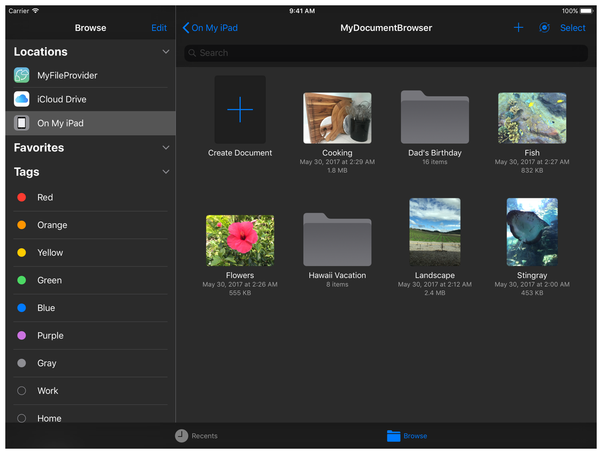

> Navigation: [Technologies](../technologies.md) · [UIKit](../uikit.md)

# UIDocumentBrowserViewController

<sub>Class</sub>

A view controller for browsing and performing actions on documents that you store locally and in the cloud.

<sub>iOS, iPadOS, Mac Catalyst, visionOS</sub>

```swift
@MainActor class UIDocumentBrowserViewController
```

## Overview

With the document browser view controller, users can easily access and view their documents in the cloud. By default, the document browser can access both the system’s local file provider and its iCloud file provider.



<sub>A screenshot of the document browser. The On My iPad location is in a selected state on the left, and several photos and folders appear in the pane on the right.</sub>

The local file provider grants access to all the documents in the app’s `Documents` directory. Users can also access documents from another app’s `Documents` directory, if that app declares either the [UISupportsDocumentBrowser](../bundleresources/information-property-list/uisupportsdocumentbrowser.md) key, or both the [UIFileSharingEnabled](../bundleresources/information-property-list/uifilesharingenabled.md) and [LSSupportsOpeningDocumentsInPlace](../bundleresources/information-property-list/lssupportsopeningdocumentsinplace.md) keys in its `Info.plist` file. When the user opens a document from another app’s `Documents` directory, they edit the document in place, and save the changes to the other app’s `Documents` directory.

The iCloud file provider creates a folder for your app in the user’s iCloud Drive. Users can access documents from this folder, or from anywhere in their iCloud Drive. The system automatically handles access to iCloud for you, so you don’t need to enable your app’s iCloud capabilities.

Third-party storage services can also provide access to the documents they manage by implementing a File Provider extension (iOS 11 or later). For more information, see [File Provider](../fileprovider.md).

> [!important] Important
> Don’t assume that the files you access are local. Users can store files in iCloud Drive, or in any cloud storage that provides a current File Provider extension.
>
> Remember that the system (or other apps) might modify the files that the document browser provides at any time. Therefore, you must coordinate your access to these files using either a [UIDocument](uidocument.md) subclass, or [NSFilePresenter](../foundation/nsfilepresenter.md) and [NSFileCoordinator](../foundation/nsfilecoordinator.md) objects.

## Relationships

- **Inherits From**: [UIViewController](uiviewcontroller.md)

- **Conforms To**: [CVarArg](../swift/cvararg.md), [CustomDebugStringConvertible](../swift/customdebugstringconvertible.md), [CustomStringConvertible](../swift/customstringconvertible.md), [Equatable](../swift/equatable.md), [Hashable](../swift/hashable.md), [NSCoding](../foundation/nscoding.md), [NSExtensionRequestHandling](../foundation/nsextensionrequesthandling.md), [NSObjectProtocol](../objectivec/nsobjectprotocol.md), [NSTouchBarProvider](../appkit/nstouchbarprovider.md), [Sendable](../swift/sendable.md), [SendableMetatype](../swift/sendablemetatype.md), [UIActivityItemsConfigurationProviding](uiactivityitemsconfigurationproviding.md), [UIAppearanceContainer](uiappearancecontainer.md), [UIContentContainer](uicontentcontainer.md), [UIFocusEnvironment](uifocusenvironment.md), [UIPasteConfigurationSupporting](uipasteconfigurationsupporting.md), [UIResponderStandardEditActions](uiresponderstandardeditactions.md), [UIStateRestoring](uistaterestoring.md), [UITraitChangeObservable](uitraitchangeobservable-67e94.md), [UITraitEnvironment](uitraitenvironment.md), [UIUserActivityRestoring](uiuseractivityrestoring.md)

## Topics

### Creating a document browser

- [Adding a document browser to your app](adding-a-document-browser-to-your-app.md) — Give people access to their local or remote documents from within your app.
- [- initForOpeningContentTypes:](<uidocumentbrowserviewcontroller/init(foropening_).md>) — Initializes and returns a document browser view controller that can open the specified file types.

### Creating new documents

- [activeDocumentCreationIntent](uidocumentbrowserviewcontroller/activedocumentcreationintent.md) — The current intent that defines how your app creates a document.

### Responding to browser events

- [delegate](uidocumentbrowserviewcontroller/delegate.md) — The document browser’s delegate.
- [UIDocumentBrowserViewControllerDelegate](uidocumentbrowserviewcontrollerdelegate.md) — The protocol you implement to respond as the user interacts with the document browser.
- [- importDocumentAtURL:nextToDocumentAtURL:mode:completionHandler:](<uidocumentbrowserviewcontroller/importdocument(at_nexttodocumentat_mode_completionhandler_).md>) — Imports a document into the same location as an existing document.

### Configuring a document browser

- [allowsDocumentCreation](uidocumentbrowserviewcontroller/allowsdocumentcreation.md) — A Boolean value that determines whether the document browser can create new documents.
- [allowsPickingMultipleItems](uidocumentbrowserviewcontroller/allowspickingmultipleitems.md) — A Boolean value that determines whether the user can select and open more than one document at a time.
- [- revealDocumentAtURL:importIfNeeded:completion:](<uidocumentbrowserviewcontroller/revealdocument(at_importifneeded_completion_).md>) — Reveals, and optionally imports, the document at the provided URL.
- [contentTypesForRecentDocuments](uidocumentbrowserviewcontroller/contenttypesforrecentdocuments.md) — Content types for browsing recent documents.

### Modifying the browser’s appearance

- [browserUserInterfaceStyle](uidocumentbrowserviewcontroller/browseruserinterfacestyle-swift.property.md) — The visual style for the document browser.
- [BrowserUserInterfaceStyle](uidocumentbrowserviewcontroller/browseruserinterfacestyle-swift.enum.md) — Styles that define the document browser’s appearance.
- [additionalLeadingNavigationBarButtonItems](uidocumentbrowserviewcontroller/additionalleadingnavigationbarbuttonitems.md) — Additional bar button items that the document browser displays on the leading side of its navigation bar.
- [additionalTrailingNavigationBarButtonItems](uidocumentbrowserviewcontroller/additionaltrailingnavigationbarbuttonitems.md) — Additional bar button items that the document browser displays on the trailing side of its navigation bar.
- [shouldShowFileExtensions](uidocumentbrowserviewcontroller/shouldshowfileextensions.md) — A Boolean value that determines whether the browser always shows file extensions.
- [localizedCreateDocumentActionTitle](uidocumentbrowserviewcontroller/localizedcreatedocumentactiontitle.md) — The title for the Create Document button.
- [defaultDocumentAspectRatio](uidocumentbrowserviewcontroller/defaultdocumentaspectratio.md) — The aspect ratio for the Create Document button.

### Adding custom actions

- [customActions](uidocumentbrowserviewcontroller/customactions.md) — Custom document browser actions.
- [UIDocumentBrowserAction](uidocumentbrowseraction.md) — A custom action that you can create and add to a document browser’s Edit menu or navigation bar.

### Animating transitions

- [- transitionControllerForDocumentAtURL:](<uidocumentbrowserviewcontroller/transitioncontroller(fordocumentat_).md>) — Creates a transition controller that provides the standard system-loading and segue animations for the document browser.
- [UIDocumentBrowserTransitionController](uidocumentbrowsertransitioncontroller.md) — An object that implements the standard loading and transition animations for a document browser.

### Renaming a document

- [- renameDocumentAtURL:proposedName:completionHandler:](<uidocumentbrowserviewcontroller/renamedocument(at_proposedname_completionhandler_).md>) — Renames a document at the specified URL.

### Handling errors

- [UIDocumentBrowserError](uidocumentbrowsererror.md) — A structure that contains information about document browser errors.
- [Code](uidocumentbrowsererror/code.md) — The error codes for document browser errors.
- [UIDocumentBrowserErrorDomain](uidocumentbrowsererrordomain.md) — The error domain for document browser errors.

### Deprecated symbols

- [- initForOpeningFilesWithContentTypes:](<uidocumentbrowserviewcontroller/init(foropeningfileswithcontenttypes_).md>) — Initializes and returns a document browser view controller that can open the specified file types. _(deprecated)_
- [recentDocumentsContentTypes](uidocumentbrowserviewcontroller/recentdocumentscontenttypes.md) — Content types for browsing recent documents. _(deprecated)_
- [allowedContentTypes](uidocumentbrowserviewcontroller/allowedcontenttypes.md) — The document types that the browser can open. _(deprecated)_
- [- transitionControllerForDocumentURL:](<uidocumentbrowserviewcontroller/transitioncontroller(fordocumenturl_).md>) — Creates a transition controller that provides the standard system-loading and segue animations for the document browser. _(deprecated)_

### Initializers

- [init(forOpeningContentTypes:)](<uidocumentbrowserviewcontroller/init(foropeningcontenttypes_).md>)

## See Also

### Documents and directories

- [Customizing a document-based app’s launch experience](customizing-a-document-based-app-s-launch-experience.md) — Add unique elements to your app’s document launch scene.
- [Adding a document browser to your app](adding-a-document-browser-to-your-app.md) — Give people access to their local or remote documents from within your app.
- [Providing access to directories](providing-access-to-directories.md) — Use a document picker to access the content of a directory outside your app’s container.
- [Building an app with a document browser](building-an-app-with-a-document-browser.md) — Provide access to on-device and cloud files by adding a document browser to your app.
- [Building a document browser app for custom file formats](building-a-document-browser-app-for-custom-file-formats.md) — Implement a custom document file format to manage user interactions with files on different cloud storage providers.
- [UIDocumentViewController](uidocumentviewcontroller.md) — A view controller that manages and presents a document stored locally or in the cloud.
- [UIDocumentPickerViewController](uidocumentpickerviewcontroller.md) — A view controller that provides access to documents or destinations outside your app’s sandbox.
- [UIDocumentInteractionController](uidocumentinteractioncontroller.md) — A view controller that previews, opens, or prints files with a file format that your app can’t handle directly.
