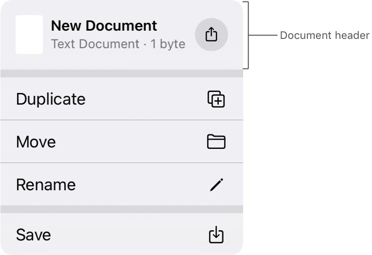

> Navigation: [Technologies](../technologies.md) · [UIKit](../uikit.md)

# UIDocumentProperties

<sub>Class</sub>

Information that UIKit uses to generate a document header for a navigation item’s title menu.

<sub>iOS, iPadOS, Mac Catalyst, visionOS</sub>

```swift
@MainActor class UIDocumentProperties
```

## Overview

Assign a [UIDocumentProperties](uidocumentproperties.md) object to your navigation item’s [documentProperties](uinavigationitem/documentproperties.md) property. UIKit uses this object to display a document header at the top of the title menu, which appears when a person taps the navigation item’s title. The document header displays information about the current document, such as its title, file type, and size.



<sub>Title menu with a document header that contains a document preview, a Share button, and the text New Document, Text Document, 1 byte.</sub>

Additionally, you can configure a set of sharing capabilities that allow people to share or drag and drop the document content from the document header:

- Set an [activityViewControllerProvider](uidocumentproperties/activityviewcontrollerprovider.md) to show the Share button.
- Set a [dragItemsProvider](uidocumentproperties/dragitemsprovider.md) to allow people to drag and drop the document by dragging the preview icon.

> [!note] Related Sessions from WWDC22
> Session 10069: [Meet desktop-class iPad](https://developer.apple.com/wwdc22/10069)
>
> Session 10070: [Build a desktop-class iPad app](https://developer.apple.com/wwdc22/10070)

## Relationships

- **Inherits From**: [NSObject](../objectivec/nsobject-swift.class.md)

- **Conforms To**: [CVarArg](../swift/cvararg.md), [CustomDebugStringConvertible](../swift/customdebugstringconvertible.md), [CustomStringConvertible](../swift/customstringconvertible.md), [Equatable](../swift/equatable.md), [Hashable](../swift/hashable.md), [NSObjectProtocol](../objectivec/nsobjectprotocol.md), [Sendable](../swift/sendable.md)

## Topics

### Creating a document header

- [- initWithURL:](<uidocumentproperties/init(url_)-zeio.md>) — Creates a document properties object from document data at the URL you specify.
- [- initWithMetadata:](<uidocumentproperties/init(metadata_).md>) — Creates a document properties object from the metadata object you specify.
- [metadata](uidocumentproperties/metadata.md) — The document’s metadata.

### Generating a document preview

- [wantsIconRepresentation](uidocumentproperties/wantsiconrepresentation.md) — A Boolean value that determines whether to render an icon of the document in the navigation bar.

### Supporting drag and drop

- [dragItemsProvider](uidocumentproperties/dragitemsprovider.md) — A closure that provides drag items that represent the document.

### Supporting sharing

- [activityViewControllerProvider](uidocumentproperties/activityviewcontrollerprovider.md) — A closure that provides an activity view controller for sharing the document.

### Initializers

- [init(URL:)](<uidocumentproperties/init(url_)-1rzp3.md>)

## See Also

### Customizing the title menu

- [titleMenuProvider](uinavigationitem/titlemenuprovider.md) — A closure that generates the navigation item’s title menu.
- [documentProperties](uinavigationitem/documentproperties.md) — An object that provides the document header for the title menu.
