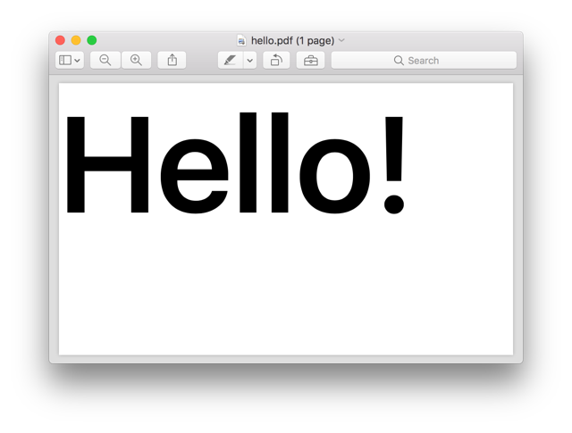
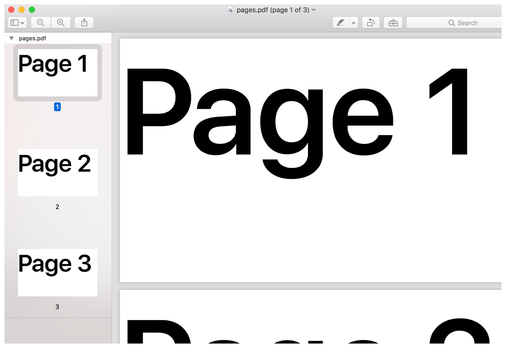
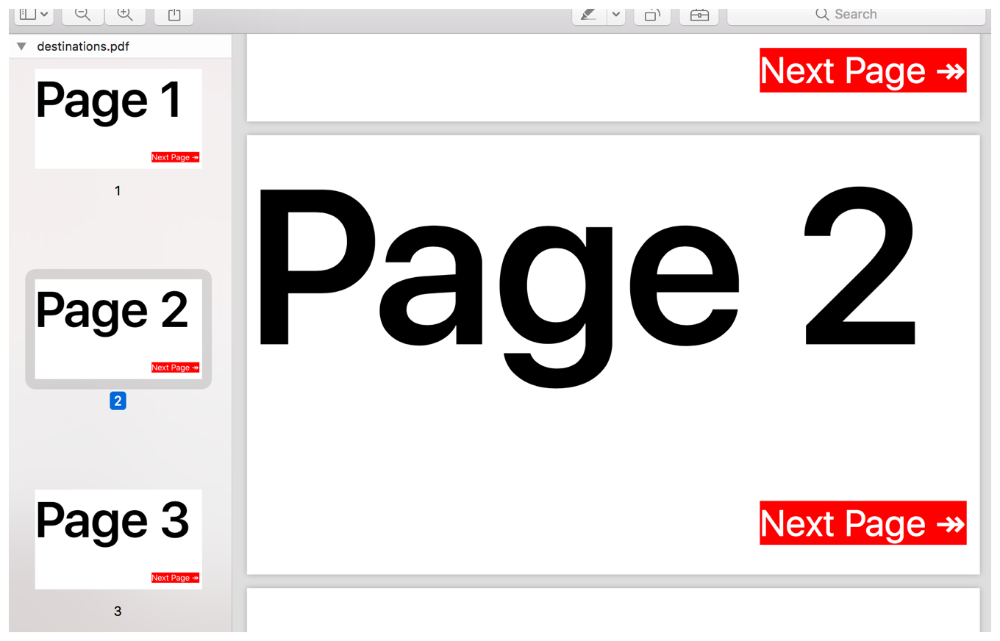

> Navigation: [Technologies](../technologies.md) · [UIKit](../uikit.md)

# UIGraphicsPDFRenderer

<sub>Class</sub>

A graphics renderer for creating PDFs.

<sub>iOS, iPadOS, Mac Catalyst, tvOS, visionOS</sub>

```swift
class UIGraphicsPDFRenderer
```

## Overview

You can use PDF renderers to create PDF files, without having to manage Core Graphics contexts.

To render a PDF:

1. Optionally create a [UIGraphicsPDFRendererFormat](uigraphicspdfrendererformat.md) object to specify nondefault parameters the renderer should use to create its context.
2. Instantiate a [UIGraphicsPDFRenderer](uigraphicspdfrenderer.md) object, providing the dimensions of the output image and a format object. The renderer uses sensible defaults for the current device if you don’t provide format object, as demonstrated in [Creating a graphics PDF renderer](uigraphicspdfrenderer.md#Creating-a-graphics-PDF-renderer).
3. Choose one of the rendering methods depending on your desired output: [- PDFDataWithActions:](<uigraphicspdfrenderer/pdfdata(actions_).md>) outputs the PDF in the form of a [Data](../foundation/data.md) object, and [- writePDFToURL:withActions:error:](<uigraphicspdfrenderer/writepdf(to_withactions_).md>) saves the PDF as a file directly to disk.
4. Provide Core Graphics drawing instructions within the closure associated with your chosen method, as shown in [Creating a PDF with a PDF renderer](uigraphicspdfrenderer.md#Creating-a-PDF-with-a-PDF-renderer).
5. Optionally, you can create a multi-page PDF, using the approach shown in [Adding pages](uigraphicspdfrenderer.md#Adding-pages).
6. Optionally, add links to your PDF to make navigation easy, as shown in [Creating internal links](uigraphicspdfrenderer.md#Creating-internal-links).

After initializing a PDF renderer, you can use it to draw multiple PDFs with the same configuration.

### Creating a graphics PDF renderer

Create a PDF renderer, providing the bounds of the PDF page.

**Swift**

```swift
let renderer = UIGraphicsPDFRenderer(bounds: CGRect(x: 0, y: 0, width: 500, height: 300))
```

**Objective-C**

```objc
UIGraphicsPDFRenderer *renderer = [[UIGraphicsPDFRenderer alloc] initWithBounds:CGRectMake(0, 0, 500, 300)];
```

You can instead use one of the other [UIGraphicsPDFRenderer](uigraphicspdfrenderer.md) initializers to specify a renderer format ([UIGraphicsPDFRendererFormat](uigraphicspdfrendererformat.md)) in addition to the bounds. This allows you to configure the underlying Core Graphics context with custom PDF document info. If you don’t provide a format, the renderer uses the [+ defaultFormat](<uigraphicsrendererformat/default().md>) format, which creates a context best suited for the current device.

### Creating a PDF with a PDF renderer

Use the [- PDFDataWithActions:](<uigraphicspdfrenderer/pdfdata(actions_).md>) method to create a PDF with the PDF renderer you created above. This takes a block that represents the drawing actions. Within this block, the renderer creates a Core Graphics context using the parameters provided during renderer initialization, and sets this to be the current context.

Before issuing PDF drawing instructions, you must create a page with a call to either the [- beginPage](<uigraphicspdfrenderercontext/beginpage().md>) method or [- beginPageWithBounds:pageInfo:](<uigraphicspdfrenderercontext/beginpage(withbounds_pageinfo_).md>) method on the supplied [UIGraphicsPDFRendererContext](uigraphicspdfrenderercontext.md).

**Swift**

```swift
let pdf = renderer.pdfData { (context) in
  context.beginPage()
  let attributes = [
    NSFontAttributeName : UIFont.boldSystemFont(ofSize: 150)
  ]
  let text = "Hello!" as NSString
  text.draw(in: CGRect(x: 0, y: 0, width: 500, height: 200), withAttributes: attributes)
}
```

**Objective-C**

```objc
NSData *pdf = [renderer PDFDataWithActions:^(UIGraphicsPDFRendererContext * _Nonnull context) {
  [context beginPage];
  NSDictionary *attributes = @{NSFontAttributeName : [UIFont boldSystemFontOfSize:150]};
  NSString *text = @"Hello!";
  [text drawInRect:CGRectMake(0, 0, 500, 200) withAttributes:attributes];}];  
```

The drawing actions closure takes a single argument of type [UIGraphicsPDFRendererContext](uigraphicspdfrenderercontext.md). This provides access to some high-level drawing functions, such as [- fillRect:](<uigraphicsrenderercontext/fill(__).md>) through the [UIGraphicsRendererContext](uigraphicsrenderercontext.md) superclass.

> [!note] Note
> This code uses a drawing method on [NSString](../foundation/nsstring.md). If you want to create a PDF with more text, consider using [TextKit](https://developer.apple.com/library/archive/documentation/Miscellaneous/Conceptual/iPhoneOSTechOverview/iPhoneOSTechnologies/iPhoneOSTechnologies.html#//apple_ref/doc/uid/TP40007898-CH3-SW11) or [Core Text](https://developer.apple.com/library/archive/documentation/StringsTextFonts/Conceptual/TextAndWebiPhoneOS/LowerLevelText-HandlingTechnologies/LowerLevelText-HandlingTechnologies.html#//apple_ref/doc/uid/TP40009542-CH15-SW3), both of which provide extensive text layout functionality.

The above code creates the following result:



### Adding pages

Add multiple pages to your PDF through repeated calls to the [- beginPage](<uigraphicspdfrenderercontext/beginpage().md>) method on the [UIGraphicsPDFRendererContext](uigraphicspdfrenderercontext.md) provided to the drawing block.

**Swift**

```swift
let pdf = renderer.pdfData { (context) in
  let attributes = [
    NSFontAttributeName : UIFont.boldSystemFont(ofSize: 150)
  ]
  for page in 1...3 {
    context.beginPage()
    let text = "Page \(page)" as NSString
    text.draw(in: CGRect(x: 0, y: 0, width: 500, height: 200), withAttributes: attributes)
  }
}
```

**Objective-C**

```objc
NSData *pdf = [renderer PDFDataWithActions:^(UIGraphicsPDFRendererContext * _Nonnull context) {
  NSDictionary *attributes = @{NSFontAttributeName : [UIFont boldSystemFontOfSize:150]}; 
  for (int page = 1; page < 4; page++) {
    [context beginPage];
    NSString *text = [NSString stringWithFormat:@"Page %d", page];
    [text drawInRect:CGRectMake(0, 0, 500, 200) withAttributes:attributes];
  }}];
```

Use the [- beginPageWithBounds:pageInfo:](<uigraphicspdfrenderercontext/beginpage(withbounds_pageinfo_).md>) method instead of the [- beginPage](<uigraphicspdfrenderercontext/beginpage().md>) method if you want to override the default properties for the new page.

This code creates a PDF with three pages, each of which contains the current page number as large text, as shown in the following image.



<sub>Screenshot from Preview showing a 3-page PDF. Each page contains large black lettering which details the current page number.</sub>

### Creating internal links

You can create internal links, known as destinations, in PDFs. A complete link has two components:

- A named destination. This is a point on a PDF page. You create these with the [- addDestinationWithName:atPoint:](<uigraphicspdfrenderercontext/adddestination(withname_at_).md>) method on [UIGraphicsPDFRendererContext](uigraphicspdfrenderercontext.md).
- A link region. This is a rectangle on a PDF page, which when tapped, instructs the PDF viewing app to jump to a specific named destination. You create these with the [- setDestinationWithName:forRect:](<uigraphicspdfrenderercontext/setdestinationwithname(__for_).md>) method on [UIGraphicsPDFRendererContext](uigraphicspdfrenderercontext.md), providing the name of the destination to jump to, and the bounds of the active link region.

The following code demonstrates how to use destinations with a PDF renderer by showing how to create links that jump to the next page.

**Swift**

```swift
let pdf = renderer.pdfData { (context) in
  let pageNumberAttributes = [
    NSFontAttributeName : UIFont.boldSystemFont(ofSize: 150)
  ]
  
  let nextPage = "Next Page ↠" as NSString
  let nextPageRect = CGRect(x: 350, y: 250, width: 150, height: 40)
  let nextPageAttributes = [
    NSFontAttributeName : UIFont.systemFont(ofSize: 25),
    NSBackgroundColorAttributeName : UIColor.red,
    NSForegroundColorAttributeName : UIColor.white
  ]
  
  for page in 1...3 {
    context.beginPage()
    let pageNumber = "Page \(page)" as NSString
    pageNumber.draw(in: CGRect(x: 0, y: 0, width: 500, height: 200), withAttributes: pageNumberAttributes)
    
    nextPage.draw(in: nextPageRect, withAttributes: nextPageAttributes)
    
    context.addDestination(withName: "page-\(page)", at: CGPoint.zero.applying(context.cgContext.userSpaceToDeviceSpaceTransform))
    context.setDestinationWithName("page-\(page + 1)", for: nextPageRect.applying(context.cgContext.userSpaceToDeviceSpaceTransform))
  }
}
```

**Objective-C**

```objc
NSData *pdf = [renderer PDFDataWithActions:^(UIGraphicsPDFRendererContext * _Nonnull context) {
  NSDictionary *attributes = @{NSFontAttributeName : [UIFont boldSystemFontOfSize:150]};
    
  NSString *nextPage = @"Next Page ↠";
  CGRect nextPageRect = CGRectMake(350, 250, 150, 40);
  NSDictionary *nextPageAttributes = @{
    NSFontAttributeName : [UIFont systemFontOfSize:25],
    NSBackgroundColorAttributeName : [UIColor redColor],
    NSForegroundColorAttributeName : [UIColor whiteColor]
  };
  for (int page = 1; page < 4; page++) {
    [context beginPage];
    NSString *pageNumber = [NSString stringWithFormat:@"Page %d", page];
    [pageNumber drawInRect:CGRectMake(0, 0, 500, 200) withAttributes:attributes];
    [nextPage drawInRect:nextPageRect withAttributes:nextPageAttributes];
      
    [context addDestinationWithName:[NSString stringWithFormat:@"page-%d", page]
                            atPoint:CGContextConvertPointToDeviceSpace(context.CGContext, CGPointZero)];
    [context setDestinationWithName:[NSString stringWithFormat:@"page-%d", page+1]
                            forRect:CGContextConvertRectToDeviceSpace(context.CGContext, nextPageRect)];
  }
}];
```

This code adds large red labels that jump from the current page to the next page when clicked. Each page has a destination with names of the form `page-1`, positioned at the origin. The bounding box for the next-page label is the link to the destination on the following page.

> [!note] Note
> The [- addDestinationWithName:atPoint:](<uigraphicspdfrenderercontext/adddestination(withname_at_).md>) and [- setDestinationWithName:forRect:](<uigraphicspdfrenderercontext/setdestinationwithname(__for_).md>) methods on [UIGraphicsPDFRendererContext](uigraphicspdfrenderercontext.md) use the underlying PDF coordinate space, which has its y-axis flipped with respect to the coordinate system used by Core Graphics. You can translate between the two using the [userSpaceToDeviceSpaceTransform](../coregraphics/cgcontext/userspacetodevicespacetransform.md) property on [CGContext](../coregraphics/cgcontext.md), as shown in the code.

The above code results in the following PDF:



## Relationships

- **Inherits From**: [UIGraphicsRenderer](uigraphicsrenderer.md)

- **Conforms To**: [CVarArg](../swift/cvararg.md), [CustomDebugStringConvertible](../swift/customdebugstringconvertible.md), [CustomStringConvertible](../swift/customstringconvertible.md), [Equatable](../swift/equatable.md), [Hashable](../swift/hashable.md), [NSObjectProtocol](../objectivec/nsobjectprotocol.md), [Sendable](../swift/sendable.md), [SendableMetatype](../swift/sendablemetatype.md)

## Topics

### Creating a PDF renderer

- [- initWithBounds:format:](<uigraphicspdfrenderer/init(bounds_format_).md>) — Creates a new graphics renderer with the specified bounds and format.

### Managing the PDF data

- [- PDFDataWithActions:](<uigraphicspdfrenderer/pdfdata(actions_).md>) — Creates a PDF from a set of drawing instructions and returns it as a data object.
- [- writePDFToURL:withActions:error:](<uigraphicspdfrenderer/writepdf(to_withactions_).md>) — Creates a PDF from a set of drawing instructions and saves it to a specified URL.
- [DrawingActions](uigraphicspdfrenderer/drawingactions.md) — A closure for drawing PDF content.

## See Also

### Graphics contexts

- [UIGraphicsRenderer](uigraphicsrenderer.md) — An abstract base class for creating graphics renderers.
- [UIGraphicsRendererContext](uigraphicsrenderercontext.md) — The base class for the drawing environments for graphics renderers.
- [UIGraphicsRendererFormat](uigraphicsrendererformat.md) — A set of drawing attributes that represents the configuration of a graphics renderer context.
- [UIGraphicsImageRenderer](uigraphicsimagerenderer.md) — A graphics renderer for creating Core Graphics-backed images.
- [UIGraphicsImageRendererContext](uigraphicsimagerenderercontext.md) — The drawing environment for an image renderer.
- [UIGraphicsImageRendererFormat](uigraphicsimagerendererformat.md) — A set of drawing attributes that represents the configuration of an image renderer context.
- [UIGraphicsPDFRendererContext](uigraphicspdfrenderercontext.md) — The drawing environment for a PDF renderer.
- [UIGraphicsPDFRendererFormat](uigraphicspdfrendererformat.md) — A set of drawing attributes that represents the configuration of a PDF renderer context.
