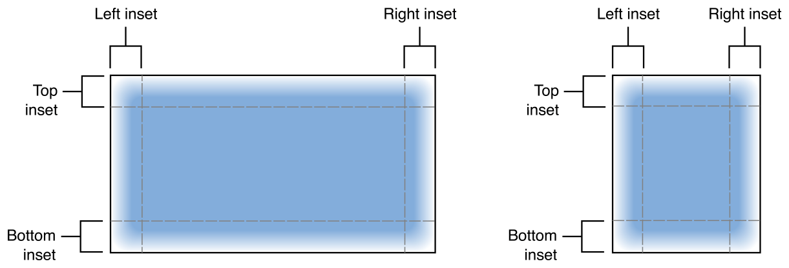
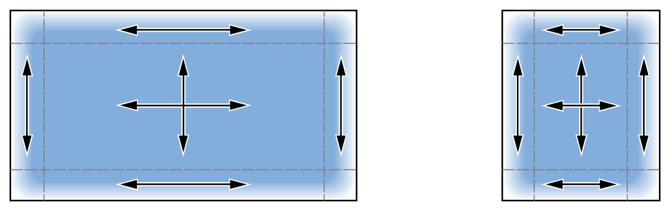

> Navigation: [Technologies](../technologies.md) · [UIKit](../uikit.md)

# UIImage

<sub>Class</sub>

An object that manages image data in your app.

<sub>iOS, iPadOS, Mac Catalyst, tvOS, visionOS, watchOS</sub>

```swift
class UIImage
```

## Overview

You use image objects to represent image data of all kinds, and the [UIImage](uiimage.md) class is capable of managing data for all image formats supported by the underlying platform. Image objects are immutable, so you always create them from existing image data, such as an image file on disk or programmatically created image data. An image object may contain a single image or a sequence of images for use in an animation.

You can use image objects in several different ways:

- Assign an image to a [UIImageView](uiimageview.md) object to display the image in your interface.
- Use an image to customize system controls such as buttons, sliders, and segmented controls.
- Draw an image directly into a view or other graphics context.
- Pass an image to other APIs that might require image data.

Although image objects support all platform-native image formats, it’s recommended that you use PNG or JPEG files for most images in your app. Image objects are optimized for reading and displaying both formats, and those formats offer better performance than most other image formats. Because the PNG format is lossless, it’s especially recommended for the images you use in your app’s interface.

### Create image objects

When creating image objects using the methods of this class, you must have existing image data located in a file or data structure. You can’t create an empty image and draw content into it. There are many options for creating image objects, each of which is best for specific situations:

- Use the [+ imageNamed:inBundle:compatibleWithTraitCollection:](<uiimage/init(named_in_compatiblewith_).md>) method (or the [+ imageNamed:](<uiimage/init(named_).md>) method) to create an image from an image asset or image file located in your app’s main bundle (or some other known bundle). Because these methods cache the image data automatically, they’re especially recommended for images that you use frequently.
- Use the [imageWithContentsOfFile:](uiimage/imagewithcontentsoffile_.md) or [- initWithContentsOfFile:](<uiimage/init(contentsoffile_).md>) method to create an image object where the initial data isn’t in a bundle. These methods load the image data from disk each time, so don’t use them to load the same image repeatedly.
- Use the [+ animatedImageWithImages:duration:](<uiimage/animatedimage(with_duration_).md>) and [+ animatedImageNamed:duration:](<uiimage/animatedimagenamed(__duration_).md>) methods to create a single [UIImage](uiimage.md) object comprised of multiple sequential images. Install the resulting image in a [UIImageView](uiimageview.md) object to create animations in your interface.

Other methods of the [UIImage](uiimage.md) class let you create animations from specific types of data, such as Core Graphics images or image data you create yourself. UIKit also provides the [UIGraphicsGetImageFromCurrentImageContext](<uigraphicsgetimagefromcurrentimagecontext().md>) function to create images from content you draw yourself. You use that function in conjunction with a bitmap-based graphics context, which you use to capture your drawing commands.

> [!note] Note
> Because image objects are immutable, you can’t change their properties after creation. Most image properties are set automatically using metadata in the accompanying image file or image data. The immutable nature of image objects also means they’re safe to create and use from any thread.

Image assets are the easiest way to manage the images that ship with your app. Each new Xcode project contains an assets library, to which you can add multiple image sets. An image set contains the variations of a single image that your app uses. A single image set can provide different versions of an image for different platforms, for different trait environments (compact or regular), and for different scale factors.

In addition to loading images from disk, you can ask the user to supply images from an available camera or photo library using a [UIImagePickerController](uiimagepickercontroller.md) object. An image picker displays a custom user interface for selecting images. Accessing user-supplied images requires explicit user permission. For more information about using an image picker, see [UIImagePickerController](uiimagepickercontroller.md).

### Define a stretchable image

A stretchable image is one that defines regions where you can duplicate the underlying image data in an aesthetically pleasing way. Stretchable images are commonly used to create backgrounds that can grow or shrink to fill the available space.

Define a stretchable image by adding insets to an existing image using the [- resizableImageWithCapInsets:](<uiimage/resizableimage(withcapinsets_).md>) or [- resizableImageWithCapInsets:resizingMode:](<uiimage/resizableimage(withcapinsets_resizingmode_).md>) method. The insets subdivide the image into two or more parts. Specifying nonzero values for each inset yields an image divided into nine parts, as shown in the following image:



<sub>An image that depicts how to use insets to define stretchable regions. The image on the left is stretched and shows Left, Right, Top, and Bottom insets. The image on the right is condensed and also shows Left, Right, Top, and Bottom insets.</sub>

Each inset defines the portion of the image that doesn’t stretch in the given dimension. The regions inside an image’s top and bottom insets maintain a fixed height, and the areas inside the left and right insets maintain a fixed width. The following image shows how each part of a nine-part image stretches as the image itself is stretched to fill the available space. The corners of the image don’t change size because they’re inside both a horizontal and vertical inset:



<sub>An image that depicts the stretchable portions of a nine-part image. The image on the left is stretched. The image on the right is condensed. The corners of both images remain the same size.</sub>

### Compare images

The [isEqual(_:)](<../objectivec/nsobjectprotocol/isequal(__).md>) method is the only reliable way to determine whether two image objects contain the same image data. The following code illustrates the correct and incorrect ways to compare images.

**Swift**

```swift
// Load the same image twice.
let image1 = UIImage(named: "MyImage")
let image2 = UIImage(named: "MyImage") 

// The image objects may be different, but the contents are still equal.
if image1 != nil && image1!.isEqual(image2) {
    // Correct. This technique compares the image data correctly.
} 
if image1 == image2 {
    // Incorrect! Direct object comparisons may not work.
}
```

**Objective-C**

```objc
// Load the same image twice.
UIImage* image1 = [UIImage imageNamed:@"MyImage"];
UIImage* image2 = [UIImage imageNamed:@"MyImage"];
 
// The image objects may be different, but the contents are still equal
if ([image1 isEqual:image2]) {
   // Correct. This technique compares the image data correctly.
}
 
if (image1 == image2) {
   // Incorrect! Direct object comparisons may not work.
}
```

### Access the image data

Image objects don’t provide direct access to their underlying image data. However, you can retrieve the image data in other formats for use in your app. Specifically, you can use the [CGImage](uiimage/cgimage.md) and [CIImage](uiimage/ciimage.md) properties to retrieve versions of the image that are compatible with Core Graphics and Core Image, respectively. You can also use the [UIImagePNGRepresentation](<uiimage/pngdata().md>) and [UIImageJPEGRepresentation](<uiimage/jpegdata(compressionquality_).md>) functions to generate an [NSData](../foundation/nsdata.md) object containing the image data in either the PNG or JPEG format.

## Relationships

- **Inherits From**: [NSObject](../objectivec/nsobject-swift.class.md)

- **Conforms To**: [AttachableAsImage](../testing/attachableasimage.md), [CVarArg](../swift/cvararg.md), [Copyable](../swift/copyable.md), [CustomDebugStringConvertible](../swift/customdebugstringconvertible.md), [CustomStringConvertible](../swift/customstringconvertible.md), [Equatable](../swift/equatable.md), [Escapable](../swift/escapable.md), [Hashable](../swift/hashable.md), [JournalingSuggestionAsset](../journalingsuggestions/journalingsuggestionasset.md), [NSCoding](../foundation/nscoding.md), [NSItemProviderReading](../foundation/nsitemproviderreading.md), [NSItemProviderWriting](../foundation/nsitemproviderwriting.md), [NSObjectProtocol](../objectivec/nsobjectprotocol.md), [NSSecureCoding](../foundation/nssecurecoding.md), [Sendable](../swift/sendable.md), [SendableMetatype](../swift/sendablemetatype.md), [UIAccessibilityIdentification](uiaccessibilityidentification.md), [UIItemProviderPresentationSizeProviding](uiitemproviderpresentationsizeproviding.md)

## Topics

### Loading and caching images

- [Providing images for different appearances](providing-images-for-different-appearances.md) — Supply image resources appropriate for light and dark appearances and for high-contrast environments.
- [Configuring and displaying symbol images in your UI](configuring-and-displaying-symbol-images-in-your-ui.md) — Create scalable images that integrate with your app’s text, and adjust the appearance of those images dynamically.
- [Creating custom symbol images for your app](creating-custom-symbol-images-for-your-app.md) — Create, organize, and annotate symbol images using SF Symbols.
- [+ imageNamed:inBundle:compatibleWithTraitCollection:](<uiimage/init(named_in_compatiblewith_).md>) — Creates an image object using the named image asset that’s compatible with the specified trait collection.
- [+ imageNamed:inBundle:withConfiguration:](<uiimage/init(named_in_with_).md>) — Creates an image by using the named image asset that’s compatible with the configuration you specify.
- [init(named:in:variableValue:configuration:)](<uiimage/init(named_in_variablevalue_configuration_).md>) — Creates an image by using the name, configuration, and variable value you specify.
- [+ imageNamed:](<uiimage/init(named_).md>) — Creates an image object from the specified named asset.
- [init(imageLiteralResourceName:)](<uiimage/init(imageliteralresourcename_).md>) — Returns the image object for the specified resource.
- [+ systemImageNamed:withConfiguration:](<uiimage/init(systemname_withconfiguration_).md>) — Creates an image object that contains a system symbol image with the specified configuration.
- [init(systemName:variableValue:configuration:)](<uiimage/init(systemname_variablevalue_configuration_).md>) — Creates an image object that contains a system symbol image with the configuration and variable value you specify.
- [+ systemImageNamed:compatibleWithTraitCollection:](<uiimage/init(systemname_compatiblewith_).md>) — Creates an image object that contains a system symbol image appropriate for the specified traits.
- [+ systemImageNamed:](<uiimage/init(systemname_).md>) — Creates an image object that contains a system symbol image.
- [init(resource:)](<uiimage/init(resource_).md>)
- [Building high-performance lists and collection views](building-high-performance-lists-and-collection-views.md) — Improve the performance of lists and collections in your app with prefetching and image preparation.

### Loading images for display

- [- imageByPreparingForDisplay](<uiimage/preparingfordisplay().md>) — Decodes an image synchronously and provides a new one for display in views and animations.
- [- prepareForDisplayWithCompletionHandler:](<uiimage/preparefordisplay(completionhandler_).md>) — Decodes an image asynchronously and provides a new one for display in views and animations.
- [- imageByPreparingThumbnailOfSize:](<uiimage/preparingthumbnail(of_).md>) — Returns a new thumbnail image at the specified size.
- [- prepareThumbnailOfSize:completionHandler:](<uiimage/preparethumbnail(of_completionhandler_).md>) — Creates a thumbnail image at the specified size asynchronously on a background thread.

### Creating and initializing image objects

- [- initWithContentsOfFile:](<uiimage/init(contentsoffile_).md>) — Initializes and returns the image object with the contents of the specified file.
- [- initWithData:](<uiimage/init(data_).md>) — Initializes and returns the image object with the specified data.
- [- initWithData:scale:](<uiimage/init(data_scale_).md>) — Initializes and returns the image object with the specified data and scale factor.
- [- initWithCGImage:](<uiimage/init(cgimage_)-14qlb.md>) — Initializes and returns the image object with the specified Quartz image reference.
- [- initWithCGImage:scale:orientation:](<uiimage/init(cgimage_scale_orientation_)-2ouhh.md>) — Initializes and returns an image object with the specified scale and orientation factors.
- [- initWithCIImage:](<uiimage/init(ciimage_)-93vu1.md>) — Initializes and returns an image object with the specified Core Image object.
- [- initWithCIImage:scale:orientation:](<uiimage/init(ciimage_scale_orientation_)-9gpyn.md>) — Initializes and returns an image object with the specified Core Image object and properties.
- [UIImageReader](uiimagereader-swift.struct.md)

### Creating animated images

- [+ animatedImageNamed:duration:](<uiimage/animatedimagenamed(__duration_).md>) — Creates and returns an animated image.
- [+ animatedImageWithImages:duration:](<uiimage/animatedimage(with_duration_).md>) — Creates and returns an animated image from an existing set of images.
- [+ animatedResizableImageNamed:capInsets:duration:](<uiimage/animatedresizableimagenamed(__capinsets_duration_).md>) — Creates and returns an animated image with end caps.
- [+ animatedResizableImageNamed:capInsets:resizingMode:duration:](<uiimage/animatedresizableimagenamed(__capinsets_resizingmode_duration_).md>) — Creates and returns an animated image with end caps and a specific resizing mode.

### Changing the image attributes

- [- imageWithConfiguration:](<uiimage/withconfiguration(__).md>) — Returns a new version of the current image, replacing the current configuration attributes with the specified attributes.
- [- imageByApplyingSymbolConfiguration:](<uiimage/applyingsymbolconfiguration(__).md>) — Returns a new version of the current image, applying the specified configuration attributes on top of the current attributes.
- [- imageFlippedForRightToLeftLayoutDirection](<uiimage/imageflippedforrighttoleftlayoutdirection().md>) — Returns a new version of the current image that flips horizontally when it’s in a right-to-left layout.
- [- imageWithHorizontallyFlippedOrientation](<uiimage/withhorizontallyflippedorientation().md>) — Returns a new version of the image that’s a mirror of the original image.
- [- imageWithRenderingMode:](<uiimage/withrenderingmode(__).md>) — Returns a new version of the image that uses the specified rendering mode.
- [- imageWithAlignmentRectInsets:](<uiimage/withalignmentrectinsets(__).md>) — Returns a new version of the image that uses the specified alignment insets.
- [- resizableImageWithCapInsets:](<uiimage/resizableimage(withcapinsets_).md>) — Returns a new version of the image with the specified cap insets.
- [- resizableImageWithCapInsets:resizingMode:](<uiimage/resizableimage(withcapinsets_resizingmode_).md>) — Returns a new version of the image with the specified cap insets and options.
- [- imageWithoutBaseline](<uiimage/imagewithoutbaseline().md>) — Creates a copy of the current image object without any baseline information.
- [- imageWithBaselineOffsetFromBottom:](<uiimage/withbaselineoffset(frombottom_).md>) — Creates a new image with a baseline at the specified offset from the bottom of the image.
- [Configuration](uiimage/configuration-swift.class.md) — A configuration object that contains the traits that the system uses when selecting the current image variant.
- [SymbolConfiguration](uiimage/symbolconfiguration-swift.class.md) — An object that contains the specific font, size, style, and weight attributes to apply to a symbol image.

### Getting standard system images

- [addImage](uiimage/add.md) — The standard image for indicating the addition of content.
- [removeImage](uiimage/remove.md) — The standard image for indicating the removal of content.
- [actionsImage](uiimage/actions.md) — The standard image for indicating user-initiated actions.
- [checkmarkImage](uiimage/checkmark.md) — The standard image for a checkmark on a filled-circle background.
- [strokedCheckmarkImage](uiimage/strokedcheckmark.md) — The standard image for a checkmark on a tinted circle with a white-stroked border.

### Getting the image data

- [CGImage](uiimage/cgimage.md) — The underlying Quartz image data.
- [CIImage](uiimage/ciimage.md) — The underlying Core Image data.
- [images](uiimage/images.md) — The complete array of image objects that compose the animation of an animated object.
- [imageAsset](uiimage/imageasset.md) — The image asset (if any) for the image.

### Getting the image size and scale

- [scale](uiimage/scale.md) — The scale factor of the image.
- [size](uiimage/size.md) — The logical dimensions, in points, for the image.

### Accessing image attributes

- [imageOrientation](uiimage/imageorientation.md) — The orientation of the receiver’s image.
- [Orientation](uiimage/orientation.md) — Constants that specify the intended display orientation for an image.
- [flipsForRightToLeftLayoutDirection](uiimage/flipsforrighttoleftlayoutdirection.md) — A Boolean value that indicates whether the image flips in a right-to-left layout.
- [resizingMode](uiimage/resizingmode-swift.property.md) — The resizing mode of the image.
- [ResizingMode](uiimage/resizingmode-swift.enum.md) — Constants that specify the possible resizing modes for an image.
- [duration](uiimage/duration.md) — The time interval for displaying an animated image.
- [capInsets](uiimage/capinsets.md) — The end-cap insets.
- [alignmentRectInsets](uiimage/alignmentrectinsets.md) — The alignment metadata for positioning the image during layout.
- [symbolImage](uiimage/issymbolimage.md) — A Boolean value that indicates whether the image is a symbol.

### Getting the image configuration

- [configuration](uiimage/configuration-swift.property.md) — The configuration details for the image.
- [symbolConfiguration](uiimage/symbolconfiguration-swift.property.md) — The configuration details for a symbol image.
- [traitCollection](uiimage/traitcollection.md) — The trait collection that describes the current variant of the image.

### Specifying the dynamic range

- [isHighDynamicRange](uiimage/ishighdynamicrange.md) — Indicates that this image is tagged for display of high dynamic range content.
- [- imageRestrictedToStandardDynamicRange](<uiimage/imagerestrictedtostandarddynamicrange().md>) — Returns a new image that will render within the standard range.
- [UIImageHEICRepresentation](<uiimage/heicdata().md>) — Returns HEIC data representing the image, or nil if such a representation could not be generated. HEIC is recommended for efficiently storing all kinds of images, including those with high dynamic range content.
- [DynamicRange](uiimage/dynamicrange.md)

### Managing the baseline

- [baselineOffsetFromBottom](uiimage/baselineoffsetfrombottom-3emg.md) — The position of the baseline relative to the bottom of the image.

### Getting rendering information

- [renderingMode](uiimage/renderingmode-swift.property.md) — A setting that determines how the app renders an image.
- [RenderingMode](uiimage/renderingmode-swift.enum.md) — Constants that specify the possible rendering modes for an image.
- [imageRendererFormat](uiimage/imagerendererformat.md) — The preferred image renderer format for the image.

### Tinting the image

- [- imageWithTintColor:](<uiimage/withtintcolor(__).md>) — Returns a new version of the current image with the specified tint color.
- [- imageWithTintColor:renderingMode:](<uiimage/withtintcolor(__renderingmode_).md>) — Returns a new version of the image with a tint color that uses the specified rendering mode.

### Drawing images

- [- drawAtPoint:](<uiimage/draw(at_).md>) — Draws the image at the specified point in the current context.
- [- drawAtPoint:blendMode:alpha:](<uiimage/draw(at_blendmode_alpha_).md>) — Draws the entire image at the specified point using the custom compositing options.
- [- drawInRect:](<uiimage/draw(in_).md>) — Draws the entire image in the specified rectangle, scaling it as necessary to fit.
- [- drawInRect:blendMode:alpha:](<uiimage/draw(in_blendmode_alpha_).md>) — Draws the entire image in the specified rectangle using the specified compositing options.
- [- drawAsPatternInRect:](<uiimage/drawaspattern(in_).md>) — Draws a tiled Quartz pattern using the receiver’s contents as the tile pattern.

### Exporting standard bitmap formats

- [UIImageJPEGRepresentation](<uiimage/jpegdata(compressionquality_).md>) — Returns a data object that contains the image in JPEG format.
- [UIImagePNGRepresentation](<uiimage/pngdata().md>) — Returns a data object that contains the specified image in PNG format.

### Deprecated

- [- stretchableImageWithLeftCapWidth:topCapHeight:](<uiimage/stretchableimage(withleftcapwidth_topcapheight_).md>) — Creates and returns a new image object with the specified cap values. _(deprecated)_
- [leftCapWidth](uiimage/leftcapwidth.md) — The horizontal end-cap size. _(deprecated)_
- [topCapHeight](uiimage/topcapheight.md) — The vertical end-cap size. _(deprecated)_

### Initializers

- [init(CGImage:)](<uiimage/init(cgimage_)-8doi8.md>)
- [init(CGImage:)](<uiimage/init(cgimage_)-g30x.md>)
- [init(CGImage:scale:orientation:)](<uiimage/init(cgimage_scale_orientation_)-3mxey.md>)
- [init(CGImage:scale:orientation:)](<uiimage/init(cgimage_scale_orientation_)-3xlco.md>)
- [init(CIImage:)](<uiimage/init(ciimage_)-3kg9b.md>)
- [init(CIImage:)](<uiimage/init(ciimage_)-8dq4u.md>)
- [init(CIImage:scale:orientation:)](<uiimage/init(ciimage_scale_orientation_)-3742c.md>)
- [init(CIImage:scale:orientation:)](<uiimage/init(ciimage_scale_orientation_)-wlzf.md>)
- [init(coder:)](<uiimage/init(coder_).md>)
- [init(named:inBundle:compatibleWithTraitCollection:)](<uiimage/init(named_inbundle_compatiblewithtraitcollection_).md>)
- [init(named:inBundle:withConfiguration:)](<uiimage/init(named_inbundle_withconfiguration_).md>)

## See Also

### Representations

- [SymbolConfiguration](uiimage/symbolconfiguration-swift.class.md) — An object that contains the specific font, size, style, and weight attributes to apply to a symbol image.
- [Configuration](uiimage/configuration-swift.class.md) — A configuration object that contains the traits that the system uses when selecting the current image variant.
