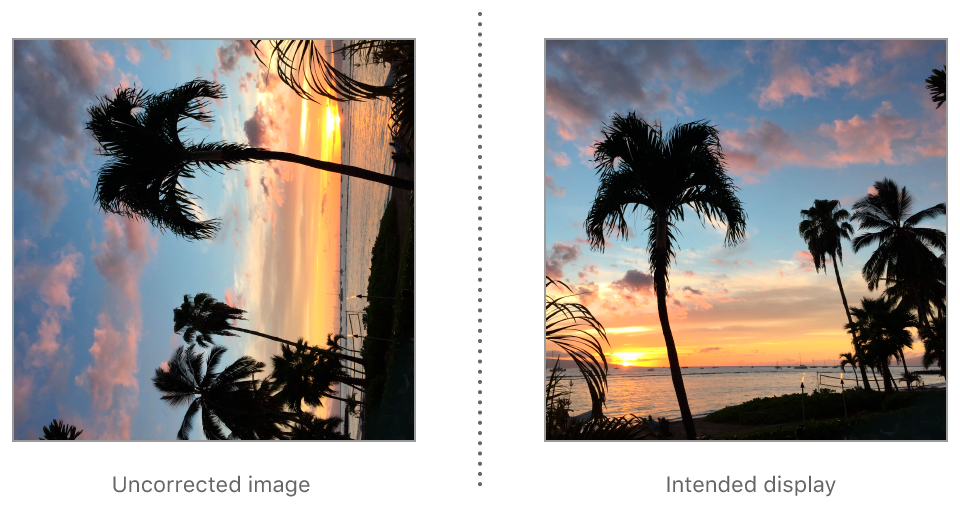

> Navigation: [Technologies](../../../technologies.md) · [UIKit](../../../uikit.md) · [UIImage](../../uiimage.md) · [Orientation](../orientation.md)

# UIImage.Orientation.leftMirrored

<sub>Case</sub>

The image has been rotated 90° clockwise and flipped horizontally from the orientation of its original pixel data.

<sub>iOS, iPadOS, Mac Catalyst, tvOS, visionOS, watchOS</sub>

```swift
case leftMirrored
```

## Discussion

If an image is encoded with this orientation, then displayed by software unaware of orientation metadata, the image appears to be horizontally mirrored, then rotated 90° counter-clockwise. (That is, to present the image in its intended orientation, you can rotate it 90° clockwise, then flip horizontally.)



## See Also

### Related Documentation

- [CGImagePropertyOrientation.leftMirrored](../../../imageio/cgimagepropertyorientation/leftmirrored.md) — The encoded image data is horizontally flipped and rotated 90° counter-clockwise from the image’s intended display orientation.

### Image orientations

- [UIImageOrientationUp](up.md) — The original pixel data matches the image’s intended display orientation.
- [UIImageOrientationDown](down.md) — The image has been rotated 180° from the orientation of its original pixel data.
- [UIImageOrientationLeft](left.md) — The image has been rotated 90° counterclockwise from the orientation of its original pixel data.
- [UIImageOrientationRight](right.md) — The image has been rotated 90° clockwise from the orientation of its original pixel data.
- [UIImageOrientationUpMirrored](upmirrored.md) — The image has been horizontally flipped from the orientation of its original pixel data.
- [UIImageOrientationDownMirrored](downmirrored.md) — The image has been vertically flipped from the orientation of its original pixel data.
- [UIImageOrientationRightMirrored](rightmirrored.md) — The image has been rotated 90° counterclockwise and flipped horizontally from the orientation of its original pixel data.
