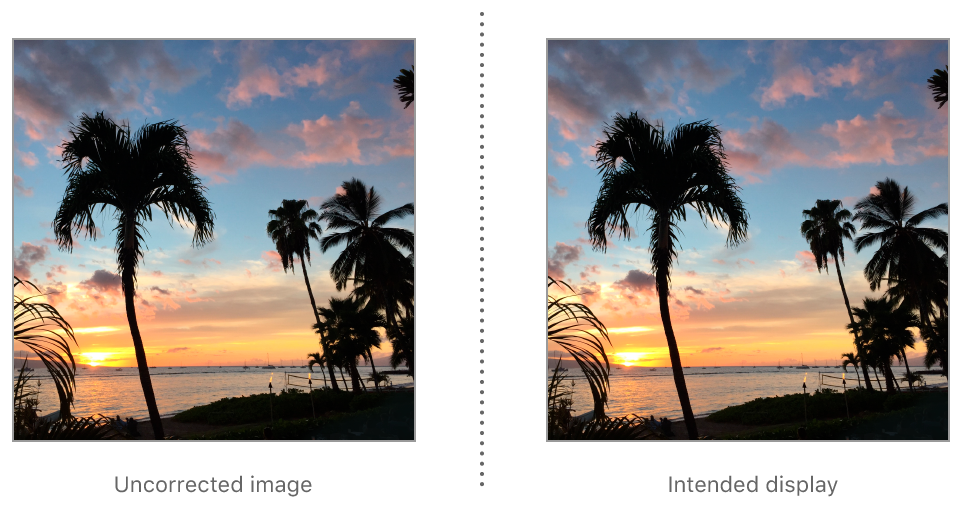

> Navigation: [Technologies](../../../technologies.md) · [UIKit](../../../uikit.md) · [UIImage](../../uiimage.md) · [Orientation](../orientation.md)

# UIImage.Orientation.up

<sub>Case</sub>

The original pixel data matches the image’s intended display orientation.

<sub>iOS, iPadOS, Mac Catalyst, tvOS, visionOS, watchOS</sub>

```swift
case up
```

## Discussion

If an image is encoded with this orientation, then displayed by software unaware of orientation metadata, the image appears correctly “right side up”. That is, this orientation is an identity value.



## See Also

### Related Documentation

- [CGImagePropertyOrientation.up](../../../imageio/cgimagepropertyorientation/up.md) — The encoded image data matches the image’s intended display orientation.

### Image orientations

- [UIImageOrientationDown](down.md) — The image has been rotated 180° from the orientation of its original pixel data.
- [UIImageOrientationLeft](left.md) — The image has been rotated 90° counterclockwise from the orientation of its original pixel data.
- [UIImageOrientationRight](right.md) — The image has been rotated 90° clockwise from the orientation of its original pixel data.
- [UIImageOrientationUpMirrored](upmirrored.md) — The image has been horizontally flipped from the orientation of its original pixel data.
- [UIImageOrientationDownMirrored](downmirrored.md) — The image has been vertically flipped from the orientation of its original pixel data.
- [UIImageOrientationLeftMirrored](leftmirrored.md) — The image has been rotated 90° clockwise and flipped horizontally from the orientation of its original pixel data.
- [UIImageOrientationRightMirrored](rightmirrored.md) — The image has been rotated 90° counterclockwise and flipped horizontally from the orientation of its original pixel data.
