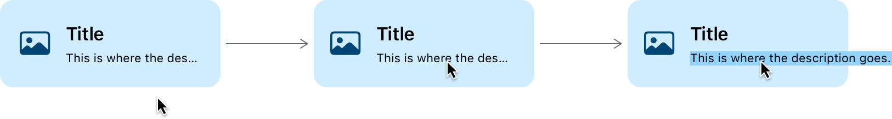

> Navigation: [Technologies](../../technologies.md) · [UIKit](../../uikit.md) · [UILabel](../uilabel.md)

# showsExpansionTextWhenTruncated

<sub>Instance Property</sub>

A Boolean value that determines whether the full text of the label displays when the pointer hovers over the truncated text.

<sub>iOS, iPadOS, Mac Catalyst, tvOS, visionOS</sub>

```swift
var showsExpansionTextWhenTruncated: Bool { get set }
```

## Discussion

A label may truncate text too long to fit in its container based on the value of the label’s [lineBreakMode](linebreakmode.md) property. To provide the option in your app to show the full text when the pointer hovers over the truncated text, set [showsExpansionTextWhenTruncated](showsexpansiontextwhentruncated.md) to [true](../../swift/true.md). The default value is [false](../../swift/false.md).



<sub>An illustration showing three views extending horizontally. Each view displays an icon on the left, followed by title and subtitle labels on the right side of the view. The title appears above the subtitle. A line with an arrow at the end extends from the first view to the second view, and from the second view to the third view. The first view shows an arrow pointer positioned outside of the view. The second view shows the pointer positioned over truncated text in the subtitle label. The third view shows the expanded text as the pointer continues to hover over the subtitle label.</sub>

> [!note] Note
> Text expansion is available in iPhone and iPad apps running on a Mac with Apple silicon and in Mac apps built with [Mac Catalyst](../mac-catalyst.md).

## See Also

### Accessing the text attributes

- [text](text.md) — The text that the label displays.
- [attributedText](attributedtext.md) — The styled text that the label displays.
- [font](font.md) — The font of the text.
- [textColor](textcolor.md) — The color of the text.
- [textAlignment](textalignment.md) — The technique for aligning the text.
- [lineBreakMode](linebreakmode.md) — The technique for wrapping and truncating the label’s text.
- [lineBreakStrategy](linebreakstrategy.md) — The strategy that the system uses to break lines when laying out multiple lines of text.
- [enabled](isenabled.md) — A Boolean value that determines whether the label draws its text in an enabled state.
- [enablesMarqueeWhenAncestorFocused](enablesmarqueewhenancestorfocused.md) — A Boolean value that determines whether the label scrolls its text while one of its containing views has focus.
