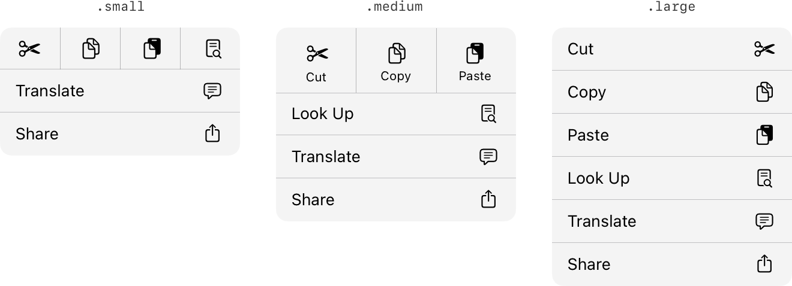

> Navigation: [Technologies](../../technologies.md) · [UIKit](../../uikit.md) · [UIMenu](../uimenu.md)

# preferredElementSize

<sub>Instance Property</sub>

The size of the menu’s child elements.

<sub>iOS, iPadOS, Mac Catalyst, tvOS, visionOS</sub>

```swift
var preferredElementSize: UIMenu.ElementSize { get set }
```

## Discussion

This property allows you to choose between different layouts in the context menu:

- The [UIMenuElementSizeSmall](elementsize/small.md) size gives the menu a more compact, side-by-side appearance, allowing you to fit more actions in a single row.
- The [UIMenuElementSizeMedium](elementsize/medium.md) size gives the menu the side-by-side appearance, but shows additional detail for each action. The text-editing menu uses this element size to display the standard edit menu.
- The [UIMenuElementSizeLarge](elementsize/large.md) size gives the menu its default, full-width appearance.



<sub>Screenshots of menus that use the small, medium, and large element sizes. The menu using the small size contains four side-by-side icons in the top row, followed by full-size elements. The menu using the medium size contains three side-by-side icons with labels in the top row, followed by full-size elements. The menu using the large size only contains full-size elements.</sub>

If you specify the [UIMenuElementSizeSmall](elementsize/small.md) or [UIMenuElementSizeMedium](elementsize/medium.md) sizes, the menu displays any items beyond the first three (for medium) or four (for small) as full-size elements.

This property doesn’t have an effect if you build your app with Mac Catalyst.

> [!note] Related Sessions from WWDC22
> Session 10071: [Adopt desktop-class editing interactions](https://developer.apple.com/wwdc22/10071)

## See Also

### Specifying size of menu elements

- [ElementSize](elementsize.md) — Constants that determine the size of an element in a menu.
