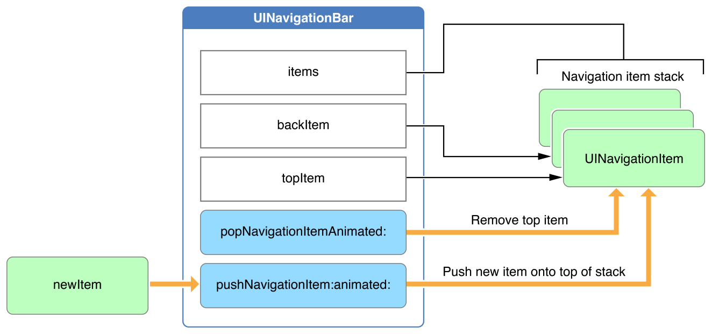

> Navigation: [Technologies](../technologies.md) · [UIKit](../uikit.md)

# UINavigationBar

<sub>Class</sub>

Navigational controls that display in a bar along the top of the screen, usually in conjunction with a navigation controller.

<sub>iOS, iPadOS, Mac Catalyst, tvOS, visionOS</sub>

```swift
@MainActor class UINavigationBar
```

## Overview

A `UINavigationBar` object is a bar, typically displayed at the top of the window, containing buttons for navigating within a hierarchy of screens. The primary components are a left (back) button, a center title and optional subtitle, and optional right button(s). You can use a navigation bar as a standalone object or in conjunction with a navigation controller object.

You most frequently use a navigation bar within a navigation controller. The [UINavigationController](uinavigationcontroller.md) object creates, displays, and manages its associated navigation bar, and uses attributes of the view controllers you add to control the content displayed in the navigation bar.

To control a navigation bar when using a navigation controller, follow these steps:

- Create a navigation controller in Interface Builder or in the code.
- Configure the appearance of the navigation bar using the [navigationBar](uinavigationcontroller/navigationbar.md) property on the [UINavigationController](uinavigationcontroller.md) object.
- Control the content of the navigation bar by setting the [title](uiviewcontroller/title.md) and [navigationItem](uiviewcontroller/navigationitem.md) properties on each [UIViewController](uiviewcontroller.md) you push onto the navigation controller’s stack.

You can also use a standalone navigation bar, without using a navigation controller. To add a navigation bar to your interface, follow these steps:

- Set up Auto Layout rules to govern the position of the navigation bar in your interface.
- Create a root navigation item to supply the initial title.
- Configure a delegate object to handle user interactions with the navigation bar.
- Customize the appearance of the navigation bar.
- Configure your app to push and pop relevant navigation items as the user navigates through the hierarchical screens.

### Use a navigation bar with a navigation controller

If you use a navigation controller to manage the navigation between different screens of content, the navigation controller creates a navigation bar automatically and pushes and pops navigation items when appropriate.

A navigation controller uses the [navigationItem](uiviewcontroller/navigationitem.md) property on [UIViewController](uiviewcontroller.md) to provide the model objects to its navigation bar when navigating a stack of view controllers. The default navigation item uses the view controller’s title, but you can override the [navigationItem](uiviewcontroller/navigationitem.md) on a [UIViewController](uiviewcontroller.md) subclass to gain complete control of the navigation bar’s content.

A navigation controller automatically assigns itself as the delegate of its navigation bar object. Therefore, when using a navigation controller, don’t assign a custom delegate object to the corresponding navigation bar.

To access the navigation bar associated with a navigation controller, use the [navigationBar](uinavigationcontroller/navigationbar.md) property on [UINavigationController](uinavigationcontroller.md). See [Customize the appearance of a navigation bar](uinavigationbar.md#Customize-the-appearance-of-a-navigation-bar) for details on appearance customization.

For more information about navigation controllers, see [UINavigationController](uinavigationcontroller.md).

### Add content to a standalone navigation bar

In the vast majority of scenarios, you use a navigation bar as part of a navigation controller. However, there are situations for which you might want to use the navigation bar UI and implement your own approach to content navigation. In these situations, you can use a standalone navigation bar.

When you use a navigation bar as a standalone object, you’re responsible for providing its content. Unlike other types of views, you don’t add subviews to a navigation bar directly. Instead, you use a navigation item (an instance of the [UINavigationItem](uinavigationitem.md) class) to specify what buttons or custom views you want displayed. A navigation item has properties for specifying views on the left, right, and center of the navigation bar and for specifying a custom prompt string.

A navigation bar manages a stack of [UINavigationItem](uinavigationitem.md) objects. Although the stack is there mostly to support navigation controllers, you can use it to implement your own custom navigation interface. The topmost item in the stack represents the navigation item whose contents are currently displayed by the navigation bar. You push new navigation items onto the stack using the [- pushNavigationItem:animated:](<uinavigationbar/pushitem(__animated_).md>) method and pop items off the stack using the [- popNavigationItemAnimated:](<uinavigationbar/popitem(animated_).md>) method. Both of these changes can be animated for the benefit of the user.

In addition to pushing and popping items, you can also set the contents of the stack directly using either the [items](uinavigationbar/items.md) property or the [- setItems:animated:](<uinavigationbar/setitems(__animated_).md>) method. You might use this method at launch time to restore your interface to its previous state or to push or pop more than one navigation item at a time. The following figure shows the part of the [UINavigationBar](uinavigationbar.md) API responsible for managing the stack of navigation items:



<sub>A flowchart diagram of the navigation bar and a stack of navigation items. A new navigation item enters the navigation bar from the left side of the diagram. In the center, the UINavigationBar contains properties that provide access to items in the stack, and methods that allow mutation by pushing on and popping off the stack, depicted on the right of the diagram.</sub>

If you’re using a navigation bar as a standalone object, assign a custom delegate object to the [delegate](uinavigationbar/delegate.md) property and use that object to intercept messages coming from the navigation bar. Delegate objects must conform to the [UINavigationBarDelegate](uinavigationbardelegate.md) protocol. The delegate notifications let you track when navigation items are pushed or popped from the stack. You use these notifications to update the rest of your app’s user interface.

For more information about creating navigation items, see [UINavigationItem](uinavigationitem.md). For more information about implementing a delegate object, see [UINavigationBarDelegate](uinavigationbardelegate.md).

### Customize the appearance of a navigation bar

Navigation bars are transparent and feature bar button items constructed with Liquid Glass. Don’t add a background or apply a tint color to the navigation bar, as that may interfere with the Liquid Glass presentation.

Customize the color of the text or image in a bar button item by setting the [tintColor](uibarbuttonitem/tintcolor.md) property. To customize the background color of a bar button item, set the bar button’s tint color, then set the bar button’s [style](uibarbuttonitem/style-swift.property.md) property to the value [UIBarButtonItemStyleProminent](uibarbuttonitem/style-swift.enum/prominent.md).

The [titleTextAttributes](uinavigationbar/titletextattributes.md) property specifies the attributes for displaying the bar’s title text. You can specify the font, text color, text shadow color, and text shadow offset for the title in the text attributes dictionary using the [NSFontAttributeName](nsfontattributename.md), [NSForegroundColorAttributeName](nsforegroundcolorattributename.md), and [NSShadowAttributeName](nsshadowattributename.md) keys.

Use the [- setTitleVerticalPositionAdjustment:forBarMetrics:](<uinavigationbar/settitleverticalpositionadjustment(__for_).md>) method to adjust the vertical position of the title. This method allows you to specify the adjustment dependent on the bar height, which is represented by the [UIBarMetrics](uibarmetrics.md) enumeration.

See [Customizing your app’s navigation bar](customizing-your-app-s-navigation-bar.md) for customization examples.

### Customize a navigation bar with Interface Builder

The following table lists the Interface Builder attributes that affect the appearance of the navigation bar’s title.

| Attribute | Description |
|---|---|
| Title Font | The font for the title in the center of the navigation bar. Access this value at runtime with the [NSFontAttributeName](nsfontattributename.md) key in the [titleTextAttributes](uinavigationbar/titletextattributes.md) dictionary. |
| Title Color | The color for the navigation bar title. Access this value at runtime with the [NSForegroundColorAttributeName](nsforegroundcolorattributename.md) key in the [titleTextAttributes](uinavigationbar/titletextattributes.md) dictionary. |
| Title Shadow | The color and offset of the shadow for the navigation bar’s title. Access these values at runtime from the [titleTextAttributes](uinavigationbar/titletextattributes.md) dictionary, using the [NSShadowAttributeName](nsshadowattributename.md) key. |

### Localize a navigation bar

To localize navigation bars, specify a localized string for each of the displayed string properties of the navigation item model objects.

For more information about localizing your interface, see [Localization](../xcode/localization.md).

### Make a navigation bar accessible

Navigation bars are accessible by default. The default accessibility trait for a navigation bar is User Interaction Enabled.

With VoiceOver enabled on an iOS device, after someone navigates to a new view in the hierarchy, VoiceOver reads the navigation bar’s title, followed by the name of the left bar button item. When someone taps an element in a navigation bar, VoiceOver reads the name and the type of the element, for example, “General back button,” “Keyboard heading,” and “Edit button.”

For general information about making your interface accessible, see [Accessibility for UIKit](accessibility-for-uikit.md).

## Relationships

- **Inherits From**: [UIView](uiview.md)

- **Conforms To**: [CALayerDelegate](../quartzcore/calayerdelegate.md), [CLBodyIdentifiable](../corelocation/clbodyidentifiable.md), [CMBodyIdentifiable](../coremotion/cmbodyidentifiable.md), [CVarArg](../swift/cvararg.md), [CustomDebugStringConvertible](../swift/customdebugstringconvertible.md), [CustomStringConvertible](../swift/customstringconvertible.md), [Equatable](../swift/equatable.md), [Hashable](../swift/hashable.md), [NSCoding](../foundation/nscoding.md), [NSObjectProtocol](../objectivec/nsobjectprotocol.md), [NSTouchBarProvider](../appkit/nstouchbarprovider.md), [Sendable](../swift/sendable.md), [SendableMetatype](../swift/sendablemetatype.md), [UIAccessibilityIdentification](uiaccessibilityidentification.md), [UIActivityItemsConfigurationProviding](uiactivityitemsconfigurationproviding.md), [UIAppearance](uiappearance.md), [UIAppearanceContainer](uiappearancecontainer.md), [UIBarPositioning](uibarpositioning.md), [UICoordinateSpace](uicoordinatespace.md), [UIDynamicItem](uidynamicitem.md), [UIFocusEnvironment](uifocusenvironment.md), [UIFocusItem](uifocusitem.md), [UIFocusItemContainer](uifocusitemcontainer.md), [UILargeContentViewerItem](uilargecontentvieweritem.md), [UIPasteConfigurationSupporting](uipasteconfigurationsupporting.md), [UIPopoverPresentationControllerSourceItem](uipopoverpresentationcontrollersourceitem.md), [UIResponderStandardEditActions](uiresponderstandardeditactions.md), [UITraitChangeObservable](uitraitchangeobservable-67e94.md), [UITraitEnvironment](uitraitenvironment.md), [UIUserActivityRestoring](uiuseractivityrestoring.md)

## Topics

### Responding to navigation bar changes

- [delegate](uinavigationbar/delegate.md) — The navigation bar’s delegate object.
- [UINavigationBarDelegate](uinavigationbardelegate.md) — Methods that a navigation bar calls before and after it modifies its stack of navigation items.

### Pushing and popping items

- [- pushNavigationItem:animated:](<uinavigationbar/pushitem(__animated_).md>) — Pushes the given navigation item onto the navigation bar’s stack and updates the UI.
- [- popNavigationItemAnimated:](<uinavigationbar/popitem(animated_).md>) — Pops the top item from the navigation bar’s stack and updates the UI.
- [- setItems:animated:](<uinavigationbar/setitems(__animated_).md>) — Replaces the navigation items currently managed by the navigation bar with the specified items.
- [items](uinavigationbar/items.md) — An array of navigation items managed by the navigation bar.
- [topItem](uinavigationbar/topitem.md) — The navigation item at the top of the navigation bar’s stack.
- [backItem](uinavigationbar/backitem.md) — The navigation item that is immediately below the topmost item on a navigation bar’s stack.

### Customizing the bar’s appearance

- [prefersLargeTitles](uinavigationbar/preferslargetitles.md) — A Boolean value that indicates whether the title displays in a large format.
- [standardAppearance](uinavigationbar/standardappearance.md) — The appearance settings for a standard-height navigation bar.
- [compactAppearance](uinavigationbar/compactappearance.md) — The appearance settings for a compact-height navigation bar.
- [scrollEdgeAppearance](uinavigationbar/scrolledgeappearance.md) — The appearance settings for the navigation bar when the edge of scrollable content aligns with the edge of the navigation bar.
- [compactScrollEdgeAppearance](uinavigationbar/compactscrolledgeappearance.md) — The appearance settings for a compact-height navigation bar when the edge of scrollable content aligns with the edge of the navigation bar.
- [translucent](uinavigationbar/istranslucent.md) — A Boolean value that indicates whether the navigation bar is translucent.
- [Legacy customizations](uinavigationbar-legacy-customizations.md) — Customize appearance information directly on the navigation bar object.

### Building with Mac Catalyst

- [behavioralStyle](uinavigationbar/behavioralstyle.md) — The behavioral style of the navigation bar.
- [preferredBehavioralStyle](uinavigationbar/preferredbehavioralstyle.md) — The preferred behavioral style of the navigation bar.
- [currentNSToolbarSection](uinavigationbar/currentnstoolbarsection.md) — The toolbar section that the navigation bar is currently using.
- [NSToolbarSection](uinavigationbar/nstoolbarsection.md) — Constants that determine how the system hosts the navigation bar in an AppKit toolbar.

## See Also

### Container view controllers

- [Creating a custom container view controller](creating-a-custom-container-view-controller.md) — Create a composite interface by combining content from one or more view controllers with other custom views.
- [UISplitViewController](uisplitviewcontroller.md) — A container view controller that implements a hierarchical interface.
- [UINavigationController](uinavigationcontroller.md) — A container view controller that defines a stack-based scheme for navigating hierarchical content.
- [UINavigationItem](uinavigationitem.md) — The items that a navigation bar displays when the associated view controller is visible.
- [UITabBarController](uitabbarcontroller.md) — A container view controller that manages a multiselection interface, where the selection determines which child view controller to display.
- [UITabBar](uitabbar.md) — A control that displays one or more buttons in a tab bar for selecting between different subtasks, views, or modes in an app.
- [UITabBarItem](uitabbaritem.md) — An object that describes an item in a tab bar.
- [UITab](uitab.md) — An object that manages a tab in a tab bar.
- [UITabAccessory](uitabaccessory.md)
- [UISearchTab](uisearchtab.md) — A tab subclass that represents the system’s search tab.
- [UITabGroup](uitabgroup.md) — An object that manages a collection of tab objects.
- [UIPageViewController](uipageviewcontroller.md) — A container view controller that manages navigation between pages of content, where a subview controller manages each page.
