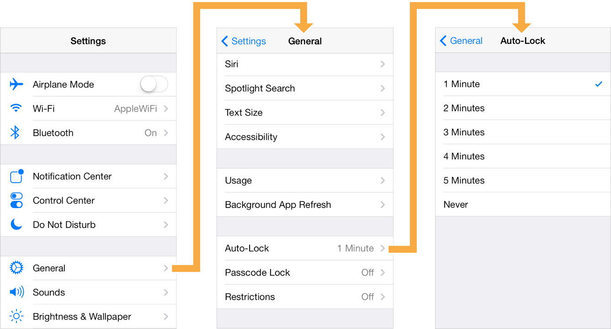
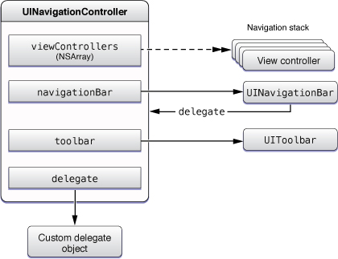
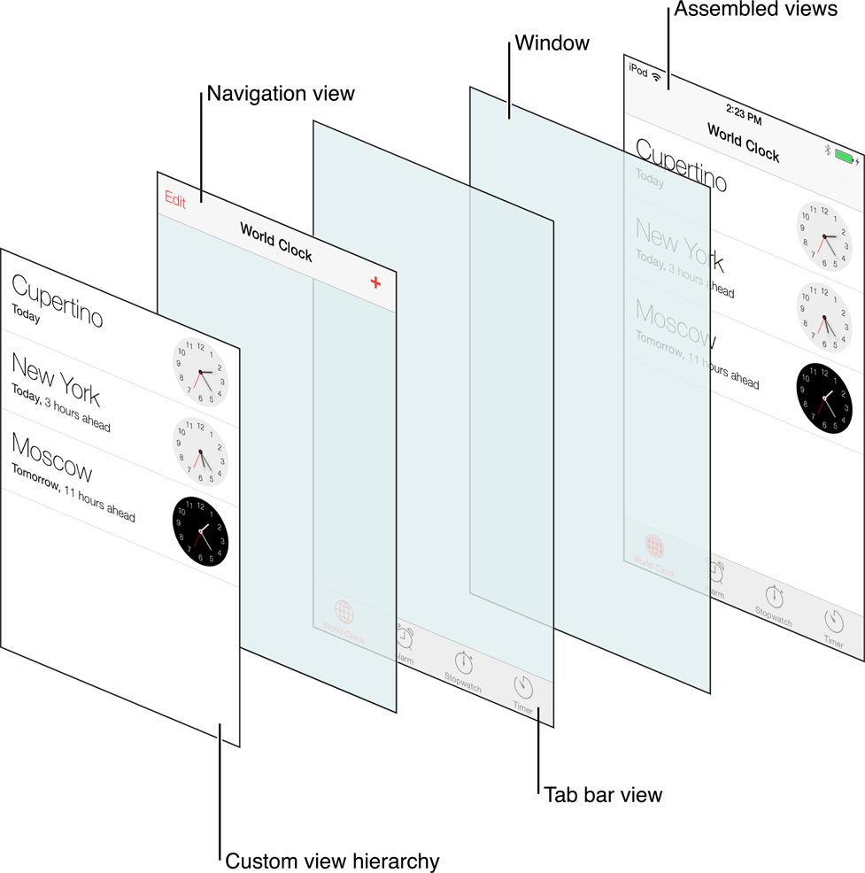

> Navigation: [Technologies](../technologies.md) · [UIKit](../uikit.md)

# UINavigationController

<sub>Class</sub>

A container view controller that defines a stack-based scheme for navigating hierarchical content.

<sub>iOS, iPadOS, Mac Catalyst, tvOS, visionOS</sub>

```swift
@MainActor class UINavigationController
```

## Overview

A navigation controller is a container view controller that manages one or more contained view controllers in a navigation interface. In this type of interface, only one contained view controller is visible at a time. Selecting an item in the view controller pushes a new view controller onscreen using an animation, hiding the previous view controller. Tapping the back button in the navigation bar at the top of the interface removes the top view controller, thereby revealing the view controller underneath.

Use a navigation interface to mimic the organization of hierarchical data managed by your app. At each level of the hierarchy, you provide an appropriate screen (managed by a custom view controller) to display the content at that level. The following image shows an example of the navigation interface presented by the Settings application in a simulated iOS device. The first screen presents the user with the list of groups that organize preferences. Selecting a group reveals individual settings and groups of settings for that application. For all but the root view, the navigation controller provides a back button to allow the user to move back up the hierarchy.



A navigation controller object manages the view controllers it contains using an ordered array, known as the _navigation stack_. The first view controller in the array is the root view controller and represents the bottom of the stack. The last view controller in the array is the topmost item on the stack, and represents the view controller that the system is currently displaying. You add and remove view controllers from the stack using segues or using the methods of this class. The user can also remove the topmost view controller using the back button in the navigation bar or using a swipe gesture.

The navigation controller manages the navigation bar at the top of the interface and an optional toolbar at the bottom of the interface. The navigation bar is always present and is managed by the navigation controller itself, which updates the navigation bar using the content provided by its contained view controllers. When the [toolbarHidden](uinavigationcontroller/istoolbarhidden.md) property is [false](../swift/false.md), the navigation controller similarly updates the toolbar with contents provided by the topmost view controller.

A navigation controller coordinates its behavior with its [delegate](uinavigationcontroller/delegate.md) object. The delegate object can override the pushing or popping of view controllers, provide custom animation transitions, and specify the preferred orientation for the navigation interface. The delegate object you provide must conform to the [UINavigationControllerDelegate](uinavigationcontrollerdelegate.md) protocol.

The following image shows the relationships between the navigation controller and the objects it manages. Use the specified properties of the navigation controller to access these objects.



### Navigation controller views

A navigation controller is a container view controller — that is, it embeds the content of other view controllers inside of itself. You access a navigation controller’s view from its [view](uiviewcontroller/view.md) property. This view incorporates the navigation bar, an optional toolbar, and the content view corresponding to the topmost view controller. The following image shows how these views assemble to present the overall navigation interface. In this figure, the navigation interface is further embedded inside a tab bar interface. Although the content of the navigation bar and toolbar views changes, the views themselves don’t. The only view that actually changes is the custom content view provided by the topmost view controller on the navigation stack.



> [!note] Note
> Because the content view underlaps the navigation bar, consider that space when designing your view controller content.

The navigation controller manages the creation, configuration, and display of the navigation bar and optional navigation toolbar. Don’t change the navigation bar’s [frame](uiview/frame.md), [bounds](uiview/bounds.md), or [alpha](uiview/alpha.md) values directly. If you subclass [UINavigationBar](uinavigationbar.md), initialize your navigation controller using the [- initWithNavigationBarClass:toolbarClass:](<uinavigationcontroller/init(navigationbarclass_toolbarclass_).md>) method. To hide or show the navigation bar, use the [navigationBarHidden](uinavigationcontroller/isnavigationbarhidden.md) property or [- setNavigationBarHidden:animated:](<uinavigationcontroller/setnavigationbarhidden(__animated_).md>) method.

A navigation controller builds the contents of the navigation bar dynamically using the navigation item objects (instances of the [UINavigationItem](uinavigationitem.md) class) associated with the view controllers on the navigation stack. To change the contents of the navigation bar, configure the navigation items of your custom view controllers. For more information about navigation items, see [UINavigationItem](uinavigationitem.md).

> [!tip] Tip
> Avoid using custom backgrounds and [UIAppearance](uiappearance.md) APIs to prevent interfering with Liquid Glass in your navigation bar.

### Updating the navigation bar

Each time the top-level view controller changes, the navigation controller updates the navigation bar accordingly. Specifically, the navigation controller updates the bar button items displayed in each of the three navigation bar positions: left, middle, and right. Bar button items are instances of the [UIBarButtonItem](uibarbuttonitem.md) class. You can create items with custom content or create standard system items depending on your needs.

When your navigation bar displays with Liquid Glass, don’t add a background or apply a tint color. Add color to the text or image in a bar button item with [tintColor](uibarbuttonitem/tintcolor.md). To add color to the background of a bar button item, set the [style](uibarbuttonitem/style-swift.property.md) to [UIBarButtonItemStyleProminent](uibarbuttonitem/style-swift.enum/prominent.md).

For more information about the navigation bar, see [UINavigationBar](uinavigationbar.md). For more information about how to create bar button items, see [UIBarButtonItem](uibarbuttonitem.md).

#### The left item

For all but the root view controller on the navigation stack, the item on the left side of the navigation bar provides navigation back to the previous view controller. The contents of this left-most button are determined as follows:

- If the new top-level view controller has a custom left bar button item, that item is displayed. To specify a custom left bar button item, set the [leftBarButtonItem](uinavigationitem/leftbarbuttonitem.md) property of the view controller’s navigation item.
- If the top-level view controller doesn’t have a custom left bar button item, but the navigation item of the previous view controller has an object in its [backBarButtonItem](uinavigationitem/backbarbuttonitem.md) property, the navigation bar displays that item.
- If a custom bar button item isn’t specified by either of the view controllers, the system uses a default back button that displays a back image.
- If there’s only one view controller on the navigation stack, it doesn’t display a back button.

> [!note] Note
> In cases where the title of a back button is too long to fit in the available space, the navigation bar may substitute the string “Back” for the actual button title. The navigation bar does this only if the back button is provided by the previous view controller. If the new top-level view controller has a custom left-bar button item — an object in the [leftBarButtonItem](uinavigationitem/leftbarbuttonitem.md) or [leftBarButtonItems](uinavigationitem/leftbarbuttonitems.md) property of its navigation item — the navigation bar doesn’t change the button title.

#### The middle item

The navigation controller updates the middle of the navigation bar as follows:

- If the new top-level view controller has a custom title view, the navigation bar displays that view in place of the default title view. To specify a custom title view, set the [titleView](uinavigationitem/titleview.md) property of the view controller’s navigation item.
- If no custom title view is set, the navigation bar displays a label containing the view controller’s default title. The string for this label is usually obtained from the [title](uiviewcontroller/title.md) property of the view controller itself. If you want to display a different title than the one associated with the view controller, set the [title](uiviewcontroller/title.md) property of the view controller’s navigation item instead.

#### The right item

The navigation controller updates the right side of the navigation bar as follows:

- If the new top-level view controller has custom right bar button items, it displays those items. To specify a custom right-bar button item or items, set the [rightBarButtonItem](uinavigationitem/rightbarbuttonitem.md) or [rightBarButtonItems](uinavigationitem/rightbarbuttonitems.md) property of the view controller’s navigation item.
- If the view controller doesn’t have any custom right-bar button items, the navigation bar doesn’t display anything on the right side of the bar.

### Displaying a toolbar

A navigation controller object manages an optional toolbar in its view hierarchy. When displayed, this toolbar obtains its current set of items from the [toolbarItems](uiviewcontroller/toolbaritems.md) property of the active view controller. When the active view controller changes, the navigation controller updates the toolbar items to match the new view controller, animating the new items into position when appropriate.

The navigation toolbar is hidden by default but you can show it for your navigation interface by calling the [- setToolbarHidden:animated:](<uinavigationcontroller/settoolbarhidden(__animated_).md>) method of your navigation controller object. If not all of your view controllers support toolbar items, your delegate object can call this method to toggle the visibility of the toolbar during subsequent push and pop operations. To use a custom [UIToolbar](uitoolbar.md) subclass, initialize the navigation controller using the [- initWithNavigationBarClass:toolbarClass:](<uinavigationcontroller/init(navigationbarclass_toolbarclass_).md>) method. If you use custom toolbar and navigation bar subclasses to create a navigation controller, note that you’re responsible for pushing and setting view controllers before presenting the navigation controller onscreen.

### Adapting to different environments

The navigation interface remains the same in both horizontally compact and horizontally regular environments. When toggling between the two environments, only the size of the navigation controller’s view changes. The navigation controller doesn’t change its view hierarchy or the layout of its views.

When configuring segues between view controllers on a navigation stack, the standard Show and Show Detail segues behave as follows:

- **Show segue** — The navigation controller pushes the specified view controller onto its navigation stack.
- **Show Detail segue** — The navigation controller presents the specified view controller modally.

The behaviors of other segue types are unchanged.

### Interface behaviors

A navigation controller supports the following behaviors for its interface:

- **Supported interface orientations** — A navigation controller object doesn’t consult the view controllers on its navigation stack when determining the supported interface orientations. On iPhone, a navigation controller supports all orientations except portrait upside-down. On iPad, a navigation controller supports all orientations. If the navigation controller has a delegate object, the delegate can specify a different set of supported orientations using the [- navigationControllerSupportedInterfaceOrientations:](<uinavigationcontrollerdelegate/navigationcontrollersupportedinterfaceorientations(__).md>) method.
- **Presentation context** — A navigation controller defines the presentation context for modally presented view controllers. When the modal transition style is [UIModalPresentationCurrentContext](uimodalpresentationstyle/currentcontext.md) or [UIModalPresentationOverCurrentContext](uimodalpresentationstyle/overcurrentcontext.md), modal presentations from the view controllers in the navigation stack cover the entire navigation interface.

### State preservation

When you assign a value to a navigation controller’s [restorationIdentifier](uiviewcontroller/restorationidentifier.md) property, it attempts to preserve itself and the contained view controllers on its navigation stack. The navigation controller starts at the bottom of the stack and moves upward, encoding each view controller that also has a valid restoration identifier string. During the next launch cycle, the navigation controller restores the preserved view controllers to the navigation stack in the same order that they were preserved.

The view controllers you push onto the navigation stack may use the same restoration identifiers. The navigation controller automatically stores additional information to ensure that each view controller’s restoration path is unique.

For more information about how state preservation and restoration works, see [Preserving your app’s UI across launches](preserving-your-app-s-ui-across-launches.md).

## Relationships

- **Inherits From**: [UIViewController](uiviewcontroller.md)

- **Inherited By**: [UIImagePickerController](uiimagepickercontroller.md), [UIVideoEditorController](uivideoeditorcontroller.md)

- **Conforms To**: [CVarArg](../swift/cvararg.md), [CustomDebugStringConvertible](../swift/customdebugstringconvertible.md), [CustomStringConvertible](../swift/customstringconvertible.md), [Equatable](../swift/equatable.md), [Hashable](../swift/hashable.md), [NSCoding](../foundation/nscoding.md), [NSExtensionRequestHandling](../foundation/nsextensionrequesthandling.md), [NSObjectProtocol](../objectivec/nsobjectprotocol.md), [NSTouchBarProvider](../appkit/nstouchbarprovider.md), [Sendable](../swift/sendable.md), [SendableMetatype](../swift/sendablemetatype.md), [UIActivityItemsConfigurationProviding](uiactivityitemsconfigurationproviding.md), [UIAppearanceContainer](uiappearancecontainer.md), [UIContentContainer](uicontentcontainer.md), [UIFocusEnvironment](uifocusenvironment.md), [UIPasteConfigurationSupporting](uipasteconfigurationsupporting.md), [UIResponderStandardEditActions](uiresponderstandardeditactions.md), [UIStateRestoring](uistaterestoring.md), [UITraitChangeObservable](uitraitchangeobservable-67e94.md), [UITraitEnvironment](uitraitenvironment.md), [UIUserActivityRestoring](uiuseractivityrestoring.md)

## Topics

### Creating a navigation controller

- [- initWithRootViewController:](<uinavigationcontroller/init(rootviewcontroller_).md>) — Initializes and returns a newly created navigation controller.
- [- initWithNavigationBarClass:toolbarClass:](<uinavigationcontroller/init(navigationbarclass_toolbarclass_).md>) — Initializes and returns a newly created navigation controller that uses your custom bar subclasses.
- [- initWithNibName:bundle:](<uinavigationcontroller/init(nibname_bundle_).md>) — Creates a navigation controller with the nib file in the specified bundle.
- [- initWithCoder:](<uinavigationcontroller/init(coder_).md>) — Creates a navigation controller from data in an unarchiver.

### Customizing the navigation interface behavior

- [delegate](uinavigationcontroller/delegate.md) — The delegate of the navigation controller object.
- [UINavigationControllerDelegate](uinavigationcontrollerdelegate.md) — The interface for an object that serves as a navigation controller’s delegate.

### Accessing items on the navigation stack

- [topViewController](uinavigationcontroller/topviewcontroller.md) — The view controller at the top of the navigation stack.
- [visibleViewController](uinavigationcontroller/visibleviewcontroller.md) — The view controller associated with the currently visible view in the navigation interface.
- [viewControllers](uinavigationcontroller/viewcontrollers.md) — The view controllers currently on the navigation stack.
- [- setViewControllers:animated:](<uinavigationcontroller/setviewcontrollers(__animated_).md>) — Replaces the view controllers currently managed by the navigation controller with the specified items.

### Pushing and popping stack items

- [- pushViewController:animated:](<uinavigationcontroller/pushviewcontroller(__animated_).md>) — Pushes a view controller onto the receiver’s stack and updates the display.
- [- popViewControllerAnimated:](<uinavigationcontroller/popviewcontroller(animated_).md>) — Pops the top view controller from the navigation stack and updates the display.
- [- popToRootViewControllerAnimated:](<uinavigationcontroller/poptorootviewcontroller(animated_).md>) — Pops all the view controllers on the stack except the root view controller and updates the display.
- [- popToViewController:animated:](<uinavigationcontroller/poptoviewcontroller(__animated_).md>) — Pops view controllers until the specified view controller is at the top of the navigation stack.
- [interactivePopGestureRecognizer](uinavigationcontroller/interactivepopgesturerecognizer.md) — The gesture recognizer responsible for popping the top view controller off the navigation stack when a person swipes from the leading screen edge.
- [interactiveContentPopGestureRecognizer](uinavigationcontroller/interactivecontentpopgesturerecognizer.md) — The gesture recognizer that handles interactively popping the top view controller off the navigation stack when a person pans horizontally in the view.

### Configuring navigation bars

- [navigationBar](uinavigationcontroller/navigationbar.md) — The navigation bar managed by the navigation controller.
- [- setNavigationBarHidden:animated:](<uinavigationcontroller/setnavigationbarhidden(__animated_).md>) — Sets whether the navigation bar is hidden.
- [Customizing your app’s navigation bar](customizing-your-app-s-navigation-bar.md) — Create custom titles, prompts, and buttons in your app’s navigation bar.

### Configuring custom toolbars

- [toolbar](uinavigationcontroller/toolbar.md) — The custom toolbar associated with the navigation controller.
- [- setToolbarHidden:animated:](<uinavigationcontroller/settoolbarhidden(__animated_).md>) — Changes the visibility of the navigation controller’s built-in toolbar.
- [toolbarHidden](uinavigationcontroller/istoolbarhidden.md) — A Boolean indicating whether the navigation controller’s built-in toolbar is visible.
- [UINavigationControllerHideShowBarDuration](uinavigationcontroller/hideshowbarduration.md) — A variable that specifies the duration when animating the navigation bar.

### Hiding the navigation bar

- [hidesBarsOnTap](uinavigationcontroller/hidesbarsontap.md) — A Boolean value indicating whether the navigation controller allows hiding of its bars using a tap gesture.
- [hidesBarsOnSwipe](uinavigationcontroller/hidesbarsonswipe.md) — A Boolean value indicating whether the navigation bar hides its bars in response to a swipe gesture.
- [hidesBarsWhenVerticallyCompact](uinavigationcontroller/hidesbarswhenverticallycompact.md) — A Boolean value indicating whether the navigation controller hides its bars in a vertically compact environment.
- [hidesBarsWhenKeyboardAppears](uinavigationcontroller/hidesbarswhenkeyboardappears.md) — A Boolean value indicating whether the navigation controller hides its bars when the keyboard appears.
- [navigationBarHidden](uinavigationcontroller/isnavigationbarhidden.md) — A Boolean value that indicates whether the navigation bar is hidden.
- [barHideOnTapGestureRecognizer](uinavigationcontroller/barhideontapgesturerecognizer.md) — The gesture recognizer used to hide and show the navigation and toolbar.
- [barHideOnSwipeGestureRecognizer](uinavigationcontroller/barhideonswipegesturerecognizer.md) — The gesture recognizer used to hide the navigation bar and toolbar.

### Displaying view controllers

- [- showViewController:sender:](<uinavigationcontroller/show(__sender_).md>) — Presents the specified view controller in the navigation interface.

## See Also

### Container view controllers

- [Creating a custom container view controller](creating-a-custom-container-view-controller.md) — Create a composite interface by combining content from one or more view controllers with other custom views.
- [UISplitViewController](uisplitviewcontroller.md) — A container view controller that implements a hierarchical interface.
- [UINavigationBar](uinavigationbar.md) — Navigational controls that display in a bar along the top of the screen, usually in conjunction with a navigation controller.
- [UINavigationItem](uinavigationitem.md) — The items that a navigation bar displays when the associated view controller is visible.
- [UITabBarController](uitabbarcontroller.md) — A container view controller that manages a multiselection interface, where the selection determines which child view controller to display.
- [UITabBar](uitabbar.md) — A control that displays one or more buttons in a tab bar for selecting between different subtasks, views, or modes in an app.
- [UITabBarItem](uitabbaritem.md) — An object that describes an item in a tab bar.
- [UITab](uitab.md) — An object that manages a tab in a tab bar.
- [UITabAccessory](uitabaccessory.md)
- [UISearchTab](uisearchtab.md) — A tab subclass that represents the system’s search tab.
- [UITabGroup](uitabgroup.md) — An object that manages a collection of tab objects.
- [UIPageViewController](uipageviewcontroller.md) — A container view controller that manages navigation between pages of content, where a subview controller manages each page.
