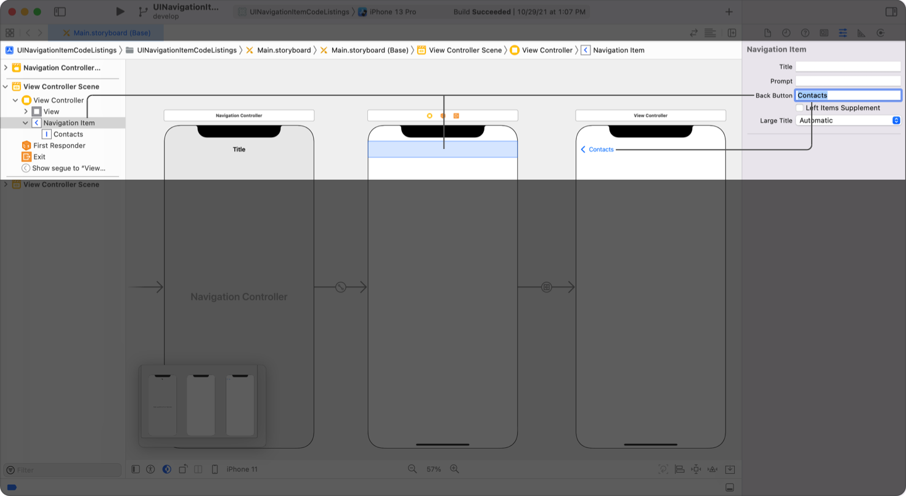

> Navigation: [Technologies](../../technologies.md) · [UIKit](../../uikit.md) · [UINavigationItem](../uinavigationitem.md)

# backButtonTitle

<sub>Instance Property</sub>

The custom title of the Back button.

<sub>iOS, iPadOS, Mac Catalyst, tvOS, visionOS</sub>

```swift
var backButtonTitle: String? { get set }
```

## Discussion

Use this property to set the title of the Back button when a view controller’s [navigationItem](../uiviewcontroller/navigationitem.md) is the [backItem](../uinavigationbar/backitem.md) of the navigation bar, in other words, when the Back button appears in the navigation bar of the next view controller. For example, a view controller that displays a list of contacts can set [backButtonTitle](backbuttontitle.md) to “Contacts”. When a person taps a contact, the view controller pushes a new view controller onto the navigation stack, which displays the details of the selected contact. This new topmost view controller shows “Contacts” as the Back button title.

Interface Builder shows this behavior when setting the Back button title in a storyboard, as shown in the following screenshot:



<sub>A screenshot of Interface Builder displaying a storyboard. The storyboard shows three controllers, a navigation controller connected to a view controller that is connected to a second view controller. The first view controller shows its navigation item as selected. The Attributes inspector shows the properties of the selected navigation item, with “Contacts” highlighted in the Back Button field. The second view controller displays a Back button with the title “Contacts” in its navigation bar.</sub>

When setting [backButtonTitle](backbuttontitle.md) programmatically, set it in the current view controller before pushing a new view controller onto the navigation stack; for instance, in [- viewDidLoad](<../uiviewcontroller/viewdidload().md>) or [- viewWillAppear:](<../uiviewcontroller/viewwillappear(__).md>).

```swift
override func viewDidLoad() {
    super.viewDidLoad()
    navigationItem.backButtonTitle = "Contacts"
}
```

When [backButtonTitle](backbuttontitle.md) is `nil`, which is the default value, the navigation item uses its [title](title.md) property as the Back button title.

> [!note] Note
> [backBarButtonItem](backbarbuttonitem.md) takes precedence if you specify both [backButtonTitle](backbuttontitle.md) and [backBarButtonItem](backbarbuttonitem.md).

## See Also

### Configuring the Back button

- [backBarButtonItem](backbarbuttonitem.md) — The bar button item for adding a Back button to the navigation bar.
- [backButtonDisplayMode](backbuttondisplaymode-swift.property.md) — The display mode of the Back button.
- [BackButtonDisplayMode](backbuttondisplaymode-swift.enum.md) — Constants that describe the display modes of the Back button.
- [hidesBackButton](hidesbackbutton.md) — A Boolean value that determines whether the navigation item hides the Back button.
- [- setHidesBackButton:animated:](<sethidesbackbutton(__animated_).md>) — Hides or shows the Back button, optionally animating the transition.
- [backAction](backaction.md) — The back action for the navigation bar.
