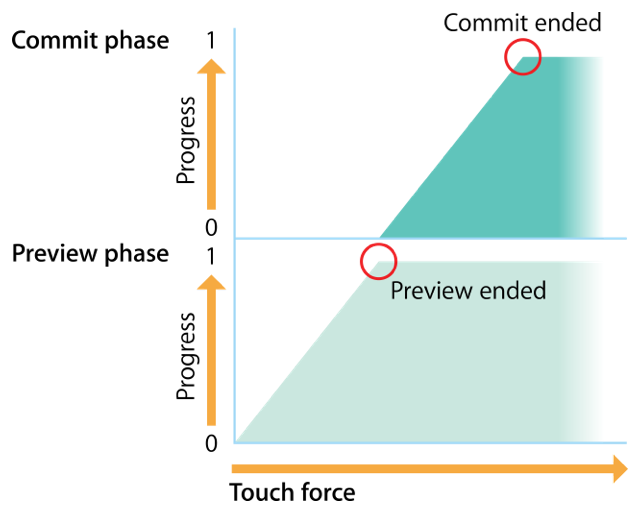

> Navigation: [Technologies](../technologies.md) · [UIKit](../uikit.md)

# UIPreviewInteraction

<sub>Class</sub>

A class that registers a view to provide a custom user experience in response to 3D Touch interactions.

<sub>iOS, iPadOS, Mac Catalyst, visionOS</sub>

```swift
@MainActor class UIPreviewInteraction
```

## Overview

A 3D Touch interaction results in a _preview interaction_ that comprises two phases, the first also called _preview_, followed by _commit_. The interaction progresses through these phases as a person applies more force with a touch. The following image shows the relationship between the force of a person’s touch and the phases of the preview interaction.



<sub>An illustration showing the preview interaction as it progresses through the preview phase and into the commit phases in response to increasing touch force.</sub>

When using view controller previewing, _peek_ represents the preview phase, and _pop_ the commit phase.

> [!note] Note
> If you want to provide the system default view controller previewing behavior (_peek_ and _pop_), use the [- registerForPreviewingWithDelegate:sourceView:](<uiviewcontroller/registerforpreviewing(with_sourceview_).md>) and [- unregisterForPreviewingWithContext:](<uiviewcontroller/unregisterforpreviewing(withcontext_).md>) methods on [UIViewController](uiviewcontroller.md) instead of [UIPreviewInteraction](uipreviewinteraction.md). See `Working With 3D Touch Previews and Preview Quick Actions` for further details.

A preview interaction is responsible for managing 3D Touch interactions for a specified view. It uses a delegate object to communicate the progress and status of the interaction to your code.

To use a preview interaction in your app:

1. Create a [UIPreviewInteraction](uipreviewinteraction.md) object, passing the view into the default initializer.
2. Create a delegate object that conforms to the [UIPreviewInteractionDelegate](uipreviewinteractiondelegate.md) protocol, and implement the appropriate methods.
3. Assign the delegate object to the [delegate](uipreviewinteraction/delegate.md) property on the preview interaction object.

For more information about the state transitions through which a preview interaction progresses, see [UIPreviewInteractionDelegate](uipreviewinteractiondelegate.md).

## Relationships

- **Inherits From**: [NSObject](../objectivec/nsobject-swift.class.md)

- **Conforms To**: [CVarArg](../swift/cvararg.md), [CustomDebugStringConvertible](../swift/customdebugstringconvertible.md), [CustomStringConvertible](../swift/customstringconvertible.md), [Equatable](../swift/equatable.md), [Hashable](../swift/hashable.md), [NSObjectProtocol](../objectivec/nsobjectprotocol.md), [Sendable](../swift/sendable.md)

## Topics

### Creating a preview interaction

- [- initWithView:](<uipreviewinteraction/init(view_).md>) — Returns a newly initialized preview interaction for the specified view.

### Preparing preview interactions

- [delegate](uipreviewinteraction/delegate.md) — An object that acts as the delegate of the preview interaction.
- [UIPreviewInteractionDelegate](uipreviewinteractiondelegate.md) — A set of methods for communicating the progress of a preview interaction.

### Handling preview interactions

- [view](uipreviewinteraction/view.md) — The view from which the preview interaction receives touch events.
- [- cancelInteraction](<uipreviewinteraction/cancel().md>) — Cancels the current preview interaction.
- [- locationInCoordinateSpace:](<uipreviewinteraction/location(in_).md>) — Returns the location of the touch that started the interaction.

## See Also

### 3D Touch interactions

- [UIPreviewInteractionDelegate](uipreviewinteractiondelegate.md) — A set of methods for communicating the progress of a preview interaction.
- [UIPreviewActionItem](uipreviewactionitem.md) — A set of methods that defines the styles you can apply to peek quick actions and peek quick action groups, and defines a read-only accessor for the user-visible title of a peek quick action.
