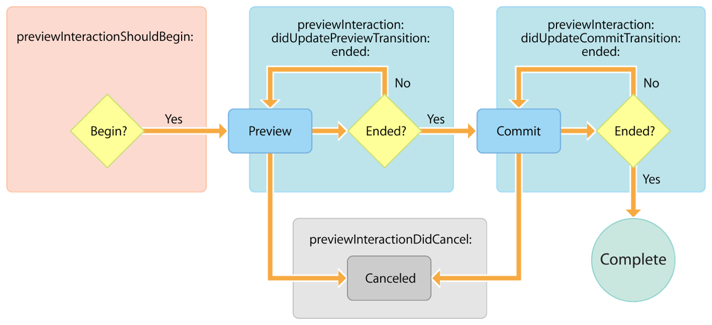

> Navigation: [Technologies](../technologies.md) · [UIKit](../uikit.md)

# UIPreviewInteractionDelegate

<sub>Protocol</sub>

A set of methods for communicating the progress of a preview interaction.

<sub>iOS, iPadOS, Mac Catalyst, tvOS, visionOS</sub>

```swift
@MainActor protocol UIPreviewInteractionDelegate : NSObjectProtocol
```

## Overview

A preview interaction abstracts a 3D Touch interaction into a state machine and communicates its progress through the state machine though a delegate. You’re responsible for implementing the appropriate UI behavior.

Create an object that conforms to this protocol and assign it to the [delegate](uipreviewinteraction/delegate.md) property on an instance of [UIPreviewInteraction](uipreviewinteraction.md). Use this delegate object to respond to the state changes that occur within the preview interaction as the user performs 3D Touch interactions.

### Control preview interaction state changes

The methods on [UIPreviewInteractionDelegate](uipreviewinteractiondelegate.md) allow you to control whether a preview interaction is allowed to begin, and to observe its progress through the phases of a preview interaction. This allows you to provide a custom user experience while maintaining coherence with the system.

A preview interaction consists of two main phases: _preview_ and _commit_. The following image is a visualization of the underlying state machine associated with a preview interaction.



<sub>Flow diagram showing the four underlying states of a preview interaction: preview, commit, complete and canceled. Delegate methods communicate the transitions between these states.</sub>

The [- previewInteractionShouldBegin:](<uipreviewinteractiondelegate/previewinteractionshouldbegin(__).md>) method is called as the user begins to press on a view that has a preview interaction associated with it. Implement this method and return [false](../swift/false.md) to prevent the preview interaction from continuing. Returning [true](../swift/true.md), or not implementing this optional method, will allow the preview interaction to continue.

Once a preview interaction begins, it enters the first phase — also called _preview_ —_ _through which it progresses as the user presses harder on the view. During this phase, the [- previewInteraction:didUpdatePreviewTransition:ended:](<uipreviewinteractiondelegate/previewinteraction(__didupdatepreviewtransition_ended_).md>) method is called repeatedly, reporting the progress through the transition as a [CGFloat](../corefoundation/cgfloat-swift.struct.md) with a value from `0` to `1`. Implement this method and use the `transitionProgress` parameter to update the UI, providing visual feedback to the user.

When the `ended` parameter changes from [false](../swift/false.md) to [true](../swift/true.md), the preview interaction transitions to the second phase — _commit_. There are no further calls to the [- previewInteraction:didUpdatePreviewTransition:ended:](<uipreviewinteractiondelegate/previewinteraction(__didupdatepreviewtransition_ended_).md>) delegate method.

The progress through the _commit_ phase is reported to the [- previewInteraction:didUpdateCommitTransition:ended:](<uipreviewinteractiondelegate/previewinteraction(__didupdatecommittransition_ended_).md>) delegate method. Implement this method and use the `transitionP``rogress` parameter to update the UI appropriately. The preview interaction is said to be completed when the `ended` parameter is true, at which point you should complete any UI changes.

At any point before the preview interaction is completed, it can be canceled, either when the user lifts their finger from the screen, or when the [- cancelInteraction](<uipreviewinteraction/cancel().md>) method is called on the [UIPreviewInteraction](uipreviewinteraction.md) instance. When this happens, the [- previewInteractionDidCancel:](<uipreviewinteractiondelegate/previewinteractiondidcancel(__).md>) delegate method is called. You should use this method to cancel any UI transitions currently in progress.

### Preview interaction user interface updates

[UIPreviewInteraction](uipreviewinteraction.md) abstracts 3D Touch interactions away from touch force, allowing you to provide your own user interface updates for an interaction pattern that’s well understood by people. The preview interaction sits between view controller previewing (_peek_ and _pop_) and the force values in [UITouch](uitouch.md), in that you’re required to provide your own user interface updates but don’t need to handle raw touch force values.

It’s important that during the preview and commit phases, you update the UI in such a way that a person is aware that the interaction is taking place. For example, pressing a table row in the Mail app first progressively blurs the other rows (the preview phase), and then shows a popover of the email as the commit phase begins. Throughout the commit phase, the popover grows, before finally transitioning to the email detail view at the end of the commit phase.

You can provide any user experience you want to accompany the preview and commit phases, but be sure to follow the appropriate section on 3D Touch in the [iOS Human Interface Guidelines](https://developer.apple.com/ios/human-interface-guidelines/). Consider using [UIViewPropertyAnimator](uiviewpropertyanimator.md) to implement the UI changes that track the progress through the preview and commit phases of the preview interaction. This class allows you to build an animation and then scrub through that animation, using the [fractionComplete](uiviewanimating/fractioncomplete.md) property. This maps perfectly to the `transitionProgress` property provided in the [- previewInteraction:didUpdatePreviewTransition:ended:](<uipreviewinteractiondelegate/previewinteraction(__didupdatepreviewtransition_ended_).md>) and [- previewInteraction:didUpdateCommitTransition:ended:](<uipreviewinteractiondelegate/previewinteraction(__didupdatecommittransition_ended_).md>) methods, allowing you to use [UIViewPropertyAnimator](uiviewpropertyanimator.md) to update the UI in response to a person’s touch force.

## Relationships

- **Inherits From**: [NSObjectProtocol](../objectivec/nsobjectprotocol.md)

## Topics

### Managing preview interactions

- [- previewInteractionShouldBegin:](<uipreviewinteractiondelegate/previewinteractionshouldbegin(__).md>) — Asks the delegate whether a preview interaction is allowed to begin.
- [- previewInteraction:didUpdatePreviewTransition:ended:](<uipreviewinteractiondelegate/previewinteraction(__didupdatepreviewtransition_ended_).md>) — Informs the delegate of the progress through the preview phase of the preview interaction.
- [- previewInteraction:didUpdateCommitTransition:ended:](<uipreviewinteractiondelegate/previewinteraction(__didupdatecommittransition_ended_).md>) — Informs the delegate of the preview interaction’s progress through the commit phase.
- [- previewInteractionDidCancel:](<uipreviewinteractiondelegate/previewinteractiondidcancel(__).md>) — Informs the delegate that the specified preview interaction was canceled.

## See Also

### 3D Touch interactions

- [UIPreviewInteraction](uipreviewinteraction.md) — A class that registers a view to provide a custom user experience in response to 3D Touch interactions.
- [UIPreviewActionItem](uipreviewactionitem.md) — A set of methods that defines the styles you can apply to peek quick actions and peek quick action groups, and defines a read-only accessor for the user-visible title of a peek quick action.
