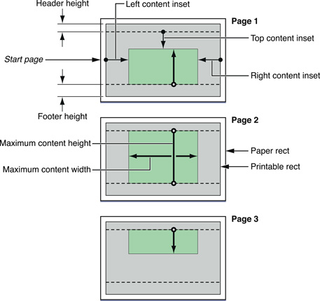

> Navigation: [Technologies](../technologies.md) · [UIKit](../uikit.md)

# UIPrintFormatter

<sub>Class</sub>

An abstract base class for print formatters, which are objects that lay out custom printable content that can cross page boundaries.

<sub>iOS, iPadOS, Mac Catalyst, visionOS</sub>

```swift
class UIPrintFormatter
```

## Overview

Given a print formatter, the printing system can automate the printing of the type of content associated with the print formatter. Examples of such content could be a web view, a mix of images and text, or a long text document. The UIKit framework provides several concrete subclasses of [UIPrintFormatter](uiprintformatter.md): [UISimpleTextPrintFormatter](uisimpletextprintformatter.md), [UIMarkupTextPrintFormatter](uimarkuptextprintformatter.md), and [UIViewPrintFormatter](uiviewprintformatter.md).

You can assign a single print formatter for a print job using the [printFormatter](uiprintinteractioncontroller/printformatter.md) property of the [UIPrintInteractionController](uiprintinteractioncontroller.md) shared instance; or you can specify one or more print formatters that are associated with specific pages of a page renderer through the [- addPrintFormatter:startingAtPageAtIndex:](<uiprintpagerenderer/addprintformatter(__startingatpageat_).md>)method of [UIPrintPageRenderer](uiprintpagerenderer.md). A page renderer is an instance of a custom subclass of [UIPrintPageRenderer](uiprintpagerenderer.md) that draws content for printing.

[UIPrintFormatter](uiprintformatter.md) publishes an interface that allows you to specify the starting page for a print job and the margins around the printed content; given that information plus the content, a print formatter computes the number of pages for the print job. The following image depicts the print-formatter properties, along with certain [UIPrintPaper](uiprintpaper.md) and [UIPrintPageRenderer](uiprintpagerenderer.md) properties, that define the layout of a multipage print job.



Third-party subclasses of [UIPrintFormatter](uiprintformatter.md) aren’t recommended. If you have custom content to print, use a custom [UIPrintPageRenderer](uiprintpagerenderer.md) object.

## Relationships

- **Inherits From**: [NSObject](../objectivec/nsobject-swift.class.md)

- **Inherited By**: [UIMarkupTextPrintFormatter](uimarkuptextprintformatter.md), [UISimpleTextPrintFormatter](uisimpletextprintformatter.md), [UIViewPrintFormatter](uiviewprintformatter.md)

- **Conforms To**: [CVarArg](../swift/cvararg.md), [CustomDebugStringConvertible](../swift/customdebugstringconvertible.md), [CustomStringConvertible](../swift/customstringconvertible.md), [Equatable](../swift/equatable.md), [Hashable](../swift/hashable.md), [NSCopying](../foundation/nscopying.md), [NSObjectProtocol](../objectivec/nsobjectprotocol.md)

## Topics

### Laying out the content

- [perPageContentInsets](uiprintformatter/perpagecontentinsets.md) — The margins for each printed page.
- [maximumContentHeight](uiprintformatter/maximumcontentheight.md) — The maximum height of the content area.
- [maximumContentWidth](uiprintformatter/maximumcontentwidth.md) — The maximum width of the content area.
- [contentInsets](uiprintformatter/contentinsets.md) — The distances the edges of content are inset from the printing rectangle. _(deprecated)_

### Managing pagination

- [startPage](uiprintformatter/startpage.md) — The index of the first page that the print formatter lays out.
- [pageCount](uiprintformatter/pagecount.md) — The number of pages to print.

### Drawing the content

- [- drawInRect:forPageAtIndex:](<uiprintformatter/draw(in_forpageat_).md>) — Draws the portion of a print formatter’s content for the specified area of the specified page.
- [- rectForPageAtIndex:](<uiprintformatter/rectforpage(at_).md>) — Returns the area that encloses a specified page of content.

### Communicating with the page renderer

- [- removeFromPrintPageRenderer](<uiprintformatter/removefromprintpagerenderer().md>) — Removes the print formatter from the page renderer.
- [printPageRenderer](uiprintformatter/printpagerenderer.md) — Returns the page renderer for the print formatter.

### Requiring operations to take place on the main thread

- [requiresMainThread](uiprintformatter/requiresmainthread.md) — A Boolean value that determines whether the system executes the print formatter’s rendering operations on the main thread.

## See Also

### Formatters

- [UIViewPrintFormatter](uiviewprintformatter.md) — An object that lays out the drawn content of a view for printing.
- [UISimpleTextPrintFormatter](uisimpletextprintformatter.md) — An object that lays out plain text for printing, possibly over multiple pages.
- [UIMarkupTextPrintFormatter](uimarkuptextprintformatter.md) — An object that lays out HTML text for a multipage print job.
