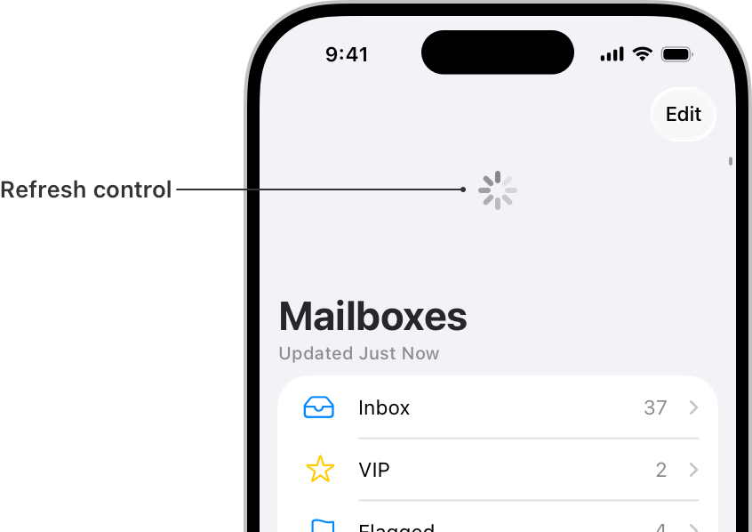

> Navigation: [Technologies](../technologies.md) · [UIKit](../uikit.md)

# UIRefreshControl

<sub>Class</sub>

A standard control that can initiate the refreshing of a scroll view’s contents.

<sub>iOS, iPadOS, Mac Catalyst, visionOS</sub>

```swift
@MainActor class UIRefreshControl
```

## Overview

A [UIRefreshControl](uirefreshcontrol.md) object is a standard control that you attach to any [UIScrollView](uiscrollview.md) object, including table views and collection views. Add this control to scrollable views to give your users a standard way to refresh their contents. When the user drags the top of the scrollable content area downward, the scroll view reveals the refresh control, begins animating its progress indicator, and notifies your app. You use that notification to update your content and dismiss the refresh control.



<sub>Illustration showing a refresh control. The control displays an animated progress indicator at the top of a scroll view's content area.</sub>

The refresh control lets you know when to update your content using the target-action mechanism of [UIControl](uicontrol.md). Upon activation, the refresh control calls the action method you provided at configuration time. When adding your action method, configure it to listen for the [UIControlEventValueChanged](uicontrol/event/valuechanged.md) event, as shown in the following example code. Use your action method to update your content, and call the refresh control’s [- endRefreshing](<uirefreshcontrol/endrefreshing().md>) method when you’re done.

```swift
func configureRefreshControl () {
   // Add the refresh control to your UIScrollView object.
   myScrollingView.refreshControl = UIRefreshControl()
   myScrollingView.refreshControl?.addTarget(self, action:
                                      #selector(handleRefreshControl),
                                      for: .valueChanged)
}
    
@objc func handleRefreshControl() {
   // Update your content…

   // Dismiss the refresh control.
   DispatchQueue.main.async {
      self.myScrollingView.refreshControl?.endRefreshing()
   }
}

```

If you’re using a [UITableViewController](uitableviewcontroller.md), assign its [refreshControl](uitableviewcontroller/refreshcontrol.md) property to an instance of [UIRefreshControl](uirefreshcontrol.md). Then associate a target and action method for the [UIControlEventValueChanged](uicontrol/event/valuechanged.md) event to manage the refresh behavior of the associated table view.

## Relationships

- **Inherits From**: [UIControl](uicontrol.md)

- **Conforms To**: [CALayerDelegate](../quartzcore/calayerdelegate.md), [CLBodyIdentifiable](../corelocation/clbodyidentifiable.md), [CMBodyIdentifiable](../coremotion/cmbodyidentifiable.md), [CVarArg](../swift/cvararg.md), [CustomDebugStringConvertible](../swift/customdebugstringconvertible.md), [CustomStringConvertible](../swift/customstringconvertible.md), [Equatable](../swift/equatable.md), [Hashable](../swift/hashable.md), [NSCoding](../foundation/nscoding.md), [NSObjectProtocol](../objectivec/nsobjectprotocol.md), [NSTouchBarProvider](../appkit/nstouchbarprovider.md), [Sendable](../swift/sendable.md), [SendableMetatype](../swift/sendablemetatype.md), [UIAccessibilityIdentification](uiaccessibilityidentification.md), [UIActivityItemsConfigurationProviding](uiactivityitemsconfigurationproviding.md), [UIAppearance](uiappearance.md), [UIAppearanceContainer](uiappearancecontainer.md), [UIContextMenuInteractionDelegate](uicontextmenuinteractiondelegate.md), [UICoordinateSpace](uicoordinatespace.md), [UIDynamicItem](uidynamicitem.md), [UIFocusEnvironment](uifocusenvironment.md), [UIFocusItem](uifocusitem.md), [UIFocusItemContainer](uifocusitemcontainer.md), [UILargeContentViewerItem](uilargecontentvieweritem.md), [UIPasteConfigurationSupporting](uipasteconfigurationsupporting.md), [UIPopoverPresentationControllerSourceItem](uipopoverpresentationcontrollersourceitem.md), [UIResponderStandardEditActions](uiresponderstandardeditactions.md), [UITraitChangeObservable](uitraitchangeobservable-67e94.md), [UITraitEnvironment](uitraitenvironment.md), [UIUserActivityRestoring](uiuseractivityrestoring.md)

## Topics

### Initializing a refresh control

- [- init](<uirefreshcontrol/init().md>) — Initializes and returns a standard refresh control.

### Accessing the control attributes

- [tintColor](uirefreshcontrol/tintcolor.md) — The tint color for the refresh control.
- [attributedTitle](uirefreshcontrol/attributedtitle.md) — The styled title text to display in the refresh control.

### Managing the refresh status

- [- beginRefreshing](<uirefreshcontrol/beginrefreshing().md>) — Tells the control that a refresh operation was started programmatically.
- [- endRefreshing](<uirefreshcontrol/endrefreshing().md>) — Tells the control that a refresh operation has ended.
- [refreshing](uirefreshcontrol/isrefreshing.md) — A Boolean value indicating whether a refresh operation has been triggered and is in progress.

## See Also

### Managing the scroll indicator and refresh control

- [indicatorStyle](uiscrollview/indicatorstyle-swift.property.md) — The style of the scroll indicators.
- [IndicatorStyle](uiscrollview/indicatorstyle-swift.enum.md) — Defines constants that represent the styles of the scroll indicators.
- [showsHorizontalScrollIndicator](uiscrollview/showshorizontalscrollindicator.md) — A Boolean value that controls whether the horizontal scroll indicator is visible.
- [showsVerticalScrollIndicator](uiscrollview/showsverticalscrollindicator.md) — A Boolean value that controls whether the vertical scroll indicator is visible.
- [horizontalScrollIndicatorInsets](uiscrollview/horizontalscrollindicatorinsets.md) — The horizontal distance the scroll indicators are inset from the edge of the scroll view.
- [verticalScrollIndicatorInsets](uiscrollview/verticalscrollindicatorinsets.md) — The vertical distance the scroll indicators are inset from the edge of the scroll view.
- [automaticallyAdjustsScrollIndicatorInsets](uiscrollview/automaticallyadjustsscrollindicatorinsets.md) — A Boolean value that indicates whether the system automatically adjusts the scroll indicator insets.
- [- flashScrollIndicators](<uiscrollview/flashscrollindicators().md>) — Displays the scroll indicators momentarily.
- [- withScrollIndicatorsShownForContentOffsetChanges:](<uiscrollview/withscrollindicatorsshown(forcontentoffsetchanges_).md>) — Displays the scroll indicators during updates to the scroll view’s content offset.
- [refreshControl](uiscrollview/refreshcontrol.md) — The refresh control associated with the scroll view.
