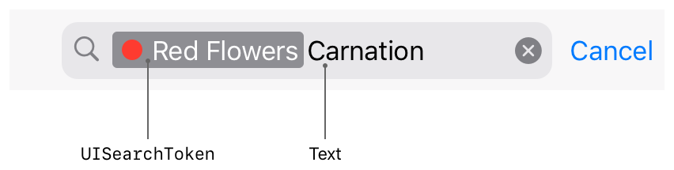

> Navigation: [Technologies](../technologies.md) · [UIKit](../uikit.md)

# UISearchToken

<sub>Class</sub>

Search criteria in a search text field, represented by text and an optional icon.

<sub>iOS, iPadOS, Mac Catalyst, visionOS</sub>

```swift
@MainActor class UISearchToken
```

## Overview

Use search tokens to help users understand and edit complex search queries in a [UISearchTextField](uisearchtextfield.md). A token acts like a single character in standard text interactions such as deleting, selecting, or dragging. A search token should always have text and may also have an icon.



<sub>Screenshot of a search window with a red circle and the words “Red Flowers Carnation”. The red dot and “Red Flowers” are in a gray box labeled as a UISearchToken and “Carnation” is labeled as text. </sub>

Assign a [representedObject](uisearchtoken/representedobject.md) to each search token that’s meaningful to your app. By attaching this extra data to the token you can reconstruct the full search query using information available in the search field when, for example, your app starts from state restoration or the user starts a search.

See [Using suggested searches with a search controller](using-suggested-searches-with-a-search-controller.md) to learn how to use search tokens.

## Relationships

- **Inherits From**: [NSObject](../objectivec/nsobject-swift.class.md)

- **Conforms To**: [CVarArg](../swift/cvararg.md), [CustomDebugStringConvertible](../swift/customdebugstringconvertible.md), [CustomStringConvertible](../swift/customstringconvertible.md), [Equatable](../swift/equatable.md), [Hashable](../swift/hashable.md), [NSObjectProtocol](../objectivec/nsobjectprotocol.md), [Sendable](../swift/sendable.md)

## Topics

### Creating a search token

- [+ tokenWithIcon:text:](<uisearchtoken/init(icon_text_).md>) — Creates a search token with the specified text and icon (if any).
- [representedObject](uisearchtoken/representedobject.md) — The object represented by the search token.

## See Also

### Search field

- [UISearchTextField](uisearchtextfield.md) — A view for displaying and editing text and search tokens.
- [UISearchTextFieldDelegate](uisearchtextfielddelegate.md) — The interface for the delegate of a search field.
