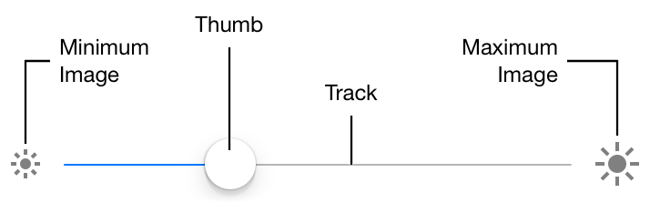
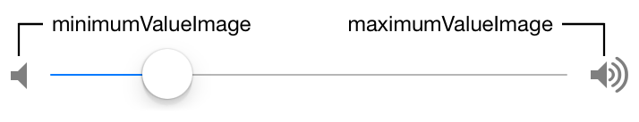
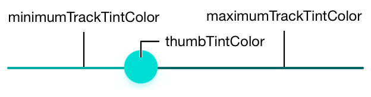
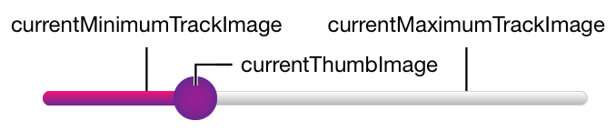

> Navigation: [Technologies](../technologies.md) · [UIKit](../uikit.md)

# UISlider

<sub>Class</sub>

A control for selecting a single value from a continuous range of values.

<sub>iOS, iPadOS, Mac Catalyst, visionOS</sub>

```swift
@MainActor class UISlider
```

## Overview

As you move the _thumb_ of a slider, it passes its updated value to any actions attached to it. The appearance of sliders is configurable; you can tint the track and the thumb, and provide images to appear at the ends of the slider. You can add sliders to your interface programmatically or by using Interface Builder.

The following image shows the terms used to describe the constituent parts of a [UISlider](uislider.md) object in a left-to-right configuration.



To add a slider to your interface:

- Specify the range of values the slider represents.
- Optionally, configure the appearance of the slider with appropriate tint colors, and limit images.
- Connect one or more action methods to the slider.
- Set up Auto Layout rules to govern the size and position of the slider in your interface.

### Respond to user interaction

Sliders use the target-action design pattern to notify your app when the user moves the slider. To be notified when the slider’s value changes, register your action method with the [UIControlEventValueChanged](uicontrol/event/valuechanged.md) event. At runtime, the slider calls your method in response to the user changing the slider’s value.

By default, the slider sends value-changed events continuously as the user moves the slider’s thumb control. Setting the [continuous](uislider/iscontinuous.md) property to [false](../swift/false.md) causes the slider to send an event only when the user releases the slider’s thumb control, setting the final value.

You connect a slider to your action method by using the [- addTarget:action:forControlEvents:](<uicontrol/addtarget(__action_for_).md>) method or by creating a connection in Interface Builder. The signature of an action method takes one of three forms, as shown in the following code. Choose the form that provides the information that you need to respond to the value change in the slider.

**Swift**

```swift
@IBAction func doSomething()
@IBAction func doSomething(sender: UISlider)
@IBAction func doSomething(sender: UISlider, forEvent event: UIEvent)
```

**Objective-C**

```objc
- (IBAction)doSomething;
- (IBAction)doSomething:(id)sender;
- (IBAction)doSomething:(id)sender forEvent:(UIEvent*)event;
```

### Debug sliders

When debugging issues with sliders, follow these tips to avoid common pitfalls:

- **Use either a custom tint color or a custom image, but not both.** When customizing slider appearance with images or tint, use one option or the other, but not both. Conflicting settings for track and thumb appearance are resolved in favor of the most recently set value. For example, setting a new minimum track image for any state clears any custom tint color you may have provided for minimum track images. Similarly, setting the thumb tint color removes any custom thumb images associated with the slider.
- **The current value must be between the minimum and maximum values.** If you try to programmatically set a slider’s current value to be below the minimum or above the maximum, it’s set to the minimum or maximum instead. However, if you set the value beyond the range of the minimum or maximum in Interface Builder, the minimum or minimum values are updated instead.
- **Set custom images for all control states.** If you use custom track and thumb images for your slider, remember to set an image for every possible [State](uicontrol/state-swift.struct.md). Any control state that doesn’t have a corresponding custom image assigned to it displays the standard image instead. If you set one custom image, be sure to set them all.

### Configure slider attributes in Interface Builder

The following table lists the core attributes that you configure for sliders in Interface Builder.

| Attribute | Description |
|---|---|
| Value Minimum / Maximum | Specifies the values attached to the endpoints of the slider, the minimum representing the leading end of the slider and the maximum representing the trailing end. Access these values at runtime using the [minimumValue](uislider/minimumvalue.md) and [maximumValue](uislider/maximumvalue.md) properties. |
| Value Current | Represents the initial value of the slider. The value must be between the minimum and maximum values. Access this value at runtime with the [value](uislider/value.md) property. |

The following table lists the attributes that control the appearance of a slider.

| Attribute | Description |
|---|---|
| Min Image | Specifies the image displayed at the leading end of the slider. If blank, no image is displayed. Access this value at runtime with the [minimumValueImage](uislider/minimumvalueimage.md) property. |
| Max Image | Specifies the image displayed at the trailing end of the slider. If blank, no image is displayed. Access this value at runtime with the [maximumValueImage](uislider/maximumvalueimage.md) property. |
| Min Track Tint | Specifies the tint color of the track to the leading side of the slider’s thumb. The value defaults to the slider’s inherited tint color. Access this value at runtime with the [minimumTrackTintColor](uislider/minimumtracktintcolor.md) property. |
| Max Track Tint | Specifies the tint color of the track to the trailing side of the slider’s thumb. Access this value at runtime with the [maximumTrackTintColor](uislider/maximumtracktintcolor.md) property. |
| Thumb Tint | Controls the tint color of the slider’s thumb. Access this value at runtime with the [thumbTintColor](uislider/thumbtintcolor.md) property. |

The following table lists the attributes that configure the events associated with a slider.

| Attribute | Description |
|---|---|
| Events: Continuous Updates | Controls when attached actions are triggered: when checked, action events are called whenever the thumb is moved during user interaction. When not checked, attached actions are triggered only on completion of user interaction. Access this value at runtime with the [continuous](uislider/iscontinuous.md) property. |

For information about the sliders’s inherited Interface Builder attributes, see [UIControl](uicontrol.md) and [UIView](uiview.md).

### Customize the slider’s appearance

Use Auto Layout to specify the position and width of a slider. The intrinsic height is determined by the intrinsic heights of the minimum and maximum images, if present. The width of the track automatically adjusts to accommodate the minimum and maximum images.

The most common way to customize the slider’s appearance is to provide custom minimum and maximum value images. These images sit at either end of the slider control and indicate which value that end of the slider represents. Set the values of the [minimumValueImage](uislider/minimumvalueimage.md) and [maximumValueImage](uislider/maximumvalueimage.md) properties to appropriate [UIImage](uiimage.md) objects to display images at the ends of the slider. The following image shows a slider configured with minimum and maximum images that imply volume adjustment.



> [!note] Note
> Sliders respond to user interaction with dynamic effects and appearance. If you set custom tint colors for the track or thumb, the slider maintains this behavior. If you use images to customize the appearance of the track, then the slider doesn’t apply the dynamic effects or alter the appearance.

To set custom tint colors for both the track and the thumb of a slider, use the [minimumTrackTintColor](uislider/minimumtracktintcolor.md), [maximumTrackTintColor](uislider/maximumtracktintcolor.md), and [thumbTintColor](uislider/thumbtintcolor.md) properties, as shown in the following image.



By default, the minimum track tint color defers to the tint color of the slider control.

To completely change the appearance of the slider, you can specify images for the thumb and the track. Provide images for each of the control states (normal, highlighted, and so on) with the [- setMinimumTrackImage:forState:](<uislider/setminimumtrackimage(__for_).md>), [- setMaximumTrackImage:forState:](<uislider/setmaximumtrackimage(__for_).md>), and [- setThumbImage:forState:](<uislider/setthumbimage(__for_).md>) methods. Set the [capInsets](uiimage/capinsets.md) property for the track images to facilitate horizontal stretching. To access the images used in the current control state, use the [currentMinimumTrackImage](uislider/currentminimumtrackimage.md), [currentMaximumTrackImage](uislider/currentmaximumtrackimage.md), and [currentThumbImage](uislider/currentthumbimage.md) properties, as shown in the following image.



### Provide localized strings

Sliders have no special properties related to internationalization. However, if you use a slider with a label, make sure you provide localized strings for the label.

Sliders automatically adjust to the appropriate interface direction, ensuring that the minimum end of the slider is always at the leading end and the maximum end at the trailing end. If you override [- minimumValueImageRectForBounds:](<uislider/minimumvalueimagerect(forbounds_).md>) or [- maximumValueImageRectForBounds:](<uislider/maximumvalueimagerect(forbounds_).md>) in a subclass of [UISlider](uislider.md), be sure to take the user interface layout direction into account.

For more information, see [Internationalization and Localization Guide](https://developer.apple.com/library/archive/documentation/MacOSX/Conceptual/BPInternational/Introduction/Introduction.html#//apple_ref/doc/uid/10000171i).

### Make sliders accessible

Sliders are accessible by default. The default accessibility traits for a slider are User Interaction Enabled and Adjustable.

When enabled on a device, VoiceOver speaks the accessibility label, value, traits, and hint to the user. VoiceOver speaks this information when a user swipes up and down (not left and right) over the slider. For example, using the Ringer and Alerts volume slider (Settings \> Sounds \> Ringer and Alerts), VoiceOver speaks the following:

```objc
"Sound volume: 13 percent. Adjustable. Swipe up or down with one finger to adjust the value."
```

For more information about making iOS controls accessible, see the accessibility information in [UIControl](uicontrol.md). For general information about making your interface accessible, see [Accessibility Programming Guide for iOS](https://developer.apple.com/library/archive/documentation/UserExperience/Conceptual/iPhoneAccessibility/Introduction/Introduction.html#//apple_ref/doc/uid/TP40008785).

## Relationships

- **Inherits From**: [UIControl](uicontrol.md)

- **Conforms To**: [CALayerDelegate](../quartzcore/calayerdelegate.md), [CLBodyIdentifiable](../corelocation/clbodyidentifiable.md), [CMBodyIdentifiable](../coremotion/cmbodyidentifiable.md), [CVarArg](../swift/cvararg.md), [CustomDebugStringConvertible](../swift/customdebugstringconvertible.md), [CustomStringConvertible](../swift/customstringconvertible.md), [Equatable](../swift/equatable.md), [Hashable](../swift/hashable.md), [NSCoding](../foundation/nscoding.md), [NSObjectProtocol](../objectivec/nsobjectprotocol.md), [NSTouchBarProvider](../appkit/nstouchbarprovider.md), [Sendable](../swift/sendable.md), [SendableMetatype](../swift/sendablemetatype.md), [UIAccessibilityIdentification](uiaccessibilityidentification.md), [UIActivityItemsConfigurationProviding](uiactivityitemsconfigurationproviding.md), [UIAppearance](uiappearance.md), [UIAppearanceContainer](uiappearancecontainer.md), [UIContextMenuInteractionDelegate](uicontextmenuinteractiondelegate.md), [UICoordinateSpace](uicoordinatespace.md), [UIDynamicItem](uidynamicitem.md), [UIFocusEnvironment](uifocusenvironment.md), [UIFocusItem](uifocusitem.md), [UIFocusItemContainer](uifocusitemcontainer.md), [UILargeContentViewerItem](uilargecontentvieweritem.md), [UIPasteConfigurationSupporting](uipasteconfigurationsupporting.md), [UIPopoverPresentationControllerSourceItem](uipopoverpresentationcontrollersourceitem.md), [UIResponderStandardEditActions](uiresponderstandardeditactions.md), [UITraitChangeObservable](uitraitchangeobservable-67e94.md), [UITraitEnvironment](uitraitenvironment.md), [UIUserActivityRestoring](uiuseractivityrestoring.md)

## Topics

### Accessing the slider’s value

- [value](uislider/value.md) — The slider’s current value.
- [- setValue:animated:](<uislider/setvalue(__animated_).md>) — Sets the slider’s current value, allowing you to animate the change visually.

### Accessing the slider’s value limits

- [minimumValue](uislider/minimumvalue.md) — The minimum value of the slider.
- [maximumValue](uislider/maximumvalue.md) — The maximum value of the slider.

### Modifying the slider’s behavior

- [continuous](uislider/iscontinuous.md) — A Boolean value indicating whether changes in the slider’s value generate continuous update events.
- [behavioralStyle](uislider/behavioralstyle.md) — The style that determines how the slider behaves.
- [preferredBehavioralStyle](uislider/preferredbehavioralstyle.md) — The preferred behavioral style.
- [UIBehavioralStyle](uibehavioralstyle.md) — Constants that indicate how a control behaves in apps built with Mac Catalyst.

### Changing the slider’s style

- [sliderStyle](uislider/sliderstyle.md)
- [Style](uislider/style.md)

### Changing the slider’s appearance

- [minimumValueImage](uislider/minimumvalueimage.md) — The image that represents the slider’s minimum value.
- [maximumValueImage](uislider/maximumvalueimage.md) — The image representing the slider’s maximum value.
- [minimumTrackTintColor](uislider/minimumtracktintcolor.md) — The color used to tint the default minimum track images.
- [currentMinimumTrackImage](uislider/currentminimumtrackimage.md) — The minimum track image currently being used to render the slider.
- [- minimumTrackImageForState:](<uislider/minimumtrackimage(for_).md>) — Returns the minimum track image associated with the specified control state.
- [- setMinimumTrackImage:forState:](<uislider/setminimumtrackimage(__for_).md>) — Assigns a minimum track image to the specified control states.
- [maximumTrackTintColor](uislider/maximumtracktintcolor.md) — The color used to tint the default maximum track images.
- [currentMaximumTrackImage](uislider/currentmaximumtrackimage.md) — Contains the maximum track image currently being used to render the slider.
- [- maximumTrackImageForState:](<uislider/maximumtrackimage(for_).md>) — Returns the maximum track image associated with the specified control state.
- [- setMaximumTrackImage:forState:](<uislider/setmaximumtrackimage(__for_).md>) — Assigns a maximum track image to the specified control states.
- [thumbTintColor](uislider/thumbtintcolor.md) — The color used to tint the default thumb images.
- [currentThumbImage](uislider/currentthumbimage.md) — The thumb image currently being used to render the slider.
- [- thumbImageForState:](<uislider/thumbimage(for_).md>) — Returns the thumb image associated with the specified control state.
- [- setThumbImage:forState:](<uislider/setthumbimage(__for_).md>) — Assigns a thumb image to the specified control states.

### Configuring the track

- [trackConfiguration](uislider/trackconfiguration-6m55i.md)
- [TrackConfiguration](uislider/trackconfiguration-swift.struct.md)

### Overrides for subclasses

- [- maximumValueImageRectForBounds:](<uislider/maximumvalueimagerect(forbounds_).md>) — Returns the drawing rectangle for the maximum value image.
- [- minimumValueImageRectForBounds:](<uislider/minimumvalueimagerect(forbounds_).md>) — Returns the drawing rectangle for the minimum value image.
- [- trackRectForBounds:](<uislider/trackrect(forbounds_).md>) — Returns the drawing rectangle for the slider’s track.
- [- thumbRectForBounds:trackRect:value:](<uislider/thumbrect(forbounds_trackrect_value_).md>) — Returns the drawing rectangle for the slider’s thumb image.

## See Also

### Controls

- [Responding to control-based events using target-action](responding-to-control-based-events-using-target-action.md) — Handle user input by connecting buttons, sliders, and other controls to your app’s code using the target-action design pattern.
- [UIControl](uicontrol.md) — The base class for controls, which are visual elements that convey a specific action or intention in response to user interactions.
- [UIButton](uibutton.md) — A control that executes your custom code in response to user interactions.
- [UIColorWell](uicolorwell.md) — A control that displays a color picker.
- [UIDatePicker](uidatepicker.md) — A control for inputting date and time values.
- [UIPageControl](uipagecontrol.md) — A control that displays a horizontal series of dots, each of which corresponds to a page in the app’s document or other data-model entity.
- [UISegmentedControl](uisegmentedcontrol.md) — A horizontal control that consists of multiple segments, each segment functioning as a discrete button.
- [UIStepper](uistepper.md) — A control for incrementing or decrementing a value.
- [UISwitch](uiswitch.md) — A control that offers a binary choice, such as on/off.
