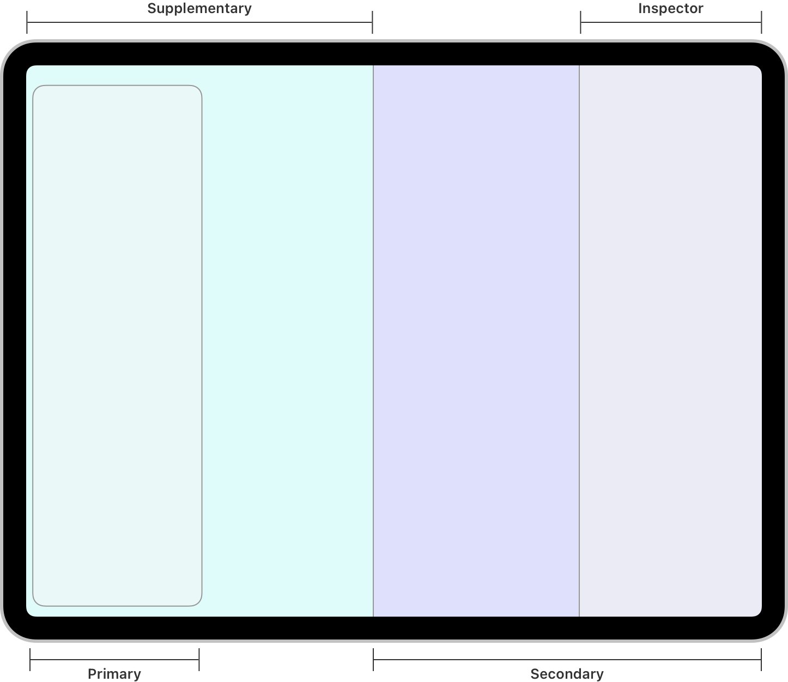
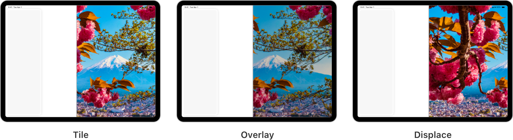

> Navigation: [Technologies](../technologies.md) · [UIKit](../uikit.md)

# UISplitViewController

<sub>Class</sub>

A container view controller that implements a hierarchical interface.

<sub>iOS, iPadOS, Mac Catalyst, tvOS, visionOS</sub>

```swift
@MainActor class UISplitViewController
```

## Overview

A split view controller is a container view controller that manages child view controllers in a hierarchical interface. In this type of interface, changes in one view controller drive changes in the content of another.

Split view interfaces are most suitable for filterable content or navigating content hierarchies, like traversing the folders and notes within the Notes app to view each note. In the Notes app, selecting a folder in the primary sidebar shows the list of notes in that folder, and selecting a note from the list shows the contents of that specific note in the secondary view.



<sub>Diagram showing a triple-column split view interface with the primary, supplementary,  secondary, and inspector columns labeled.</sub>

When you build your app’s user interface, the split view controller is typically the root view controller of your app’s window. The split view controller has no significant appearance of its own. Most of its appearance is defined by the child view controllers you install.

> [!note] Note
> You can’t push a split view controller onto a navigation stack. Although it’s possible to install a split view controller as a child in some other container view controllers, doing so isn’t recommended in most cases. For design guidance, see [Split views](https://developer.apple.com/design/human-interface-guidelines/split-views/).

### Split view styles

In iOS 14 and later, [UISplitViewController](uisplitviewcontroller.md) supports column-style layouts. A column-style split view controller lets you create an interface with two or three columns by using [- initWithStyle:](<uisplitviewcontroller/init(style_).md>) with the appropriate [style](uisplitviewcontroller/style-swift.property.md):

- Use the [UISplitViewControllerStyleDoubleColumn](uisplitviewcontroller/style-swift.enum/doublecolumn.md) style to create a split view interface with a two-column layout. This style of split view controller manages two child view controllers, placed in the primary and secondary columns.
- Use the [UISplitViewControllerStyleTripleColumn](uisplitviewcontroller/style-swift.enum/triplecolumn.md) style to create a split view interface with a three-column layout. This style of split view controller manages three child view controllers, placed in the primary, supplementary, and secondary columns.


In either the two-column or three-column layout, [UISplitViewController](uisplitviewcontroller.md) supports an inspector column on the trailing edge of the view. Use the inspector column to provide auxiliary information related to the secondary column, or for controls that affect content in the secondary column.

Before iOS 14, [UISplitViewController](uisplitviewcontroller.md) supported just one split view interface style with a primary view controller and a secondary view controller. This classic interface style applies to split view controllers created using any other approach than [- initWithStyle:](<uisplitviewcontroller/init(style_).md>). Split view controllers with the classic interface have a [style](uisplitviewcontroller/style-swift.property.md) of [UISplitViewControllerStyleUnspecified](uisplitviewcontroller/style-swift.enum/unspecified.md) and they don’t respond to any of the column-style APIs introduced in iOS 14 and later.

### Child view controllers

In a column-style split view interface, use the [- setViewController:forColumn:](<uisplitviewcontroller/setviewcontroller(__for_).md>) and [- viewControllerForColumn:](<uisplitviewcontroller/viewcontroller(for_).md>) methods to set and get view controllers for each column. The split view controller wraps all of its child view controllers in navigation controllers. If you set a child view controller that’s not a navigation controller, the split view controller creates a navigation controller for it. The split view controller returns your original view controller through [- viewControllerForColumn:](<uisplitviewcontroller/viewcontroller(for_).md>), but its [childViewControllers](uiviewcontroller/children.md) property contains the navigation controller it used to wrap your view controller. After you assign view controllers to specific columns, you can show and hide those columns using [- showColumn:](<uisplitviewcontroller/show(__).md>) or [- hideColumn:](<uisplitviewcontroller/hide(__).md>).

In a classic split view interface, you can configure the child view controllers using Interface Builder or programmatically by assigning the view controllers to the [viewControllers](uisplitviewcontroller/viewcontrollers.md) property. In cases where you need to change either the primary or secondary view controller, it’s recommended that you do so using the [- showViewController:sender:](<uisplitviewcontroller/show(__sender_).md>) and [- showDetailViewController:sender:](<uisplitviewcontroller/showdetailviewcontroller(__sender_).md>) methods. Using these methods (instead of modifying the [viewControllers](uisplitviewcontroller/viewcontrollers.md) property directly) lets the split view controller present the specified view controller in a way that’s most appropriate for the current display mode and size class.

### Interface transitions

The split view controller performs collapse and expand transitions in response to certain changes in its interface. For example, transitions occur when the interface’s size class toggles between horizontally regular and horizontally compact, when a user interaction hides or shows a column, or when you hide or show columns programmatically. The split view controller works with its [delegate](uisplitviewcontroller/delegate.md) object to perform collapse and expand transitions. The delegate is an object you provide that adopts the [UISplitViewControllerDelegate](uisplitviewcontrollerdelegate.md) protocol.

In a column-style split view interface, when the interface is collapsed, you can show a different view controller than your primary, supplementary, or secondary. Set the desired view controller for the [UISplitViewControllerColumnCompact](uisplitviewcontroller/column/compact.md) column using [- setViewController:forColumn:](<uisplitviewcontroller/setviewcontroller(__for_).md>). If you want to further customize transitions for collapsing and expanding the interface, see [Column-style split views](uisplitviewcontrollerdelegate.md#Column-style-split-views).

Configure your own custom views and interactions to show or hide the inspector column. When the interface is collapsed, the split view controller displays the inspector as a sheet over the secondary column.

For information about managing transitions in classic split view interfaces, see [Classic split views](uisplitviewcontrollerdelegate.md#Classic-split-views).

### Display mode

A split view controller’s current display mode represents the visual arrangement of its child view controllers. It determines how many of its child view controllers are shown, and how they’re positioned in relation to each other. For example, you can arrange the child view controllers so that they appear side-by-side, so that only one at a time is visible, or so that one is partially obscured by the others.

You don’t set the display mode directly; instead, you set a preferred display mode by using the [preferredDisplayMode](uisplitviewcontroller/preferreddisplaymode.md) property. The split view controller makes every effort to respect the display mode you specify, but it may not be able to accommodate that mode visually because of space constraints. For example, the split view controller can’t display its child view controllers side-by-side in a horizontally compact environment. For possible configurations, see [DisplayMode](uisplitviewcontroller/displaymode-swift.enum.md).


After you set the preferred display mode, the split view controller updates itself and reflects the actual display mode in the [displayMode](uisplitviewcontroller/displaymode-swift.property.md) property. If you just want to change which columns are shown, try using [- showColumn:](<uisplitviewcontroller/show(__).md>) or [- hideColumn:](<uisplitviewcontroller/hide(__).md>). The split view controller will determine how to update the display mode to display the desired columns.

### Gesture and button support

There are several ways for user interaction to change the current display mode.

The split view controller installs a built-in gesture recognizer that lets the user change the display mode using a swipe. You can suppress this gesture recognizer by setting the [presentsWithGesture](uisplitviewcontroller/presentswithgesture.md) property to [false](../swift/false.md). For example, you might set this property to [false](../swift/false.md) if you want your primary view controller to always be visible.

If [presentsWithGesture](uisplitviewcontroller/presentswithgesture.md) is [true](../swift/true.md), the split view controller also presents a special bar button item for changing the display mode. The split view controller manages the behavior, appearance, and positioning of this item. It appears as a sidebar toggle icon for [UISplitViewControllerSplitBehaviorTile](uisplitviewcontroller/splitbehavior-swift.enum/tile.md) and as a back-chevron icon for [UISplitViewControllerSplitBehaviorOverlay](uisplitviewcontroller/splitbehavior-swift.enum/overlay.md) and [UISplitViewControllerSplitBehaviorDisplace](uisplitviewcontroller/splitbehavior-swift.enum/displace.md). Tapping this button transitions to a new display mode based on the current display mode and split behavior.

For three-column split view interfaces—those with a [style](uisplitviewcontroller/style-swift.property.md) of [UISplitViewControllerStyleTripleColumn](uisplitviewcontroller/style-swift.enum/triplecolumn.md)—another property that affects display mode is [showsSecondaryOnlyButton](uisplitviewcontroller/showssecondaryonlybutton.md). When this property is [true](../swift/true.md), the split view controller presents another bar button item for toggling the display mode to and from [UISplitViewControllerDisplayModeSecondaryOnly](uisplitviewcontroller/displaymode-swift.enum/secondaryonly.md). The split view controller manages the behavior, appearance, and positioning of this item. It appears as a double-arrow icon. When a user taps this button, it toggles the display mode to or from [UISplitViewControllerDisplayModeSecondaryOnly](uisplitviewcontroller/displaymode-swift.enum/secondaryonly.md).

### Split behavior

A split view controller’s split behavior controls how its secondary view controller appears in relation to the others. You can configure this behavior so that the secondary view controller always appears side-by-side with the others, so that it’s partially obscured by the others, or so that it’s displaced offscreen opposite the others to make space for them.

You don’t set the split behavior directly; instead, you set a preferred split behavior by using the [preferredSplitBehavior](uisplitviewcontroller/preferredsplitbehavior.md) property. This change takes effect after the next layout occurs. The split view controller reflects the actual split behavior in the [splitBehavior](uisplitviewcontroller/splitbehavior-swift.property.md) property. The value of the [splitBehavior](uisplitviewcontroller/splitbehavior-swift.property.md) property affects which display modes are available for the split view controller. For possible configurations, see [SplitBehavior](uisplitviewcontroller/splitbehavior-swift.enum.md).



### Column-width customization

You can specify custom widths for the primary, supplementary, secondary, and inspector columns of the split view interface by setting their respective minimum, maximum, and preferred width properties listed in [Managing column dimensions](uisplitviewcontroller.md#Managing-column-dimensions). If you don’t specify values for these properties, they default to [UISplitViewControllerAutomaticDimension](uisplitviewcontroller/automaticdimension.md).

### Message forwarding

A split view controller interposes itself between the app’s window and its child view controllers. As a result, all messages to the child view controllers must flow through the split view controller. Messages are forwarded as appropriate. For example, view appearance and disappearance messages are sent only when the corresponding child view controller actually appears onscreen.

## Relationships

- **Inherits From**: [UIViewController](uiviewcontroller.md)

- **Conforms To**: [CVarArg](../swift/cvararg.md), [CustomDebugStringConvertible](../swift/customdebugstringconvertible.md), [CustomStringConvertible](../swift/customstringconvertible.md), [Equatable](../swift/equatable.md), [Hashable](../swift/hashable.md), [NSCoding](../foundation/nscoding.md), [NSExtensionRequestHandling](../foundation/nsextensionrequesthandling.md), [NSObjectProtocol](../objectivec/nsobjectprotocol.md), [NSTouchBarProvider](../appkit/nstouchbarprovider.md), [Sendable](../swift/sendable.md), [SendableMetatype](../swift/sendablemetatype.md), [UIActivityItemsConfigurationProviding](uiactivityitemsconfigurationproviding.md), [UIAppearanceContainer](uiappearancecontainer.md), [UIContentContainer](uicontentcontainer.md), [UIFocusEnvironment](uifocusenvironment.md), [UIPasteConfigurationSupporting](uipasteconfigurationsupporting.md), [UIResponderStandardEditActions](uiresponderstandardeditactions.md), [UIStateRestoring](uistaterestoring.md), [UITraitChangeObservable](uitraitchangeobservable-67e94.md), [UITraitEnvironment](uitraitenvironment.md), [UIUserActivityRestoring](uiuseractivityrestoring.md)

## Topics

### Creating a split view controller

- [- initWithStyle:](<uisplitviewcontroller/init(style_).md>) — Creates a split view controller with the specified column style.
- [- initWithNibName:bundle:](<uisplitviewcontroller/init(nibname_bundle_).md>) — Creates a split view controller with the nib file in the specified bundle.
- [- initWithCoder:](<uisplitviewcontroller/init(coder_).md>) — Creates a split view controller from data in an unarchiver.

### Getting the split view style

- [style](uisplitviewcontroller/style-swift.property.md) — The style that determines the number of columns that the split view interface displays.
- [Style](uisplitviewcontroller/style-swift.enum.md) — Constants that describe the number of columns the split view interface displays.

### Customizing the split view transitions

- [delegate](uisplitviewcontroller/delegate.md) — The delegate you use to manage changes to a split view interface.
- [UISplitViewControllerDelegate](uisplitviewcontrollerdelegate.md) — The methods adopted by the object you use to manage changes to a split view interface.

### Managing the child view controllers

- [Column](uisplitviewcontroller/column.md) — Constants that describe the columns within the split view interface.
- [- setViewController:forColumn:](<uisplitviewcontroller/setviewcontroller(__for_).md>) — Presents the provided view controller in the specified column of the split view interface.
- [- viewControllerForColumn:](<uisplitviewcontroller/viewcontroller(for_).md>) — Returns the view controller associated with the specified column of the split view interface.
- [viewControllers](uisplitviewcontroller/viewcontrollers.md) — The array of view controllers the split view controller manages.

### Displaying the child view controllers

- [- showColumn:](<uisplitviewcontroller/show(__).md>) — Presents the view controller in the specified column of the split view interface.
- [- hideColumn:](<uisplitviewcontroller/hide(__).md>) — Dismisses the view controller in the specified column of the split view interface.
- [- isShowingColumn:](<uisplitviewcontroller/isshowing(__).md>) — A Boolean value that indicates whether the split view interface is showing the specified column.
- [- showViewController:sender:](<uisplitviewcontroller/show(__sender_).md>) — Presents the specified view controller as the primary view controller in the split view interface.
- [- showDetailViewController:sender:](<uisplitviewcontroller/showdetailviewcontroller(__sender_).md>) — Presents the specified view controller as the secondary view controller of the split view interface.

### Managing the display mode

- [preferredDisplayMode](uisplitviewcontroller/preferreddisplaymode.md) — The preferred arrangement of the split view interface.
- [displayMode](uisplitviewcontroller/displaymode-swift.property.md) — The current arrangement of the split view interface.
- [displayModeButtonItem](uisplitviewcontroller/displaymodebuttonitem.md) — A button that changes the display mode of the split view controller.
- [presentsWithGesture](uisplitviewcontroller/presentswithgesture.md) — Specifies whether a hidden view controller can be presented and dismissed using a swipe gesture.
- [showsSecondaryOnlyButton](uisplitviewcontroller/showssecondaryonlybutton.md) — Specifies whether the secondary view controller shows a button to toggle to and from the secondary-only display mode.
- [DisplayMode](uisplitviewcontroller/displaymode-swift.enum.md) — Constants that describe the possible arrangements for a split view interface.
- [displayModeButtonVisibility](uisplitviewcontroller/displaymodebuttonvisibility-swift.property.md) — A setting that determines whether the display mode button is visible in the interface.
- [DisplayModeButtonVisibility](uisplitviewcontroller/displaymodebuttonvisibility-swift.enum.md) — Constants that determine the visibility of the display mode button.

### Managing the split behavior

- [preferredSplitBehavior](uisplitviewcontroller/preferredsplitbehavior.md) — The preferred behavior that determines how the child view controllers appear in relation to each other.
- [splitBehavior](uisplitviewcontroller/splitbehavior-swift.property.md) — The current behavior that determines how the child view controllers appear in relation to each other.
- [SplitBehavior](uisplitviewcontroller/splitbehavior-swift.enum.md) — Constants that describe the possible ways that the child view controllers appear in relation to each other.

### Managing column dimensions

- [collapsed](uisplitviewcontroller/iscollapsed.md) — A Boolean value that indicates whether only one of the child view controllers displays.
- [preferredPrimaryColumnWidthFraction](uisplitviewcontroller/preferredprimarycolumnwidthfraction.md) — The relative width of the primary view controller’s content.
- [preferredPrimaryColumnWidth](uisplitviewcontroller/preferredprimarycolumnwidth.md) — The preferred width, in points, of the primary view controller’s content.
- [primaryColumnWidth](uisplitviewcontroller/primarycolumnwidth.md) — The width, in points, of the primary view controller’s content.
- [minimumPrimaryColumnWidth](uisplitviewcontroller/minimumprimarycolumnwidth.md) — The minimum width, in points, for the primary view controller’s content.
- [maximumPrimaryColumnWidth](uisplitviewcontroller/maximumprimarycolumnwidth.md) — The maximum width, in points, for the primary view controller’s content.
- [preferredSupplementaryColumnWidthFraction](uisplitviewcontroller/preferredsupplementarycolumnwidthfraction.md) — The relative width of the supplementary view controller’s content.
- [preferredSupplementaryColumnWidth](uisplitviewcontroller/preferredsupplementarycolumnwidth.md) — The preferred width, in points, of the supplementary view controller’s content.
- [supplementaryColumnWidth](uisplitviewcontroller/supplementarycolumnwidth.md) — The width, in points, of the supplementary view controller’s content.
- [minimumSupplementaryColumnWidth](uisplitviewcontroller/minimumsupplementarycolumnwidth.md) — The minimum width, in points, for the supplementary view controller’s content.
- [maximumSupplementaryColumnWidth](uisplitviewcontroller/maximumsupplementarycolumnwidth.md) — The maximum width, in points, for the supplementary view controller’s content.
- [preferredSecondaryColumnWidth](uisplitviewcontroller/preferredsecondarycolumnwidth.md) — The preferred width, in points, for the secondary view controller’s content.
- [preferredSecondaryColumnWidthFraction](uisplitviewcontroller/preferredsecondarycolumnwidthfraction.md) — The relative width of the secondary view controller’s content.
- [minimumSecondaryColumnWidth](uisplitviewcontroller/minimumsecondarycolumnwidth.md) — The minimum width, in points, for the secondary view controller’s content.
- [preferredInspectorColumnWidth](uisplitviewcontroller/preferredinspectorcolumnwidth.md) — The preferred width, in points, for the inspector view controller’s content.
- [preferredInspectorColumnWidthFraction](uisplitviewcontroller/preferredinspectorcolumnwidthfraction.md) — The relative width of the inspector view controller’s content.
- [maximumInspectorColumnWidth](uisplitviewcontroller/maximuminspectorcolumnwidth.md) — The maximum width, in points, for the inspector view controller’s content.
- [minimumInspectorColumnWidth](uisplitviewcontroller/minimuminspectorcolumnwidth.md) — The minimum width, in points, for the inspector view controller’s content.
- [UISplitViewControllerAutomaticDimension](uisplitviewcontroller/automaticdimension.md) — The default value to apply to a dimension.

### Inspecting the layout environment

- [LayoutEnvironment](uisplitviewcontroller/layoutenvironment.md) — Constants that indicate the current layout of the containing split view controller.

### Positioning the primary view controller

- [primaryEdge](uisplitviewcontroller/primaryedge-swift.property.md) — The side on which the primary view controller sits.
- [PrimaryEdge](uisplitviewcontroller/primaryedge-swift.enum.md) — Constants that indicate the side on which the primary view controller sits.

### Managing the background style

- [primaryBackgroundStyle](uisplitviewcontroller/primarybackgroundstyle.md) — The background style of the primary view controller.
- [BackgroundStyle](uisplitviewcontroller/backgroundstyle.md) — Styles that apply a visual effect to the background of a primary view controller.

## See Also

### Container view controllers

- [Creating a custom container view controller](creating-a-custom-container-view-controller.md) — Create a composite interface by combining content from one or more view controllers with other custom views.
- [UINavigationController](uinavigationcontroller.md) — A container view controller that defines a stack-based scheme for navigating hierarchical content.
- [UINavigationBar](uinavigationbar.md) — Navigational controls that display in a bar along the top of the screen, usually in conjunction with a navigation controller.
- [UINavigationItem](uinavigationitem.md) — The items that a navigation bar displays when the associated view controller is visible.
- [UITabBarController](uitabbarcontroller.md) — A container view controller that manages a multiselection interface, where the selection determines which child view controller to display.
- [UITabBar](uitabbar.md) — A control that displays one or more buttons in a tab bar for selecting between different subtasks, views, or modes in an app.
- [UITabBarItem](uitabbaritem.md) — An object that describes an item in a tab bar.
- [UITab](uitab.md) — An object that manages a tab in a tab bar.
- [UITabAccessory](uitabaccessory.md)
- [UISearchTab](uisearchtab.md) — A tab subclass that represents the system’s search tab.
- [UITabGroup](uitabgroup.md) — An object that manages a collection of tab objects.
- [UIPageViewController](uipageviewcontroller.md) — A container view controller that manages navigation between pages of content, where a subview controller manages each page.
