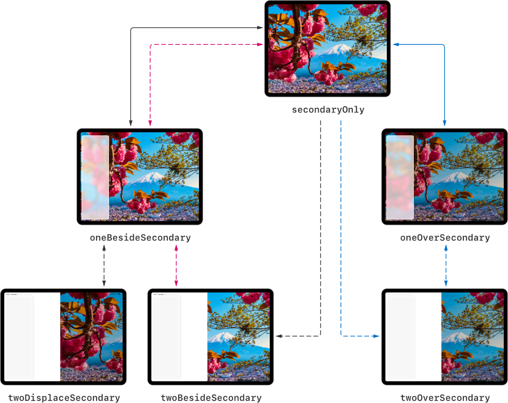

> Navigation: [Technologies](../../technologies.md) · [UIKit](../../uikit.md) · [UISplitViewController](../uisplitviewcontroller.md)

# UISplitViewController.DisplayMode

<sub>Enumeration</sub>

Constants that describe the possible arrangements for a split view interface.

<sub>iOS, iPadOS, Mac Catalyst, tvOS, visionOS</sub>

```swift
enum DisplayMode
```

## Overview

A split view controller’s display mode controls the visual arrangement of its child view controllers. You set a preferred display mode by using the [preferredDisplayMode](preferreddisplaymode.md) property, and the split view controller updates itself and reflects the actual display mode in the [displayMode](displaymode-swift.property.md) property.

Display modes apply to a split view controller in an expanded arrangement. When the split view interface is collapsed — when [collapsed](iscollapsed.md) is [true](../../swift/true.md) — the display mode has no impact on the appearance of the split view controller interface.

A split view controller’s split behavior ([splitBehavior](splitbehavior-swift.property.md)) affects its possible display modes. For more information, see [SplitBehavior](splitbehavior-swift.enum.md).

| Split Behavior | Possible Display Modes |
|---|---|
| Tile | [UISplitViewControllerDisplayModeSecondaryOnly](displaymode-swift.enum/secondaryonly.md)  [UISplitViewControllerDisplayModeOneBesideSecondary](displaymode-swift.enum/onebesidesecondary.md)  [UISplitViewControllerDisplayModeTwoBesideSecondary](displaymode-swift.enum/twobesidesecondary.md) |
| Overlay | [UISplitViewControllerDisplayModeSecondaryOnly](displaymode-swift.enum/secondaryonly.md)  [UISplitViewControllerDisplayModeOneOverSecondary](displaymode-swift.enum/oneoversecondary.md)  [UISplitViewControllerDisplayModeTwoOverSecondary](displaymode-swift.enum/twooversecondary.md) |
| Displace | [UISplitViewControllerDisplayModeSecondaryOnly](displaymode-swift.enum/secondaryonly.md)  [UISplitViewControllerDisplayModeOneBesideSecondary](displaymode-swift.enum/onebesidesecondary.md)  [UISplitViewControllerDisplayModeTwoDisplaceSecondary](displaymode-swift.enum/twodisplacesecondary.md) |

There are several ways for user interaction to change the current display mode. Based on the type of user interaction (gesture or button tap), the display mode can transition between a set of predetermined states.



## Relationships

- **Conforms To**: [BitwiseCopyable](../../swift/bitwisecopyable.md), [Equatable](../../swift/equatable.md), [Hashable](../../swift/hashable.md), [RawRepresentable](../../swift/rawrepresentable.md), [Sendable](../../swift/sendable.md), [SendableMetatype](../../swift/sendablemetatype.md)

## Topics

### Constants

- [UISplitViewControllerDisplayModeAutomatic](displaymode-swift.enum/automatic.md) — The split view controller automatically decides the most appropriate display mode based on the device and the current app size.
- [UISplitViewControllerDisplayModeSecondaryOnly](displaymode-swift.enum/secondaryonly.md) — Only the secondary view controller is shown onscreen.
- [UISplitViewControllerDisplayModeOneBesideSecondary](displaymode-swift.enum/onebesidesecondary.md) — One sidebar appears side-by-side with the secondary view controller.
- [UISplitViewControllerDisplayModeOneOverSecondary](displaymode-swift.enum/oneoversecondary.md) — One sidebar is layered on top of the secondary view controller, leaving the secondary view controller partially visible.
- [UISplitViewControllerDisplayModeTwoBesideSecondary](displaymode-swift.enum/twobesidesecondary.md) — Two sidebars appear side-by-side with the secondary view controller.
- [UISplitViewControllerDisplayModeTwoOverSecondary](displaymode-swift.enum/twooversecondary.md) — Two sidebars are layered on top of the secondary view controller, leaving the secondary view controller partially visible.
- [UISplitViewControllerDisplayModeTwoDisplaceSecondary](displaymode-swift.enum/twodisplacesecondary.md) — Two sidebars displace the secondary view controller instead of overlapping it, moving it partially offscreen.

### Deprecated

- [UISplitViewControllerDisplayModePrimaryHidden](displaymode-swift.enum/primaryhidden.md) — The primary view controller is hidden. _(deprecated)_
- [UISplitViewControllerDisplayModeAllVisible](displaymode-swift.enum/allvisible.md) — The primary and secondary view controllers are displayed side-by-side onscreen. _(deprecated)_
- [UISplitViewControllerDisplayModePrimaryOverlay](displaymode-swift.enum/primaryoverlay.md) — The primary view controller is layered on top of the secondary view controller, leaving the secondary view controller partially visible. _(deprecated)_

### Initializers

- [init(rawValue:)](<displaymode-swift.enum/init(rawvalue_).md>)

## See Also

### Managing the display mode

- [preferredDisplayMode](preferreddisplaymode.md) — The preferred arrangement of the split view interface.
- [displayMode](displaymode-swift.property.md) — The current arrangement of the split view interface.
- [displayModeButtonItem](displaymodebuttonitem.md) — A button that changes the display mode of the split view controller.
- [presentsWithGesture](presentswithgesture.md) — Specifies whether a hidden view controller can be presented and dismissed using a swipe gesture.
- [showsSecondaryOnlyButton](showssecondaryonlybutton.md) — Specifies whether the secondary view controller shows a button to toggle to and from the secondary-only display mode.
- [displayModeButtonVisibility](displaymodebuttonvisibility-swift.property.md) — A setting that determines whether the display mode button is visible in the interface.
- [DisplayModeButtonVisibility](displaymodebuttonvisibility-swift.enum.md) — Constants that determine the visibility of the display mode button.
