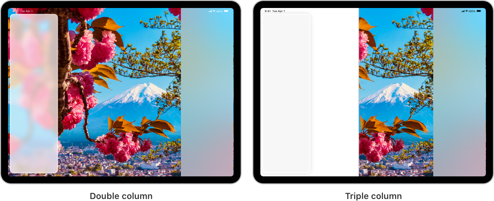

> Navigation: [Technologies](../../technologies.md) · [UIKit](../../uikit.md) · [UISplitViewController](../uisplitviewcontroller.md)

# UISplitViewController.Style

<sub>Enumeration</sub>

Constants that describe the number of columns the split view interface displays.

<sub>iOS, iPadOS, Mac Catalyst, tvOS, visionOS</sub>

```swift
enum Style
```

## Overview

In iOS 14 and later, [UISplitViewController](../uisplitviewcontroller.md) supports column-style layouts. A column-style split view controller lets you create an interface with two or three columns by using [- initWithStyle:](<init(style_).md>) with the appropriate [style](style-swift.property.md):

- Use the [UISplitViewControllerStyleDoubleColumn](style-swift.enum/doublecolumn.md) style to create a split view interface with a two-column layout. This style of split view controller manages two child view controllers, placed in the primary and secondary columns.
- Use the [UISplitViewControllerStyleTripleColumn](style-swift.enum/triplecolumn.md) style to create a split view interface with a three-column layout. This style of split view controller manages three child view controllers, placed in the primary, supplementary, and secondary columns.



Before iOS 14, [UISplitViewController](../uisplitviewcontroller.md) supported just one split view interface style with a primary view controller and a secondary view controller. This classic interface style applies to split view controllers created using any other approach than [- initWithStyle:](<init(style_).md>). Split view controllers with the classic interface have a [style](style-swift.property.md) of [UISplitViewControllerStyleUnspecified](style-swift.enum/unspecified.md) and they don’t respond to any of the column-style APIs introduced in iOS 14 and later.

## Relationships

- **Conforms To**: [BitwiseCopyable](../../swift/bitwisecopyable.md), [Equatable](../../swift/equatable.md), [Hashable](../../swift/hashable.md), [RawRepresentable](../../swift/rawrepresentable.md), [Sendable](../../swift/sendable.md), [SendableMetatype](../../swift/sendablemetatype.md)

## Topics

### Constants

- [UISplitViewControllerStyleUnspecified](style-swift.enum/unspecified.md) — The split view interface uses the classic split view style.
- [UISplitViewControllerStyleDoubleColumn](style-swift.enum/doublecolumn.md) — The split view interface displays two columns.
- [UISplitViewControllerStyleTripleColumn](style-swift.enum/triplecolumn.md) — The split view interface displays three columns.

### Initializers

- [init(rawValue:)](<style-swift.enum/init(rawvalue_).md>)

## See Also

### Getting the split view style

- [style](style-swift.property.md) — The style that determines the number of columns that the split view interface displays.
