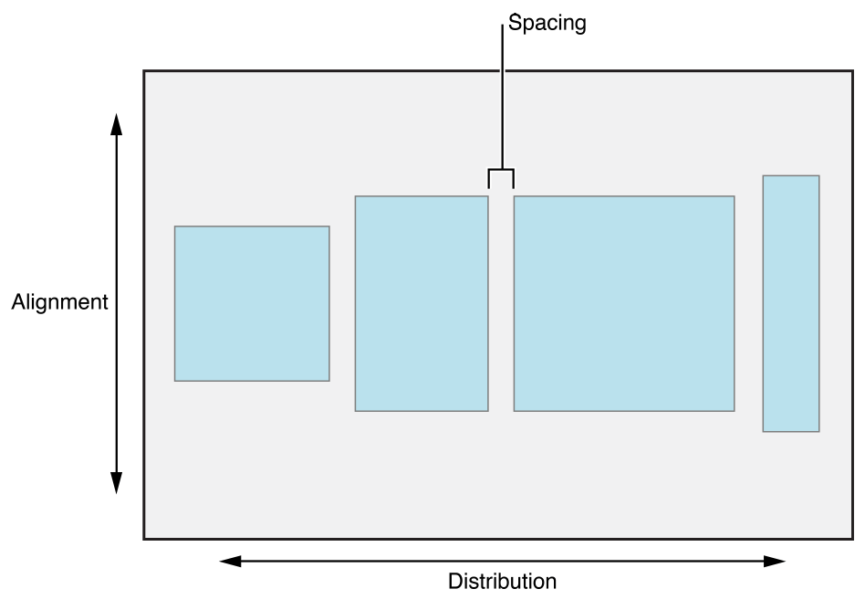
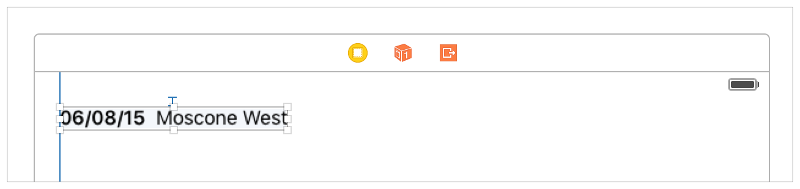
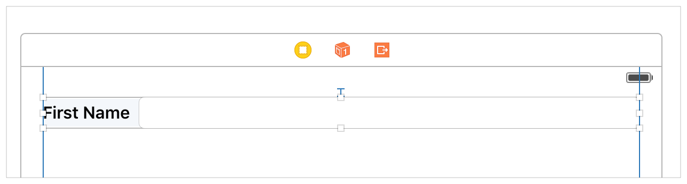
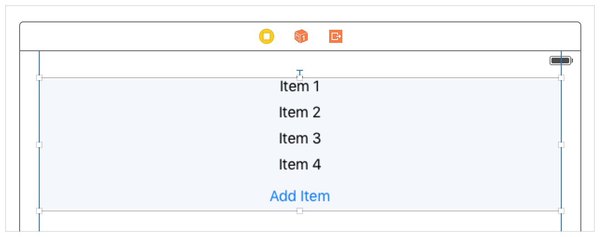
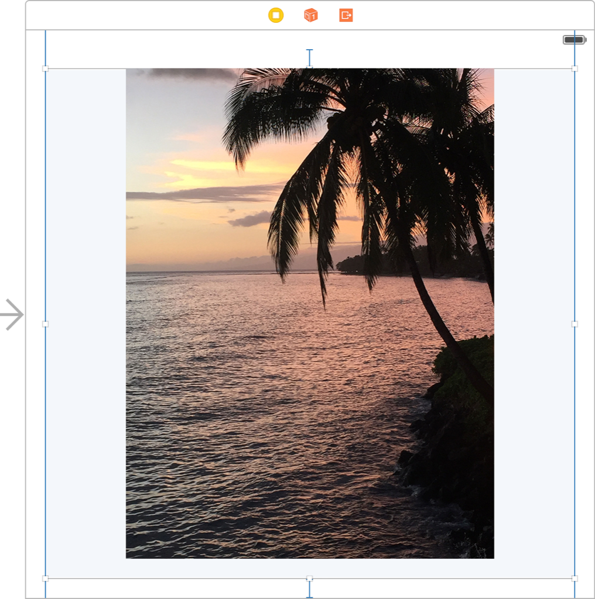
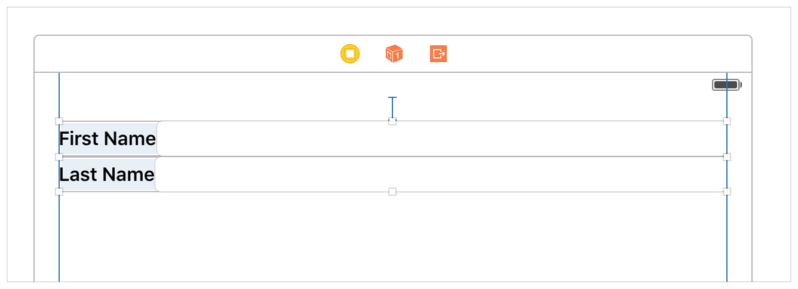

> Navigation: [Technologies](../technologies.md) · [UIKit](../uikit.md)

# UIStackView

<sub>Class</sub>

A streamlined interface for laying out a collection of views in either a column or a row.

<sub>iOS, iPadOS, Mac Catalyst, tvOS, visionOS</sub>

```swift
@MainActor class UIStackView
```

## Overview

Stack views let you leverage the power of Auto Layout, creating user interfaces that can dynamically adapt to the device’s orientation, screen size, and any changes in the available space. The stack view manages the layout of all the views in its [arrangedSubviews](uistackview/arrangedsubviews.md) property. These views are arranged along the stack view’s axis, based on their order in the [arrangedSubviews](uistackview/arrangedsubviews.md) array. The exact layout varies depending on the stack view’s [axis](uistackview/axis.md), [distribution](uistackview/distribution-swift.property.md), [alignment](uistackview/alignment-swift.property.md), [spacing](uistackview/spacing.md), and other properties.



<sub>Diagram of four arranged subviews in a stack view. The distribution property determines how the stack view arranges its subviews along its axis, and the alignment property determines how the stack view arranges its subviews perpendicular to its axis. The spacing property determines the space between the subviews.</sub>

To use a stack view, open the Storyboard you wish to edit. Drag either a Horizontal Stack View or a Vertical Stack View out from the Object library, and position the stack view where desired. Next, drag out the stack’s content, dropping the view or control into the stack. You can continue to add views and controls to your stack, as needed. Interface Builder resizes the stack based on its content. You can also adjust the appearance of the stack’s content by modifying the Stack View’s properties in the Attributes inspector.

> [!note] Note
> You’re responsible for defining the position and (optionally) the size of the stack view. The stack view then manages the layout and size of its content.

### Stack view and Auto Layout

The stack view uses Auto Layout to position and size its arranged views. The stack view aligns the first and last arranged view with its edges along the stack’s axis. In a horizontal stack, this means the first arranged view’s leading edge is pinned to the stack’s leading edge, and the last arranged view’s trailing edge is pinned to the stack’s trailing edge. In vertical stacks, the top and bottom edges are pinned to the stack’s top and bottom edges, respectively. If you set the stack view’s [layoutMarginsRelativeArrangement](uistackview/islayoutmarginsrelativearrangement.md) property to [true](../swift/true.md), the stack view pins its content to the relevant margin instead of its edge.

For all distributions except the [UIStackViewDistributionFillEqually](uistackview/distribution-swift.enum/fillequally.md) distribution, the stack view uses each arranged view’s [intrinsicContentSize](uiview/intrinsiccontentsize.md) property when calculating its size along the stack’s axis. [UIStackViewDistributionFillEqually](uistackview/distribution-swift.enum/fillequally.md) resizes all the arranged views so they’re the same size, filling the stack view along its axis. If possible, the stack view stretches all the arranged views to match the view with the longest intrinsic size along the stack’s axis.

For all alignments except the [UIStackViewAlignmentFill](uistackview/alignment-swift.enum/fill.md) alignment, the stack view uses each arranged view’s [intrinsicContentSize](uiview/intrinsiccontentsize.md) property when calculating its size perpendicular to the stack’s axis. [UIStackViewAlignmentFill](uistackview/alignment-swift.enum/fill.md) resizes all the arranged views so that they fill the stack view perpendicularly to its axis. If possible, the stack view stretches all the arranged views to match the view with the largest intrinsic size perpendicular to the stack’s axis.

#### Position and size the stack view

Although a stack view allows you to lay out its contents without using Auto Layout directly, you still need to use Auto Layout to position the stack view itself. In general, this means pinning at least two adjacent edges of the stack view to define its position. Without additional constraints, the system calculates the size of the stack view based on its contents.

- Along the stack view’s axis, its fitting size is equal to the sum of the sizes of all the arranged views plus the space between views.
- Perpendicular to the stack view’s axis, its fitting size is equal to the size of the largest arranged view.
- If the stack view’s [layoutMarginsRelativeArrangement](uistackview/islayoutmarginsrelativearrangement.md) property is set to [true](../swift/true.md), the stack view’s fitting size is increased to include space for the margins.

You can provide additional constraints to specify the stack view’s height, width, or both. In these cases, the stack view adjusts the layout and size of its arranged views to fill the specified area. The exact layout varies based on the stack view’s properties. See the [Distribution](uistackview/distribution-swift.enum.md) and [Alignment](uistackview/alignment-swift.enum.md) enumerations for a complete description on how the stack view handles having either extra space or insufficient space for its content.

You can also position a stack view based on its first or last baseline, instead of using the top, bottom, or center Y position. Like the stack view’s fitting size, these baselines are calculated based on the stack view’s content.

- A horizontal stack view returns its tallest view for both the [viewForFirstBaselineLayout](uiview/forfirstbaselinelayout.md) and [viewForLastBaselineLayout](uiview/forlastbaselinelayout.md) methods. If the tallest view is also a stack view, it returns the result of calling [viewForFirstBaselineLayout](uiview/forfirstbaselinelayout.md) or [viewForLastBaselineLayout](uiview/forlastbaselinelayout.md) on the nested stack view.
- A vertical stack view returns its first arranged view for [viewForFirstBaselineLayout](uiview/forfirstbaselinelayout.md) and its last arranged view for [viewForLastBaselineLayout](uiview/forlastbaselinelayout.md). If either of these views are also stack views, then it returns the result of calling [viewForFirstBaselineLayout](uiview/forfirstbaselinelayout.md) or [viewForLastBaselineLayout](uiview/forlastbaselinelayout.md) on the nested stack view.

> [!note] Note
> Baseline alignment only works on views whose height matches their intrinsic content size’s height. If the view is stretched or compressed, the baseline appears in the wrong location.

#### Define common stack view layouts

Common approaches for laying out content using stack views:

**Define the position only.** You can define the stack view’s position by pinning two of its adjacent edges to its superview. In this case, the stack view’s size grows freely in both dimensions, based on its arranged views. This approach is particularly useful when you want the stack view’s content to appear at its intrinsic content size, and you want to arrange other user-interface elements relative to the stack view.

The following image shows a stack view with its leading and top edges pinned to its superview. The labels are first baseline aligned, with an 8-point space between them, left-aligning the stack view’s content in its superview.



<sub>A horizontal stack view with its leading and top edges pinned to its superview. The stack view contains two labels, a date and a location name. The labels have baseline alignment with an 8-point space between them. With these constraints, the stack view’s content is left-aligned in its superview.</sub>

**Define the stack’s size along its axis.** In this case, pin both edges of the stack along its axis to its superview, defining the stack view’s size in that dimension. You also need to pin one of the other edges to define the stack view’s position. The stack view sizes and positions its content along its axis to fill the defined space; however, the unpinned edge moves freely, based on the size of the largest arranged view.

The following image shows a stack view with the leading, top, and trailing edges pinned to its superview. Using the fill distribution causes the content to resize to fill the view’s width, and because the text field has a lower content-hugging priority than the label, it’s stretched as necessary.



<sub>A horizontal stack view with a label and a text field. The label is only as wide as the string it contains, but the text field fills the stack view’s width. </sub>

**Define the stack’s size perpendicular to its axis.** This approach is similar to the previous example, but you pin the two edges perpendicular to the stack view’s axis and only one edge along the axis. This lets the stack view grow and shrink along its axis as you add and remove arranged views. Unless you use a [UIStackViewDistributionFillEqually](uistackview/distribution-swift.enum/fillequally.md) distribution, the arranged views are sized according to their intrinsic content size. Perpendicular to the axis, the views are laid out in the defined space based on the stack view’s alignment.

The following image shows a vertical stack containing four labels and a button. The stack uses 8-point spacing and the center alignment. The stack view’s height grows and shrinks as items are added to or removed from the stack.



<sub>A vertical stack view with four labels “Item 1” through “Item 4,”  and a button to add more items below. The stack view has a flexible height to account for adding more items. </sub>

**Define the size and position of the stack view.** In this case, you pin all four edges of the stack view, causing the stack view to lay out its content within the provided space.

The following image shows a vertical stack view with all four edges pinned to its superview. By using the center alignment and fill distribution, the stack view ensures that its content is centered horizontally and vertically fills the screen. However, getting the desired layout with this approach requires a couple of additional steps. By default, the stack view vertically stretches the label and not the image view. To resize the image view, lower its content-hugging priority below the label’s content-hugging priority. Additionally, to maintain the image view’s aspect ratio as it resizes, set its Mode to Aspect Fit. Adding an equal width constraint between the image view and the stack view helps ensure the image is sized to fill the available space.



<sub>A vertical stack view with all four edges pinned to its superview. The stack view contains an image and uses the center alignment and fill distribution.</sub>

### Manage the stack view’s appearance

A stack view manages the position and size of its arranged views. There are a number of properties that define how the stack view lays out its content.

- The [axis](uistackview/axis.md) property determines the stack’s orientation, either vertically or horizontally.
- The [distribution](uistackview/distribution-swift.property.md) property determines the layout of the arranged views along the stack’s axis.
- The [alignment](uistackview/alignment-swift.property.md) property determines the layout of the arranged views perpendicular to the stack’s axis.
- The [spacing](uistackview/spacing.md) property determines the minimum spacing between arranged views.
- The [baselineRelativeArrangement](uistackview/isbaselinerelativearrangement.md) property determines whether the vertical spacing between views is measured from the baselines.
- The [layoutMarginsRelativeArrangement](uistackview/islayoutmarginsrelativearrangement.md) property determines whether the stack view lays out its arranged views relative to its layout margins.

Typically, you use a single stack view to lay out a small number of items. You can build more complex view hierarchies by nesting stack views inside other stack views. For example, the following image shows a vertical stack view containing two horizontal stack views. Each of the horizontal stack views contains a label and a text field.



<sub>A vertical stack view containing two horizontal stack views. The top horizontal stack view contains a label with the text First Name and a blank text field for entering the corresponding text. The bottom horizontal stack view contains a label with the text Last Name and a blank text field.</sub>

You can also fine-tune an arranged view’s appearance by adding additional constraints to the arranged view. For example, you can use constraints to set a minimum or maximum height or width for the view. Or you can define an aspect ratio for the view. The stack view uses these constraints when laying out its content.

> [!note] Note
> Be careful to avoid introducing conflicts when adding constraints to views inside a stack view. As a general rule, if a view’s size defaults back to its intrinsic content size for a given dimension, you can safely add a constraint for that dimension.

### Maintain consistency between the arranged views and subviews

The stack view ensures that its [arrangedSubviews](uistackview/arrangedsubviews.md) property is always a subset of its [subviews](uiview/subviews.md) property. Specifically, the stack view enforces the following rules:

- When the stack view adds a view to its [arrangedSubviews](uistackview/arrangedsubviews.md) array, it also adds that view as a subview, if it isn’t already.
- When a subview is removed from the stack view, the stack view also removes it from the [arrangedSubviews](uistackview/arrangedsubviews.md) array.
- Removing a view from the [arrangedSubviews](uistackview/arrangedsubviews.md) array doesn’t remove it as a subview. The stack view no longer manages the view’s size and position, but the view is still part of the view hierarchy, and is rendered on screen if it’s visible.

Although the [arrangedSubviews](uistackview/arrangedsubviews.md) array always contains a subset of the [subviews](uiview/subviews.md) array, the order of these arrays remain independent.

- The order of the [arrangedSubviews](uistackview/arrangedsubviews.md) array defines the order in which views appear in the stack. For horizontal stacks, the views are laid out in reading order, with the lower index views appearing before the higher index views. In English, for example, the views are laid out in order from left to right. For vertical stacks, the views are laid out from top to bottom, with the lower index views above the higher index views.
- The order of the subviews array defines the Z-order of the subviews. If the views overlap, subviews with a lower index appear behind subviews with a higher index.

### Change the stack view’s content dynamically

The stack view automatically updates its layout whenever views are added, removed, or inserted into the [arrangedSubviews](uistackview/arrangedsubviews.md) array, or whenever one of the arranged subviews’s [hidden](uiview/ishidden.md) property changes.

**Swift**

```swift
// Appears to remove the first arranged view from the stack.
// The view is still inside the stack, it's just no longer visible, and no longer contributes to the layout.
let firstView = stackView.arrangedSubviews[0]
firstView.isHidden = true
```

**Objective-C**

```objc
// Appears to remove the first arranged view from the stack.
// The view is still inside the stack, it's just no longer visible, and no longer contributes to the layout.
UIView * firstView = self.stackView.arrangedSubviews[0];
firstView.hidden = YES;
```

The stack view also automatically responds to changes to any of its properties. For example, you can dynamically change the stack’s orientation, by updating the stack view’s [axis](uistackview/axis.md) property.

**Swift**

```swift
// Toggle between a vertical and horizontal stack.
if stackView.axis == .horizontal {
    stackView.axis = .vertical
}
else {
    stackView.axis = .horizontal
}
```

**Objective-C**

```objc
// Toggle between a vertical and horizontal stack.
if (self.stackView.axis == UILayoutConstraintAxisHorizontal) {
    self.stackView.axis = UILayoutConstraintAxisVertical;
}
else {
    self.stackView.axis = UILayoutConstraintAxisHorizontal;
}
```

You can animate both changes to the arranged subview’s [hidden](uiview/ishidden.md) property and changes to the stack view’s properties by placing these changes inside an animation block.

**Swift**

```swift
// Animates removing the first item in the stack.
UIView.animate(withDuration: 0.25) { () -> Void in
    let firstView = stackView.arrangedSubviews[0]
    firstView.isHidden = true
}
```

**Objective-C**

```objc
// Animates removing the first item in the stack.
[UIView animateWithDuration:0.25 animations:^{
    UIView * firstView = self.stackView.arrangedSubviews[0];
    firstView.hidden = YES;
}];
```

Finally, you can define size-class specific values for many of the stack view’s properties directly in Interface Builder. The system automatically animates these changes whenever the stack view’s size class changes.

## Relationships

- **Inherits From**: [UIView](uiview.md)

- **Conforms To**: [CALayerDelegate](../quartzcore/calayerdelegate.md), [CLBodyIdentifiable](../corelocation/clbodyidentifiable.md), [CMBodyIdentifiable](../coremotion/cmbodyidentifiable.md), [CVarArg](../swift/cvararg.md), [CustomDebugStringConvertible](../swift/customdebugstringconvertible.md), [CustomStringConvertible](../swift/customstringconvertible.md), [Equatable](../swift/equatable.md), [Hashable](../swift/hashable.md), [NSCoding](../foundation/nscoding.md), [NSObjectProtocol](../objectivec/nsobjectprotocol.md), [NSTouchBarProvider](../appkit/nstouchbarprovider.md), [Sendable](../swift/sendable.md), [SendableMetatype](../swift/sendablemetatype.md), [UIAccessibilityIdentification](uiaccessibilityidentification.md), [UIActivityItemsConfigurationProviding](uiactivityitemsconfigurationproviding.md), [UIAppearance](uiappearance.md), [UIAppearanceContainer](uiappearancecontainer.md), [UICoordinateSpace](uicoordinatespace.md), [UIDynamicItem](uidynamicitem.md), [UIFocusEnvironment](uifocusenvironment.md), [UIFocusItem](uifocusitem.md), [UIFocusItemContainer](uifocusitemcontainer.md), [UILargeContentViewerItem](uilargecontentvieweritem.md), [UIPasteConfigurationSupporting](uipasteconfigurationsupporting.md), [UIPopoverPresentationControllerSourceItem](uipopoverpresentationcontrollersourceitem.md), [UIResponderStandardEditActions](uiresponderstandardeditactions.md), [UITraitChangeObservable](uitraitchangeobservable-67e94.md), [UITraitEnvironment](uitraitenvironment.md), [UIUserActivityRestoring](uiuseractivityrestoring.md)

## Topics

### Initializing a stack view

- [- initWithArrangedSubviews:](<uistackview/init(arrangedsubviews_).md>) — Returns a new stack view object that manages the provided views.
- [- initWithFrame:](<uistackview/init(frame_).md>) — Creates a stack view with the specified frame.
- [- initWithCoder:](<uistackview/init(coder_).md>) — Creates a stack view from data in an unarchiver.

### Managing arranged subviews

- [- addArrangedSubview:](<uistackview/addarrangedsubview(__).md>) — Adds a view to the end of the arranged subviews array.
- [arrangedSubviews](uistackview/arrangedsubviews.md) — The list of views arranged by the stack view.
- [- insertArrangedSubview:atIndex:](<uistackview/insertarrangedsubview(__at_).md>) — Adds the provided view to the array of arranged subviews at the specified index.
- [- removeArrangedSubview:](<uistackview/removearrangedsubview(__).md>) — Removes the provided view from the stack’s array of arranged subviews.

### Configuring the layout

- [axis](uistackview/axis.md) — The axis along which the arranged views lay out.
- [alignment](uistackview/alignment-swift.property.md) — The alignment of the arranged subviews perpendicular to the stack view’s axis.
- [distribution](uistackview/distribution-swift.property.md) — The distribution of the arranged views along the stack view’s axis.
- [spacing](uistackview/spacing.md) — The distance in points between the adjacent edges of the stack view’s arranged views.
- [baselineRelativeArrangement](uistackview/isbaselinerelativearrangement.md) — A Boolean value that determines whether the vertical spacing between views is measured from their baselines.
- [layoutMarginsRelativeArrangement](uistackview/islayoutmarginsrelativearrangement.md) — A Boolean value that determines whether the stack view lays out its arranged views relative to its layout margins.

### Adding space between items

- [- customSpacingAfterView:](<uistackview/customspacing(after_).md>) — Returns the custom spacing after the specified view.
- [- setCustomSpacing:afterView:](<uistackview/setcustomspacing(__after_).md>) — Applies custom spacing after the specified view.
- [UIStackViewSpacingUseDefault](uistackview/spacingusedefault.md) — The default spacing for subviews within a stack view.
- [UIStackViewSpacingUseSystem](uistackview/spacingusesystem.md) — The system-defined spacing to the neighboring view.

### Constants

- [Distribution](uistackview/distribution-swift.enum.md) — The layout that defines the size and position of the arranged views along the stack view’s axis.
- [Alignment](uistackview/alignment-swift.enum.md) — The layout of arranged views perpendicular to the stack view’s axis.
