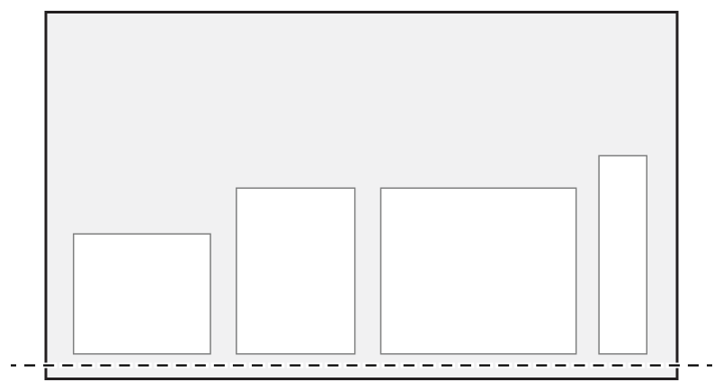

> Navigation: [Technologies](../../../technologies.md) · [UIKit](../../../uikit.md) · [UIStackView](../../uistackview.md) · [Alignment](../alignment-swift.enum.md)

# bottom

<sub>Type Property</sub>

A layout for horizontal stacks where the stack view aligns the bottom edge of its arranged views along its bottom edge.

<sub>iOS, iPadOS, Mac Catalyst, tvOS, visionOS</sub>

```swift
static var bottom: UIStackView.Alignment { get }
```

## Discussion

This value is equivalent to the [UIStackViewAlignmentTrailing](trailing.md) alignment for vertical stacks.

The following image shows an example of a horizontal stack view that uses the [UIStackViewAlignmentBottom](bottom.md) alignment.



## See Also

### Constants

- [UIStackViewAlignmentFill](fill.md) — A layout where the stack view resizes its arranged views so that they fill the available space perpendicular to the stack view’s axis.
- [UIStackViewAlignmentCenter](center.md) — A layout where the stack view aligns the center of its arranged views with its center along its axis.
- [UIStackViewAlignmentLeading](leading.md) — A layout for vertical stacks where the stack view aligns the leading edge of its arranged views along its leading edge.
- [UIStackViewAlignmentTrailing](trailing.md) — A layout for vertical stacks where the stack view aligns the trailing edge of its arranged views along its trailing edge.
- [UIStackViewAlignmentTop](top.md) — A layout for horizontal stacks where the stack view aligns the top edge of its arranged views along its top edge.
- [UIStackViewAlignmentFirstBaseline](firstbaseline.md) — A layout for horizontal stacks where the stack view aligns its arranged views based on their first baseline.
- [UIStackViewAlignmentLastBaseline](lastbaseline.md) — A layout for horizontal stacks where the stack view aligns its arranged views based on their last baseline.
