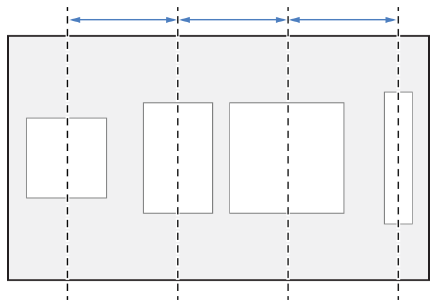

> Navigation: [Technologies](../../../technologies.md) · [UIKit](../../../uikit.md) · [UIStackView](../../uistackview.md) · [Distribution](../distribution-swift.enum.md)

# UIStackView.Distribution.equalCentering

<sub>Case</sub>

A layout that attempts to position the arranged views with equal center-to-center spacing along the stack view’s axis, while maintaining the spacing property’s distance between views.

<sub>iOS, iPadOS, Mac Catalyst, tvOS, visionOS</sub>

```swift
case equalCentering
```

## Discussion

If the arranged views don’t fit within the stack view, it shrinks the spacing until it reaches the minimum spacing defined by its [spacing](../spacing.md) property. If the views still don’t fit, the stack view shrinks the arranged views according to their compression resistance priority. If there’s any ambiguity, the stack view shrinks the views based on their index in the [arrangedSubviews](../arrangedsubviews.md) array.

The following image shows an example of a horizontal stack view that uses the [UIStackViewDistributionEqualSpacing](equalspacing.md) distribution.



<sub>A horizontal stack view with four arranged subviews. The stack view spaces the arranged views with equal center-to-center spacing along the stack view’s axis.</sub>

> [!note] Note
> The stack view maintains the intrinsic content size of its arranged views at the expense of the center-to-center spacing. Similarly, it maintains the minimum spacing between views at the expense of the view’s intrinsic content size.

## See Also

### Constants

- [UIStackViewDistributionFill](fill.md) — A layout where the stack view resizes its arranged views so that they fill the available space along the stack view’s axis.
- [UIStackViewDistributionFillEqually](fillequally.md) — A layout where the stack view resizes all arranged views to the same size, filling the available space along the stack view’s axis.
- [UIStackViewDistributionFillProportionally](fillproportionally.md) — A layout where the stack view resizes views proportionally based on their intrinsic content size to fill the available space along the stack view’s axis.
- [UIStackViewDistributionEqualSpacing](equalspacing.md) — A layout where the stack view maintains equal spacing between adjacent views while preserving their intrinsic content size.
