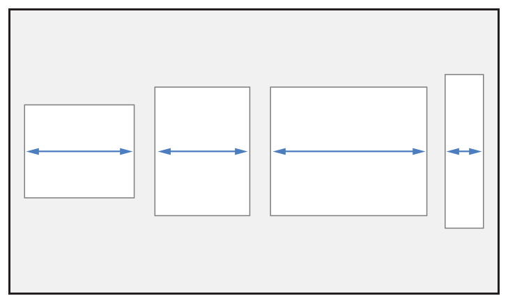

> Navigation: [Technologies](../../../technologies.md) · [UIKit](../../../uikit.md) · [UIStackView](../../uistackview.md) · [Distribution](../distribution-swift.enum.md)

# UIStackView.Distribution.fillProportionally

<sub>Case</sub>

A layout where the stack view resizes views proportionally based on their intrinsic content size to fill the available space along the stack view’s axis.

<sub>iOS, iPadOS, Mac Catalyst, tvOS, visionOS</sub>

```swift
case fillProportionally
```

## Discussion

The following image shows an example of a horizontal stack view that uses the [UIStackViewDistributionFillProportionally](fillproportionally.md) distribution.



<sub>A horizontal stack view with four arranged subviews. The stack view resizes the width of the arranged views so that they fill the available space along the stack view’s axis, with the views varying in size.</sub>

## See Also

### Constants

- [UIStackViewDistributionFill](fill.md) — A layout where the stack view resizes its arranged views so that they fill the available space along the stack view’s axis.
- [UIStackViewDistributionFillEqually](fillequally.md) — A layout where the stack view resizes all arranged views to the same size, filling the available space along the stack view’s axis.
- [UIStackViewDistributionEqualSpacing](equalspacing.md) — A layout where the stack view maintains equal spacing between adjacent views while preserving their intrinsic content size.
- [UIStackViewDistributionEqualCentering](equalcentering.md) — A layout that attempts to position the arranged views with equal center-to-center spacing along the stack view’s axis, while maintaining the spacing property’s distance between views.
