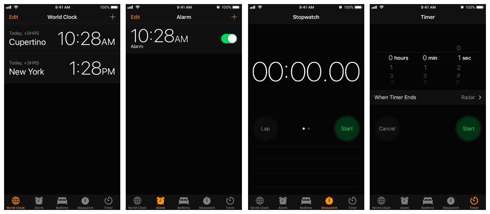
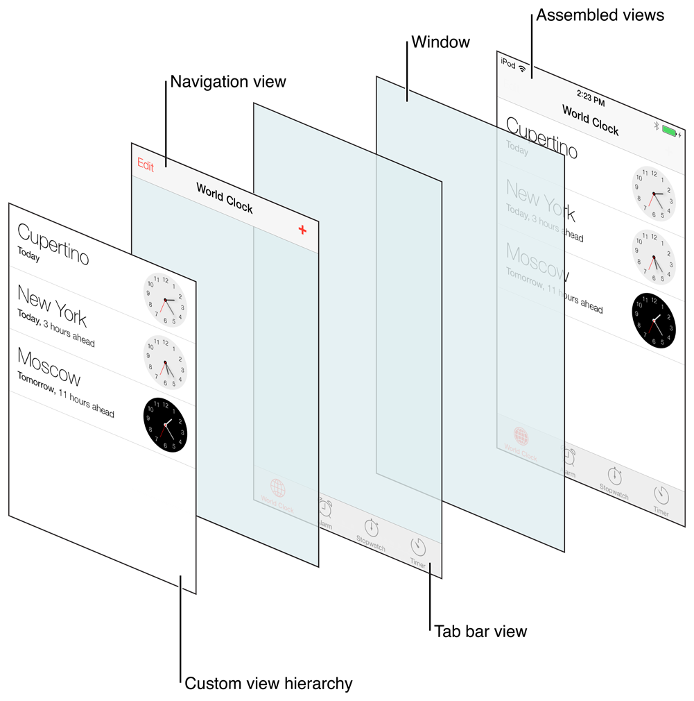

> Navigation: [Technologies](../technologies.md) · [UIKit](../uikit.md)

# UITabBarController

<sub>Class</sub>

A container view controller that manages a multiselection interface, where the selection determines which child view controller to display.

<sub>iOS, iPadOS, Mac Catalyst, tvOS, visionOS</sub>

```swift
@MainActor class UITabBarController
```

## Overview

The tab bar interface displays tabs at the bottom of the window for selecting between the different modes and for displaying the views for that mode. This class is generally used as-is, but may also be subclassed.

Each tab of a tab bar controller interface is associated with a custom view controller. When the user selects a specific tab, the tab bar controller displays the root view of the corresponding view controller, replacing any previous views. (User taps always display the root view of the tab, regardless of which tab was previously selected. This is true even if the tab was already selected.) Because selecting a tab replaces the contents of the interface, the type of interface managed in each tab need not be similar in any way. In fact, tab bar interfaces are commonly used either to present different types of information or to present the same information using a completely different style of interface. The following image shows the tab bar interface presented by the Clock app, each tab of which presents a type of time based information.



You should never access the tab bar view of a tab bar controller directly. To configure the tabs of a tab bar controller, you assign the view controllers that provide the root view for each tab to the [viewControllers](uitabbarcontroller/viewcontrollers.md) property. The order in which you specify the view controllers determines the order in which they appear in the tab bar. When setting this property, you should also assign a value to the [selectedViewController](uitabbarcontroller/selectedviewcontroller.md) property to indicate which view controller is selected initially. (You can also select view controllers by array index using the [selectedIndex](uitabbarcontroller/selectedindex.md) property.) When you embed the tab bar controller’s view (obtained using the inherited [view](uiviewcontroller/view.md) property) in your app window, the tab bar controller automatically selects that view controller and displays its contents, resizing them as needed to fit the tab bar interface.

Tab bar items are configured through their corresponding view controller. To associate a tab bar item with a view controller, create a new instance of the [UITabBarItem](uitabbaritem.md) class, configure it appropriately for the view controller, and assign it to the view controller’s [tabBarItem](uiviewcontroller/tabbaritem.md) property. If you don’t provide a custom tab bar item for your view controller, the view controller creates a default item containing no image and the text from the view controller’s [title](uiviewcontroller/title.md) property.

As the user interacts with a tab bar interface, the tab bar controller object sends notifications about the interactions to its delegate. The delegate can be any object you specify but must conform to the [UITabBarControllerDelegate](uitabbarcontrollerdelegate.md) protocol. You can use the delegate to prevent specific tab bar items from being selected and to perform additional tasks when tabs are selected. You can also use the delegate to monitor changes to the tab bar that are made by the More navigation controller, which is described in more detail in [The More navigation controller](uitabbarcontroller.md#The-More-navigation-controller).

### The views of a tab bar controller

Because the [UITabBarController](uitabbarcontroller.md) class inherits from the [UIViewController](uiviewcontroller.md) class, tab bar controllers have their own view that’s accessible through the [view](uiviewcontroller/view.md) property. The view for a tab bar controller is just a container for a tab bar view and the view containing your custom content. The tab bar view provides the selection controls for the user and consists of one or more tab bar items. The following image shows how these views are assembled to present the overall tab bar interface. Although the items in the tab bar and toolbar views can change, the views that manage them don’t. Only the custom content view changes to reflect the view controller for the currently selected tab.



You can use navigation controllers or custom view controllers as the root view controller for a tab. If the root view controller is a navigation controller, the tab bar controller makes further adjustments to the size of the displayed navigation content so that it doesn’t overlap the tab bar. Any views you display in a tab bar interface should therefore have their [autoresizingMask](uiview/autoresizingmask-swift.property.md) property set to resize the view appropriately under any conditions.

### The More navigation controller

The tab bar has limited space for displaying your custom items. If you add six or more custom view controllers to a tab bar controller, the tab bar controller displays only the first four items plus the standard More item on the tab bar. Tapping the More item brings up a standard interface for selecting the remaining items.

The interface for the standard More item includes an Edit button that allows the user to reconfigure the tab bar. By default, the user is allowed to rearrange all items on the tab bar. If you do not want the user to modify some items, though, you can remove the appropriate view controllers from the array in the [customizableViewControllers](uitabbarcontroller/customizableviewcontrollers.md) property.

> [!note] Note
> Tab bar customization and the More interface are not available in tvOS.

### State preservation

When you assign a value to this view controller’s [restorationIdentifier](uiviewcontroller/restorationidentifier.md) property, it preserves a reference to the view controller in the selected tab. At restore time, it uses the reference to select the tab with the same view controller.

When preserving a tab bar controller, assign unique restoration identifiers to the child view controllers you want to preserve. Omitting a restoration identifier from a child view controller causes that tab to return to its default configuration. Although the tab bar controller saves its tabs in the same order that they are listed in the [viewControllers](uitabbarcontroller/viewcontrollers.md) property, the save order is actually irrelevant. Your code is responsible for providing the new tab bar controller during the next launch cycle, so your code can adjust the order of the tabs as needed. The state preservation system restores the contents of each tab based on the assigned restoration identifier, not based on the position of the tab.

For more information about how state preservation and restoration works, see [App Programming Guide for iOS](https://developer.apple.com/library/archive/documentation/iPhone/Conceptual/iPhoneOSProgrammingGuide/Introduction/Introduction.html#//apple_ref/doc/uid/TP40007072).

### Differences between iOS and tvOS

Tab bar controllers serve the same purpose in tvOS as in iOS, but provide slightly different user interface features:

- In tvOS, the tab bar interface appears at the top of the window. When focus leaves the tab bar, the tab bar remains fixed at the top of the screen by default. To create an interface where the tab bar doesn’t remain fixed, but instead scrolls with the content, set the [tabBarObservedScrollView](uiviewcontroller/tabbarobservedscrollview.md) property to the appropriate scroll view. In iOS, the tab bar always stays pinned at the bottom of the screen.
- In tvOS, swiping down from the tab bar moves focus into the content view; specifically, to the first focusable view that’s visually below the selected tab. Swiping down behaves like a normal focus-changing gesture — that is, focus moves in the direction the user swiped. If nothing is focusable immediately below the selected tab, the closest focusable view is focused instead. In iOS, the tab bar always remains in focus at the bottom of the screen.
- In tvOS, pressing the Select button while a tab is focused moves focus into the content view. Because there’s no direction associated with this change, focus moves to the most appropriate view specified in the content view’s [preferredFocusEnvironments](uifocusenvironment/preferredfocusenvironments.md) property. In iOS, there’s no notion of focusing between views.
- Tab bar controllers in tvOS don’t support customization. A tab bar controller displays only the number of view controllers from its [viewControllers](uitabbarcontroller/viewcontrollers.md) array that fit on the screen, and doesn’t provide the More interface seen in iOS.

## Relationships

- **Inherits From**: [UIViewController](uiviewcontroller.md)

- **Conforms To**: [CVarArg](../swift/cvararg.md), [CustomDebugStringConvertible](../swift/customdebugstringconvertible.md), [CustomStringConvertible](../swift/customstringconvertible.md), [Equatable](../swift/equatable.md), [Hashable](../swift/hashable.md), [NSCoding](../foundation/nscoding.md), [NSExtensionRequestHandling](../foundation/nsextensionrequesthandling.md), [NSObjectProtocol](../objectivec/nsobjectprotocol.md), [NSTouchBarProvider](../appkit/nstouchbarprovider.md), [Sendable](../swift/sendable.md), [SendableMetatype](../swift/sendablemetatype.md), [UIActivityItemsConfigurationProviding](uiactivityitemsconfigurationproviding.md), [UIAppearanceContainer](uiappearancecontainer.md), [UIContentContainer](uicontentcontainer.md), [UIFocusEnvironment](uifocusenvironment.md), [UIPasteConfigurationSupporting](uipasteconfigurationsupporting.md), [UIResponderStandardEditActions](uiresponderstandardeditactions.md), [UIStateRestoring](uistaterestoring.md), [UITabBarDelegate](uitabbardelegate.md), [UITraitChangeObservable](uitraitchangeobservable-67e94.md), [UITraitEnvironment](uitraitenvironment.md), [UIUserActivityRestoring](uiuseractivityrestoring.md)

## Topics

### Creating tab bar controllers

- [- initWithTabs:](<uitabbarcontroller/init(tabs_).md>) — Creates a tab bar controller with the specified tabs.

### Assigning tabs

- [tabs](uitabbarcontroller/tabs.md) — An array of tabs that the tab bar displays.
- [- setTabs:animated:](<uitabbarcontroller/settabs(__animated_).md>) — Sets the root tabs of the tab bar controller, with an option to animate the change.
- [- performBatchUpdates:](<uitabbarcontroller/performbatchupdates(__).md>) — Animates multiple tab changes as a single update. _(beta)_

### Supporting the sidebar

- [mode](uitabbarcontroller/mode-swift.property.md) — The display mode for a tab bar.
- [Mode](uitabbarcontroller/mode-swift.enum.md) — A tab bar’s display mode.
- [sidebar](uitabbarcontroller/sidebar-swift.property.md) — A tab bar’s corresponding sidebar.
- [Sidebar](uitabbarcontroller/sidebar-swift.class.md) — An object for managing and configuring the sidebar.
- [UITabSidebarItem](uitabsidebaritem.md)
- [Request](uitabsidebaritem/request.md)
- [Animating](uitabbarcontroller/sidebar-swift.class/animating.md)

### Adapting to the tab bar layout

- [contentLayoutGuide](uitabbarcontroller/contentlayoutguide.md) — The content layout guide provides the layout area for the UITabBarController unobscured by the tab bar or sidebar.

### Customizing the tab bar behavior

- [delegate](uitabbarcontroller/delegate.md) — The tab bar controller’s delegate object.
- [UITabBarControllerDelegate](uitabbarcontrollerdelegate.md) — A set of methods you implement to customize the behavior of a tab bar.
- [tabBarMinimizeBehavior](uitabbarcontroller/tabbarminimizebehavior.md) — Defines the minimize behavior for the tab bar, if it is supported.
- [MinimizeBehavior](uitabbarcontroller/minimizebehavior.md)

### Customizing the tab bar appearance

- [tabBarHidden](uitabbarcontroller/istabbarhidden.md) — Determines if the active tab bar is currently hidden.
- [- setTabBarHidden:animated:](<uitabbarcontroller/settabbarhidden(__animated_).md>) — Changes the active tab bar’s visibility with an option to animate the change.
- [bottomAccessory](uitabbarcontroller/bottomaccessory.md) — An optional bottom accessory of the tab bar controller.
- [- setBottomAccessory:animated:](<uitabbarcontroller/setbottomaccessory(__animated_).md>) — Sets a bottom accessory with an option to animate the change.
- [compactTabIdentifiers](uitabbarcontroller/compacttabidentifiers.md) — An optional filter to display only select root-level tabs when in a compact appearance.
- [customizationIdentifier](uitabbarcontroller/customizationidentifier.md) — The customization identifier for the tab bar and sidebar for persistence.
- [prominentTabIdentifier](uitabbarcontroller/prominenttabidentifier.md) — The identifier of the tab that should be displayed as prominent. Where supported, the specified tab receives enhanced visual emphasis in the tab bar. If this property is nil, and there is a `UISearchTab` that could become prominent (when `automaticallyActivatesSearch = true`), then the search tab will receive the prominent treatment by default. _(beta)_
- [- setProminentTabIdentifier:animated:](<uitabbarcontroller/setprominenttabidentifier(__animated_).md>) — Sets the prominent tab identifier with an option to animate the change. _(beta)_

### Accessing the tab bar controller properties

- [tabBar](uitabbarcontroller/tabbar.md) — The tab bar view associated with this controller.
- [- tabForIdentifier:](<uitabbarcontroller/tab(foridentifier_).md>) — Returns the `tab` matching the specified `identifier` in the tab bar controller’s tabs. Returns nil if no tab is found matching the `identifier`.

### Managing the view controllers

- [viewControllers](uitabbarcontroller/viewcontrollers.md) — An array of the root view controllers displayed by the tab bar interface.
- [- setViewControllers:animated:](<uitabbarcontroller/setviewcontrollers(__animated_).md>) — Sets the root view controllers of the tab bar controller.
- [customizableViewControllers](uitabbarcontroller/customizableviewcontrollers.md) — The subset of view controllers managed by this tab bar controller that can be customized.
- [moreNavigationController](uitabbarcontroller/morenavigationcontroller.md) — The view controller that manages the More navigation interface.

### Managing the selected tab

- [selectedTab](uitabbarcontroller/selectedtab.md) — The currently selected tab, which can be a root tab or any of their descendants.
- [selectedViewController](uitabbarcontroller/selectedviewcontroller.md) — The view controller associated with the currently selected tab item.
- [selectedIndex](uitabbarcontroller/selectedindex.md) — The index of the view controller associated with the currently selected tab item.

## See Also

### Container view controllers

- [Creating a custom container view controller](creating-a-custom-container-view-controller.md) — Create a composite interface by combining content from one or more view controllers with other custom views.
- [UISplitViewController](uisplitviewcontroller.md) — A container view controller that implements a hierarchical interface.
- [UINavigationController](uinavigationcontroller.md) — A container view controller that defines a stack-based scheme for navigating hierarchical content.
- [UINavigationBar](uinavigationbar.md) — Navigational controls that display in a bar along the top of the screen, usually in conjunction with a navigation controller.
- [UINavigationItem](uinavigationitem.md) — The items that a navigation bar displays when the associated view controller is visible.
- [UITabBar](uitabbar.md) — A control that displays one or more buttons in a tab bar for selecting between different subtasks, views, or modes in an app.
- [UITabBarItem](uitabbaritem.md) — An object that describes an item in a tab bar.
- [UITab](uitab.md) — An object that manages a tab in a tab bar.
- [UITabAccessory](uitabaccessory.md)
- [UISearchTab](uisearchtab.md) — A tab subclass that represents the system’s search tab.
- [UITabGroup](uitabgroup.md) — An object that manages a collection of tab objects.
- [UIPageViewController](uipageviewcontroller.md) — A container view controller that manages navigation between pages of content, where a subview controller manages each page.
