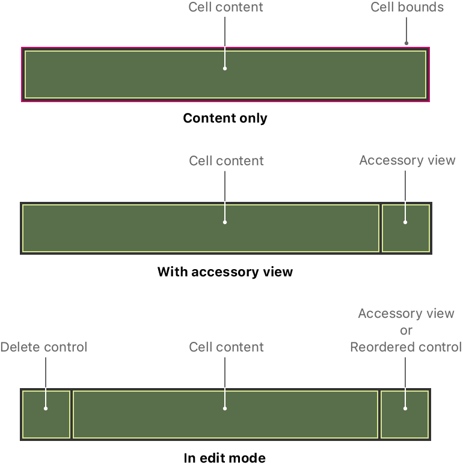

> Navigation: [Technologies](../technologies.md) · [UIKit](../uikit.md)

# UITableViewCell

<sub>Class</sub>

The visual representation of a single row in a table view.

<sub>iOS, iPadOS, Mac Catalyst, tvOS, visionOS</sub>

```swift
@MainActor class UITableViewCell
```

## Overview

A [UITableViewCell](uitableviewcell.md) object is a specialized type of view that manages the content of a single table row. You use cells primarily to organize and present your app’s custom content, but [UITableViewCell](uitableviewcell.md) provides some specific customizations to support table-related behaviors, including:

- Applying a selection or highlight color to the cell
- Adding standard accessory views, such as a detail or disclosure control
- Putting the cell into an editable state
- Indenting the cell’s content to create a visual hierarchy in your table

Your app’s content occupies most of the cell’s bounds, but the cell may adjust that space to make room for other content. Cells display accessory views on the trailing edge of their content area. When you put your table into edit mode, the cell adds a delete control to the leading edge of its content area, and optionally swaps out an accessory view for a reorder control.



<sub>Illustration showing the area of a cell by itself and with an accessory view and edit control. The content area of a cell shrinks as needed to accommodate the accessory view or edit controls.</sub>

Every table view must have at least one type of cell for displaying content, and tables may have multiple cell types to display different types of content. Your table’s data source object handles the creation and configuration of cells immediately before they appear onscreen. For information about how to create your table’s cells, see [Filling a table with data](filling-a-table-with-data.md).

### Configure your cell’s content

Configure the content and layout of your cells in your storyboard file. Tables have one cell type by default, but you can add more by changing the value in the table’s Prototype Cells attribute. In addition to configuring the cell’s content, make sure you configure the following attributes:

- Identifier. Use this identifier (also known as a reuse identifier) to create the cell.
- Style. Choose one of the standard types or define a custom cell.
- Class. Specify a [UITableViewCell](uitableviewcell.md) subclass with your custom behavior.

To configure the content and appearance of your cell, you can set its [contentConfiguration](uitableviewcell/contentconfiguration-9ktox.md) and [backgroundConfiguration](uitableviewcell/backgroundconfiguration-24e8e.md).

## Relationships

- **Inherits From**: [UIView](uiview.md)

- **Conforms To**: [CALayerDelegate](../quartzcore/calayerdelegate.md), [CLBodyIdentifiable](../corelocation/clbodyidentifiable.md), [CMBodyIdentifiable](../coremotion/cmbodyidentifiable.md), [CVarArg](../swift/cvararg.md), [CustomDebugStringConvertible](../swift/customdebugstringconvertible.md), [CustomStringConvertible](../swift/customstringconvertible.md), [Equatable](../swift/equatable.md), [Hashable](../swift/hashable.md), [NSCoding](../foundation/nscoding.md), [NSObjectProtocol](../objectivec/nsobjectprotocol.md), [NSTouchBarProvider](../appkit/nstouchbarprovider.md), [Sendable](../swift/sendable.md), [SendableMetatype](../swift/sendablemetatype.md), [UIAccessibilityIdentification](uiaccessibilityidentification.md), [UIActivityItemsConfigurationProviding](uiactivityitemsconfigurationproviding.md), [UIAppearance](uiappearance.md), [UIAppearanceContainer](uiappearancecontainer.md), [UICoordinateSpace](uicoordinatespace.md), [UIDynamicItem](uidynamicitem.md), [UIFocusEnvironment](uifocusenvironment.md), [UIFocusItem](uifocusitem.md), [UIFocusItemContainer](uifocusitemcontainer.md), [UIGestureRecognizerDelegate](uigesturerecognizerdelegate.md), [UILargeContentViewerItem](uilargecontentvieweritem.md), [UIPasteConfigurationSupporting](uipasteconfigurationsupporting.md), [UIPopoverPresentationControllerSourceItem](uipopoverpresentationcontrollersourceitem.md), [UIResponderStandardEditActions](uiresponderstandardeditactions.md), [UITraitChangeObservable](uitraitchangeobservable-67e94.md), [UITraitEnvironment](uitraitenvironment.md), [UIUserActivityRestoring](uiuseractivityrestoring.md)

## Topics

### Creating a table view cell

- [- initWithStyle:reuseIdentifier:](<uitableviewcell/init(style_reuseidentifier_).md>) — Initializes a table cell with a style and a reuse identifier and returns it to the caller.
- [CellStyle](uitableviewcell/cellstyle.md) — An enumeration for the various styles of cells.
- [- initWithCoder:](<uitableviewcell/init(coder_).md>) — Creates a table view from data in an unarchiver.

### Reusing cells

- [reuseIdentifier](uitableviewcell/reuseidentifier.md) — A string for identifying a reusable cell.
- [- prepareForReuse](<uitableviewcell/prepareforreuse().md>) — Prepares a reusable cell for reuse by the table view’s delegate.

### Configuring the background

- [defaultBackgroundConfiguration()](<uitableviewcell/defaultbackgroundconfiguration().md>) — Retrieves a background configuration with system default values.
- [backgroundConfiguration](uitableviewcell/backgroundconfiguration-24e8e.md) — The current background configuration of the cell.
- [automaticallyUpdatesBackgroundConfiguration](uitableviewcell/automaticallyupdatesbackgroundconfiguration.md) — A Boolean value that determines whether the cell automatically updates its background configuration when its state changes.
- [backgroundView](uitableviewcell/backgroundview.md) — The view to use as the background of the cell.
- [selectedBackgroundView](uitableviewcell/selectedbackgroundview.md) — The view to use as the background for a selected cell.
- [multipleSelectionBackgroundView](uitableviewcell/multipleselectionbackgroundview.md) — The background view to use for a selected cell when the table view allows multiple row selections.

### Managing the content

- [defaultContentConfiguration()](<uitableviewcell/defaultcontentconfiguration().md>) — Retrieves a default list content configuration for the cell’s style.
- [contentConfiguration](uitableviewcell/contentconfiguration-9ktox.md) — The current content configuration of the cell.
- [automaticallyUpdatesContentConfiguration](uitableviewcell/automaticallyupdatescontentconfiguration.md) — A Boolean value that determines whether the cell automatically updates its content configuration when its state changes.
- [contentView](uitableviewcell/contentview.md) — The content view of the cell object.

### Managing the state

- [configurationState](uitableviewcell/configurationstate-4xwj0.md) — The current configuration state of the cell.
- [- setNeedsUpdateConfiguration](<uitableviewcell/setneedsupdateconfiguration().md>) — Informs the cell to update its configuration for its current state.
- [updateConfiguration(using:)](<uitableviewcell/updateconfiguration(using_).md>) — Updates the cell’s configuration using the current state.
- [configurationUpdateHandler](uitableviewcell/configurationupdatehandler-974.md) — A block for handling updates to the cell’s configuration using the current state.
- [ConfigurationUpdateHandler](uitableviewcell/configurationupdatehandler-swift.typealias.md) — The type of block for handling updates to the cell’s configuration using the current state.

### Managing accessory views

- [accessoryType](uitableviewcell/accessorytype-swift.property.md) — The type of standard accessory view for the cell to use in the table view’s normal state.
- [accessoryView](uitableviewcell/accessoryview.md) — The view to use on the right side of the cell, typically as a control, in the table view’s normal state.
- [editingAccessoryType](uitableviewcell/editingaccessorytype.md) — The type of standard accessory view for the cell to use in the table view’s editing state.
- [editingAccessoryView](uitableviewcell/editingaccessoryview.md) — The view to use on the right side of the cell, typically as a control, in the table view’s editing state.
- [AccessoryType](uitableviewcell/accessorytype-swift.enum.md) — The type of standard accessory control used by a cell.

### Managing cell selection and highlighting

- [selectionStyle](uitableviewcell/selectionstyle-swift.property.md) — The style of selection for a cell.
- [SelectionStyle](uitableviewcell/selectionstyle-swift.enum.md) — The style of selected cells.
- [selected](uitableviewcell/isselected.md) — A Boolean value that indicates whether the cell is selected.
- [- setSelected:animated:](<uitableviewcell/setselected(__animated_).md>) — Sets the selected state of the cell, optionally animating the transition between states.
- [highlighted](uitableviewcell/ishighlighted.md) — A Boolean value that indicates whether the cell is highlighted.
- [- setHighlighted:animated:](<uitableviewcell/sethighlighted(__animated_).md>) — Sets the highlighted state of the cell, optionally animating the transition between states.

### Editing the cell

- [editing](uitableviewcell/isediting.md) — A Boolean value that indicates whether the cell is in an editable state.
- [- setEditing:animated:](<uitableviewcell/setediting(__animated_).md>) — Toggles the cell into and out of editing mode.
- [editingStyle](uitableviewcell/editingstyle-swift.property.md) — The editing style of the cell.
- [EditingStyle](uitableviewcell/editingstyle-swift.enum.md) — The editing control used by a cell.
- [showingDeleteConfirmation](uitableviewcell/showingdeleteconfirmation.md) — A Boolean value that indicates whether the cell is currently showing the delete-confirmation button.
- [showsReorderControl](uitableviewcell/showsreordercontrol.md) — A Boolean value that determines whether the cell shows the reordering control.

### Dragging the row

- [userInteractionEnabledWhileDragging](uitableviewcell/userinteractionenabledwhiledragging.md) — A Boolean value indicating whether users can interact with a cell while it is being dragged.
- [- dragStateDidChange:](<uitableviewcell/dragstatedidchange(__).md>) — Notifies the cell that its drag status changed.
- [DragState](uitableviewcell/dragstate.md) — Constants indicating the current state of a row involved in a drag operation.

### Adjusting to state transitions

- [- willTransitionToState:](<uitableviewcell/willtransition(to_).md>) — Notifies the cell that it’s about to transition to a new cell state.
- [- didTransitionToState:](<uitableviewcell/didtransition(to_).md>) — Notifies the cell that it transitioned to a new cell state.
- [StateMask](uitableviewcell/statemask.md) — Constants used to determine the new state of a cell as it transitions between states.

### Managing content indentation

- [indentationLevel](uitableviewcell/indentationlevel.md) — The indentation level of the cell’s content.
- [indentationWidth](uitableviewcell/indentationwidth.md) — The width for each level of indentation of a cell’s content.
- [shouldIndentWhileEditing](uitableviewcell/shouldindentwhileediting.md) — A Boolean value that controls whether the cell background is indented when the table view is in editing mode.
- [separatorInset](uitableviewcell/separatorinset.md) — The inset values for the separator line drawn beneath the cell.
- [SeparatorStyle](uitableviewcell/separatorstyle.md) — The style for cells to use as separators.

### Managing focus

- [focusStyle](uitableviewcell/focusstyle-swift.property.md) — The appearance of the cell when focused.
- [FocusStyle](uitableviewcell/focusstyle-swift.enum.md) — The style of focused cells.

### Deprecated

- [textLabel](uitableviewcell/textlabel.md) — The label to use for the main textual content of the table cell. _(deprecated)_
- [detailTextLabel](uitableviewcell/detailtextlabel.md) — The secondary label of the table cell, if one exists. _(deprecated)_
- [imageView](uitableviewcell/imageview.md) — The image view of the table cell. _(deprecated)_

## See Also

### Cells, headers, and footers

- [Configuring the cells for your table](configuring-the-cells-for-your-table.md) — Specify the appearance and content of your table’s rows by defining one or more prototype cells in your storyboard.
- [Creating self-sizing table view cells](creating-self-sizing-table-view-cells.md) — Create table view cells that support Dynamic Type and use system spacing constraints to adjust the spacing surrounding text labels.
- [Adding headers and footers to table sections](adding-headers-and-footers-to-table-sections.md) — Differentiate groups of rows visually by adding header and footer views to your table view’s sections.
- [UITableViewHeaderFooterView](uitableviewheaderfooterview.md) — A reusable view that you place at the top or bottom of a table section to display additional information for that section.
