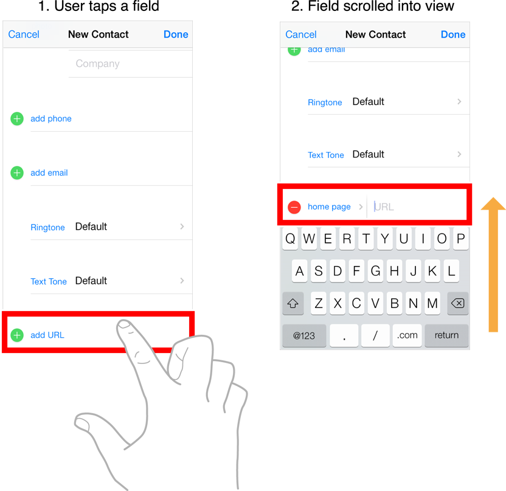

> Navigation: [Technologies](../technologies.md) · [UIKit](../uikit.md)

# UITextField

<sub>Class</sub>

An object that displays an editable text area in your interface.

<sub>iOS, iPadOS, Mac Catalyst, tvOS, visionOS</sub>

```swift
@MainActor class UITextField
```

## Overview

You use text fields to gather text-based input from the user using the onscreen keyboard. The keyboard is configurable for many different types of input such as plain text, emails, numbers, and so on. Text fields use the target-action mechanism and a delegate object to report changes made during the course of editing.

In addition to its basic text-editing behavior, you can add overlay views to a text field to display additional information and provide additional tappable controls. You might add custom overlay views for elements such as a bookmarks button or search icon. Text fields provide a built-in overlay view to clear the current text. The use of custom overlay views is optional.


After adding a text field to your interface, you configure it for use in your app. Configuration involves performing some or all of the following tasks:

- Configure one or more targets and actions for the text field.
- Configure the keyboard-related attributes of the text field.
- Assign a delegate object to handle important tasks, such as:

    - Determining whether the user should be allowed to edit the text field’s contents.
    - Validating the text entered by the user.
    - Responding to taps in the keyboard’s return button.
    - Forwarding the user-entered text to other parts of your app.
    - Store a reference to the text field in one of your controller objects.

For information about the methods of the text field’s delegate object, see [UITextFieldDelegate](uitextfielddelegate.md).

### Show and hide the keyboard

When a text field becomes first responder, the system automatically shows the keyboard and binds its input to the text field. A text field becomes the first responder automatically when the user taps it. You can also force a text field to become the first responder by calling its [- becomeFirstResponder](<uiresponder/becomefirstresponder().md>) method. You might force a text field to become first responder when you require the user to enter some information.

> [!note] Note
> The appearance of the keyboard has the potential to obscure portions of your user interface. You should update your interface as needed to ensure that the text field being edited is visible. Use the keyboard notifications to detect the appearance and disappearance of the keyboard and to make necessary changes to your interface. For more information, see [Respond to keyboard-related notifications](uitextfield.md#Respond-to-keyboard-related-notifications).

You can ask the system to dismiss the keyboard by calling the [- resignFirstResponder](<uiresponder/resignfirstresponder().md>) method of your text field. Usually, you dismiss the keyboard in response to specific interactions. For example, you might dismiss the keyboard when the user taps the keyboard’s return key. The system can also dismiss the keyboard in response to user actions. Specifically, the system dismisses the keyboard when the user taps a new control that doesn’t support keyboard input.

The appearance and dismissal of the keyboard affect the editing state of the text field. When the keyboard appears, the text field enters the editing state and sends the appropriate notifications to its delegate. Similarly, when the text field resigns the first responder status, it leaves the editing state and notifies its delegate. For more information about the sequence of events that occur during editing, see [Validate text and manage the editing process](uitextfield.md#Validate-text-and-manage-the-editing-process).

#### Configure the keyboard’s appearance

You customize your text field’s keyboard using the properties of the [UITextInputTraits](uitextinputtraits.md) protocol, which the [UITextField](uitextfield.md) class adopts. UIKit supports standard keyboards for the user’s current language and also supports specialized keyboards for entering numbers, URLs, email addresses, and other specific types of information. You use the properties of this protocol to adjust keyboard traits such as the following:

- The type of keyboard to display
- The autocapitalization behavior of the keyboard
- The autocorrection behavior of the keyboard
- The type of return key to display

#### Respond to keyboard-related notifications

Because the system manages the showing and hiding of the keyboard in response to responder changes, it posts the following notifications for tracking the keyboard-related changes:

- [UIKeyboardWillShowNotification](uiresponder/keyboardwillshownotification.md)
- [UIKeyboardDidShowNotification](uiresponder/keyboarddidshownotification.md)
- [UIKeyboardWillHideNotification](uiresponder/keyboardwillhidenotification.md)
- [UIKeyboardDidHideNotification](uiresponder/keyboarddidhidenotification.md)
- [UIKeyboardWillChangeFrameNotification](uiresponder/keyboardwillchangeframenotification.md)
- [UIKeyboardDidChangeFrameNotification](uiresponder/keyboarddidchangeframenotification.md)

Each notification contains a [userInfo](../foundation/nsnotification/userinfo.md) dictionary that includes the size of the keyboard. Because the keyboard can hide portions of your interface, you should use the size information to reposition your content on the screen. For content embedded in a scroll view, you can scroll the text field into view, as illustrated in the following image. In other cases, you can resize your main content view so that it isn’t covered by the keyboard.



### Format the text in a text field

There are two types of formatting you can do to a text field’s text:

- You can change the font, color, and style of the text using properties of this class. Alternatively, you can specify an [NSAttributedString](../foundation/nsattributedstring.md) for the text field’s content.
- You can format the content of a text field using an [Formatter](../foundation/formatter.md) object.

The [font](uitextfield/font.md), [textColor](uitextfield/textcolor.md), and [textAlignment](uitextfield/textalignment.md) properties, among others, affect the appearance of the text field’s string. Modifying these properties applies the specified characteristic to the entire string. To specify more granular formatting, specify the text field’s text using an [NSAttributedString](../foundation/nsattributedstring.md) object.

The [UITextField](uitextfield.md) class doesn’t provide built-in support for formatting its string using an [Formatter](../foundation/formatter.md) object, but you can use the text field’s delegate to format the content yourself. To do so, use the text field’s delegate methods to validate text and to format it appropriately. For example, use the [- textField:shouldChangeCharactersInRange:replacementString:](<uitextfielddelegate/textfield(__shouldchangecharactersin_replacementstring_).md>) method to validate and format text while the user is typing. For information about how to use formatter objects, see [Data Formatting](../foundation/data-formatting.md).

### Use overlay views to edit content

Overlay views are small views displayed on the left and right sides of the text view’s editable area. Typically, overlay views are image-based buttons that you set up as additional editing controls. For example, you might use an overlay view to implement a bookmarks button. To configure a button as an overlay view, specify an image for the button’s content and configure the target and action of the button to respond to taps.

The following code shows how to add a button as the left overlay of a text field. In this case, the code creates a button and configure its size and contents. The [leftViewMode](uitextfield/leftviewmode.md) property specifies when your button is displayed. When the user taps the button, the button calls the configured action method, which in this case is a custom `displayBookmarks:` method.

**Swift**

```swift
let overlayButton = UIButton(type: .custom)
let bookmarkImage = UIImage(systemName: "bookmark")
overlayButton.setImage(bookmarkImage, for: .normal)
overlayButton.addTarget(self, action: #selector(displayBookmarks), 
    for: .touchUpInside)
overlayButton.sizeToFit()
        
// Assign the overlay button to the text field
textField.leftView = overlayButton
textField.leftViewMode = .always
```

**Objective-C**

```objc
UIButton *overlayButton = [UIButton buttonWithType:UIButtonTypeCustom];
UIImage *bookmarkImage = [UIImage systemImageNamed:@"bookmark"];
[overlayButton setImage:bookmarkImage forState:UIControlStateNormal];
[overlayButton addTarget:self action:@selector(displayBookmarks)
        forControlEvents:UIControlEventTouchUpInside];
[overlayButton sizeToFit];

// Assign the overlay button to the text field
self.textField.leftView = overlayButton;
self.textField.leftViewMode = UITextFieldViewModeAlways;
```

When configuring overlay views, consider whether you want your text field to display the built-in clear button. The clear button provides the user with a convenient way to delete all of the text field’s text. This button is displayed in the right overlay position, but if you provide a custom right overlay view, use the [rightViewMode](uitextfield/rightviewmode.md) and [clearButtonMode](uitextfield/clearbuttonmode.md) properties to define when your custom overlay should be displayed and when the clear button should be displayed.

### Validate text and manage the editing process

A text field manages the editing of its text with the help of its delegate object. As the user interacts with a text field, the text field notifies its delegate and gives it a chance to control what is happening. You can use the delegate methods to prevent the user from starting or stopping the editing process or to validate text as it’s typed. You can also use the delegate methods to perform related tasks, such as updating other parts of your interface based on the information typed by the user.

For more information about using the text field’s delegate to manage editing interactions, see [UITextFieldDelegate](uitextfielddelegate.md).

### Interface Builder attributes

The following table lists the attributes that you configure for text fields in Interface Builder.

| Attribute | Description |
|---|---|
| Text | The initial text displayed by the text field. You can specify the text as a plain string or as an attributed string. If you specify an attributed string, Interface Builder provides different options for editing the font, color, and formatting of the string. |
| Color | The color of the text field’s text. To set this attribute programmatically, use the [textColor](uitextfield/textcolor.md) property. |
| Font | The font of the text field’s text. To set this attribute programmatically, use the [font](uitextfield/font.md) property. |
| Alignment | The alignment of the text field’s text inside the editing area. This option is available only when formatting plain strings. To set this attribute programmatically, use the [textAlignment](uitextfield/textalignment.md) property. |
| Placeholder | The placeholder text displayed by the text field. When the text field’s string is empty, the text field displays this string instead, formatting the string so as to indicate that it isn’t the actual text. Typing any text into the text field hides this string. To set this attribute programmatically, use the [placeholder](uitextfield/placeholder.md) property. |
| Background | The background image to display when the text field is enabled. This image is displayed behind the rest of the text field’s content. To set this attribute programmatically, use the [background](uitextfield/background.md) property. |
| Disabled | The background image to display when the text field is disabled. This image is displayed behind the rest of the text field’s content. To set this attribute programmatically, use the [disabledBackground](uitextfield/disabledbackground.md) property. |
| Border Style | The visual style for the text field’s border. This attribute defines the visual border, if any, drawn around the editable text region. To set this attribute programmatically, use the [borderStyle](uitextfield/borderstyle-swift.property.md) property. |
| Clear Button | The behavior of the clear button. The clear button is a built-in overlay view that the user taps to delete all of the text in a text field. Use this attribute to define when the clear button appears. To set this attribute programmatically, use the [clearButtonMode](uitextfield/clearbuttonmode.md) property. |
| Min Font Size | The minimum font size for the text field’s text. When the Adjust to Fit option is enabled, the text field automatically varies the font size to ensure maximum legibility of the text. You can use this attribute to specify the smallest font size that your consider appropriate for your text. To set this attribute programmatically, use the [minimumFontSize](uitextfield/minimumfontsize.md) property. |

The following table lists the keyboard-related attributes that you configure for text fields. This attributes correspond to properties of the [UITextInputTraits](uitextinputtraits.md) protocol that the [UITextField](uitextfield.md) class adopts.

| Attribute | Description |
|---|---|
| Capitalization | The automatic capitalization style to apply to typed text. This attribute determines at what time the Shift key is automatically pressed. You can access the value of this attribute programmatically using the text field’s [autocapitalizationType](uitextinputtraits/autocapitalizationtype.md) property. |
| Correction | The autocorrection behavior of the text field. This attribute determines whether autocorrection is enabled or disabled during typing. You can access the value of this attribute programmatically using the text field’s [autocorrectionType](uitextinputtraits/autocorrectiontype.md) property. |
| Spell Checking | The spell checking behavior of the text field. This attribute determines whether spell checking is enabled or disabled during typing. You can access the value of this attribute programmatically using the text field’s [spellCheckingType](uitextinputtraits/spellcheckingtype.md) property. |
| Keyboard Type | The style of the text field’s keyboard. This property specifies the type of keyboard displayed when the text field is active. You can access the value of this attribute programmatically using the text field’s [keyboardType](uitextinputtraits/keyboardtype.md) property. |
| Appearance | The visual style applied to the text field’s keyboard. Use this property to specify a dark or light keyboard. You can access the value of this attribute programmatically using the text field’s [keyboardAppearance](uitextinputtraits/keyboardappearance.md) property. |
| Return Key | The type of return key to display on the keyboard. Use this property to configure the text and visual style applied to the keyboard’s return key. You can access the value of this attribute programmatically using the text field’s [returnKeyType](uitextinputtraits/returnkeytype.md) property.  The return key is disabled by default and becomes enabled only when the user types some text into the text field. To respond to taps in the Return key, implement the [- textFieldShouldReturn:](<uitextfielddelegate/textfieldshouldreturn(__).md>) method in the delegate you assign to the text field. |

For information about additional attributes you can configure for a text view, see [UIControl](uicontrol.md).

### Internationalization

The default language of the device affects the keyboard that pops up with the text field (including the return key). You don’t need to do anything to enable this functionality; it’s enabled by default. However, your text field should be able to handle input that comes from any language.

When using storyboards to build your interface, use Xcode’s base internationalization feature to configure the localizations your project supports. When you add a localization, Xcode creates a strings file for that localization. When configuring your interface programmatically, use the system’s built-in support for loading localized strings and resources. For more information about internationalizing your interface, see [Localization](../xcode/localization.md).

### Accessibility

Text fields are accessible by default. The default accessibility trait for a text field is User Interaction Enabled.

For more information about making iOS controls accessible, see the accessibility information in [UIControl](uicontrol.md). For general information about making your interface accessible, see [Accessibility for UIKit](accessibility-for-uikit.md).

### State preservation

When you assign a value to a text field’s [restorationIdentifier](uiview/restorationidentifier.md) property, it preserves the selected range of text, if any. During the next launch cycle, the text field attempts to restore that selection. If the selection range can’t be applied to the current text, no selection is made.

For design guidance, see [Human Interface Guidelines](https://developer.apple.com/design/human-interface-guidelines/components/selection-and-input/text-fields/).

## Relationships

- **Inherits From**: [UIControl](uicontrol.md)

- **Inherited By**: [UISearchTextField](uisearchtextfield.md)

- **Conforms To**: [CALayerDelegate](../quartzcore/calayerdelegate.md), [CLBodyIdentifiable](../corelocation/clbodyidentifiable.md), [CMBodyIdentifiable](../coremotion/cmbodyidentifiable.md), [CVarArg](../swift/cvararg.md), [Copyable](../swift/copyable.md), [CustomDebugStringConvertible](../swift/customdebugstringconvertible.md), [CustomStringConvertible](../swift/customstringconvertible.md), [Equatable](../swift/equatable.md), [Escapable](../swift/escapable.md), [Hashable](../swift/hashable.md), [NSCoding](../foundation/nscoding.md), [NSObjectProtocol](../objectivec/nsobjectprotocol.md), [NSTouchBarProvider](../appkit/nstouchbarprovider.md), [Sendable](../swift/sendable.md), [SendableMetatype](../swift/sendablemetatype.md), [UIAccessibilityIdentification](uiaccessibilityidentification.md), [UIActivityItemsConfigurationProviding](uiactivityitemsconfigurationproviding.md), [UIAppearance](uiappearance.md), [UIAppearanceContainer](uiappearancecontainer.md), [UIContentSizeCategoryAdjusting](uicontentsizecategoryadjusting.md), [UIContextMenuInteractionDelegate](uicontextmenuinteractiondelegate.md), [UICoordinateSpace](uicoordinatespace.md), [UIDynamicItem](uidynamicitem.md), [UIFocusEnvironment](uifocusenvironment.md), [UIFocusItem](uifocusitem.md), [UIFocusItemContainer](uifocusitemcontainer.md), [UIKeyInput](uikeyinput.md), [UILargeContentViewerItem](uilargecontentvieweritem.md), [UILetterformAwareAdjusting](uiletterformawareadjusting.md), [UIPasteConfigurationSupporting](uipasteconfigurationsupporting.md), [UIPopoverPresentationControllerSourceItem](uipopoverpresentationcontrollersourceitem.md), [UIResponderStandardEditActions](uiresponderstandardeditactions.md), [UITextDraggable](uitextdraggable.md), [UITextDroppable](uitextdroppable.md), [UITextInput](uitextinput.md), [UITextInputTraits](uitextinputtraits.md), [UITextPasteConfigurationSupporting](uitextpasteconfigurationsupporting.md), [UITraitChangeObservable](uitraitchangeobservable-67e94.md), [UITraitEnvironment](uitraitenvironment.md), [UIUserActivityRestoring](uiuseractivityrestoring.md)

## Topics

### Validating and handling edits

- [delegate](uitextfield/delegate.md) — The text field’s delegate.
- [UITextFieldDelegate](uitextfielddelegate.md) — A set of optional methods to manage editing and validating text in a text field object.

### Configuring the text attributes

- [text](uitextfield/text.md) — The text that the text field displays.
- [attributedText](uitextfield/attributedtext.md) — The styled text that the text field displays.
- [placeholder](uitextfield/placeholder.md) — The string that displays when there is no other text in the text field.
- [attributedPlaceholder](uitextfield/attributedplaceholder.md) — The styled string that displays when there is no other text in the text field.
- [defaultTextAttributes](uitextfield/defaulttextattributes.md) — The default attributes to apply to the text.
- [font](uitextfield/font.md) — The font of the text.
- [textColor](uitextfield/textcolor.md) — The color of the text.
- [textAlignment](uitextfield/textalignment.md) — The technique for aligning the text.
- [typingAttributes](uitextfield/typingattributes.md) — The attributes to apply to new text that the user enters.
- [BorderStyle](uitextfield/borderstyle-swift.enum.md) — The type of border around the text field.

### Sizing the text field’s text

- [adjustsFontSizeToFitWidth](uitextfield/adjustsfontsizetofitwidth.md) — A Boolean value that indicates whether to reduce the font size to fit the text string into the text field’s bounding rectangle.
- [minimumFontSize](uitextfield/minimumfontsize.md) — The size of the smallest permissible font when drawing the text field’s text.
- [sizingRule](uiletterformawareadjusting/sizingrule.md) — The typographic bounds-sizing behavior that handles text with fonts that contain oversize characters.

### Managing the editing behavior

- [editing](uitextfield/isediting.md) — A Boolean value that indicates whether the text field is currently in edit mode.
- [clearsOnBeginEditing](uitextfield/clearsonbeginediting.md) — A Boolean value that determines whether the text field removes old text when editing begins.
- [clearsOnInsertion](uitextfield/clearsoninsertion.md) — A Boolean value that determines whether inserting text replaces the previous contents.
- [allowsEditingTextAttributes](uitextfield/allowseditingtextattributes.md) — A Boolean value that determines whether the user can edit the attributes of the text in the text field.
- [DidEndEditingReason](uitextfield/didendeditingreason.md) — Constants that indicate the reason for ending editing in a text field.
- [UITextFieldDidEndEditingReasonKey](uitextfield/didendeditingreasonuserinfokey.md) — A key that indicates the reason for ending editing in a text field.
- [UITextFieldTextDidBeginEditingNotification](uitextfield/textdidbegineditingnotification.md) — A notification that alerts observers when an editing session begins in a text field.
- [UITextFieldTextDidChangeNotification](uitextfield/textdidchangenotification.md) — A notification that alerts observers when the text in a text field changes.
- [UITextFieldTextDidEndEditingNotification](uitextfield/textdidendeditingnotification.md) — A notification that alerts observers when the editing session ends for a text field.

### Setting the view’s background appearance

- [borderStyle](uitextfield/borderstyle-swift.property.md) — The border style for the text field.
- [background](uitextfield/background.md) — The image that represents the background appearance of the text field when it is in an enabled state.
- [disabledBackground](uitextfield/disabledbackground.md) — The image that represents the background appearance of the text field when it is in a disabled state.

### Managing overlay views

- [clearButtonMode](uitextfield/clearbuttonmode.md) — A mode that controls when the standard Clear button appears in the text field.
- [leftView](uitextfield/leftview.md) — The overlay view that displays on the left (or leading) side of the text field.
- [leftViewMode](uitextfield/leftviewmode.md) — A mode that controls when the left overlay view appears in the text field.
- [rightView](uitextfield/rightview.md) — The overlay view that displays on the right (or trailing) side of the text field.
- [rightViewMode](uitextfield/rightviewmode.md) — A mode that controls when the right overlay view appears in the text field.
- [ViewMode](uitextfield/viewmode.md) — Constants that define when overlay views appear in a text field.

### Drawing and positioning overrides

- [- textRectForBounds:](<uitextfield/textrect(forbounds_).md>) — Returns the drawing rectangle for the text field’s text.
- [- drawTextInRect:](<uitextfield/drawtext(in_).md>) — Draws the text field’s text in the specified rectangle. _(deprecated)_
- [- placeholderRectForBounds:](<uitextfield/placeholderrect(forbounds_).md>) — Returns the drawing rectangle for the text field’s placeholder text.
- [- drawPlaceholderInRect:](<uitextfield/drawplaceholder(in_).md>) — Draws the text field’s placeholder text in the specified rectangle.
- [- borderRectForBounds:](<uitextfield/borderrect(forbounds_).md>) — Returns the text field’s border rectangle.
- [- editingRectForBounds:](<uitextfield/editingrect(forbounds_).md>) — Returns the rectangle for displaying editable text.
- [- clearButtonRectForBounds:](<uitextfield/clearbuttonrect(forbounds_).md>) — Returns the drawing rectangle for the built-in Clear button.
- [- leftViewRectForBounds:](<uitextfield/leftviewrect(forbounds_).md>) — Returns the drawing rectangle of the text field’s left overlay view.
- [- rightViewRectForBounds:](<uitextfield/rightviewrect(forbounds_).md>) — Returns the drawing location of the text field’s right overlay view.

### Replacing the system input views

- [inputView](uitextfield/inputview.md) — The custom input view to display when the text field becomes the first responder.
- [inputAccessoryView](uitextfield/inputaccessoryview.md) — The custom accessory view to display when the text field becomes the first responder.

### Supporting state restoration

- [interactionState](uitextfield/interactionstate.md)

### Structures

- [TextDidBeginEditingMessage](uitextfield/textdidbegineditingmessage.md)
- [TextDidChangeMessage](uitextfield/textdidchangemessage.md)
- [TextDidEndEditingMessage](uitextfield/textdidendeditingmessage.md)

## See Also

### Text views

- [UILabel](uilabel.md) — A view that displays one or more lines of informational text.
- [UITextView](uitextview.md) — A scrollable, multiline text region.
- [Drag and drop customization](drag-and-drop-customization.md) — Extend the standard drag and drop support for text views to include custom types of content.
