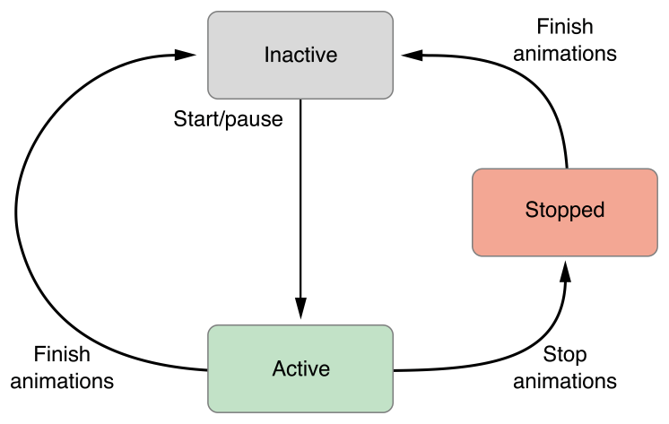

> Navigation: [Technologies](../technologies.md) · [UIKit](../uikit.md)

# UIViewAnimating

<sub>Protocol</sub>

An interface for implementing custom animator objects.

<sub>iOS, iPadOS, Mac Catalyst, tvOS, visionOS</sub>

```swift
@MainActor protocol UIViewAnimating : NSObjectProtocol
```

## Overview

The [UIViewAnimating](uiviewanimating.md) protocol defines the methods for implementing the basic flow control for animations, including the ability to start, stop, and pause animations. There are also several properties for reflecting the current state of the animation and for modifying that state while an animation is in progress.

Normally, you use the methods of this protocol to manage animations associated with a [UIViewPropertyAnimator](uiviewpropertyanimator.md) object. Specifically, you use these methods to start and stop your animations, to reverse animations, and to change the completion progress of the animation. You might also use these capabilities to implement interactive animations. You can also adopt this protocol to implement custom animator objects.

### Understand animation states

Animator objects move through a set of states during the processing of a set of animations. These states define the animator’s behavior, including how it handles changes. When implementing your own animators, you must respect these state transitions and keep the [state](uiviewanimating/state.md) property updated accurately. The following image shows the states and the state transitions that occur.



The inactive state is the animator’s initial state. Every newly created animator starts off in the inactive state. Similarly, an animator that has finished its animations returns to the inactive state. While in the inactive state, you configure the animations that you want to execute for the full duration that you specify.

When you call the [- startAnimation](<uiviewanimating/startanimation().md>) or [- pauseAnimation](<uiviewanimating/pauseanimation().md>) method, the animator moves to the active state. An animator in this state is either running its animations or is paused so that you can modify those animations. When the current animations run to their intended end, the animator returns to the inactive state so that it can be reconfigured with a new set of animations.

Calling the [- stopAnimation:](<uiviewanimating/stopanimation(__).md>) method stops any running animations and updates the properties of the corresponding views to their current in-progress values. After calling this method, the animator object moves to the stopped or inactive state and must be reconfigured before it can be used again.

## Relationships

- **Inherits From**: [NSObjectProtocol](../objectivec/nsobjectprotocol.md)

- **Inherited By**: [UIViewImplicitlyAnimating](uiviewimplicitlyanimating.md)

- **Conforming Types**: [UIViewPropertyAnimator](uiviewpropertyanimator.md)

## Topics

### Starting and stopping the animations

- [- startAnimation](<uiviewanimating/startanimation().md>) — Starts the animation from its current position.
- [- startAnimationAfterDelay:](<uiviewanimating/startanimation(afterdelay_).md>) — Starts the animation after the specified delay.
- [- pauseAnimation](<uiviewanimating/pauseanimation().md>) — Pauses a running animation at its current position.
- [- stopAnimation:](<uiviewanimating/stopanimation(__).md>) — Stops the animations at their current positions.
- [- finishAnimationAtPosition:](<uiviewanimating/finishanimation(at_).md>) — Finishes the animations and returns the animator to the inactive state.

### Getting the animator’s state

- [fractionComplete](uiviewanimating/fractioncomplete.md) — The completion percentage of the animation.
- [reversed](uiviewanimating/isreversed.md) — A Boolean value indicating whether the animation is running in the reverse direction.
- [state](uiviewanimating/state.md) — The current state of the animation.
- [running](uiviewanimating/isrunning.md) — A Boolean value indicating whether the animation is currently running.

### Constants

- [UIViewAnimatingState](uiviewanimatingstate.md) — Constants indicating the current state of the animation.
- [UIViewAnimatingPosition](uiviewanimatingposition.md) — Constants indicating positions within the animation.

## See Also

### Essentials

- [UIViewPropertyAnimator](uiviewpropertyanimator.md) — A class that animates changes to views and allows the dynamic modification of those animations.
