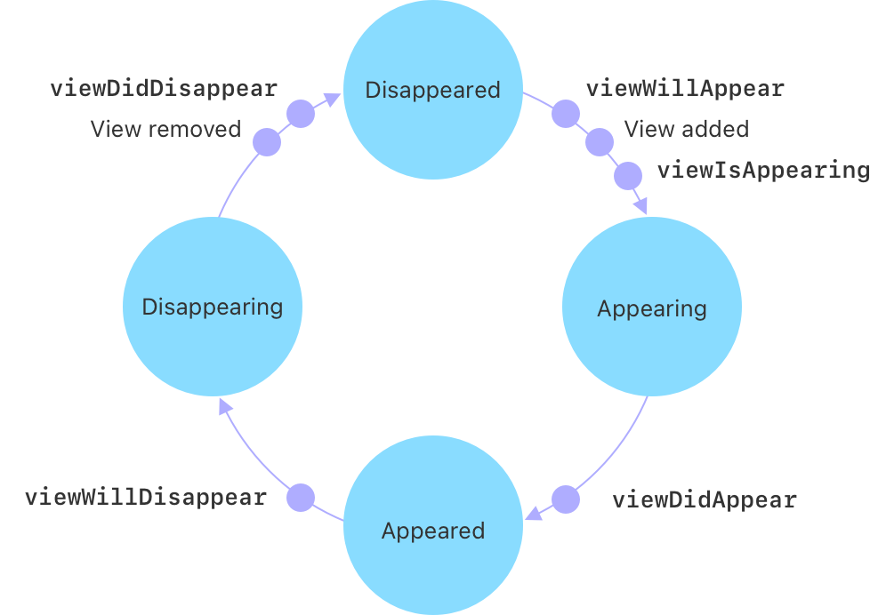

> Navigation: [Technologies](../technologies.md) · [UIKit](../uikit.md)

# UIViewController

<sub>Class</sub>

An object that manages a view hierarchy for your UIKit app.

<sub>iOS, iPadOS, Mac Catalyst, tvOS, visionOS</sub>

```swift
@MainActor class UIViewController
```

## Overview

The [UIViewController](uiviewcontroller.md) class defines the shared behavior that’s common to all view controllers. You rarely create instances of the [UIViewController](uiviewcontroller.md) class directly. Instead, you subclass [UIViewController](uiviewcontroller.md) and add the methods and properties needed to manage the view controller’s view hierarchy.

A view controller’s main responsibilities include the following:

- Updating the contents of the views, usually in response to changes to the underlying data
- Responding to user interactions with views
- Resizing views and managing the layout of the overall interface
- Coordinating with other objects — including other view controllers — in your app

A view controller is tightly bound to the views it manages and takes part in handling events in its view hierarchy. Specifically, view controllers are [UIResponder](uiresponder.md) objects and are inserted into the responder chain between the view controller’s root view and that view’s superview, which typically belongs to a different view controller. If none of the view controller’s views handle an event, the view controller has the option of handling the event or passing it along to the superview.

View controllers are rarely used in isolation. Instead, you often use multiple view controllers, each of which owns a portion of your app’s user interface. For example, one view controller might display a table of items while a different view controller displays the selected item from that table. Usually, only the views from one view controller are visible at a time. A view controller may present a different view controller to display a new set of views, or it may act as a container for other view controllers’ content and animate views however it wants.

### Subclassing notes

Every app contains at least one custom subclass of [UIViewController](uiviewcontroller.md). More often, apps contain many custom view controllers. Custom view controllers define the overall behaviors of your app, including the app’s appearance and how it responds to user interactions. The following sections provide a brief overview of some of the tasks your custom subclass performs. For detailed information about using and implementing view controllers, see [View Controller Programming Guide for iOS](https://developer.apple.com/library/archive/featuredarticles/ViewControllerPGforiPhoneOS/index.html#//apple_ref/doc/uid/TP40007457).

#### Manage views

Each view controller manages a view hierarchy, the root view of which is stored in the [view](uiviewcontroller/view.md) property of this class. The root view acts primarily as a container for the rest of the view hierarchy. The size and position of the root view is determined by the object that owns it, which is either a parent view controller or the app’s window. The view controller that’s owned by the window is the app’s root view controller and its view is sized to fill the window.

View controllers load their views lazily. Accessing the [view](uiviewcontroller/view.md) property for the first time loads or creates the view controller’s views. There are several ways to specify the views for a view controller:

- Specify the view controller and its views in your app’s storyboard. Storyboards are the preferred way to specify your views. With a storyboard, you specify the views and their connections to the view controller. You also specify the relationships and segues between your view controllers, which makes it easier to see and modify your app’s behavior.

To load a view controller from a storyboard, call the [- instantiateViewControllerWithIdentifier:](<uistoryboard/instantiateviewcontroller(withidentifier_).md>) method of the appropriate [UIStoryboard](uistoryboard.md) object. The storyboard object creates the view controller and returns it to your code.

- Specify the views for a view controller using a nib file. A nib file lets you specify the views of a single view controller but doesn’t let you define segues or relationships between view controllers. The nib file also stores only minimal information about the view controller itself.

To initialize a view controller object using a nib file, create your view controller class programmatically and initialize it using the [- initWithNibName:bundle:](<uiviewcontroller/init(nibname_bundle_).md>) method. When its views are requested, the view controller loads them from the nib file.

- Specify the views for a view controller using the [- loadView](<uiviewcontroller/loadview().md>) method. In that method, create your view hierarchy programmatically and assign the root view of that hierarchy to the view controller’s [view](uiviewcontroller/view.md) property.

All of these techniques have the same end result, which is to create the appropriate set of views and expose them through the [view](uiviewcontroller/view.md) property.

> [!important] Important
> A view controller is the sole owner of its view and any subviews it creates. It’s responsible for creating those views and for relinquishing ownership of them at the appropriate times such as when the view controller itself is released. If you use a storyboard or a nib file to store your view objects, each view controller object automatically gets its own copy of these views when the view controller asks for them. However, if you create your views manually, each view controller must have its own unique set of views. You can’t share views between view controllers.

A view controller’s root view is always sized to fit its assigned space. For other views in your view hierarchy, use Interface Builder to specify the Auto Layout constraints that govern how each view is positioned and sized within its superview’s bounds. You can also create constraints programmatically and add them to your views at appropriate times. For more information about how to create constraints, see [Auto Layout Guide](https://developer.apple.com/library/archive/documentation/UserExperience/Conceptual/AutolayoutPG/index.html#//apple_ref/doc/uid/TP40010853).

##### Handle view-related notifications

When the visibility of its views changes, a view controller automatically calls its own methods so that subclasses can respond to the change. Use a method like [- viewIsAppearing:](<uiviewcontroller/viewisappearing(__).md>) to prepare your views to appear onscreen, and use [- viewWillDisappear:](<uiviewcontroller/viewwilldisappear(__).md>) to save changes or other state information. Use other methods to make appropriate changes.

The following image shows the possible visible states for a view controller’s views and the state transitions that can occur. Not all `will` callback methods are paired with only a `did` callback method. You need to ensure that if you start a process in a `will` callback method, you end the process in both the corresponding `did` and the opposite `will` callback method.



<sub>A diagram of four spheres arranged in a circle. The sphere on the right is labeled Appearing and has a clockwise arrow leading to the bottom sphere, which is labeled Appeared. A small dot on the arrow is labeled viewDidAppear. A clockwise arrow leads from the bottom sphere to the left sphere, which is labeled Disappearing. A small dot along the arrow is labeled viewWillDisappear. A clockwise arrow leads from the left sphere to the top sphere, which is labeled Disappeared. Two small dots along the arrow are labeled viewDidDisappear and View removed. A clockwise arrow leads from the top sphere to the right sphere. Three small dots along the arrow are labeled viewWillAppear, View added, and viewIsAppearing.</sub>

##### Handle view rotations

As of iOS 8, all rotation-related methods are deprecated. Instead, rotations are treated as a change in the size of the view controller’s view and are therefore reported using the [- viewWillTransitionToSize:withTransitionCoordinator:](<uicontentcontainer/viewwilltransition(to_with_).md>) method. When the interface orientation changes, UIKit calls this method on the window’s root view controller. That view controller then notifies its child view controllers, propagating the message throughout the view controller hierarchy.

In iOS 6 and iOS 7, your app supports the interface orientations defined in your app’s `Info.plist` file. A view controller can override the [supportedInterfaceOrientations](uiviewcontroller/supportedinterfaceorientations.md) method to limit the list of supported orientations. Typically, the system calls this method only on the root view controller of the window or a view controller presented to fill the entire screen; child view controllers use the portion of the window provided for them by their parent view controller and no longer participate directly in decisions about what rotations are supported. The intersection of the app’s orientation mask and the view controller’s orientation mask is used to determine which orientations a view controller can be rotated into.

You can override the [preferredInterfaceOrientationForPresentation](uiviewcontroller/preferredinterfaceorientationforpresentation.md) for a view controller that’s intended to be presented full screen in a specific orientation.

When a rotation occurs for a visible view controller, the [- willRotateToInterfaceOrientation:duration:](<uiviewcontroller/willrotate(to_duration_).md>), [- willAnimateRotationToInterfaceOrientation:duration:](<uiviewcontroller/willanimaterotation(to_duration_).md>), and [- didRotateFromInterfaceOrientation:](<uiviewcontroller/didrotate(from_).md>) methods are called during the rotation. The [- viewWillLayoutSubviews](<uiviewcontroller/viewwilllayoutsubviews().md>) method is also called after the view is resized and positioned by its parent. If a view controller isn’t visible when an orientation change occurs, then the rotation methods are never called. However, the [- viewWillLayoutSubviews](<uiviewcontroller/viewwilllayoutsubviews().md>) method is called when the view becomes visible.

> [!note] Note
> At launch time, apps should always set up their interface in a portrait orientation. After the [- application:didFinishLaunchingWithOptions:](<uiapplicationdelegate/application(__didfinishlaunchingwithoptions_).md>) method returns, the app uses the view controller rotation mechanism described above to rotate the views to the appropriate orientation prior to showing the window.

#### Implement a container view controller

A custom [UIViewController](uiviewcontroller.md) subclass can also act as a container view controller. A container view controller manages the presentation of content of other view controllers it owns, also known as its child view controllers. A child’s view can be presented as-is or in conjunction with views owned by the container view controller.

Your container view controller subclass should declare a public interface to associate its children. The nature of these methods is up to you and depends on the semantics of the container you’re creating. You need to decide how many children can be displayed by your view controller at once, when those children are displayed, and where they appear in your view controller’s view hierarchy. Your view controller class defines what relationships, if any, are shared by the children. By establishing a clean public interface for your container, you ensure that children use its capabilities logically, without accessing too many private details about how your container implements the behavior.

Your container view controller must associate a child view controller with itself before adding the child’s root view to the view hierarchy. This allows iOS to properly route events to child view controllers and the views those controllers manage. Likewise, after it removes a child’s root view from its view hierarchy, it should disconnect that child view controller from itself. To make or break these associations, your container calls specific methods defined by the base class. These methods aren’t intended to be called by clients of your container class; they are to be used only by your container’s implementation to provide the expected containment behavior.

Here are the essential methods you might need to call:

- [- addChildViewController:](<uiviewcontroller/addchild(__).md>)
- [- removeFromParentViewController](<uiviewcontroller/removefromparent().md>)
- [- willMoveToParentViewController:](<uiviewcontroller/willmove(toparent_).md>)
- [- didMoveToParentViewController:](<uiviewcontroller/didmove(toparent_).md>)

> [!note] Note
> You’re not required to override any methods when creating a container view controller.
>
> By default, rotation and appearance callbacks are automatically forwarded to children. You may optionally override the [- shouldAutomaticallyForwardRotationMethods](<uiviewcontroller/shouldautomaticallyforwardrotationmethods().md>) and [shouldAutomaticallyForwardAppearanceMethods](uiviewcontroller/shouldautomaticallyforwardappearancemethods.md) methods to take control of this behavior yourself.

#### Manage memory

Memory is a critical resource in iOS, and view controllers provide built-in support for reducing their memory footprint at critical times. The [UIViewController](uiviewcontroller.md) class provides some automatic handling of low-memory conditions through its [- didReceiveMemoryWarning](<uiviewcontroller/didreceivememorywarning().md>) method, which releases unneeded memory.

#### Support state preservation and restoration

If you assign a value to the view controller’s [restorationIdentifier](uiviewcontroller/restorationidentifier.md) property, the system may ask the view controller to encode itself when the app transitions to the background. When preserved, a view controller preserves the state of any views in its view hierarchy that also have restoration identifiers. View controllers don’t automatically save any other state. If you’re implementing a custom container view controller, you must encode any child view controllers yourself. Each child you encode must have a unique restoration identifier.

For more information about how the system determines which view controllers to preserve and restore, see [App Programming Guide for iOS](https://developer.apple.com/library/archive/documentation/iPhone/Conceptual/iPhoneOSProgrammingGuide/Introduction/Introduction.html#//apple_ref/doc/uid/TP40007072). To see an example of state preservation and restoration, see [Restoring your app’s state](restoring-your-app-s-state.md).

## Relationships

- **Inherits From**: [UIResponder](uiresponder.md)

- **Inherited By**: [UIActivityViewController](uiactivityviewcontroller.md), [UIAlertController](uialertcontroller.md), [UICloudSharingController](uicloudsharingcontroller.md), [UICollectionViewController](uicollectionviewcontroller.md), [UIColorPickerViewController](uicolorpickerviewcontroller.md), [UIDocumentBrowserViewController](uidocumentbrowserviewcontroller.md), [UIDocumentMenuViewController](uidocumentmenuviewcontroller.md), [UIDocumentPickerExtensionViewController](uidocumentpickerextensionviewcontroller.md), [UIDocumentPickerViewController](uidocumentpickerviewcontroller.md), [UIDocumentViewController](uidocumentviewcontroller.md), [UIFontPickerViewController](uifontpickerviewcontroller.md), [UIInputViewController](uiinputviewcontroller.md), [UINavigationController](uinavigationcontroller.md), [UIPageViewController](uipageviewcontroller.md), [UIReferenceLibraryViewController](uireferencelibraryviewcontroller.md), [UISearchContainerViewController](uisearchcontainerviewcontroller.md), [UISearchController](uisearchcontroller.md), [UISplitViewController](uisplitviewcontroller.md), [UITabBarController](uitabbarcontroller.md), [UITableViewController](uitableviewcontroller.md), [UITextFormattingViewController](uitextformattingviewcontroller.md)

- **Conforms To**: [CVarArg](../swift/cvararg.md), [Copyable](../swift/copyable.md), [CustomDebugStringConvertible](../swift/customdebugstringconvertible.md), [CustomStringConvertible](../swift/customstringconvertible.md), [Equatable](../swift/equatable.md), [Escapable](../swift/escapable.md), [Hashable](../swift/hashable.md), [NSCoding](../foundation/nscoding.md), [NSExtensionRequestHandling](../foundation/nsextensionrequesthandling.md), [NSObjectProtocol](../objectivec/nsobjectprotocol.md), [NSTouchBarProvider](../appkit/nstouchbarprovider.md), [Sendable](../swift/sendable.md), [SendableMetatype](../swift/sendablemetatype.md), [UIActivityItemsConfigurationProviding](uiactivityitemsconfigurationproviding.md), [UIAppearanceContainer](uiappearancecontainer.md), [UIContentContainer](uicontentcontainer.md), [UIFocusEnvironment](uifocusenvironment.md), [UIPasteConfigurationSupporting](uipasteconfigurationsupporting.md), [UIResponderStandardEditActions](uiresponderstandardeditactions.md), [UIStateRestoring](uistaterestoring.md), [UITraitChangeObservable](uitraitchangeobservable-67e94.md), [UITraitEnvironment](uitraitenvironment.md), [UIUserActivityRestoring](uiuseractivityrestoring.md)

## Topics

### Creating a view controller

- [- initWithNibName:bundle:](<uiviewcontroller/init(nibname_bundle_).md>) — Creates a view controller with the nib file in the specified bundle.
- [- initWithCoder:](<uiviewcontroller/init(coder_).md>) — Creates a view controller with data in an unarchiver.

### Getting the storyboard and nib information

- [storyboard](uiviewcontroller/storyboard.md) — The storyboard from which the view controller originated.
- [nibName](uiviewcontroller/nibname.md) — The name of the view controller’s nib file, if one was specified.
- [nibBundle](uiviewcontroller/nibbundle.md) — The view controller’s nib bundle if it exists.

### Managing the view

- [view](uiviewcontroller/view.md) — The view that the controller manages.
- [viewIfLoaded](uiviewcontroller/viewifloaded.md) — The view controller’s view, or `nil` if the view isn’t yet loaded.
- [viewLoaded](uiviewcontroller/isviewloaded.md) — A Boolean value indicating whether the view is currently loaded into memory.
- [- loadView](<uiviewcontroller/loadview().md>) — Creates the view that the controller manages.
- [- viewDidLoad](<uiviewcontroller/viewdidload().md>) — Called after the controller’s view is loaded into memory.
- [- loadViewIfNeeded](<uiviewcontroller/loadviewifneeded().md>) — Loads the view controller’s view if it’s not loaded yet.
- [title](uiviewcontroller/title.md) — A localized string that represents the view this controller manages.
- [preferredContentSize](uiviewcontroller/preferredcontentsize.md) — The preferred size for the view controller’s view.
- [ornaments](uiviewcontroller/ornaments.md) — SwiftUI ornaments to display adjacent to the view controller.

### Responding to view-related events

- [- viewWillAppear:](<uiviewcontroller/viewwillappear(__).md>) — Notifies the view controller that its view is about to be added to a view hierarchy.
- [- viewIsAppearing:](<uiviewcontroller/viewisappearing(__).md>) — Notifies the view controller that the system is adding the view controller’s view to a view hierarchy.
- [- viewDidAppear:](<uiviewcontroller/viewdidappear(__).md>) — Notifies the view controller that its view was added to a view hierarchy.
- [- viewWillDisappear:](<uiviewcontroller/viewwilldisappear(__).md>) — Notifies the view controller that its view is about to be removed from a view hierarchy.
- [- viewDidDisappear:](<uiviewcontroller/viewdiddisappear(__).md>) — Notifies the view controller that its view was removed from a view hierarchy.
- [beingDismissed](uiviewcontroller/isbeingdismissed.md) — A Boolean value indicating whether the view controller is in the process of being dismissed by one of its ancestors.
- [beingPresented](uiviewcontroller/isbeingpresented.md) — A Boolean value indicating whether the view controller in the process of being presented by one of its ancestors.
- [movingFromParentViewController](uiviewcontroller/ismovingfromparent.md) — A Boolean value indicating whether the view controller is moving from a parent view controller.
- [movingToParentViewController](uiviewcontroller/ismovingtoparent.md) — A Boolean value indicating whether the view controller is moving to a parent view controller.

### Managing the view’s properties

- [ViewLoading](uiviewcontroller/viewloading.md) — A property wrapper that loads the view controller’s view before accessing the property.
- [- updateProperties](<uiviewcontroller/updateproperties().md>) — Configures the view controller’s content and styling properties.
- [- updatePropertiesIfNeeded](<uiviewcontroller/updatepropertiesifneeded().md>) — Forces an immediate properties update for this view controller and its view, including any view controllers and views in this subtree.
- [- setNeedsUpdateProperties](<uiviewcontroller/setneedsupdateproperties().md>) — Call to manually request a properties update for the view controller. Multiple requests may be coalesced into a single update alongside the next layout pass.

### Extending the view’s safe area

- [Positioning content relative to the safe area](positioning-content-relative-to-the-safe-area.md) — Position views so that they aren’t obstructed by other content.
- [additionalSafeAreaInsets](uiviewcontroller/additionalsafeareainsets.md) — Custom insets that you specify to modify the view controller’s safe area.
- [- viewSafeAreaInsetsDidChange](<uiviewcontroller/viewsafeareainsetsdidchange().md>) — Called to notify the view controller that the safe area insets of its root view changed.

### Managing the view’s margins

- [Positioning content within layout margins](positioning-content-within-layout-margins.md) — Position views so that they aren’t crowded by other content.
- [viewRespectsSystemMinimumLayoutMargins](uiviewcontroller/viewrespectssystemminimumlayoutmargins.md) — A Boolean value indicating whether the view controller’s view uses the system-defined minimum layout margins.
- [systemMinimumLayoutMargins](uiviewcontroller/systemminimumlayoutmargins.md) — The minimum layout margins for the view controller’s root view.
- [- viewLayoutMarginsDidChange](<uiviewcontroller/viewlayoutmarginsdidchange().md>) — Called to notify the view controller that the layout margins of its root view changed.

### Configuring the view’s layout behavior

- [edgesForExtendedLayout](uiviewcontroller/edgesforextendedlayout.md) — The edges that you extend for your view controller.
- [UIRectEdge](uirectedge.md) — Constants that specify the edges of a rectangle.
- [extendedLayoutIncludesOpaqueBars](uiviewcontroller/extendedlayoutincludesopaquebars.md) — A Boolean value indicating whether or not the extended layout includes opaque bars.
- [- viewWillLayoutSubviews](<uiviewcontroller/viewwilllayoutsubviews().md>) — Notifies the view controller that its view is about to lay out its subviews.
- [- viewDidLayoutSubviews](<uiviewcontroller/viewdidlayoutsubviews().md>) — Notifies the view controller when its view finishes laying out its subviews.
- [- updateViewConstraints](<uiviewcontroller/updateviewconstraints().md>) — Notifies the view controller when its view needs to update its constraints.

### Configuring the view rotation settings

- [supportedInterfaceOrientations](uiviewcontroller/supportedinterfaceorientations.md) — The interface orientations that the view controller supports.
- [preferredInterfaceOrientationForPresentation](uiviewcontroller/preferredinterfaceorientationforpresentation.md) — The interface orientation to use when presenting the view controller.
- [- setNeedsUpdateOfSupportedInterfaceOrientations](<uiviewcontroller/setneedsupdateofsupportedinterfaceorientations().md>) — Notifies the view controller about a change in supported interface orientations or preferred interface orientation for presentation.
- [prefersInterfaceOrientationLocked](uiviewcontroller/prefersinterfaceorientationlocked.md) — A Boolean value that indicates whether the view controller prefers to lock the scene’s interface orientation when the scene is visible.
- [- setNeedsUpdateOfPrefersInterfaceOrientationLocked](<uiviewcontroller/setneedsupdateofprefersinterfaceorientationlocked().md>) — Indicates that the view controller changed the interface orientation lock preference.
- [childViewControllerForInterfaceOrientationLock](uiviewcontroller/childforinterfaceorientationlock.md) — A child view controller to query for the interface orientation lock preference.

### Performing segues

- [- shouldPerformSegueWithIdentifier:sender:](<uiviewcontroller/shouldperformsegue(withidentifier_sender_).md>) — Determines whether the segue with the specified identifier should be performed.
- [- prepareForSegue:sender:](<uiviewcontroller/prepare(for_sender_).md>) — Notifies the view controller that a segue is about to be performed.
- [- performSegueWithIdentifier:sender:](<uiviewcontroller/performsegue(withidentifier_sender_).md>) — Initiates the segue with the specified identifier from the current view controller’s storyboard file.
- [- allowedChildViewControllersForUnwindingFromSource:](<uiviewcontroller/allowedchildrenforunwinding(from_).md>) — Returns an array of child view controllers to search for an unwind segue destination.
- [- childViewControllerContainingSegueSource:](<uiviewcontroller/childcontaining(__).md>) — Returns the child view controller that contains the source of the unwind segue.
- [- canPerformUnwindSegueAction:fromViewController:sender:](<uiviewcontroller/canperformunwindsegueaction(__from_sender_).md>) — Called on a view controller to determine whether it responds to an unwind action.
- [- unwindForSegue:towardsViewController:](<uiviewcontroller/unwind(for_towards_).md>) — Called when an unwind segue transitions to a new view controller.

### Presenting a view controller

- [- showViewController:sender:](<uiviewcontroller/show(__sender_).md>) — Presents a view controller in a primary context.
- [- showDetailViewController:sender:](<uiviewcontroller/showdetailviewcontroller(__sender_).md>) — Presents a view controller in a secondary (or detail) context.
- [ShowDetailTargetDidChangeMessage](uiviewcontroller/showdetailtargetdidchangemessage.md)
- [- presentViewController:animated:completion:](<uiviewcontroller/present(__animated_completion_).md>) — Presents a view controller modally.
- [- dismissViewControllerAnimated:completion:](<uiviewcontroller/dismiss(animated_completion_).md>) — Dismisses the view controller that was presented modally by the view controller.
- [modalPresentationStyle](uiviewcontroller/modalpresentationstyle.md) — The presentation style for modal view controllers.
- [UIModalPresentationStyle](uimodalpresentationstyle.md) — Modal presentation styles available when presenting view controllers.
- [modalTransitionStyle](uiviewcontroller/modaltransitionstyle.md) — The transition style to use when presenting the view controller.
- [UIModalTransitionStyle](uimodaltransitionstyle.md) — Transition styles available when presenting view controllers.
- [modalInPresentation](uiviewcontroller/ismodalinpresentation.md) — A Boolean value indicating whether the view controller enforces a modal behavior.
- [definesPresentationContext](uiviewcontroller/definespresentationcontext.md) — A Boolean value that indicates whether this view controller’s view is covered when the view controller or one of its descendants presents a view controller.
- [providesPresentationContextTransitionStyle](uiviewcontroller/providespresentationcontexttransitionstyle.md) — A Boolean value that indicates whether the view controller specifies the transition style for view controllers it presents.
- [disablesAutomaticKeyboardDismissal](uiviewcontroller/disablesautomatickeyboarddismissal.md) — Returns a Boolean indicating whether the current input view is dismissed automatically when changing controls.
- [UIViewControllerShowDetailTargetDidChangeNotification](uiviewcontroller/showdetailtargetdidchangenotification.md) — Posted when a split view controller is expanded or collapsed.

### Adding a custom transition or presentation

- [transitioningDelegate](uiviewcontroller/transitioningdelegate.md) — The delegate object that provides transition animator, interactive controller, and custom presentation controller objects.
- [transitionCoordinator](uiviewcontroller/transitioncoordinator.md) — Returns the active transition coordinator object.
- [- targetViewControllerForAction:sender:](<uiviewcontroller/targetviewcontroller(foraction_sender_).md>) — Returns the view controller that responds to the action.
- [presentationController](uiviewcontroller/presentationcontroller.md) — The presentation controller that’s managing the current view controller.
- [popoverPresentationController](uiviewcontroller/popoverpresentationcontroller.md) — The nearest popover presentation controller that is managing the current view controller.
- [sheetPresentationController](uiviewcontroller/sheetpresentationcontroller.md) — The sheet presentation controller for the view controller.
- [activePresentationController](uiviewcontroller/activepresentationcontroller.md) — The presentation controller that’s managing the view controller.
- [restoresFocusAfterTransition](uiviewcontroller/restoresfocusaftertransition.md) — A Boolean value that indicates whether an item that previously was focused should again become focused when the item’s view controller becomes visible and focusable.
- [Customizing and resizing sheets in UIKit](customizing-and-resizing-sheets-in-uikit.md) — Discover how to create a layered and customized sheet experience in UIKit.

### Adapting to environment changes

- [- collapseSecondaryViewController:forSplitViewController:](<uiviewcontroller/collapsesecondaryviewcontroller(__for_).md>) — Called when a split view controller transitions to a compact-width size class.
- [- separateSecondaryViewControllerForSplitViewController:](<uiviewcontroller/separatesecondaryviewcontroller(for_).md>) — Called when a split view controller transitions to a regular-width size class.

### Adjusting the interface style

- [overrideUserInterfaceStyle](uiviewcontroller/overrideuserinterfacestyle.md) — The user interface style adopted by the view controller and all of its children.
- [preferredUserInterfaceStyle](uiviewcontroller/preferreduserinterfacestyle.md) — The preferred interface style for this view controller.
- [childViewControllerForUserInterfaceStyle](uiviewcontroller/childviewcontrollerforuserinterfacestyle.md) — The child view controller that supports the preferred user interface style.
- [- setNeedsUserInterfaceAppearanceUpdate](<uiviewcontroller/setneedsuserinterfaceappearanceupdate().md>) — Notifies the view controller that a change occurred that might affect the preferred interface style.
- [UIUserInterfaceStyle](uiuserinterfacestyle.md) — Constants that indicate the interface style for the app.

### Adjusting the container background style

- [preferredContainerBackgroundStyle](uiviewcontroller/preferredcontainerbackgroundstyle.md)
- [childViewControllerForPreferredContainerBackgroundStyle](uiviewcontroller/childviewcontrollerforpreferredcontainerbackgroundstyle.md)
- [- setNeedsUpdateOfPreferredContainerBackgroundStyle](<uiviewcontroller/setneedsupdateofpreferredcontainerbackgroundstyle().md>)
- [UIContainerBackgroundStyle](uicontainerbackgroundstyle.md)

### Observing trait changes

- [UITraitChangeObservable](uitraitchangeobservable-67e94.md) — A type that calls your code in reaction to changes in the trait environment.

### Overriding trait values

- [traitOverrides](uiviewcontroller/traitoverrides-1z1cc.md) — A mutable container of traits you use to set trait changes for this view controller and its views.
- [UITraitOverrides](uitraitoverrides-swift.struct.md) — A mutable container of traits you use to set trait changes for an object and its descendants.
- [- updateTraitsIfNeeded](<uiviewcontroller/updatetraitsifneeded().md>) — Updates traits immediately for this view controller and its view, including any view controllers and views in this subtree.

### Managing child view controllers in a custom container

- [childViewControllers](uiviewcontroller/children.md) — An array of view controllers that are children of the current view controller.
- [- addChildViewController:](<uiviewcontroller/addchild(__).md>) — Adds the specified view controller as a child of the current view controller.
- [- removeFromParentViewController](<uiviewcontroller/removefromparent().md>) — Removes the view controller from its parent.
- [- transitionFromViewController:toViewController:duration:options:animations:completion:](<uiviewcontroller/transition(from_to_duration_options_animations_completion_).md>) — Transitions between two of the view controller’s child view controllers.
- [shouldAutomaticallyForwardAppearanceMethods](uiviewcontroller/shouldautomaticallyforwardappearancemethods.md) — Returns a Boolean value indicating whether appearance methods are forwarded to child view controllers.
- [- beginAppearanceTransition:animated:](<uiviewcontroller/beginappearancetransition(__animated_).md>) — Tells a child controller its appearance is about to change.
- [- endAppearanceTransition](<uiviewcontroller/endappearancetransition().md>) — Tells a child controller its appearance has changed.
- [UIViewControllerHierarchyInconsistencyException](uiviewcontroller/hierarchyinconsistencyexception.md) — Raised if the view controller hierarchy is inconsistent with the view hierarchy.

### Responding to containment events

- [- willMoveToParentViewController:](<uiviewcontroller/willmove(toparent_).md>) — Called just before the view controller is added or removed from a container view controller.
- [- didMoveToParentViewController:](<uiviewcontroller/didmove(toparent_).md>) — Called after the view controller is added or removed from a container view controller.

### Getting other related view controllers

- [presentingViewController](uiviewcontroller/presentingviewcontroller.md) — The view controller that presented this view controller.
- [presentedViewController](uiviewcontroller/presentedviewcontroller.md) — The view controller that is presented by this view controller, or one of its ancestors in the view controller hierarchy.
- [parentViewController](uiviewcontroller/parent.md) — The parent view controller of the recipient.
- [splitViewController](uiviewcontroller/splitviewcontroller.md) — The nearest ancestor in the view controller hierarchy that is a split view controller.
- [navigationController](uiviewcontroller/navigationcontroller.md) — The nearest ancestor in the view controller hierarchy that is a navigation controller.
- [tabBarController](uiviewcontroller/tabbarcontroller.md) — The nearest ancestor in the view controller hierarchy that is a tab bar controller.

### Configuring a navigation interface

- [navigationItem](uiviewcontroller/navigationitem.md) — The navigation item used to represent the view controller in a parent’s navigation bar.
- [hidesBottomBarWhenPushed](uiviewcontroller/hidesbottombarwhenpushed.md) — A Boolean value indicating whether the toolbar at the bottom of the screen is hidden when the view controller is pushed on to a navigation controller.
- [- setToolbarItems:animated:](<uiviewcontroller/settoolbaritems(__animated_).md>) — Sets the toolbar items to be displayed along with the view controller.
- [toolbarItems](uiviewcontroller/toolbaritems.md) — The toolbar items associated with the view controller.

### Configuring tab bar content

- [tab](uiviewcontroller/tab.md) — The `UITab` instance that was used to create the receiver, and represents the view controller. Default is nil.
- [tabBarItem](uiviewcontroller/tabbaritem.md) — The tab bar item that represents the view controller when added to a tab bar controller.
- [tabBarObservedScrollView](uiviewcontroller/tabbarobservedscrollview.md) — The full-screen scroll view to synchronize with a scrolling tab bar. _(deprecated)_

### Working with scrolling content

- [- setContentScrollView:forEdge:](<uiviewcontroller/setcontentscrollview(__for_).md>) — Sets the scroll view that bars observe for the specified edge.
- [setContentScrollView(_:)](<uiviewcontroller/setcontentscrollview(__).md>) — Sets the scroll view that bars observe for all edges of the view.
- [- contentScrollViewForEdge:](<uiviewcontroller/contentscrollview(for_).md>) — Returns the scroll view the view controller observes for the specified edge.

### Indicating missing content

- [contentUnavailableConfiguration](uiviewcontroller/contentunavailableconfiguration-4b95e.md) — The current content-unavailable configuration of the view controller.
- [contentUnavailableConfigurationState](uiviewcontroller/contentunavailableconfigurationstate-7sczw.md) — The current configuration state of the content-unavailable view.
- [- setNeedsUpdateContentUnavailableConfiguration](<uiviewcontroller/setneedsupdatecontentunavailableconfiguration().md>) — Requests that the system update the content-unavailable configuration for the latest state.
- [updateContentUnavailableConfiguration(using:)](<uiviewcontroller/updatecontentunavailableconfiguration(using_).md>) — Updates the content-unavailable configuration for the provided state.
- [UIContentUnavailableConfiguration](uicontentunavailableconfiguration-swift.struct.md) — A content configuration for a content-unavailable view.

### Supporting app extensions

- [extensionContext](uiviewcontroller/extensioncontext.md) — Returns the extension context of the view controller.

### Coordinating with system gestures

- [preferredScreenEdgesDeferringSystemGestures](uiviewcontroller/preferredscreenedgesdeferringsystemgestures.md) — The screen edges for which you want your gestures to take precedence over the system gestures.
- [childViewControllerForScreenEdgesDeferringSystemGestures](uiviewcontroller/childforscreenedgesdeferringsystemgestures.md) — Returns the child view controller that should be queried to see if its gestures should take precedence.
- [- setNeedsUpdateOfScreenEdgesDeferringSystemGestures](<uiviewcontroller/setneedsupdateofscreenedgesdeferringsystemgestures().md>) — Notifies the system of changes to the screen edges that defer system gestures.
- [prefersHomeIndicatorAutoHidden](uiviewcontroller/prefershomeindicatorautohidden.md) — A Boolean that indicates whether the system is allowed to hide the visual indicator for returning to the Home Screen.
- [childViewControllerForHomeIndicatorAutoHidden](uiviewcontroller/childforhomeindicatorautohidden.md) — Returns the child view controller that is consulted about its preference for displaying a visual indicator for returning to the Home screen.
- [- setNeedsUpdateOfHomeIndicatorAutoHidden](<uiviewcontroller/setneedsupdateofhomeindicatorautohidden().md>) — Notifies UIKit that your view controller updated its preference regarding the visual indicator for returning to the Home screen.

### Working with transitions

- [preferredTransition](uiviewcontroller/preferredtransition.md) — An object that defines the transition animation when switching to the view controller.
- [Transition](uiviewcontroller/transition.md) — An object that defines the transition animation when switching to a new view controller.

### Working with focus

- [focusGroupIdentifier](uiviewcontroller/focusgroupidentifier.md) — The identifier of the focus group that the view controller belongs to.

### Managing pointer lock state

- [prefersPointerLocked](uiviewcontroller/preferspointerlocked.md) — A Boolean value that indicates whether the view controller prefers to lock the pointer to a specific scene.
- [- setNeedsUpdateOfPrefersPointerLocked](<uiviewcontroller/setneedsupdateofpreferspointerlocked().md>) — Indicates that the view controller changed the pointer lock preference.
- [childViewControllerForPointerLock](uiviewcontroller/childviewcontrollerforpointerlock.md) — A child view controller to query for the pointer lock preference.

### Managing the status bar

- [prefersStatusBarHidden](uiviewcontroller/prefersstatusbarhidden.md) — Specifies whether the view controller prefers the status bar to be hidden or shown.
- [childViewControllerForStatusBarHidden](uiviewcontroller/childforstatusbarhidden.md) — The view controller to use for determining the hidden state of the status bar.
- [childViewControllerForStatusBarStyle](uiviewcontroller/childforstatusbarstyle.md) — Called when the system needs the view controller to use for determining status bar style.
- [preferredStatusBarStyle](uiviewcontroller/preferredstatusbarstyle.md) — The preferred status bar style for the view controller.
- [UIStatusBarStyle](uistatusbarstyle.md) — Constants that describe the style of the device’s status bar.
- [modalPresentationCapturesStatusBarAppearance](uiviewcontroller/modalpresentationcapturesstatusbarappearance.md) — Specifies whether a view controller, presented non-fullscreen, takes over control of status bar appearance from the presenting view controller.
- [preferredStatusBarUpdateAnimation](uiviewcontroller/preferredstatusbarupdateanimation.md) — Specifies the animation style to use for hiding and showing the status bar for the view controller.
- [- setNeedsStatusBarAppearanceUpdate](<uiviewcontroller/setneedsstatusbarappearanceupdate().md>) — Indicates to the system that the view controller status bar attributes have changed.

### Managing the Touch Bar

- [childViewControllerForTouchBar](uiviewcontroller/childviewcontrollerfortouchbar.md) — The child view controller that the system uses to display content in the Touch Bar.
- [- setNeedsTouchBarUpdate](<uiviewcontroller/setneedstouchbarupdate().md>) — Tells the system to update the Touch Bar.

### Accessing the available key commands

- [performsActionsWhilePresentingModally](uiviewcontroller/performsactionswhilepresentingmodally.md) — A Boolean value indicating whether the view controller performs menu-related actions.
- [- addKeyCommand:](<uiviewcontroller/addkeycommand(__).md>) — Associates the specified keyboard shortcut with the view controller.
- [- removeKeyCommand:](<uiviewcontroller/removekeycommand(__).md>) — Removes the key command from the view controller.

### Adding editing behaviors to your view controller

- [editing](uiviewcontroller/isediting.md) — A Boolean value indicating whether the view controller currently allows the user to edit the view contents.
- [- setEditing:animated:](<uiviewcontroller/setediting(__animated_).md>) — Sets whether the view controller shows an editable view.
- [editButtonItem](uiviewcontroller/editbuttonitem.md) — Returns a bar button item that toggles its title and associated state between Edit and Done.

### Handling memory warnings

- [- didReceiveMemoryWarning](<uiviewcontroller/didreceivememorywarning().md>) — Sent to the view controller when the app receives a memory warning.

### Managing state restoration

- [Restoring your app’s state](restoring-your-app-s-state.md) — Provide continuity for the user by preserving current activities.
- [restorationIdentifier](uiviewcontroller/restorationidentifier.md) — The identifier that determines whether the view controller supports state restoration.
- [restorationClass](uiviewcontroller/restorationclass.md) — The class responsible for recreating this view controller when restoring the app’s state.
- [- encodeRestorableStateWithCoder:](<uiviewcontroller/encoderestorablestate(with_).md>) — Encodes state-related information for the view controller.
- [- decodeRestorableStateWithCoder:](<uiviewcontroller/decoderestorablestate(with_).md>) — Decodes and restores state-related information for the view controller.
- [- applicationFinishedRestoringState](<uiviewcontroller/applicationfinishedrestoringstate().md>) — Called on restored view controllers after other object decoding is complete.

### Logging user interaction intervals

- [interactionActivityTrackingBaseName](uiviewcontroller/interactionactivitytrackingbasename.md) — The base name the view controller uses for logging signposts that annotate user interactions.

### Registering scene accessories

- [- registerSceneAccessory:](<uiviewcontroller/registersceneaccessory(__).md>) — Registers a new scene accessory configuration associated with this view controller. _(beta)_
- [- unregisterSceneAccessory:](<uiviewcontroller/unregistersceneaccessory(__).md>) — Unregisters a scene accessory with the specified registration. _(beta)_

### Deprecated

- [Deprecated symbols](uiviewcontroller-deprecated-symbols.md) — Symbols that view controllers no longer support.

## See Also

### Content view controllers

- [Displaying and managing views with a view controller](displaying-and-managing-views-with-a-view-controller.md) — Build a view controller in storyboards, configure it with custom views, and fill those views with your app’s data.
- [Showing and hiding view controllers](showing-and-hiding-view-controllers.md) — Display view controllers using different techniques, and pass data between them during transitions.
- [UITableViewController](uitableviewcontroller.md) — A view controller that specializes in managing a table view.
- [UICollectionViewController](uicollectionviewcontroller.md) — A view controller that specializes in managing a collection view.
- [UIContentContainer](uicontentcontainer.md) — A set of methods for adapting the contents of your view controllers to size and trait changes.
