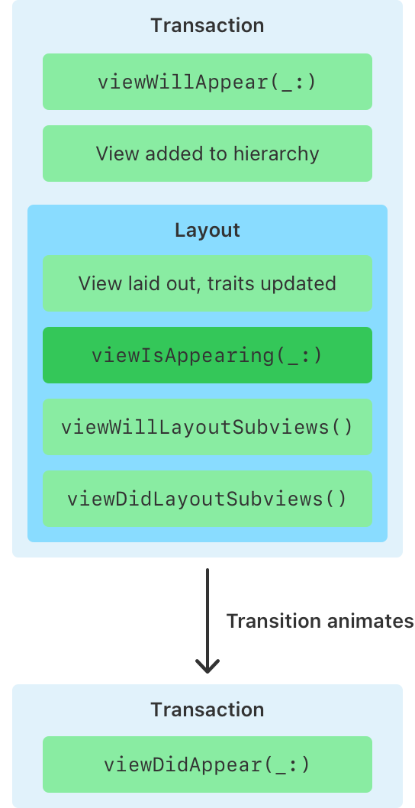

> Navigation: [Technologies](../../technologies.md) · [UIKit](../../uikit.md) · [UIViewController](../uiviewcontroller.md)

# viewIsAppearing(_:)

<sub>Instance Method</sub>

Notifies the view controller that the system is adding the view controller’s view to a view hierarchy.

<sub>iOS, iPadOS, Mac Catalyst, tvOS, visionOS</sub>

```swift
func viewIsAppearing(_ animated: Bool)
```

## Parameters

- `animated` — If [true](../../swift/true.md), the system is adding the view to the window using an animation.

## Discussion

The system calls this method once each time a view controller’s view appears after the [- viewWillAppear:](<viewwillappear(__).md>) call. In contrast to `viewWillAppear(_:)`, the system calls this method after it adds the view controller’s view to the view hierarchy, and the superview lays out the view controller’s view. By the time the system calls this method, both the view controller and its view have received updated trait collections and the view has accurate geometry.

You can override this method to perform custom tasks associated with displaying the view. For example, you might use this method to configure or update views based on the trait collections of the view or view controller. Or, because computing a scroll position relies on the view’s size and geometry, you might programmatically scroll a collection or table view to ensure a selected cell is visible when the view appears.

If you override this method, you need to call `super` at some point in your implementation.

### Choosing the appropriate callback

Although the system calls this method after [- viewWillAppear:](<viewwillappear(__).md>), both callbacks occur within the same [CATransaction](../../quartzcore/catransaction.md). This means that changes you make in either method become visible to the user at the same time.



<sub>A diagram titled View controller appearance that consists of seven stacked horizontal bars in three distinct sections. An arrow on the right labeled Time descends from the top to the bottom. The top section is labeled Transaction and contains two horizontal bars labeled viewWillAppear and View added to hierarchy. The second section is labeled Layout and contains four horizontal bars labeled View laid out by superview; traits updated; viewIsAppearing; viewWillLayoutSubviews; and viewDidLayoutSubviews. There is a gap between the second and third sections that contains the text: Transition animates. The third section is labeled Transaction and contains one horizontal bar labeled viewDidAppear.</sub>

The traits and geometry aren’t up to date when the system calls [- viewWillAppear:](<viewwillappear(__).md>), but they are when the system calls `viewIsAppearing(_:)`, so use `viewIsAppearing(_:)` to update your views.

Use `viewWillAppear(:_)` only when:

- You need a callback before the view transition begins, such as when accessing the [transitionCoordinator](transitioncoordinator.md) to add alongside animations. Alongside animations are animations that you direct the framework to perform concurrently with the view controller transition animations.
- You need balanced callbacks to do something that doesn’t depend on the view controller or view traits, hierarchy, or geometry. Use cases include registering for database notifications in [- viewWillAppear:](<viewwillappear(__).md>) and unregistering in [- viewDidDisappear:](<viewdiddisappear(__).md>).

For all other cases, use `viewIsAppearing(_:)` to update your views.

| State at callback time | `viewWillAppear(_:)` | `viewIsAppearing(_:)` |
|---|---|---|
| Transition coordinator available for adding alongside animations | **✓** | ✘ |
| View added to hierarchy | **✘** | **✓** |
| View controller and view trait collections updated | ✘ | **✓** |
| View geometry (size, safe area, and so forth) is accurate | ✘ | **✓** |

The system calls layout methods, such as [- viewWillLayoutSubviews](<viewwilllayoutsubviews().md>) and [- viewDidLayoutSubviews](<viewdidlayoutsubviews().md>), whenever the view runs [- layoutSubviews](<../uiview/layoutsubviews().md>), which can happen multiple times during the transition, or at any time while the view is visible. However, the system calls `viewIsAppearing(_:)` only once during the appearance transition, and calls it even if the view doesn’t require laying out when it appears.

For more information about how a view controller adds views to view hierarchies, and the sequence of messages that occur, see [Displaying and managing views with a view controller](../displaying-and-managing-views-with-a-view-controller.md).

## See Also

### Related Documentation

- [- viewDidLoad](<viewdidload().md>) — Called after the controller’s view is loaded into memory.

### Responding to view-related events

- [- viewWillAppear:](<viewwillappear(__).md>) — Notifies the view controller that its view is about to be added to a view hierarchy.
- [- viewDidAppear:](<viewdidappear(__).md>) — Notifies the view controller that its view was added to a view hierarchy.
- [- viewWillDisappear:](<viewwilldisappear(__).md>) — Notifies the view controller that its view is about to be removed from a view hierarchy.
- [- viewDidDisappear:](<viewdiddisappear(__).md>) — Notifies the view controller that its view was removed from a view hierarchy.
- [beingDismissed](isbeingdismissed.md) — A Boolean value indicating whether the view controller is in the process of being dismissed by one of its ancestors.
- [beingPresented](isbeingpresented.md) — A Boolean value indicating whether the view controller in the process of being presented by one of its ancestors.
- [movingFromParentViewController](ismovingfromparent.md) — A Boolean value indicating whether the view controller is moving from a parent view controller.
- [movingToParentViewController](ismovingtoparent.md) — A Boolean value indicating whether the view controller is moving to a parent view controller.
