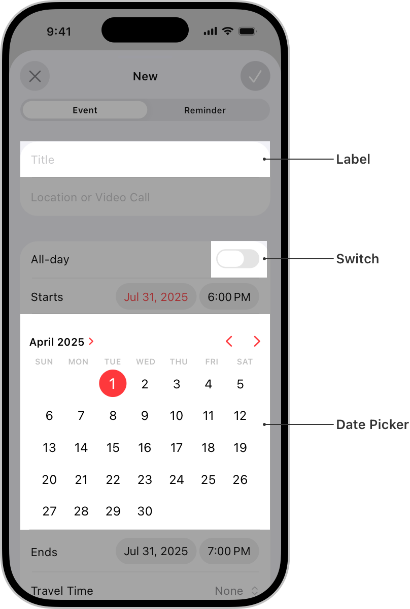

> Navigation: [Technologies](../technologies.md) · [UIKit](../uikit.md)

# Views and controls

API Collection

Present your content onscreen and define the interactions allowed with that content.

## Overview

Views and controls are the visual building blocks of your app’s user interface. Use them to draw and organize your app’s content onscreen.

Views can host other views. Embedding one view inside another creates a containment relationship between the host view (known as the _superview_) and the embedded view (known as the _subview_). View hierarchies make it easier to manage views.

You can also use views to do any of the following:

- Respond to touches and other events (either directly or in coordination with gesture recognizers).
- Draw custom content using Core Graphics or UIKit classes.
- Support drag and drop interactions.
- Respond to focus changes.
- Animate the size, position, and appearance attributes of the view.

[UIView](uiview.md) is the root class for all views and defines their common behavior. [UIControl](uicontrol.md) defines additional behaviors that are specific to buttons, switches, and other views designed for user interactions.

For additional information about how to use views and controls, see [Human Interface Guidelines](https://developer.apple.com/design/human-interface-guidelines/components/all-components). To see examples of UIKit controls, see [UIKit Catalog: Creating and customizing views and controls](uikit-catalog-creating-and-customizing-views-and-controls.md).

## Topics

### View fundamentals

- [UIView](uiview.md) — An object that manages the content for a rectangular area on the screen.
- [UIKit Catalog: Creating and customizing views and controls](uikit-catalog-creating-and-customizing-views-and-controls.md) — Customize your app’s user interface with views and controls.

### Container views

- [Autosizing views for localization in iOS](../xcode/autosizing-views-for-localization-in-ios.md) — Add auto layout constraints to your app to achieve localizable views.
- [Collection views](collection-views.md) — Display nested views using a configurable and highly customizable layout.
- [Table views](table-views.md) — Display data in a single column of customizable rows.
- [UIStackView](uistackview.md) — A streamlined interface for laying out a collection of views in either a column or a row.
- [UIScrollView](uiscrollview.md) — A view that allows the scrolling and zooming of its contained views.
- [UILookToScrollInteraction](uilooktoscrollinteraction.md) _(beta)_

### Content views

- [UIActivityIndicatorView](uiactivityindicatorview.md) — A view that shows that a task is in progress.
- [UICalendarView](uicalendarview.md) — A view that displays a calendar with date-specific decorations, and provides for user selection of a single date or multiple dates.
- [UIContentUnavailableView](uicontentunavailableview.md) — A view that indicates there’s no content to display.
- [UIImageView](uiimageview.md) — A view that displays a single image or a sequence of animated images in your interface.
- [UIPickerView](uipickerview.md) — A view that uses a spinning-wheel or slot-machine metaphor to show one or more sets of values.
- [UIProgressView](uiprogressview.md) — A view that depicts the progress of a task over time.

### Controls

- [Responding to control-based events using target-action](responding-to-control-based-events-using-target-action.md) — Handle user input by connecting buttons, sliders, and other controls to your app’s code using the target-action design pattern.
- [UIControl](uicontrol.md) — The base class for controls, which are visual elements that convey a specific action or intention in response to user interactions.
- [UIButton](uibutton.md) — A control that executes your custom code in response to user interactions.
- [UIColorWell](uicolorwell.md) — A control that displays a color picker.
- [UIDatePicker](uidatepicker.md) — A control for inputting date and time values.
- [UIPageControl](uipagecontrol.md) — A control that displays a horizontal series of dots, each of which corresponds to a page in the app’s document or other data-model entity.
- [UISegmentedControl](uisegmentedcontrol.md) — A horizontal control that consists of multiple segments, each segment functioning as a discrete button.
- [UISlider](uislider.md) — A control for selecting a single value from a continuous range of values.
- [UIStepper](uistepper.md) — A control for incrementing or decrementing a value.
- [UISwitch](uiswitch.md) — A control that offers a binary choice, such as on/off.

### Text views

- [UILabel](uilabel.md) — A view that displays one or more lines of informational text.
- [UITextField](uitextfield.md) — An object that displays an editable text area in your interface.
- [UITextView](uitextview.md) — A scrollable, multiline text region.
- [Drag and drop customization](drag-and-drop-customization.md) — Extend the standard drag and drop support for text views to include custom types of content.

### Search field

- [UISearchTextField](uisearchtextfield.md) — A view for displaying and editing text and search tokens.
- [UISearchToken](uisearchtoken.md) — Search criteria in a search text field, represented by text and an optional icon.
- [UISearchTextFieldDelegate](uisearchtextfielddelegate.md) — The interface for the delegate of a search field.

### Visual effects

- [UIVisualEffect](uivisualeffect.md) — An initializer for visual effect views and blur and vibrancy effect objects.
- [UIVisualEffectView](uivisualeffectview.md) — An object that implements some complex visual effects.
- [UIVibrancyEffect](uivibrancyeffect.md) — An object that amplifies and adjusts the color of the content layered behind a visual effect view.
- [UIBlurEffect](uiblureffect.md) — An object that applies a blurring effect to the content layered behind a visual effect view.
- [UIColorEffect](uicoloreffect.md) — A visual effect that applies a solid color background.

### Bars

- [UIBarItem](uibaritem.md) — An abstract superclass for items that you can add to a bar that appears at the bottom of the screen.
- [UIBarButtonItem](uibarbuttonitem.md) — A specialized button for placement on a toolbar, navigation bar, or shortcuts bar.
- [UIBarButtonItemGroup](uibarbuttonitemgroup.md) — A group of one or more bar button items for placement on a navigation bar or shortcuts bar.
- [UIBarButtonItemVisibilityPriority](uibarbuttonitemvisibilitypriority.md) _(beta)_
- [UINavigationBar](uinavigationbar.md) — Navigational controls that display in a bar along the top of the screen, usually in conjunction with a navigation controller.
- [UISearchBar](uisearchbar.md) — A specialized view for receiving search-related information from the user.
- [UIToolbar](uitoolbar.md) — A control that displays one or more buttons along an edge of your interface.
- [UITabBar](uitabbar.md) — A control that displays one or more buttons in a tab bar for selecting between different subtasks, views, or modes in an app.
- [UITabBarItem](uitabbaritem.md) — An object that describes an item in a tab bar.
- [UIBarPositioning](uibarpositioning.md) — A set of methods for defining the positioning of bars in iOS apps.
- [UIBarPositioningDelegate](uibarpositioningdelegate.md) — A set of methods that support the positioning of a bar that conforms to the [UIBarPositioning](uibarpositioning.md) protocol.
- [UIBarMinimization](uibarminimization-swift.struct.md)

### Content viewer

- [UILargeContentViewerInteraction](uilargecontentviewerinteraction.md) — An interaction that enables a gesture to present the large content viewer for cases when supporting the largest dynamic type sizes isn’t appropriate.
- [UILargeContentViewerInteractionDelegate](uilargecontentviewerinteractiondelegate.md) — An object that customizes the behavior of the large content viewer interactions.
- [UILargeContentViewerItem](uilargecontentvieweritem.md) — Methods that provide details about how to display your custom content in the large content viewer.

### Private Click Measurement (PCM)

- [UIEventAttributionView](uieventattributionview.md) — An overlay view that verifies user interaction for Web AdAttributionKit.
- [UIEventAttribution](uieventattribution.md) — An object that contains event attribution information for Web AdAttributionKit.
- [NSAdvertisingAttributionReportEndpoint](../bundleresources/information-property-list/nsadvertisingattributionreportendpoint.md) — The URL where Private Click Measurement and SKAdNetwork send attribution information.

### SwiftUI

- [Using SwiftUI with UIKit](using-swiftui-with-uikit.md) — Learn how to incorporate SwiftUI views into a UIKit app.

### Related types

- [UIOffset](uioffset.md) — A structure that specifies an amount to offset a position.
- [UIAxis](uiaxis.md) — A structure that specifies the layout axes.
- [UIEdgeInsets](uiedgeinsets.md) — The inset distances for views.
- [NSDirectionalEdgeInsets](nsdirectionaledgeinsets.md) — The inset distances for views, taking the user interface layout direction into account.
- [NSDirectionalRectEdge](nsdirectionalrectedge.md) — Constants that specify an edge or a set of edges, taking the user interface layout direction into account.
- [NSRectAlignment](nsrectalignment.md) — Constants that specify alignment to an edge or a set of edges depending on the user interface layout direction.
- [UIKit macros](uikit-macros.md) — Macros that UIKit defines.

## See Also

### User interface

- [View controllers](view-controllers.md) — Manage your interface using view controllers and facilitate navigation around your app’s content.
- [View layout](view-layout.md) — Use stack views to lay out the views of your interface automatically. Use Auto Layout when you require precise placement of your views.
- [Appearance customization](appearance-customization.md) — Apply Liquid Glass to views, support Dark Mode in your app, customize the appearance of bars, and use appearance proxies to modify your UI.
- [Animation and haptics](animation-and-haptics.md) — Provide feedback to users using view-based animations and haptics.
- [Windows and screens](windows-and-screens.md) — Provide a container for your view hierarchies and other content.
