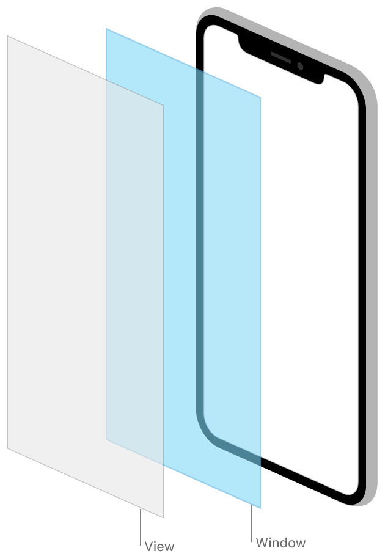

> Navigation: [Technologies](../technologies.md) · [UIKit](../uikit.md)

# Windows and screens

API Collection

Provide a container for your view hierarchies and other content.

## Overview

Window objects act as containers for your app’s onscreen content, and screens report the characteristics of the underlying display to your app. Use [Scenes](scenes.md) to configure and manage your user interface, and review [UIScreen](uiscreen.md) objects to understand the device’s main screen or connected displays.

A [UIWindow](uiwindow.md) object provides no visible content of its own. All of the window’s visible content is provided by its root view controller, which you configure in your app’s storyboards. The window’s role is to receive events from UIKit and to forward any relevant events to the root view controller and associated views. UIKit provides an initial window for you to use, and you can create additional windows as needed.

## Topics

### Windows

- [UIWindow](uiwindow.md) — The backdrop for your app’s user interface and the object that dispatches events to your views.
- [UICoordinateSpace](uicoordinatespace.md) — A set of methods for converting between different frames of reference on a screen.

### Scenes

- [Scenes](scenes.md) — Manage multiple instances of your app’s UI simultaneously, and direct resources to the appropriate instance of your UI.

### Popovers

- [Displaying transient content in a popover](displaying-transient-content-in-a-popover.md) — Show a temporary interface on top of your app’s content on iPad.
- [UIPopoverPresentationController](uipopoverpresentationcontroller.md) — An object that manages the display of content in a popover.
- [UIPopoverBackgroundView](uipopoverbackgroundview.md) — The background appearance for a popover.
- [UIPopoverBackgroundViewMethods](uipopoverbackgroundviewmethods.md) — A set of methods that popover background view subclasses must implement.

### Alerts

- [Getting the user’s attention with alerts and action sheets](getting-the-user-s-attention-with-alerts-and-action-sheets.md) — Present important information to a person or prompt them about an important choice.
- [UIAlertController](uialertcontroller.md) — An object that displays an alert message.
- [UIAlertAction](uialertaction.md) — An action that can be taken when the user taps a button in an alert.

### Screens

- [Presenting content on a connected display](presenting-content-on-a-connected-display.md) — Fill connected displays with additional content from your app.
- [UIScreen](uiscreen.md) — An object that defines the properties associated with a hardware-based display.
- [UIScreenMode](uiscreenmode.md) — A possible set of attributes that can apply to a screen object.

## See Also

### User interface

- [Views and controls](views-and-controls.md) — Present your content onscreen and define the interactions allowed with that content.
- [View controllers](view-controllers.md) — Manage your interface using view controllers and facilitate navigation around your app’s content.
- [View layout](view-layout.md) — Use stack views to lay out the views of your interface automatically. Use Auto Layout when you require precise placement of your views.
- [Appearance customization](appearance-customization.md) — Apply Liquid Glass to views, support Dark Mode in your app, customize the appearance of bars, and use appearance proxies to modify your UI.
- [Animation and haptics](animation-and-haptics.md) — Provide feedback to users using view-based animations and haptics.
