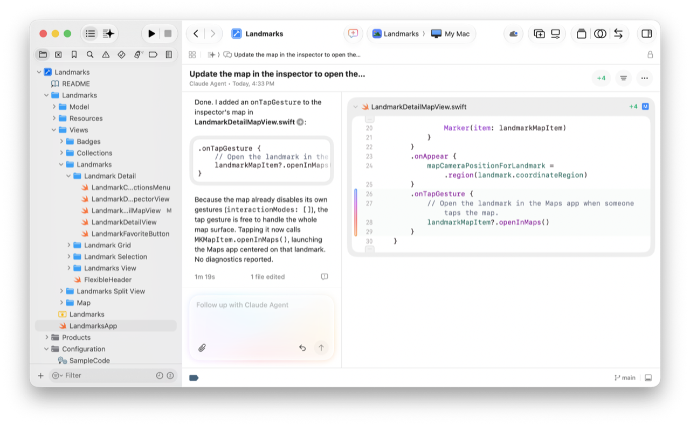
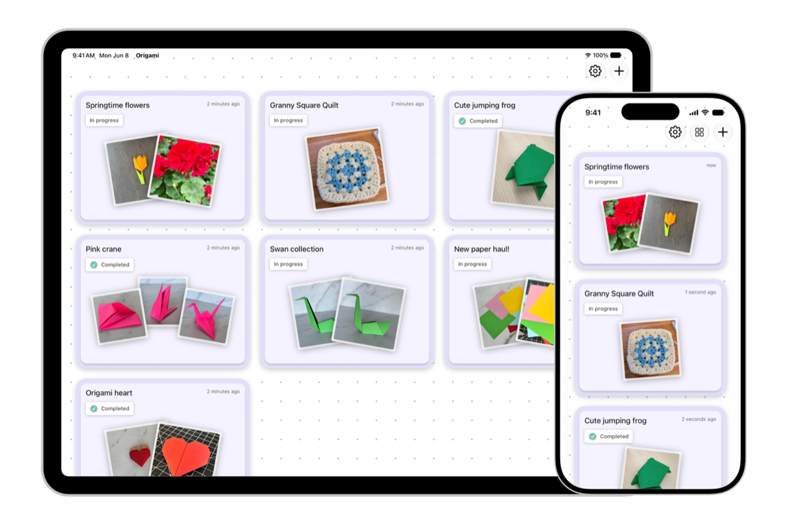

> Navigation: [Technologies](technologies.md)

# Updates

<sub>Featured</sub>

Latest additions to documentation and platform release notes.

## The 27 platform releases – June 2026

Read about the latest updates to the 27 platform releases. This page highlights changes to framework and tools documentation, as well as release notes for Xcode, macOS, iOS, iPadOS, visionOS, watchOS, and Safari.

### Xcode 27

Agentic [Coding intelligence](xcode/coding-intelligence.md) features in [Xcode](xcode.md) get even more powerful with support for skills that help you modernize and add new features to your app. For instance, skills can help you ensure your iOS apps respond perfectly as people resize your app using iPhone Mirroring on macOS.



- Xcode works closely with your AI agents of choice.  Read [Setting up coding intelligence](xcode/setting-up-coding-intelligence.md) to discover how to connect your AI agents to your Xcode project and workspace. Learn about [Extending and customizing agents](xcode/extending-and-customizing-agents.md) to understand how Xcode 27 uses skills to supercharge your coding with agents.
- Learn about [Writing code with intelligence in Xcode](xcode/writing-code-with-intelligence-in-xcode.md) and [Using coding intelligence in the source editor](xcode/using-coding-intelligence-in-the-source-editor.md) to explore new ideas, migrate to new API, and speed your development workflow.
- Read [Running your app on simulated or physical devices](xcode/running-your-app-on-simulated-or-physical-devices.md) and [Managing your simulated and physical devices in Device Hub](xcode/managing-your-simulated-and-physical-devices-in-device-hub.md) to learn about the new [Device Hub](xcode/device-hub.md).
- Reach more people all over the world by having Xcode help you with [Localizing your app using agents](xcode/localizing-your-app-using-agents.md). This improved localizing workflow is integrated directly into Xcode, bringing your apps to a wider market much faster and easier.

#### Performance and analysis

- Learn how to use the tools and frameworks Xcode provides by reading [Improving your app’s performance](xcode/improving-your-app-s-performance.md). Tools like Instruments and [MetricKit](metrickit.md) can give you the insights you need to make your app perform at its best.
- The new [StateReporting](statereporting.md) framework works with [MetricKit](metrickit.md) and helps you record a specific state for a feature within your app using the [StateReporter](statereporting/statereporter.md) class.
- Learn to use Instruments when [Analyzing CPU profiles with call tree views](xcode/analyzing-cpu-profiles-with-call-tree-views.md) to improve app performance, while using [OSSignposter](os/ossignposter.md) to annotate your code.

### Apple Intelligence and Machine Learning

The 27 platform releases include powerful new developer features that supercharge apps with AI capabilities. [App Intents](appintents.md) can connect your app with Siri, Spotlight, and Shortcuts. [Foundation Models](foundationmodels.md) gives you a standard interface to perform powerful AI tasks across Apple-provided and third-party models. [Core AI](coreai.md) lets you connect your own models into the Apple tools as first-class providers. And the [Evaluations](evaluations.md) framework provides a standard interface to evaluate your app’s intelligence-powered features.

#### Siri, Intents, and Spotlight

Your app can integrate with Apple Intelligence in the 27 releases across Apple platforms by leveraging [App Intents](appintents.md), which make the core features of your app available to Siri, Spotlight, and Shortcuts. Widgets and Live Activities also interact with your core app through its intents.

- Read the new [Getting started with the App Intents framework](appintents/getting-started-with-the-app-intents-framework.md) guide to acclimate yourself to app intents. And the new [Creating your first app intent](appintents/creating-your-first-app-intent.md) article gets you familiar with using intents in your own code.
- Learn how to connect your app into [Apple Intelligence and Siri AI](appintents/apple-intelligence-and-siri-ai.md), and explore the code in a sample messaging app in [Integrating your messaging app with Apple Intelligence](appintents/integrating-your-messaging-app-with-apple-intelligence.md).
- Read [Testing your App Intents code](appintentstesting/testing-your-app-intents-code.md) to discover how the new [App Intents Testing](appintentstesting.md) framework makes it easier than ever to test your intents to ensure they behave correctly across different user experiences.
- Messaging apps can use the new [Suggested Actions](suggestedactions.md) framework to privately and securely present actions next to messages. The system can intelligently discover useful information in message text and offer to add an event to the calendar, or add a task to Reminders, or open a location in Maps.
- Use the new [Media Intents](mediaintents.md) framework to enable your media player app to handle Siri requests. Siri turns whatever phrase someone says into an  [AudioSearch](mediaintents/audiosearch.md) type that is sent to your app for handling. The [Responding to audio search and playback requests](mediaintents/responding-to-audio-search-and-playback-requests.md) article shows how to add this capability into your own apps.
- Use [App entities](appintents/app-entities.md) types to give additional information about your app to Siri and Apple Intelligence. Read  [Making app entities available in Spotlight](appintents/making-app-entities-available-in-spotlight.md) to see how to make that information available to Spotlight, as well.
- Follow the sample code to learn about [Adopting App Intents to support system experiences](appintents/adopting-app-intents-to-support-system-experiences.md) and ensure Apple Intelligence can interact with your app across Shortcuts, Spotlight, and Siri.
- Experiment with the Travel Tracking sample project included in the article [Adopting App Intents to support system experiences](appintents/adopting-app-intents-to-support-system-experiences.md) to see lots of examples of using intents within an app or widget.
- Read [Adding your app’s content to Spotlight indexes](corespotlight/adding-your-app-s-content-to-spotlight-indexes.md) to see how to use [Core Spotlight](corespotlight.md) to give people access to activities and items within your app directly from the Spotlight interface.
- Learn to use the [Visual Intelligence](visualintelligence.md) framework on iOS, iPadOS, and now macOS by reading [Integrating your app with visual intelligence](visualintelligence/integrating-your-app-with-visual-intelligence.md). This enables your app to analyze image data from the camera to identify places and objects.

### Foundation Models

The 27 platform releases add powerful new API to the [Foundation Models](foundationmodels.md) framework. Developers can now use a single, standard interface to connect to all their models – from Apple’s on-device models to the powerful Private Cloud Compute hosted models. Frontier model providers can use the new [LanguageModel](foundationmodels/languagemodel.md) protocol to vend a Swift package to bridge their powerful cloud-hosted models to the Foundation Models API. And with [Core AI](coreai.md), Foundation Models API can access your own models, too.

- Read [Generating content and performing tasks with Foundation Models](foundationmodels/generating-content-and-performing-tasks-with-foundation-models.md) to get started building with Foundation Models, and create your first [Prompt](foundationmodels/prompt.md).
- When your app can benefit from a larger, cloud-based model you can learn about [Adding server-side intelligence with Private Cloud Compute](foundationmodels/adding-server-side-intelligence-with-private-cloud-compute.md). With Private Cloud Compute (PCC) you get a larger token context size, and stronger reasoning for handling more complex tasks. The [PrivateCloudComputeLanguageModel](foundationmodels/privatecloudcomputelanguagemodel.md) class conforms to [LanguageModel](foundationmodels/languagemodel.md) just as other frontier models do.
- Foundation Models now supports image input as well as text, which you can learn to use by reading [Analyzing images with multimodal prompting](foundationmodels/analyzing-images-with-multimodal-prompting.md). The models can help you classify the image, summarize the content, generate accessibility descriptions on the fly, and more. Use an [Attachment](foundationmodels/attachment.md) to send the image to the model along with your prompt.
- Read [Analyzing the runtime performance of your Foundation Models app](foundationmodels/analyzing-the-runtime-performance-of-your-foundation-models-app.md) to learn about optimization techniques that make the AI components of your app perform their best.
- Learn how to measure and improve your prompts by reading [Evaluating prompts to measure performance and improve model responses](foundationmodels/evaluating-prompts-to-measure-performance-and-improve-model-responses.md) and develop a strategy about [Managing the context window](foundationmodels/managing-the-context-window.md) to optimize token use.



Explore the Origami sample that demonstrates Foundation Models with Private Cloud Compute or third-party models, shown in the Platform State of the Union by reading [Origami: Crafting a dynamic tutorial for Apple Intelligence](foundationmodels/origami-crafting-a-dynamic-tutorial-for-apple-intelligence.md).

#### Core AI

The [Core AI](coreai.md) framework includes a set of tools that help you build, run, and deploy your own AI models within your app. Core AI also vends your custom AI models in a format that Foundation Models can use natively, so once adapted to Core AI, your models can interact with the same Foundation Models code you write when working with Apple’s own built-in models.

- Designed for Apple silicon performance, [Integrating on-device AI models in your app with Core AI](coreai/integrating-on-device-ai-models-in-your-app-with-core-ai.md) details how to easily import third-party or your own models into your app, and achieve great performance.
- Read [Managing model specialization and caching](coreai/managing-model-specialization-and-caching.md) to see how best to specialize your AI model, either in advance by [Compiling Core AI models ahead of time](coreai/compiling-core-ai-models-ahead-of-time.md), or cached on first use within the app.

#### Evaluations

- The new [Evaluations](evaluations.md) framework makes it easy to write intuitive Swift code to evaluate the behavior of your model, and validate your app’s behavior due to model results.
- Read [Evaluating language model responses](evaluations/evaluating-language-model-responses.md) to learn how you can build a strategy to evaluate your use of models within your app. Writing evaluations and creating comprehensive coverage is outlined in the article [Designing effective evaluations](evaluations/designing-effective-evaluations.md).
- Good evaluations require time spent [Designing datasets to test your feature](evaluations/designing-evaluation-datasets.md) as well as [Designing specific, measurable criteria in an evaluation suite](evaluations/designing-evaluation-criteria.md). Reading [Generating synthetic datasets](evaluations/generating-synthetic-evaluation-datasets.md) can help you build synthetic data to quickly get even more coverage.

### SwiftUI

- Learn to use reorderable containers in your SwiftUI apps by reading  [Reordering items in lists, stacks, grids, and custom layouts](swiftui/reordering-items-in-lists-stacks-grids-and-custom-layouts.md). See how clean the code can look:

```swift
LazyVStack {
    ForEach(cranes) { crane in
        CraneRow(crane)
    }
    .reorderable()
}
.reorderContainer(
    for: Crane.self
) { difference in
    difference.apply(to: &cranes)
}
```

- Take advantage of the recent improvements in the 27 platform releases when using [ContentBuilder](swiftui/contentbuilder.md) and [ViewBuilder](swiftui/viewbuilder.md).
- The [State()](<swiftui/state().md>) property wrapper has been upgraded in Xcode 27 to be a macro, making it easier to use while getting great performance.
- The new document infrastructure is implemented within [DocumentGroup](swiftui/documentgroup.md) and utilizing more powerful URL types. And explore the new [WritableDocument](swiftui/writabledocument.md) and [ReadableDocument](swiftui/readabledocument.md) protocols.
- The [AsyncImage](swiftui/asyncimage.md) type is much faster with improved caching.
- Check out the new [Composing advanced graphics effects with SwiftUI](swiftui/composing-advanced-graphics-effects-with-swiftui.md) sample project.

### UIKit

- Use [UICollectionViewCompositionalLayoutSectionProvider](uikit/uicollectionviewcompositionallayoutsectionprovider.md) closures as part of automatic observation tracking to automatically invalidate and update compositional layouts when observable objects change.
- Adopt the UIKit scene-based life cycle using the guidance in [Transitioning to the UIKit scene-based life cycle](uikit/transitioning-to-the-uikit-scene-based-life-cycle.md). Starting in iOS 27, apps built with the latest SDK must use the scene-based life cycle or they fail to launch.
- Learn more about advanced TextKit formatting by reading [Adding tables to attributed strings in UIKit](uikit/adding-tables-to-attributed-strings.md). And take total control of view and layout of text to create your own custom experience by reading [Managing viewport layout and attachment reuse in text views](uikit/managing-viewport-layout-and-attachment-reuse-in-a-text-view-subclass.md).

### AppKit

- Create events similar to UIControl events on NSControl with the new [NSControl.Events](appkit/nscontrol/events.md) type.
- Update views automatically in response to Observable model changes using the guidance in [Updating views automatically with observation tracking in AppKit](appkit/updating-views-automatically-with-observation-tracking-in-appkit.md).
- macOS 27 improves the touch experience when your Mac app is running on an iPad as a Sidecar display. Read [TN3212: Adopting gesture recognizers for Sidecar touch support](technotes/tn3212-adopting-gesture-recognizers-for-sidecar-touch-support.md) for best practices to ensure your app behaves as expected on a Sidecar display.

### SwiftData

- Read the latest article update to help you migrate your Core Data app to use SwiftData with [Adopting SwiftData for a Core Data app](coredata/adopting-swiftdata-for-a-core-data-app.md).
- Learn how to use [sections](swiftdata/query/sections.md) with [ResultsSectionCollection](swiftdata/resultssectioncollection.md) and a SwiftData [Query](swiftdata/query.md).

### Privacy and Security

- Developers of sensitive and secure apps can use the [Trust Insights](trustinsights.md) framework to request an evaluation from the system to help detect if someone is at risk of a social engineering threat. This information can be used in combination with other factors to enable a developer to help keep their users more protected.

### Graphics and Media

- Use the [Spatial Preview](spatialpreview.md) framework to work with 3D spatial content from a macOS app within a connected visionOS device in real time.
- Track generic spatial accessories (purpose-built devices like medical instruments or industrial tooling) and augment them with virtual content in visionOS. Read [Preparing spatial accessories for tracking in your visionOS app](arkit/preparing-spatial-accessories-for-tracking-in-your-visionos-app.md) to create a reference file for your accessory. Read [Working with generic spatial accessories](visionos/working-with-generic-spatial-accessories.md) to bundle that accessory file and track the device with ARKit.
- The new [Music Understanding](musicunderstanding.md) framework gives you the power to analyze and fully understand the technical details of audio content with details such as rhythm, pace, loudness, key, and instrument activity.
- Use the new [Now Playing](nowplaying.md) framework to let the system control playback of your media in the standard playback interface across the Lock Screen, in Control Center, on Apple Watch, and in CarPlay. Read [Publishing media sessions](nowplaying/publishing-media-sessions.md) to see how you can take advantage of this framework in your own media app.
- Hardware vendors can use the new [Media Device](mediadevice.md) framework to create an extension that enables any app to stream to their device using built-in system affordances. Read [Creating a media device extension](mediadevice/creating-a-media-device-extension.md) to see how you can create an extension to stream to your unique hardware.
- The [AVSystemRouting](avsystemrouting.md) framework adds new API to easily send media to all sorts of devices that implement a media device extension. Read [Routing media to third-party devices](avsystemrouting/routing-media-to-third-party-devices.md) to see how to route media from your own apps.

### Health

- Access workout zone data for heart rate and cycling power, and learn about the  [HKWorkoutZoneGroup](healthkit/hkworkoutzonegroup.md) structure by reading [Accessing workout zone data](healthkit/accessing-workout-zone-data.md).
- Read the new article [Recording and querying menopausal state](healthkit/recording-and-querying-menopausal-state.md) to help personalize the experience within your health-related app.

### Apple Pay, Passes, and Commerce

- Read the article [Adding support for Tap to Share to your app](proximityreader/adding-support-for-tap-to-share-to-your-app.md) to see how to use the [ProximityReader](proximityreader.md) framework to use nearby iPhones to conduct in-person transactions.
- See the new customization features in [Creating an airline boarding pass using semantic tags](walletpasses/creating-an-airline-boarding-pass-using-semantic-tags.md) to make your app’s passes even more useful in the moment. [Creating a pass with Pass Designer](walletpasses/creating-a-pass-with-pass-designer.md) explains how the Pass Designer tool can help you visualize and design your passes. [Defining the metadata of your Wallet Pass](walletpasses/defining-the-metadata-of-your-wallet-pass.md) explains how to include additional information with your pass.

### Platform services

- With iOS 27, people can easily switch from one iPhone to another. Read about [iPhone quick switch](coretelephony/iphone-quick-switch.md) and how to follow best practices using the [Core Telephony](coretelephony.md) framework to ensure your app gracefully handles this switch.
- Use the [CrashReportExtension](crashreportextension.md) framework to perform on-device analysis and produce a report when your app crashes. This crash-handling code will then run out of process, managed by the system. Implement the [CrashReporterExtension](crashreportextension/crashreporterextension.md) to create your own custom crash report.
- The new [DiskImageKit](diskimagekit.md) framework provides a programmatic API for developers to create, open, and manage disk images. It is especially useful within the [Virtualization](virtualization.md) framework as storage for virtual machine archives.
- Use the new compression algorithms, `LZRaven` and `LZMesh` for more efficient and faster results. Read about the [compression_algorithm](compression/compression_algorithm.md) type to understand the recommended defaults when sharing files among Apple devices. The [Compression](compression.md) and [Apple Archive](applearchive.md) frameworks take advantage of these new algorithms.
- The [MetricKit](metrickit.md) framework is significantly upgraded for the 27 platform releases. Read how to [Track performance by app state using MetricKit](metrickit/track-performance-by-app-state-using-metrickit.md) to get the data you need to understand how your app performs in the real world.
- Learn powerful PencilKit features you can add to your app with the [Building a handwriting recognition experience with PencilKit](pencilkit/building-a-handwriting-recognition-experience-with-pencilkit.md) sample code project and article. The [Controlling stroke rendering for animation and editing](pencilkit/controlling-stroke-rendering-for-animation-and-editing.md) article dives deep into handling pencil strokes as well.
- The [DeviceCheck](devicecheck.md) framework brings App Attest to macOS with additional device information to protect your app from unauthorized modification and fraud.
- Apps using [EnergyKit](energykit.md) can learn about [Providing charging history for electric vehicles](energykit/providing-informative-charging-history-for-electric-vehicles.md) to the Home app, including activity logs and useful insights.

## Topics

### Release notes

- [iOS & iPadOS Release Notes](ios-ipados-release-notes.md) — Learn about changes to the iOS & iPadOS SDK.
- [macOS Release Notes](macos-release-notes.md) — Learn about changes to the macOS SDK.
- [tvOS Release Notes](tvos-release-notes.md) — Learn about changes to the tvOS SDK.
- [watchOS Release Notes](watchos-release-notes.md) — Learn about changes to the watchOS SDK.
- [visionOS Release Notes](visionos-release-notes.md) — Learn about changes to the visionOS SDK.
- [Xcode Release Notes](xcode-release-notes.md) — Learn about changes to Xcode.
- [Safari Release Notes](safari-release-notes.md) — Learn about changes for Safari and Safari View Controller for iOS, iPadOS, macOS, and in visionOS; WKWebView for iOS, iPadOS, macOS, watchOS, and in visionOS; and Web Inspector on macOS.

### Technology and frameworks

- [Accelerate updates](updates/accelerate.md) — Learn about important changes to Accelerate.
- [Accessibility updates](updates/accessibility.md) — Learn about important changes to Accessibility.
- [ActivityKit updates](updates/activitykit.md) — Learn about important changes in ActivityKit.
- [AdAttributionKit Updates](updates/adattributionkit.md) — Learn about important changes to AdAttributionKit.
- [App Clips updates](updates/appclips.md) — Learn about important changes in App Clips.
- [App Intents updates](updates/appintents.md) — Learn about important changes in App Intents.
- [AppKit updates](updates/appkit.md) — Learn about important changes to AppKit.
- [Apple Intelligence updates](updates/apple-intelligence.md) — Learn about important changes to Apple Intelligence.
- [AppleMapsServerAPI Updates](updates/applemapsserverapi.md) — Learn about important changes to AppleMapsServerAPI.
- [Apple Pencil updates](updates/applepencil.md) — Learn about important changes to Apple Pencil.
- [ARKit updates](updates/arkit.md) — Learn about important changes to ARKit.
- [Audio Toolbox updates](updates/audiotoolbox.md) — Learn about important changes to Audio Toolbox.
- [AuthenticationServices updates](updates/authenticationservices.md) — Learn about important changes to AuthenticationServices.
- [AVFAudio updates](updates/avfaudio.md) — Learn about important changes to AVFAudio.
- [AVFoundation updates](updates/avfoundation.md) — Learn about important changes to AVFoundation.
- [Background Tasks updates](updates/backgroundtasks.md) — Learn about important changes in Background Tasks.
- [Bundle Resources updates](updates/bundleresources.md) — Learn about important changes to Bundle Resources.
- [CallKit updates](updates/callkit.md) — Learn about important changes to CallKit.
- [ContactsUI updates](updates/contactsui.md) — Learn about important changes to ContactsUI.
- [Core Location updates](updates/corelocation.md) — Learn about important changes to Core Location.
- [Core MIDI updates](updates/coremidi.md) — Learn about important changes to Core MIDI.
- [Core ML updates](updates/coreml.md) — Learn about important changes to Core ML.
- [Core Motion updates](updates/coremotion.md) — Learn about important changes to Core Motion.
- [Core Spotlight updates](updates/corespotlight.md) — Learn about important changes to Core Spotlight.
- [DataDetection updates](updates/datadetection.md) — Learn about important changes in DataDetection.
- [Default apps updates](updates/defaultapps.md) — Learn about the latest changes to enabling your app to be the system default.
- [DockKit updates](updates/dockkit.md) — Learn about important changes to DockKit.
- [EnergyKit updates](updates/energykit.md) — Learn about important changes to EnergyKit.
- [File Provider updates](updates/fileprovider.md) — Learn about important changes to File Provider.
- [FinanceKit updates](updates/financekit.md) — Learn more about changes to FinanceKit.
- [Foundation updates](updates/foundation.md) — Learn about important changes to Foundation.
- [Foundation Models updates](updates/foundationmodels.md) — Learn about important changes to Foundation Models.
- [FSKit updates](updates/fskit.md) — Learn about important changes to FSKit.
- [Game Controller updates](updates/gamecontroller.md) — Learn about important changes to Game Controller.
- [GameKit updates](updates/gamekit.md) — Learn about important changes to GameKit.
- [Group Activities updates](updates/groupactivities.md) — Learn about important changes to Group Activities.
- [HealthKit updates](updates/healthkit.md) — Learn about important changes to HealthKit.
- [Hypervisor updates](updates/hypervisor.md) — Learn about important changes to Hypervisor.
- [Journaling Suggestions updates](updates/journalingsuggestions.md) — Learn about important changes in Journaling Suggestions.
- [LightweightCodeRequirements updates](updates/lightweightcoderequirements.md) — Learn about important changes to LightweightCodeRequirements.
- [LiveCommunicationKit updates](updates/livecommunicationkit.md) — Learn about important changes to LiveCommunicationKit.
- [MapKit updates](updates/mapkit.md) — Learn about important changes to MapKit.
- [MapKitJS updates](updates/mapkitjs.md) — Learn about important changes to MapKitJS.
- [Matter updates](updates/matter.md) — Learn about important changes to Matter.
- [MetricKit updates](updates/metrickit.md) — Learn about important changes to MetricKit.
- [Network updates](updates/network.md) — Learn about important changes to Network.
- [Network Extension updates](updates/networkextension.md) — Learn about important changes to Network Extension.
- [PaperKit updates](updates/paperkit.md) — Learn about important changes to PaperKit.
- [PassKit updates](updates/passkit.md) — Learn more about changes to PassKit.
- [PencilKit updates](updates/pencilkit.md) — Learn about important changes to PencilKit.
- [PHASE updates](updates/phase.md) — Learn about important changes to PHASE.
- [PhotoKit updates](updates/photokit.md) — Learn about important changes to PhotoKit and PhotosUI.
- [ProximityReader updates](updates/proximityreader.md) — Learn about important changes to ProximityReader.
- [RealityKit updates](updates/realitykit.md) — Learn about important changes in RealityKit.
- [SafariServices updates](updates/safariservices.md) — Learn about important changes in SafariServices.
- [ScreenCaptureKit updates](updates/screencapturekit.md) — Learn about important changes to ScreenCaptureKit.
- [Security updates](updates/security.md) — Learn about important changes to Security.
- [Sensitive Content Analysis updates](updates/sensitivecontentanalysis.md) — Learn about important changes to Sensitive Content Analysis.
- [SensorKit updates](updates/sensorkit.md) — Learn about important changes to SensorKit.
- [ShazamKit updates](updates/shazamkit.md) — Learn about important changes in ShazamKit.
- [SiriKit updates](updates/sirikit.md) — Learn about important changes in SiriKit.
- [Speech updates](updates/speech.md) — Learn about important changes to Speech.
- [StoreKit updates](updates/storekit.md) — Learn about important changes in StoreKit.
- [Swift updates](updates/swift.md) — Learn about important changes to Swift.
- [Swift Charts updates](updates/swiftcharts.md) — Learn about important changes to Swift Charts.
- [SwiftData updates](updates/swiftdata.md) — Learn about important changes to SwiftData.
- [SwiftUI updates](updates/swiftui.md) — Learn about important changes to SwiftUI.
- [Symbols updates](updates/symbols.md) — Learn about important changes to Symbols.
- [TipKit updates](updates/tipkit.md) — Learn about important changes in TipKit.
- [ThreadNetwork updates](updates/threadnetwork.md) — Learn about important changes in ThreadNetwork.
- [UIKit updates](updates/uikit.md) — Learn about important changes to UIKit.
- [User Notifications updates](updates/usernotifications.md) — Learn about important changes in User Notifications.
- [Video Subscriber Account updates](updates/videosubscriberaccount.md) — Learn about important changes in Video Subscriber Account.
- [Virtualization updates](updates/virtualization.md) — Learn about important changes to Virtualization.
- [Vision updates](updates/vision.md) — Learn about important changes in Vision.
- [Visual Intelligence updates](updates/visualintelligence.md) — Learn about important changes in Visual Intelligence.
- [watchOS updates](updates/watchos.md) — Learn about important changes to watchOS.
- [WeatherKit updates](updates/weatherkit.md) — Learn about important changes to WeatherKit.
- [WidgetKit updates](updates/widgetkit.md) — Learn about important changes in WidgetKit.
- [WorkoutKit updates](updates/workoutkit.md) — Learn about important changes to WorkoutKit.
- [Xcode updates](updates/xcode.md) — Learn about important changes to Xcode.
- [XCUIAutomation updates](updates/xcuiautomation.md) — Learn about important changes to XCUIAutomation.
- [XPC updates](updates/xpc.md) — Learn about important changes to XPC.

### Past releases

- [WWDC25](updates/wwdc2025.md) — Highlights of new technologies introduced at WWDC25.
- [WWDC24](updates/wwdc2024.md) — Highlights of new technologies introduced at WWDC24.
- [WWDC23](updates/wwdc2023.md) — Highlights of new technologies introduced at WWDC23.
- [WWDC22](updates/wwdc2022.md) — Highlights of new technologies introduced at WWDC22.
- [WWDC21](updates/wwdc2021.md) — Highlights of new technologies introduced at WWDC21.
