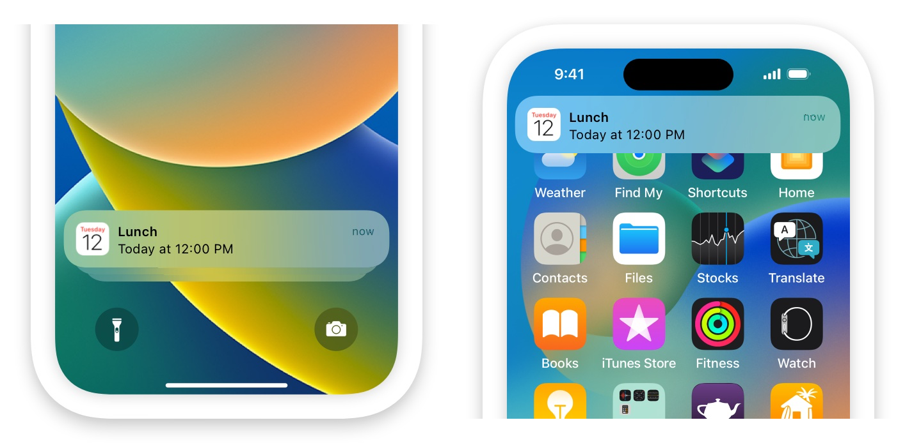

> Navigation: [Technologies](technologies.md)

# User Notifications

Framework

Push user-facing notifications to the user’s device from a server, or generate them locally from your app.

## Overview

User-facing notifications communicate important information to users of your app, regardless of whether your app is running on the user’s device. For example, a sports app can let the user know when their favorite team scores. Notifications can also tell your app to download information and update its interface. Notifications can display an alert, play a sound, or badge the app’s icon.

You can generate notifications locally from your app or remotely from a server that you manage. For _local notifications_, the app creates the notification content and specifies a condition, like a time or location, that triggers the delivery of the notification. For _remote notifications_, your company’s server generates push notifications, and Apple Push Notification service (APNs) handles the delivery of those notifications to the user’s devices.

Use this framework to do the following:

- Define the types of notifications that your app supports.
- Define any custom actions associated with your notification types.
- Schedule local notifications for delivery.
- Process already delivered notifications.
- Respond to user-selected actions.

The system makes every attempt to deliver local and remote notifications in a timely manner, but delivery isn’t guaranteed. The PushKit framework offers a more timely delivery mechanism for specific types of notifications, such as those VoIP and watchOS complications use. For more information, see [PushKit](pushkit.md).

For webpages in Safari version 16.0 and higher, generate remote notifications from a server that you manage using [Push API](https://www.w3.org/TR/push-api/) code that works in Safari and other browsers.

> [!note] Note
> Siri can provide suggestions to users in search, News, Safari, and other apps using on-device information that your app contributes through the Notifications API. Users can change this functionality to allow at any time through Siri and Search settings for your app.

For design guidance, see [Human Interface Guidelines \> Notifications](https://developer.apple.com/design/human-interface-guidelines/ios/system-capabilities/notifications/).

## Topics

### Essentials

- [User Notifications updates](updates/usernotifications.md) — Learn about important changes in User Notifications.
- [Asking permission to use notifications](usernotifications/asking-permission-to-use-notifications.md) — Request permission to display alerts, play sounds, or badge the app’s icon in response to a notification.

### Notification management

- [UNUserNotificationCenter](usernotifications/unusernotificationcenter.md) — The central object for managing notification-related activities for your app or app extension.
- [UNUserNotificationCenterDelegate](usernotifications/unusernotificationcenterdelegate.md) — An interface for processing incoming notifications and responding to notification actions.
- [UNNotificationSettings](usernotifications/unnotificationsettings.md) — The object for managing notification-related settings and the authorization status of your app.

### Remote notifications

- [Setting up a remote notification server](usernotifications/setting-up-a-remote-notification-server.md) — Generate notifications and push them to user devices.
- [Sending push notifications using command-line tools](usernotifications/sending-push-notifications-using-command-line-tools.md) — Use basic macOS command-line tools to send push notifications to Apple Push Notification service (APNs).
- [Testing notifications using the Push Notification Console](usernotifications/testing-notifications-using-the-push-notification-console.md) — Send test notifications and access delivery logs to test your app’s integration with Apple Push Notification service (APNs).

### Notification requests

- [Scheduling a notification locally from your app](usernotifications/scheduling-a-notification-locally-from-your-app.md) — Create and schedule notifications from your app when you want to get the user’s attention.
- [UNNotificationRequest](usernotifications/unnotificationrequest.md) — A request to schedule a local notification, which includes the content of the notification and the trigger conditions for delivery.
- [UNNotification](usernotifications/unnotification.md) — The data for a local or remote notification the system delivers to your app.

### Push notifications in Safari

- [Sending web push notifications in web apps and browsers](usernotifications/sending-web-push-notifications-in-web-apps-and-browsers.md) — Update your web server and website to send push notifications that work in Safari, other browsers, and web apps, following cross-browser standards.

### Notification content

- [Implementing communication notifications](usernotifications/implementing-communication-notifications.md) — Configure and display your app’s communication notifications by using intents.
- [UNNotificationContentProviding](usernotifications/unnotificationcontentproviding.md) — A protocol the system uses to provide context relevant to user notifications.
- [UNNotificationActionIcon](usernotifications/unnotificationactionicon.md) — An icon associated with an action.
- [UNMutableNotificationContent](usernotifications/unmutablenotificationcontent.md) — The editable content for a notification.
- [UNNotificationContent](usernotifications/unnotificationcontent.md) — The uneditable content of a notification.
- [UNNotificationAttachment](usernotifications/unnotificationattachment.md) — A media file associated with a notification.
- [UNNotificationSound](usernotifications/unnotificationsound.md) — The sound played upon delivery of a notification.
- [UNNotificationSoundName](usernotifications/unnotificationsoundname.md) — A string providing the name of a sound file.

### Triggers

- [UNCalendarNotificationTrigger](usernotifications/uncalendarnotificationtrigger.md) — A trigger condition that causes a notification the system delivers at a specific date and time.
- [UNTimeIntervalNotificationTrigger](usernotifications/untimeintervalnotificationtrigger.md) — A trigger condition that causes the system to deliver a notification after the amount of time you specify elapses.
- [UNLocationNotificationTrigger](usernotifications/unlocationnotificationtrigger.md) — A trigger condition that causes the system to deliver a notification when the user’s device enters or exits a geographic region you specify.
- [UNPushNotificationTrigger](usernotifications/unpushnotificationtrigger.md) — A trigger condition that indicates Apple Push Notification Service (APNs) has sent the notification.
- [UNNotificationTrigger](usernotifications/unnotificationtrigger.md) — The common behavior for subclasses that trigger the delivery of a local or remote notification.

### Notification categories and user actions

- [Declaring your actionable notification types](usernotifications/declaring-your-actionable-notification-types.md) — Differentiate your notifications and add action buttons to the notification interface.
- [UNNotificationCategory](usernotifications/unnotificationcategory.md) — A type of notification your app supports and the custom actions that the system displays.
- [UNNotificationAction](usernotifications/unnotificationaction.md) — A task your app performs in response to a notification that the system delivers.
- [UNTextInputNotificationAction](usernotifications/untextinputnotificationaction.md) — An action that accepts user-typed text.

### Notification responses

- [Handling notifications and notification-related actions](usernotifications/handling-notifications-and-notification-related-actions.md) — Respond to user interactions with the system’s notification interfaces, including handling your app’s custom actions.
- [UNNotificationResponse](usernotifications/unnotificationresponse.md) — The user’s response to an actionable notification.
- [UNTextInputNotificationResponse](usernotifications/untextinputnotificationresponse.md) — The user’s response to an actionable notification, including any custom text that the user typed or dictated.

### Notification service app extension

- [Modifying content in newly delivered notifications](usernotifications/modifying-content-in-newly-delivered-notifications.md) — Modify the payload of a remote notification before it’s displayed on the user’s iOS device.
- [UNNotificationServiceExtension](usernotifications/unnotificationserviceextension.md) — An object that modifies the content of a remote notification before it’s delivered to the user.

### Entitlements

- [APS Environment Entitlement](bundleresources/entitlements/aps-environment.md) — The environment for push notifications.
- [APS Environment (macOS) Entitlement](bundleresources/entitlements/com.apple.developer.aps-environment.md) — The environment for push notifications in macOS apps.

### Sample code

- [Handling Communication Notifications and Focus Status Updates](usernotifications/handling-communication-notifications-and-focus-status-updates.md) — Create a richer calling and messaging experience in your app by implementing communication notifications and Focus status updates.
- [Implementing Alert Push Notifications](usernotifications/implementing-alert-push-notifications.md) — Add visible alert notifications to your app by using the UserNotifications framework.
- [Implementing Background Push Notifications](usernotifications/implementing-background-push-notifications.md) — Add background notifications to your app by using the UserNotifications framework.

### Classes

- [UNNotificationAttributedMessageContext](usernotifications/unnotificationattributedmessagecontext.md)
