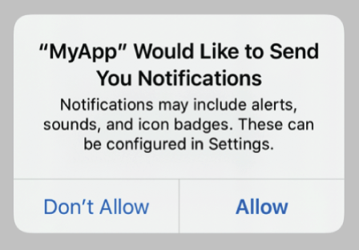
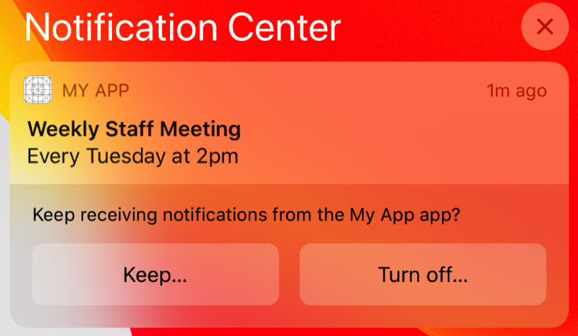

> Navigation: [Technologies](../technologies.md) · [User Notifications](../usernotifications.md)

# Asking permission to use notifications

<sub>Article</sub>

Request permission to display alerts, play sounds, or badge the app’s icon in response to a notification.

## Overview

Local and remote notifications get a person’s attention by displaying an alert, playing sounds, or badging your app’s icon. These interactions occur when your app isn’t running or is in the background. They let people know that your app has relevant information for them to view. Because a person might consider notification-based interactions disruptive, you must obtain permission to use them.



<sub>A screenshot showing the system prompting a person to allow or disallow the use of alerts, sounds, and badges when the app sends notifications.</sub>

### Explicitly request authorization in context

To ask for authorization, get the shared [UNUserNotificationCenter](unusernotificationcenter.md) instance and call its [- requestAuthorizationWithOptions:completionHandler:](<unusernotificationcenter/requestauthorization(options_completionhandler_).md>) method. Specify all of the interaction types that your app employs. For example, you can request authorization to display alerts, add a badge to the app icon, or play sounds:

```swift
let center = UNUserNotificationCenter.current()

do {
    try await center.requestAuthorization(options: [.alert, .sound, .badge])
} catch {
    // Handle the error here.
}
    
// Enable or disable features based on the authorization.
```

The first time your app makes this authorization request, the system prompts the person to grant or deny the request and records that response. Subsequent authorization requests don’t prompt the person.

Make the request in a context that helps people understand why your app needs authorization. In a task-tracking app that sends reminder notifications, you might make the request after the person schedules a first task. Sending the request in context provides a better experience than automatically requesting authorization on first launch, because people can see the purpose your apps notifications serve.

### Use provisional authorization to send trial notifications

When you explicitly ask for permission to send notifications, people must decide whether to allow or deny permission before they’ve seen a notification from your app. Even if you carefully set the context before requesting authorization, people may not have enough information to make a decision, and might reject the authorization.

Use provisional authorization to send notifications on a trial basis. People can then evaluate the notifications and decide whether to authorize them.

The system delivers provisional notifications quietly — they don’t interrupt the person with a sound or banner, or appear on the lock screen. Instead, they only appear in the notification center’s history. These notifications also include buttons that prompt the person to keep or turn off the notification.



<sub>A screenshot of a provisional notification in the notification center, with buttons to keep or turn off the notification.</sub>

If a person presses the Keep button, the system prompts them to choose between two options: Deliver Immediately or Deliver in Scheduled Summary. Deliver Immediately delivers future notifications quietly. The system authorizes your app to send notifications, but it doesn’t give your app permission to show alerts, play sounds, or badge the app icon. Your notification only appears in the notification center history unless they change their notification settings. Deliver in Scheduled Summary only appears if the person has Scheduled Summary toggled On in Settings.

If the person presses the Turn Off button, the system confirms the selection before denying your app authorization to send additional notifications.

To request provisional authorization, add the [UNAuthorizationOptionProvisional](unauthorizationoptions/provisional.md) option when requesting permission to send notifications.

```swift
let center = UNUserNotificationCenter.current()

do {
    try await center.requestAuthorization(options: [.alert, .sound, .badge, .provisional])
} catch {
    // Handle errors that may occur during requestAuthorization.
}
```

Unlike explicitly requesting authorization, this code doesn’t prompt the person for permission to receive notifications. Instead, the first time you call this method, it automatically grants authorization. However, until the person either explicitly keeps or turns off the notification, the authorization status is [UNAuthorizationStatusProvisional](unauthorizationstatus/provisional.md). Because people can change the authorization status at any point, check the status before scheduling local notifications.

Additionally, if you request provisional authorization, you can request authorization when your app first launches. The person is only asked to keep or turn off notifications when they actually receive the notification.

### Customize notifications based on the current authorizations

Always check your app’s authorization status before scheduling local notifications. People can change your app’s authorization settings at any time. They can also change the type of interactions allowed by your app — which may cause you to alter the number or type of notifications your app sends.

To provide the best experience for people, call the notification center’s [- getNotificationSettingsWithCompletionHandler:](<unusernotificationcenter/getnotificationsettings(completionhandler_).md>) method to get the current notification settings. Then customize the notification based on these settings.

```swift
let center = UNUserNotificationCenter.current()

// Obtain the notification settings.
let settings = await center.notificationSettings()

// Verify the authorization status.
guard (settings.authorizationStatus == .authorized) ||
      (settings.authorizationStatus == .provisional) else { return }

if settings.alertSetting == .enabled {
    // Schedule an alert-only notification.
} else {
    // Schedule a notification with a badge and sound.
}
```

The above example uses a guard condition to prevent the scheduling of notifications if the app isn’t authorized. The code then configures the notification based on the types of interactions allowed, preferring the use of an alert-based notification whenever possible.

You might want to configure your notification with alert, sound, and badge information even if your app isn’t authorized for some of the interactions. The system still displays alerts in Notification Center if your [UNNotificationSettings](unnotificationsettings.md) instance’s [notificationCenterSetting](unnotificationsettings/notificationcentersetting.md) property is set to [UNNotificationSettingEnabled](unnotificationsetting/enabled.md). Your notification center delegate’s [- userNotificationCenter:willPresentNotification:withCompletionHandler:](<unusernotificationcenterdelegate/usernotificationcenter(__willpresent_withcompletionhandler_).md>) method also receives notifications when your app is in the foreground, and can still access the alert, sound, or badge information.

## See Also

### Essentials

- [User Notifications updates](../updates/usernotifications.md) — Learn about important changes in User Notifications.
