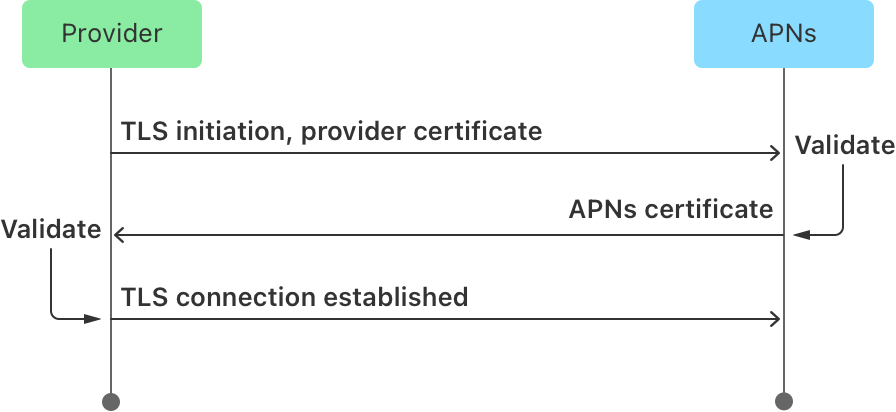

> Navigation: [Technologies](../technologies.md) · [User Notifications](../usernotifications.md) · [Setting up a remote notification server](setting-up-a-remote-notification-server.md)

# Establishing a certificate-based connection to APNs

Article

Secure your communications with Apple Push Notification service (APNs) by installing a certificate on your provider server.

## Overview

With certificate-based authentication, you use a provider certificate to establish a secure connection between your provider server and APNs. You obtain this certificate from Apple through your developer account.

Because you establish trust at the server level, individual notification requests contain only your payload and a device token. They don’t include an authentication token, which reduces the size of each notification request slightly.

You can use a provider certificate to send notifications to a single app, the Apple Watch complication, or to background VoIP services associated with a single app. To send remote notifications to multiple apps, you must create separate certificates for each app. You must also manage separate APNs connections for each app’s notifications. As a result, it’s often simpler to use token-based authentication to support multiple apps.

### Obtain a provider certificate from Apple

You obtain a provider certificate from your developer account when you sign in to [developer.apple.com](https://developer.apple.com). In the Program resources section:

1. Select Certificates under Certificates, IDs & Profiles.
2. Add a new certificate.
3. Under Services, select Apple Push Notification service SSL (Sandbox & Production) for the type and click Continue.
4. Select the App ID (also known as Bundle ID) of your app and click Continue.
5. Generate a Certificate Signing Request (CSR) on your server.
6. Click Continue.
7. Upload your CSR file and click Continue.
8. Download the resulting certificate.

> [!important] Important
> Certificates must be tied to a specific app.

Tie a different provider certificate to each app, whose App ID you specify when creating the certificate. You must also tie your certificate to a CSR, which is the private key used to encrypt the certificate. The certificate itself becomes the public key that you exchange with APNs. For more information on certificate creation, see [Certificates overview](https://help.apple.com/developer-account/#/deveedc0daa0).

### Install the certificate and private key

Install both the certificate and the private key on your provider server. In macOS, double-clicking the certificate installs it in Keychain Access automatically. If you created your CSR file from your provider server, Keychain Access installs the key in your keychain automatically.

You can use a certificate generated by selecting VoIP Services Certificate to send Pushkit VOIP notifications. A WatchKit Services Certificate allows both PushKit VoIP and notifications for the watchOS complication. Use the command-line tool `openssl` with command option `x509` to inspect a certificate.

You can also use the Keychain Access app to inspect a certificate. In Keychain Access, you can find the Topic/Bundle ID under Details \> Subject Name \> Common Name. Also check for Extension 1.2.840.113635.100.6.3.4 and 1.2.840.113635.100.6.3.6 under Details \> Public Key Info for additional Topics/Bundle IDs for Pushkit VoIP, watchOS complication, and Push to Talk. If a certificate doesn’t have the push topic for a specific push type, you can’t use the certificate to send a notification of that type.

> [!important] Important
> Check expiry of a certificate with Keychain Access. To avoid a disruption in service for your users, update your provider certificates before they expire. Provider certificates are valid for a year and you must update them to continue communicating with APNs.

### Establish trust with APNs

With your certificates installed, the following figure shows the sequence of steps to initiate a connection to the APNs server. After you request a secure connection using Transport Layer Security (TLS), APNs responds by sending a certificate for your provider server to validate. After validating that certificate, your provider certificate completes the secure connection. At this point, you can begin sending remote notification requests to APNs. An up-to-date version of macOS includes the appropriate trust store to validate the certificate presented by APNs. For other platforms, ensure you include a proper root certificate in your trust store.

A wireframe diagram depicting the sequence of steps that occur when you open a connection to the APNs server. Starting from the left is the Provider that requests a secure connection using TLS. APNs validates the connection using an APNs certificate. The Provider Validates the APNs certificate and a TLS connection is established.

The figure above has been simplified for the purpose of visualization. For a detailed flow, refer to [RFC 5246](https://datatracker.ietf.org/doc/html/rfc5246) and [RFC 8446](https://datatracker.ietf.org/doc/html/rfc8446).

If you think you have a compromised certificate or private key, you can revoke your certificate from your developer account. For more information, refer to [Revoke a certificate](https://developer.apple.com/help/account/create-certificates/revoke-a-certificate/). APNs maintains a list of revoked certificates, and it refuses TLS connections from servers with certificates on that list. If your server uses a revoked certificate, close all existing connections to APNs and configure a new provider certificate for your server before opening any new connections.

## See Also

### Security

- [Establishing a token-based connection to APNs](establishing-a-token-based-connection-to-apns.md) — Secure your communications with Apple Push Notification service (APNs) by using stateless authentication tokens.
