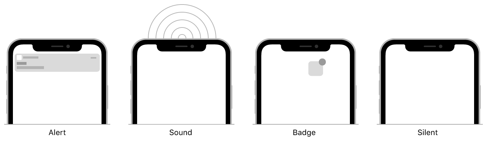
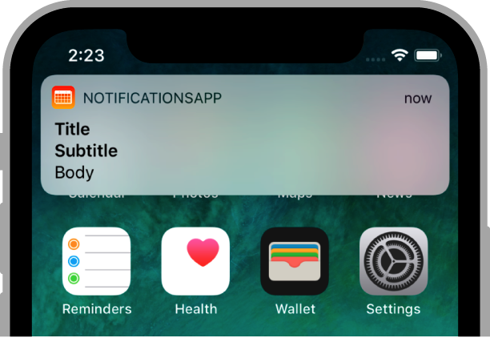

> Navigation: [Technologies](../technologies.md) · [User Notifications](../usernotifications.md) · [Setting up a remote notification server](setting-up-a-remote-notification-server.md)

# Generating a remote notification

<sub>Article</sub>

Send notifications to the user’s device with a JSON payload.

## Overview

Remote notifications convey important information to the user in the form of a JSON payload. The payload specifies the types of user interactions (alert, sound, or badge) that you want performed, and includes any custom data your app needs to respond to the notification.



<sub>An illustration showing four partial screenshots that demonstrate different types of user interactions for a notification: displaying an alert, playing a sound, badging the app’s icon, and silent (no interaction).</sub>

A basic remote notification payload includes Apple-defined keys and their custom values. You may also add custom keys and values specific to your notifications. Apple Push Notification service (APNs) refuses a notification if the total size of its payload exceeds the following limits:

- For Voice over Internet Protocol (VoIP) notifications, the maximum payload size is 5 KB (5120 bytes).
- For all other remote notifications, the maximum payload size is 4 KB (4096 bytes).

### Create the JSON payload

Specify the payload for a remote notification using a JSON dictionary. Inside this dictionary, include an `aps` key whose value is a dictionary containing one or more additional Apple-defined keys, listed in Table 1. You can include keys instructing the system to display an alert, play a sound, or badge your app’s icon. You can also instruct the system to handle the notification silently in the background. For more information, see [Pushing background updates to your App](pushing-background-updates-to-your-app.md).

In addition to the Apple-defined keys, you may add custom keys to your payload to deliver small amounts of data to your app, notification service app extension, or notification content app extension. Your custom keys must have values with primitive types, such as dictionary, array, string, number, or Boolean. Custom keys are available in the [userInfo](unnotificationcontent/userinfo.md) dictionary of the [UNNotificationContent](unnotificationcontent.md) object delivered to your app.

Typically, you use custom keys to help your code process the notification. For example, you might include an identifier string that your code can use to look up app-specific data. Add app-specific keys as peers of the `aps` dictionary.

Listing 1 shows a notification payload that displays an alert message inviting the user to play a game. If the `category` key identifies a previously registered [UNNotificationCategory](unnotificationcategory.md) object, the system adds action buttons to the alert. For example, the category here includes a play action to start the game immediately. The custom `gameID` key contains an identifier that the app can use to retrieve the game invitation.

Listing 1. A remote notification payload for showing an alert

```json
{
   "aps" : {
      "alert" : {
         "title" : "Game Request",
         "subtitle" : "Five Card Draw",
         "body" : "Bob wants to play poker"
      },
      "category" : "GAME_INVITATION"
   },
   "gameID" : "12345678"
}
```

Listing 2 shows a notification payload that badges the app’s icon and plays a sound. The specified sound file must be on the user’s device already, either in the app’s bundle or in the `Library/Sounds` folder of the app’s container. The `messageID` key contains app-specific information for identifying the message that caused the notification.

Listing 2. A remote notification payload for playing a sound

```json
{
   "aps" : {
      "badge" : 9,
      "sound" : "bingbong.aiff"
   },
   "messageID" : "ABCDEFGHIJ"
}
```

For more information about creating sounds for your notifications, see [UNNotificationSound](unnotificationsound.md).

> [!important] Important
> Don’t include customer information or any sensitive data, like a credit card number, in a notification’s payload. If you must include customer information or sensitive data, encrypt it before adding it to the payload. You can use a notification service app extension to decrypt the data on the user’s device. For more information, see [Modifying content in newly delivered notifications](modifying-content-in-newly-delivered-notifications.md).

### Localize your alert messages

There are two ways to localize the content of remote notifications:

- Include localized strings directly in the payload.
- Add localized message strings in your app bundle, and let the system choose which strings to display.

Placing localized strings directly into the payload gives you more flexibility, but requires you to track the user’s preferred language on your provider server. Because your provider server supplies the strings, it must know which language to use. On the user’s device, you can retrieve the user’s preferred languages by examining the [preferredLanguages](../foundation/nslocale/preferredlanguages.md) property of [NSLocale](../foundation/nslocale.md). Your app can then forward that information to your server.

If the text of your notification messages is predetermined, you can store your message strings in the `Localizable.strings` file of your app bundle and use the `title-loc-key`, `subtitle-loc-key`, and `loc-key` payload keys to specify which strings you want to display. Your localized strings may contain placeholders so that you can insert content dynamically into the final string. Listing 3 shows an example of a payload with a message derived from an app-provided string. The `loc-args` key contains an array of replacement variables to substitute into the string.

Listing 3. A remote notification payload with localized content

```json
{
   "aps" : {
      "alert" : {
         "loc-key" : "GAME_PLAY_REQUEST_FORMAT",
         "loc-args" : [ "Shelly", "Rick"]
      }
   }
}
```

For more information about the keys you use for localized content, see Table 2.

### Payload key reference

Table 1 lists the keys that you may include in the `aps` dictionary. To interact with the user, include the `alert`, `badge`, or `sound` keys. Don’t add your own custom keys to the `aps` dictionary; APNs ignores custom keys. Instead, add your custom keys as peers of the `aps` dictionary, as shown in Listing 1.

Table 1. Keys to include in the `aps` dictionary

| Key | Value type | Description |
|---|---|---|
| `alert` | Dictionary (or String) | The information for displaying an alert. A dictionary is recommended. If you specify a string, the alert displays your string as the body text. For a list of dictionary keys, see Table 2. |
| `badge` | Number | The number to display in a badge on your app’s icon. Specify `0` to remove the current badge, if any. |
| `sound` | String | The name of a sound file in your app’s main bundle or in the `Library/Sounds` folder of your app’s container directory. Specify the string `“default”` to play the system sound. Use this key for regular notifications. For critical alerts, use the `sound` dictionary instead. For information about how to prepare sounds, see [UNNotificationSound](unnotificationsound.md). |
| `sound` | Dictionary | A dictionary that contains sound information for critical alerts. For regular notifications, use the `sound` string instead. |
| `thread-id` | String | An app-specific identifier for grouping related notifications. This value corresponds to the [threadIdentifier](unmutablenotificationcontent/threadidentifier.md) property in the [UNNotificationContent](unnotificationcontent.md) object. |
| `category` | String | The notification’s type. This string must correspond to the [identifier](unnotificationcategory/identifier.md) of one of the [UNNotificationCategory](unnotificationcategory.md) objects you register at launch time. See [Declaring your actionable notification types](declaring-your-actionable-notification-types.md). |
| `content-available` | Number | The background notification flag. To perform a silent background update, specify the value `1` and don’t include the `alert`, `badge`, or `sound` keys in your payload. See [Pushing background updates to your App](pushing-background-updates-to-your-app.md). |
| `mutable-content` | Number | The notification service app extension flag. If the value is `1`, the system passes the notification to your notification service app extension before delivery. Use your extension to modify the notification’s content. See [Modifying content in newly delivered notifications](modifying-content-in-newly-delivered-notifications.md). |
| `target-content-id` | String | The identifier of the window brought forward. The value of this key will be populated on the [UNNotificationContent](unnotificationcontent.md) object created from the push payload. Access the value using the [UNNotificationContent](unnotificationcontent.md) object’s [targetContentIdentifier](unnotificationcontent/targetcontentidentifier.md) property. |
| `interruption-level` | String | The importance and delivery timing of a notification. The string values `“passive”`, `“active”`, “`time-sensitive”`, or `“critical”` correspond to the [UNNotificationInterruptionLevel](unnotificationinterruptionlevel.md) enumeration cases. |
| `relevance-score` | Number | The relevance score, a number between `0` and `1`, that the system uses to sort the notifications from your app. The highest score gets featured in the notification summary. See [relevanceScore](unnotificationcontent/relevancescore.md).  If your remote notification updates a Live Activity, you can set any Double value; for example, `25`, `50`, `75`, or `100`. |
| `filter-criteria` | String | The criteria the system evaluates to determine if it displays the notification in the current Focus. For more information, see [SetFocusFilterIntent](../appintents/setfocusfilterintent.md). |
| `stale-date` | Number | The UNIX timestamp that represents the date at which a Live Activity becomes stale, or out of date. For more information, see [Displaying live data with Live Activities](../activitykit/displaying-live-data-with-live-activities.md). |
| `content-state` | Dictionary | The updated or final content for a Live Activity. The content of this dictionary must match the data you describe with your custom [ActivityAttributes](../activitykit/activityattributes.md) implementation. For more information, see `Updating and ending your Live Activity with ActivityKit push notifications`. |
| `timestamp` | Number | The UNIX timestamp that marks the time when you send the remote notification that updates or ends a Live Activity. For more information, see `Updating and ending your Live Activity with ActivityKit push notifications`. |
| `event` | String | The string that describes whether you start, update, or end an ongoing Live Activity with the remote push notification. To start the Live Activity, use `start`. To update the Live Activity, use `update`. To end the Live Activity, use `end`. For more information, see `Updating and ending your Live Activity with ActivityKit push notifications`. |
| `dismissal-date` | Number | The UNIX timestamp that represents the date at which the system ends a Live Activity and removes it from the Dynamic Island and the Lock Screen. For more information, see `Updating and ending your Live Activity with ActivityKit push notifications`. |
| `attributes-type` | String | A string you use when you start a Live Activity with a remote push notification. It must match the name of the structure that describes the dynamic data that appears in a Live Activity. For more information, see `Updating and ending your Live Activity with ActivityKit push notifications`. |
| `attributes` | Dictionary | The dictionary that contains data you pass to a Live Activity that you start with a remote push notification. For more information, see `Updating and ending your Live Activity with ActivityKit push notifications`. |

Table 2 lists the keys that you may include in the `alert` dictionary. Use these strings to specify the title and message to include in the alert banner.

Table 2. Keys to include in the `alert` dictionary

| Key | Value type | Description |
|---|---|---|
| `title` | String | The title of the notification. Apple Watch displays this string in the short look notification interface. Specify a string that’s quickly understood by the user. |
| `subtitle` | String | Additional information that explains the purpose of the notification. |
| `body` | String | The content of the alert message. |
| `launch-image` | String | The name of the launch image file to display. If the user chooses to launch your app, the contents of the specified image or storyboard file are displayed instead of your app’s normal launch image. |
| `title-loc-key` | String | The key for a localized title string. Specify this key instead of the `title` key to retrieve the title from your app’s `Localizable.strings` files. The value must contain the name of a key in your strings file. |
| `title-loc-args` | Array of strings | An array of strings containing replacement values for variables in your title string. Each `%@` character in the string specified by the `title-loc-key` is replaced by a value from this array. The first item in the array replaces the first instance of the `%@` character in the string, the second item replaces the second instance, and so on. |
| `subtitle-loc-key` | String | The key for a localized subtitle string. Use this key, instead of the `subtitle` key, to retrieve the subtitle from your app’s `Localizable.strings` file. The value must contain the name of a key in your strings file. |
| `subtitle-loc-args` | Array of strings | An array of strings containing replacement values for variables in your subtitle string. Each `%@` character in the string specified by `subtitle-loc-key` is replaced by a value from this array. The first item in the array replaces the first instance of the `%@` character in the string, the second item replaces the second instance, and so on. |
| `loc-key` | String | The key for a localized message string. Use this key, instead of the `body` key, to retrieve the message text from your app’s `Localizable.strings` file. The value must contain the name of a key in your strings file. |
| `loc-args` | Array of strings | An array of strings containing replacement values for variables in your message text. Each `%@` character in the string specified by `loc-key` is replaced by a value from this array. The first item in the array replaces the first instance of the `%@` character in the string, the second item replaces the second instance, and so on. |

Table 3 lists the keys that you may include in the `sound` dictionary. Use these keys to configure the sound for a critical alert.

Table 3. Keys to include in the `sound` dictionary

| Key | Value type | Description |
|---|---|---|
| `critical` | Number | The critical alert flag. Set to `1` to enable the critical alert. |
| `name` | String | The name of a sound file in your app’s main bundle or in the `Library/Sounds` folder of your app’s container directory. Specify the string `“default”` to play the system sound. For information about how to prepare sounds, see [UNNotificationSound](unnotificationsound.md). |
| `volume` | Number | The volume for the critical alert’s sound. Set this to a value between `0` (silent) and `1` (full volume). |

The figure below shows the default placement of the `title`, `subtitle`, and `body` content in a banner notification. To customize the appearance of alerts, use a notification content app extension as described in [Customizing the Appearance of Notifications](../usernotificationsui/customizing-the-appearance-of-notifications.md).



## See Also

### Server tasks

- [Registering your app with APNs](registering-your-app-with-apns.md) — Communicate with Apple Push Notification service (APNs) and receive a unique device token that identifies your app.
- [Pushing background updates to your App](pushing-background-updates-to-your-app.md) — Deliver notifications that wake your app and update it in the background.
- [Establishing a connection to Apple Push Notification service (APNs)](establishing-a-connection-to-apns.md) — Secure your communications with APNs to send API requests.
